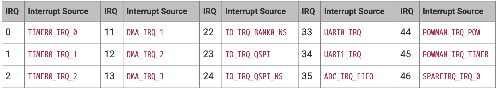

# Exceptions
for the ARM Cortex-M33 processor

---
---
# Bibliography
for this section

**Joseph Yiu**, *The Definitive Guide to ARM® Cortex®-M23 and Cortex-M33 Processors* 
   - Chapter 4 - *Architecture*
     - Section 4.5 - *Exceptions and Interrupts*
       - Subsection 4.4.1 - *What are exceptions*
   - Chapter 8 - *Exceptions and Interrupts*
     - Section 8.1 - *What are Exceptions and Interrupts*
     - Section 8.2 - *Exception types+*

---
---
# Processor Exceptions
what happens if something does not work as required


<!-- Just explain that MCU's have a special table where firmware can register functions that
the processor calls in case of several events. -->

---
---
# Standard ARM Cortex-M Exceptions
what happens if something does not work as required


---
---

# ARM Cortex-M Interrupts
some hardware device notifies the MCU

<div align="center">

</div>

<!-- Interrupts are exceptions that are usually triggered by hardware when
it needs attention.-->

---
---
# Exceptions and Interrupts in Embassy

- Embassy registers handlers for Exceptions
- Each of the Embassy drivers that you use provides interrupt handlers for the
    peripheral they control
- Developers have to **bind** interrupts to the driver.


List of some of the RP2350's interrupts

<div grid="~ cols-2 gap-3">

<div>

Register the Interrupt
```rust {*}{lines: false}
bind_interrupts!(struct Irqs {
    ADC_IRQ_FIFO => InterruptHandler;
});
```

</div>

<div>

Bind it to the driver
```rust {*}{lines: false}
let mut adc = Adc::new(p.ADC, Irqs, Config::default());
```

</div>

</div>
