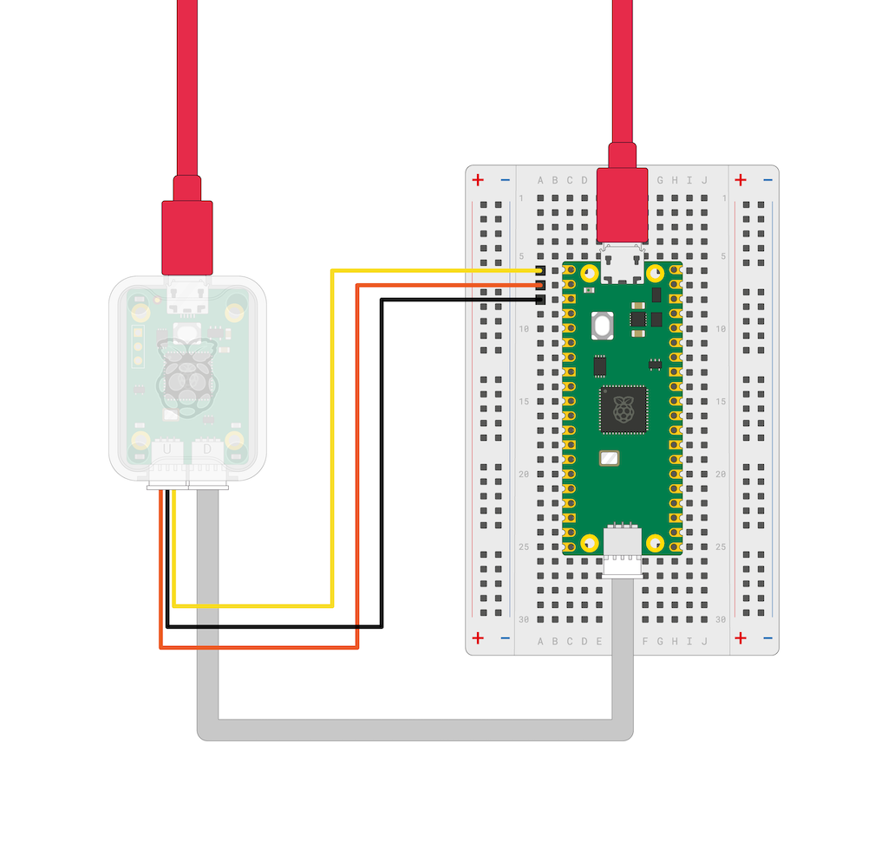
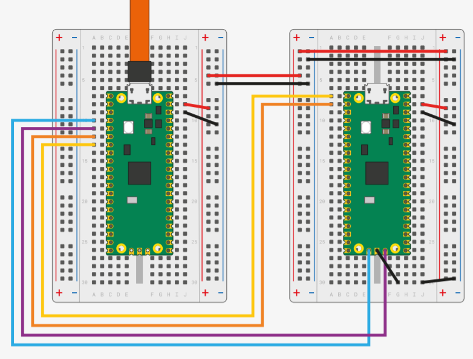

# Lab Board
[Schematics and PCB](https://gitlab.cs.pub.ro/pmrust/pm-ma-pcb)

<v-clicks>

- Raspberry Pi Pico/2 Slot
- RP2040 Debugger
- 4 buttons
- 5 LEDs
- potentiometer
- buzzer
- photoresistor
- I2C EEPROM
- BMP280 Pressure & Temp. sensor
- SPI LCD Display
- SD Card Reader
- USB-C connector
- servo connectors

</v-clicks>

::right::

<v-switch>

<template #1>
</template>

<template #0>
<Arrow x1="900" y1="20" x2="780" y2="55" width="3" color="red"/>
</template>

<template #-1>
<Arrow x1="950" y1="350" x2="850" y2="350" width="3" color="red"/>
</template>

<template #-2>
<Arrow x1="300" y1="360" x2="375" y2="360" width="3" color="red"/>
</template>

<template #-3>
<Arrow x1="300" y1="330" x2="500" y2="330" width="3" color="red"/>
</template>

<template #-4>
<Arrow x1="300" y1="160" x2="430" y2="160" width="3" color="red"/>
</template>

<template #-5>
<Arrow x1="300" y1="200" x2="430" y2="200" width="3" color="red"/>
</template>

<template #-6>
<Arrow x1="900" y1="430" x2="600" y2="430" width="3" color="red"/>
</template>

<template #-7>
<Arrow x1="900" y1="390" x2="600" y2="390" width="3" color="red"/>
</template>

<template #-8>
<Arrow x1="900" y1="470" x2="680" y2="470" width="3" color="red"/>
</template>

<template #-9>
<Arrow x1="300" y1="120" x2="470" y2="120" width="3" color="red"/>
<Arrow x1="900" y1="470" x2="600" y2="470" width="3" color="red"/>
</template>

<template #-10>
<Arrow x1="300" y1="60" x2="430" y2="60" width="3" color="red"/>
</template>

<template #-11>
<Arrow x1="870" y1="220" x2="720" y2="350" width="3" color="red"/>
</template>

<template #-12>
<Arrow x1="900" y1="20" x2="750" y2="150" width="3" color="red"/>
</template>

</v-switch>

---
---
# Project
suggested hardware

- the hardware should not cost more than 150 RON
- we suggest having a Raspberry Pi Pico with a debugger

**Raspberry Pi Pico 2W** + **Debug Probe**

**Raspberry Pi Pico 2W** + **Raspberry Pi Pico 1**

