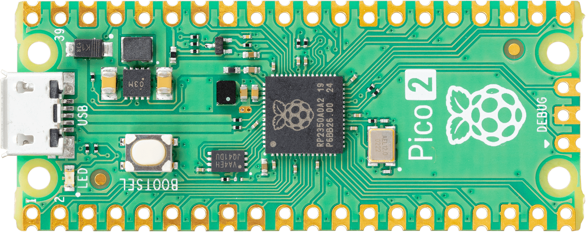
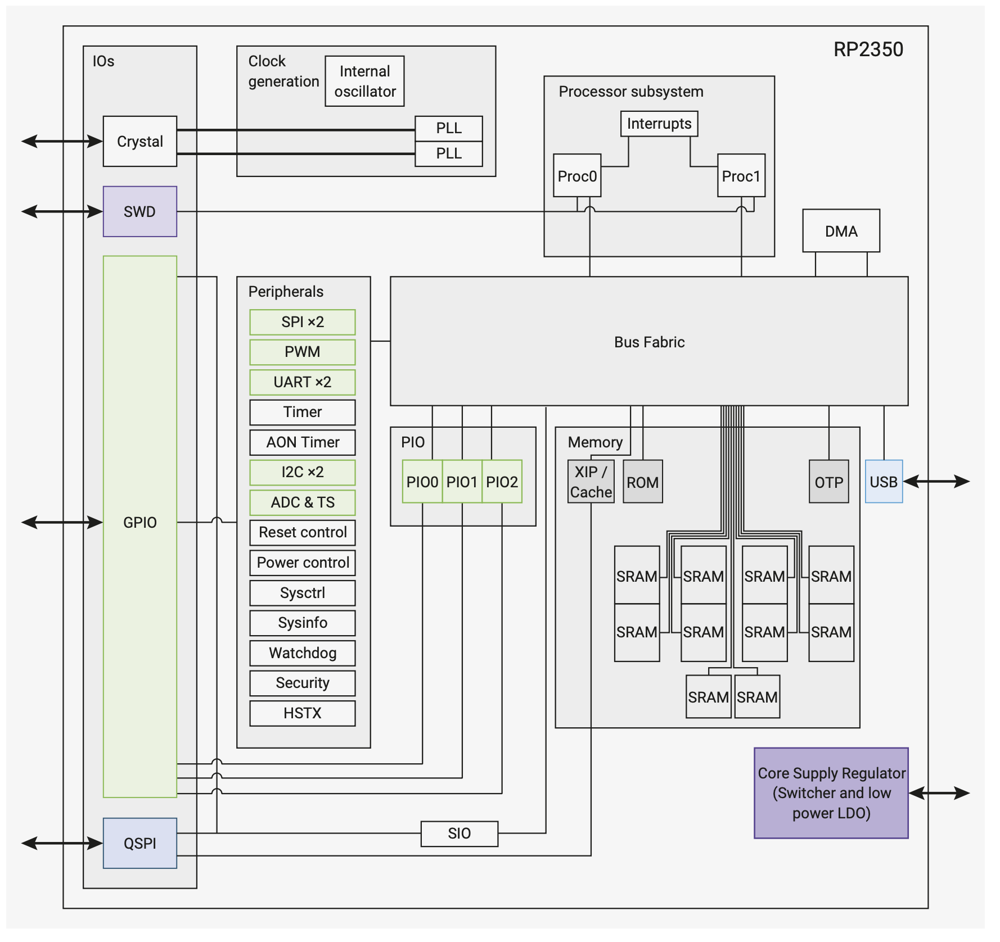
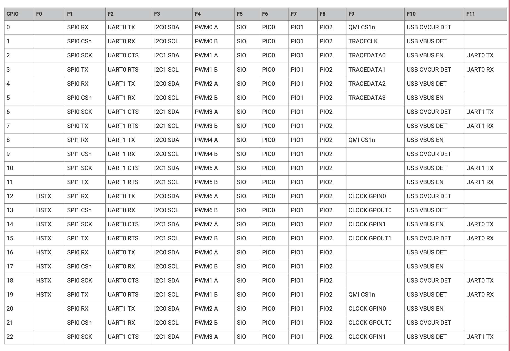
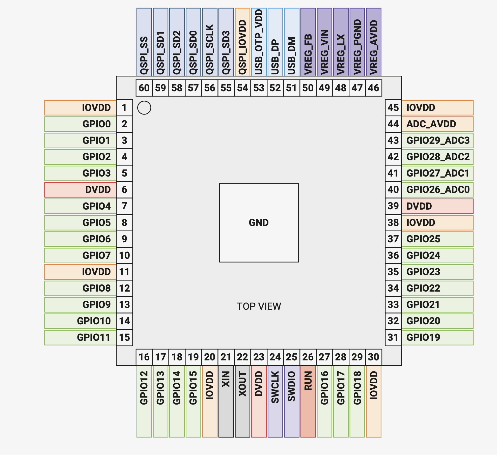
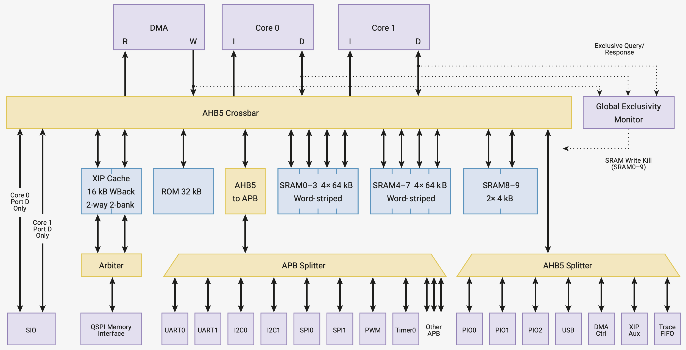

# RP2350
ARM Cortex-M33, built by Raspberry Pi

---

# Bibliography
for this section

**Raspberry Pi Ltd**, *[RP2350 Datasheet](https://datasheets.raspberrypi.com/rp2350/rp2350-datasheet.pdf)*
   - Chapter 1 - *Introduction*
   - Chapter 2 - *System Description*
     - Section 2.1 - *Bus Fabric*

---
layout: two-cols
---

# RP2350
the MCU

| | |
|-|-|
| Vendor | Raspberry Pi |
| Variant | ARM Cortex-M33 / Hazard3 RISC-V |
| ISA | ARMv8-M / rv32iamc |
| Cores | 2 |
| Word | 32 bit |
| Frequency | up to 150 MHz |
| RAM | 520 KB |
| Storage | RP2350 - 0 MB, RP2354 - 2MB |

::right::

# Boards
that use RP2350

### Raspberry Pi Pico 2 (W)

  
  
  

---
layout: two-cols
---

# The Chip

*GPIO*: General Purpose Input/Output\
*SWD*: Debug Protocol\
*DMA*: Direct Memory Access

[Datasheet RP2350](https://datasheets.raspberrypi.com/rp2350/rp2350-datasheet.pdf)

::right::

## Peripherals

|  |  |
|------|-------------|
| SIO | Single Cycle I/O (implements GPIO)|
| PWM | Pulse Width Modulation |
| ADC | Analog to Digital Converter |
| (Q)SPI | (Quad) Serial Peripheral Interface |
| UART | Universal Async. Receiver/Transmitter |
| RTC | Real Time Clock |
| I2C | Inter-Integrated Circuit |
| PIO | Programmable Input/Output |

---
layout: two-cols
---

# Pins
have multiple functions

...

::right::

---

# The Bus
that interconnects the cores with the peripherals

