# USB 2.0
Universal Serial Bus

---
layout: two-cols
---
# Universal Serial Bus
2.0

- Used for communication between a host and several devices that each provide functions
- Two modes:
  - *host* - initiates the communication (usually a computer)
  - *device* - receives and transmits data when the *host* requests it
- each device has a 7 bit address assigned upon connect
  - maximum 127 devices connected to a USB host
- devices are interconnected using *hubs*
- USB devices tree

:: right ::

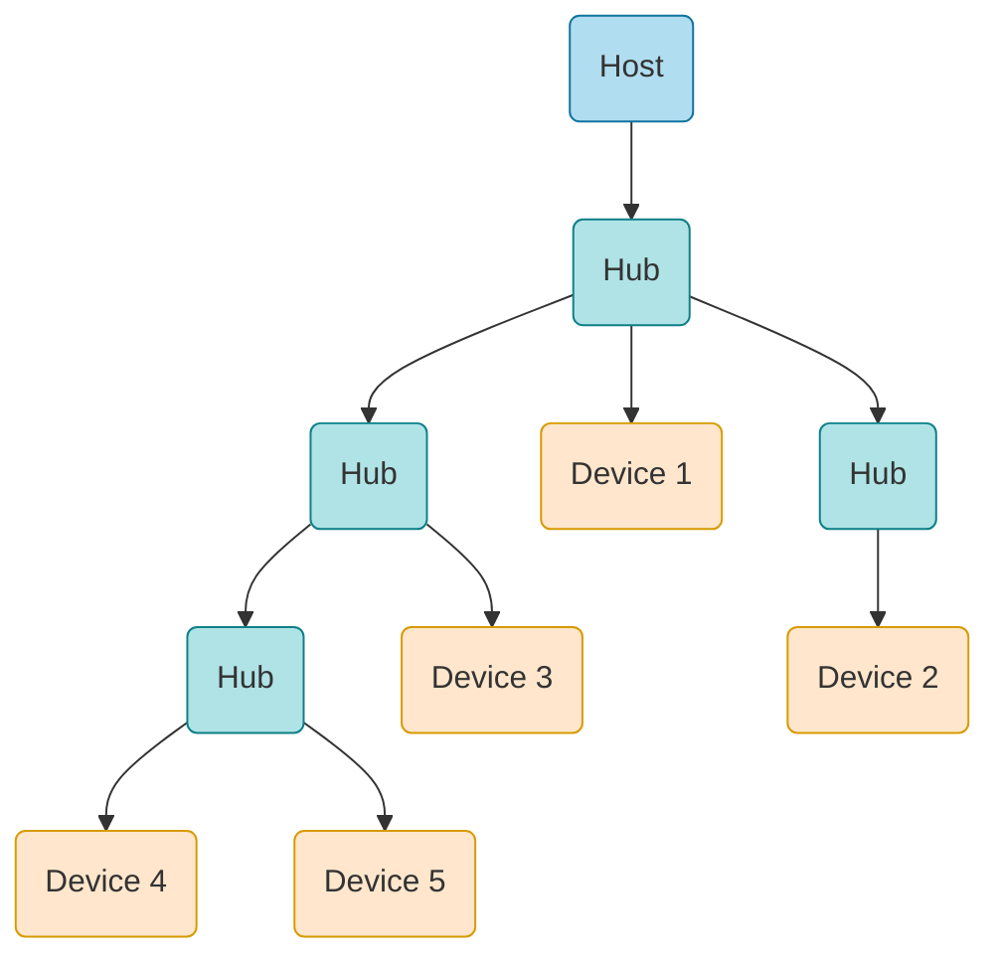

---
---
# Bibliography
for this section

1. **Raspberry Pi Ltd**, *[RP2350 Datasheet](https://datasheets.raspberrypi.com/rp2350/rp2350-datasheet.pdf)*
   - Chapter 12 - *Peripherals*
     - Chapter 12.7 - *USB*

2. *[USB Made Simple](https://www.usbmadesimple.co.uk/)*

---
layout: two-cols
---
# USB

<style>
.two-columns {
    grid-template-columns: 3fr 6fr;
}
</style>

- can work as **host** or **device**, but not at the same time
- uses a differential line for transmission
- uses a 48 MHz clock
- maximum 16 endpoints (buffers)
  - *IN* - from **device** to **host**
  - *OUT* - from **host** to **device**
- endpoints 0 IN and OUT are used for control

:: right ::

<div align="center">

</div>

---

# USB Packet
the smallest element of data transmission

<style>
img {
  background: #ffffff;
}
</style>

Token
<div align="center">

</div>

Data
<div align="center">

</div>

Handshake
<div align="center">

</div>


---

# Token Packet
usually asks for a data transmission

<style>
img {
  background: #ffffff;
}
</style>

| Type | PID | Description |
|-|-|-|
| *OUT* | `0001` | **host** wants to transmit data to the **device** |
| *IN* | `1001` | **host** wants to receive data from the **device** |
| *SETUP* | `1101` | **host** wants to setup the **device** |

Address: `ADDR`:`ENDP`

<div align="center">

</div>


---

# Data Packet
transmits data

<style>
img {
  background: #ffffff;
}
</style>

| Type | PID | Description |
|-|-|-|
| *DATA0* | `0011` | the data packet is the first one or follows after a `DATA1` packet |
| *DATA1* | `1011` | the data packet follows after a `DATA0` packet |

Data can be between 0 and 1024 bytes

<div align="center">

</div>


---

# Handshake Packet
acknowledges data

<style>
img {
  background: #ffffff;
}
</style>

| Type | PID | Description |
|-|-|-|
| *ACK* | `0010` | data has been **successfully received**  |
| *NACK* | `1010` | data has **not** been **successfully received** |
| *STALL* | `1110` | the device has an **error** |

<div align="center">

</div>


---
---
# Transmission Modes

- *Control* - used for configuration
- *Isochronous* - used for high bandwidth, best effort
- *Bulk* - used for low bandwidth, stream
- *Interrupt* - used for low bandwidth, guaranteed latency

---
---

# Control
used to control a device - ask for data

<div grid="~ cols-2 gap-5">

<div>

<v-click>

**Setup** - send a command (*GET_DESCRIPTOR*, ...)
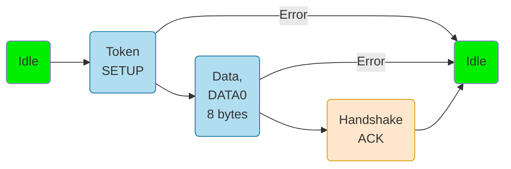

</v-click>

<v-click>

**Data** - *optional* several transfers, host transfers data
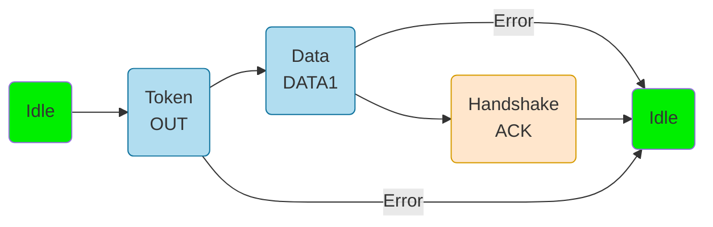

</v-click>

</div>

<div>

<v-after>


...

</v-after>

<v-click>

**Status** - report the status to the host

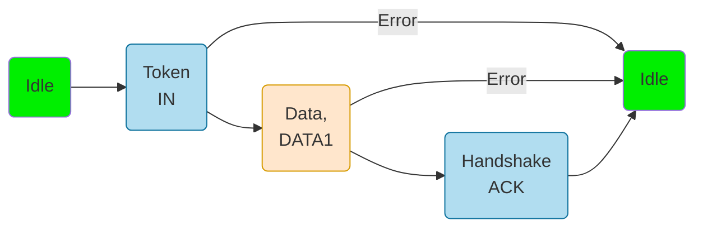

</v-click>

</div>
</div>

---

# Control
used to control a device - send data

<div grid="~ cols-2 gap-5">

<div>

<v-click>

**Setup** - send a command (*SET_ADDRESS*, ...)


</v-click>

<v-click>

**Data** - *optional* several transfers, device transfers the requested data


</v-click>

</div>

<div>

<v-after>

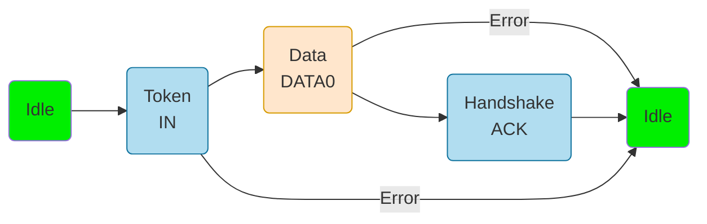

...

</v-after>

<v-click>

**Status** - report the status to the device

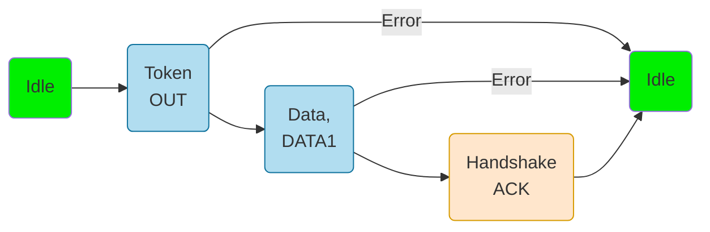

</v-click>

</div>
</div>


---
---
# Isochronous
fast but not reliable transfer

- has a guaranteed bandwidth
- allows data loss
- used for functions like streaming where loosing a packet has a minimal impact

<div grid="~ cols-2 gap-5">

<div>

<v-click>

**OUT** - transfer data from the host to the device
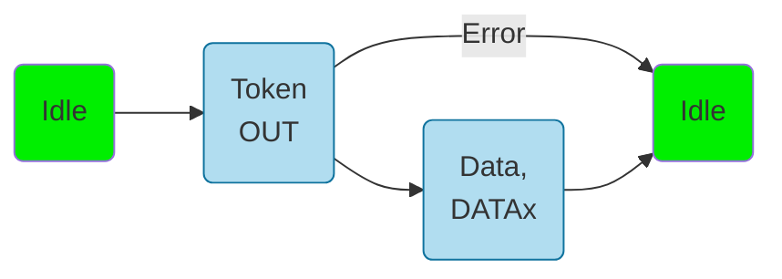

</v-click>

</div>

<div>

<v-click>

**IN** - transfer data from the device to the host
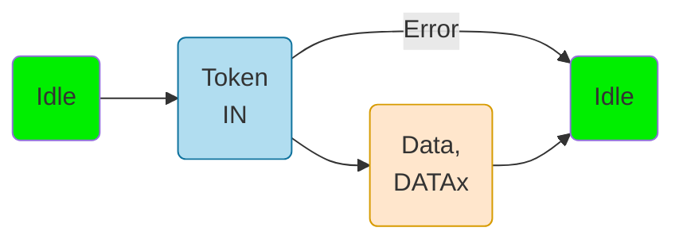

</v-click>

</div>

</div>

---
---
# Bulk
slow, but reliable transfer

- does not have a guaranteed bandwidth
- does not allow data loss
- used for large data transfers where loosing packets is not permitted

<div grid="~ cols-2 gap-5">

<div>

<v-click>

**OUT** - transfer data from the host to the device
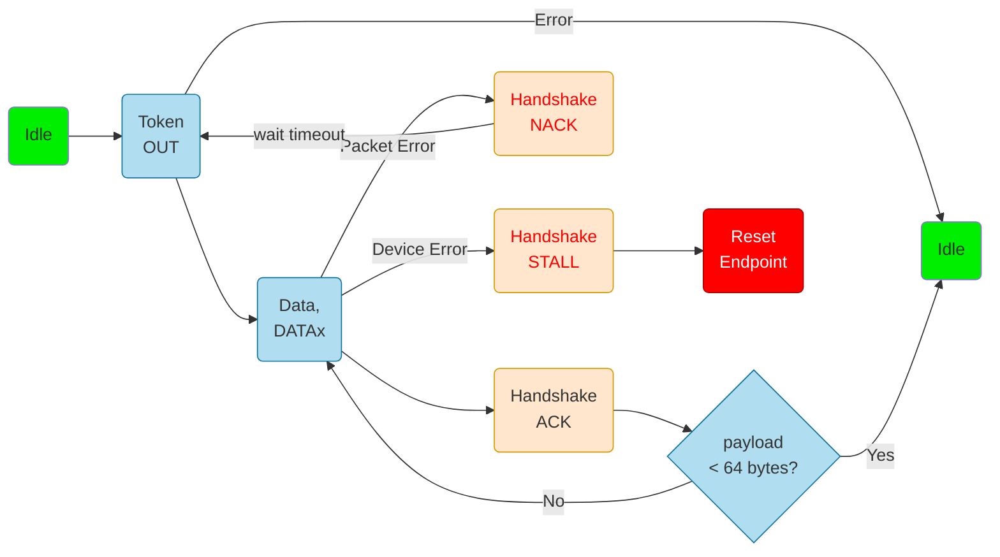

</v-click>

</div>

<div>

<v-click>

**IN** - transfer data from the device to the host
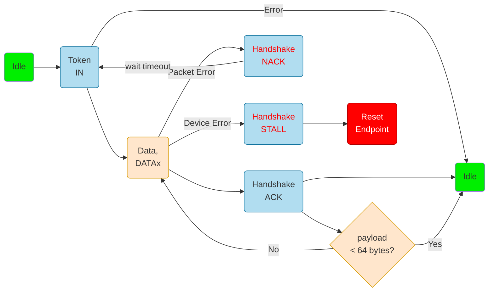

</v-click>

</div>

</div>

---
---
# Interrupt
transfer data at a minimum time interval

- the endpoint descriptor asks the host start an interrupt transfer at a time interval
- used for sending and receiving data at certain intervals

<div grid="~ cols-2 gap-5">

<div>

<v-click>

**OUT** - transfer data from the host to the device
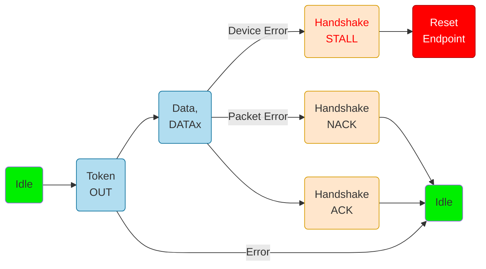

</v-click>

</div>

<div>

<v-click>

**IN** - transfer data from the device to the host
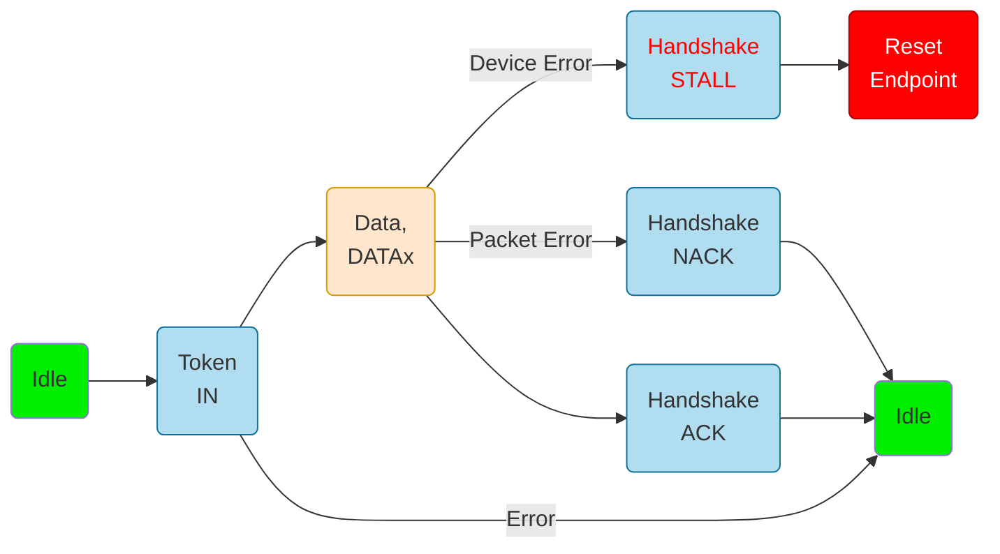

</v-click>

</div>

</div>


---
layout: two-cols
---

# Device Organization
configuration, interfaces, endpoints

- a *device* can have multiple *configurations*
  - for instance different functionality based on power consumption
- a *configuration* has multiple *interfaces*
  - a device can perform multiple functions
  - Debugger
  - Serial Port
- each *interface* has *alternate settings* with multiple *endpoints* attached
  - endpoints are used for data transfer
  - maximum 16 endpoints, can be configured IN and OUT
- the device reports the descriptors in this order

:: right ::

<div align="center">

</div>

---
layout: two-cols
---
# Connection

<style>
img {
  background: #ffffff;
}
</style>

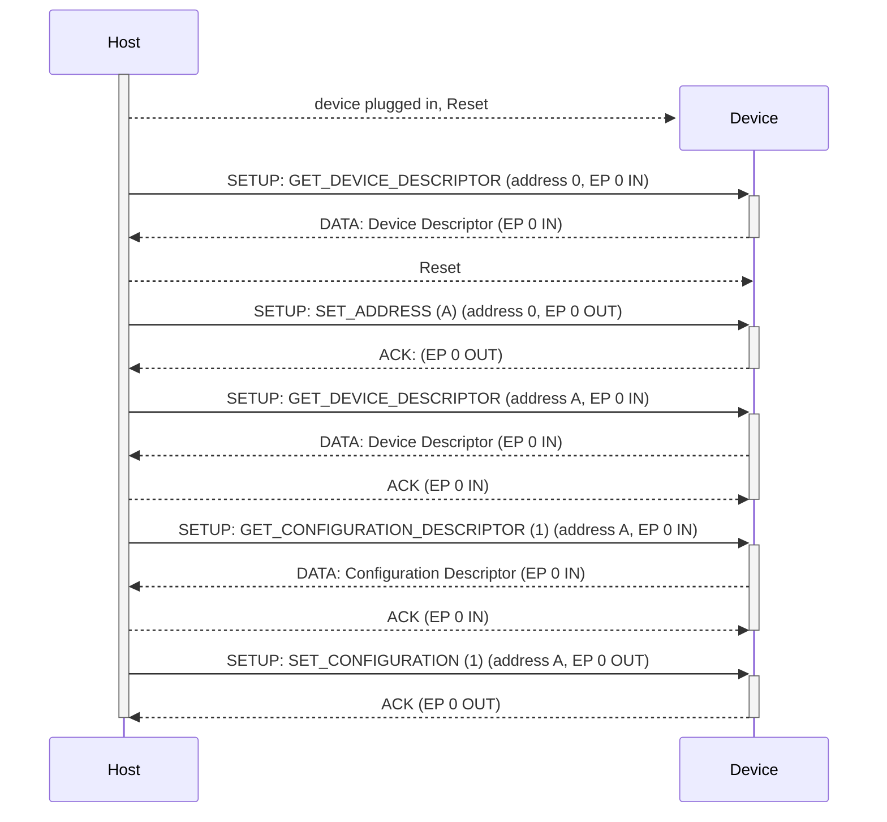

:: right ::

# Token SETUP Packet

The DATA packet of the SETUP Control Transfer

<div align="center">

</div>

*bmRequestType* field

<div align="center">

</div>


---
---
# Device Classes
predefined devices types

<style>
  table {
    font-size: 0.5em;
    border-collapse: collapse;
  }
  th {
    font-weight: bold;
  }
  td, th {
    padding: 4px; /* Reduce padding */
  }
</style>

| **Device Class Code** | **Class Name**                 | **Description**                                                   |
|-----------------------|--------------------------------|-------------------------------------------------------------------|
| `0x00`                | **Device Class**               | Device class-specific; the class code is assigned by the device.  |
| `0x01`                | **Audio**                      | Audio devices (e.g., audio interfaces, speakers, microphones).    |
| `0x02`                | **Communications and CDC Control** | Devices related to communication (e.g., modems, network adapters).|
| `0x03`                | **HID (Human Interface Device)** | Devices like keyboards, mice, and other human interface devices.  |
| `0x05`                | **Physical Interface Device (PID)** | Devices that require physical input/output (e.g., game controllers).|
| `0x06`                | **Image**                      | Image devices such as digital cameras and scanners.               |
| `0x07`                | **Printer**                    | Devices for printing (e.g., printers).                            |
| `0x08`                | **Mass Storage**               | Mass storage devices (e.g., USB flash drives, external hard drives).|
| `0x0A`                | **Still Image Capture Device** | Devices for still image capture (e.g., digital cameras).           |
| `0x0B`                | **Smart Card**                 | Smart card readers and related devices.                           |
| `0x0D`                | **Content Security**           | Devices for content protection (e.g., video players).             |
| `0x0E`                | **Video**                      | Video devices (e.g., webcams, video capture devices).             |
| `0x0F`                | **Personal Healthcare**        | Healthcare devices (e.g., thermometers, blood pressure monitors). |
| `0x10`                | **Audio/Video**                | Devices with combined audio/video functions.                      |
| `0x11`                | **Health Device**              | Devices used in health-related monitoring.                        |
| `0x12`                | **Diagnostic Device**          | Devices for diagnostics or test instruments.                      |
| `0xFF`                | **Vendor Specific**            | Vendor-specific devices (class code not assigned by USB standard).|

---
---
# Device Descriptor
describes the whole device

<style>
  table {
    font-size: 0.7em;
    border-collapse: collapse;
  }
  th {
    font-weight: bold;
  }
  td, th {
    padding: 4px; /* Reduce padding */
  }
</style>

| **Field**              | **Value**         | **Description**                                             |
|------------------------|-------------------|-------------------------------------------------------------|
| *bLength*              | `18`              | Descriptor length in bytes.                                 |
| *bDescriptorType*      | `1`               | Descriptor type (1 = Device Descriptor).                     |
| *bcdUSB*               | `0x0200`          | USB specification release number (2.0).                     |
| *bDeviceClass*         | `0xFF`            | Device class (0xFF = Vendor Specific).                       |
| *bDeviceSubClass*      | `0`               | Device subclass (0 = defined by the interface).             |
| *bDeviceProtocol*      | `0`               | Device protocol (0 = defined by the interface).             |
| *bMaxPacketSize0*      | `64`              | Maximum packet size for endpoint 0 (64 bytes).              |
| *idVendor*             | `0xCODE`          | Vendor ID (example: `0xCODE`).                               |
| *idProduct*            | `0xCAFE`          | Product ID (example: `0xCAFE`).                              |
| *bcdDevice*            | `0x0100`          | Device release number (example: `1.0`).                      |
| *iManufacturer*        | `1`               | Index of the string descriptor for the manufacturer.        |
| *iProduct*             | `2`               | Index of the string descriptor for the product.             |
| *iSerialNumber*        | `3`               | Index of the string descriptor for the serial number.       |
| *bNumConfigurations*   | `1`               | Number of configurations supported by the device.           |

---
---
# Configuration Descriptor
one of the configurations

<style>
  table {
    font-size: 0.7em;
    border-collapse: collapse;
  }
  th {
    font-weight: bold;
  }
  td, th {
    padding: 4px; /* Reduce padding */
  }
</style>

| **Field**                    | **Value**         | **Description**                                                    |
|------------------------------|-------------------|--------------------------------------------------------------------|
| *bLength*                    | `9`               | Descriptor length in bytes (always 9 for configuration descriptor). |
| *bDescriptorType*            | `2`               | Descriptor type (2 = Configuration Descriptor).                     |
| *wTotalLength*               | `0x0022`          | Total length of data returned for this configuration (including all descriptors). |
| *bNumInterfaces*             | `1`               | Number of interfaces supported by this configuration.              |
| *bConfigurationValue*        | `1`               | Value to select this configuration.                                |
| *iConfiguration*             | `4`               | Index of the string descriptor describing the configuration.       |
| *bmAttributes*               | `0x80`            | Configuration characteristics (bus-powered, no remote wake-up).    |
| *bMaxPower*                  | `50`              | Maximum power consumption (in 2mA units, so `50` means 100mA).     |


---
---
# Interface Descriptor

<style>
  table {
    font-size: 0.7em;
    border-collapse: collapse;
  }
  th {
    font-weight: bold;
  }
  td, th {
    padding: 4px; /* Reduce padding */
  }
</style>

| **Field**                    | **Value**         | **Description**                                                    |
|------------------------------|-------------------|--------------------------------------------------------------------|
| *bLength*                    | `9`               | Descriptor length in bytes (always 9 for interface descriptor).    |
| *bDescriptorType*            | `4`               | Descriptor type (4 = Interface Descriptor).                        |
| *bInterfaceNumber*           | `0`               | Number of this interface (starting from 0).                        |
| *bAlternateSetting*          | `0`               | Alternate setting (0 = default setting).                          |
| *bNumEndpoints*              | `1`               | Number of endpoints used by this interface.                        |
| *bInterfaceClass*            | `0xFF`            | Interface class (0xFF = Vendor Specific).                         |
| *bInterfaceSubClass*         | `0`               | Interface subclass (0 = vendor specific).                         |
| *bInterfaceProtocol*         | `0`               | Interface protocol (0 = vendor specific).                         |
| *iInterface*                 | `5`               | Index of the string descriptor describing this interface.          |

---
---
# Endpoint Descriptor

<style>
  table {
    font-size: 0.7em;
    border-collapse: collapse;
  }
  th {
    font-weight: bold;
  }
  td, th {
    padding: 4px; /* Reduce padding */
  }
</style>

| **Field**                    | **Value**         | **Description**                                                    |
|------------------------------|-------------------|--------------------------------------------------------------------|
| *bLength*                    | `7`               | Descriptor length in bytes (always 7 for endpoint descriptor).     |
| *bDescriptorType*            | `5`               | Descriptor type (5 = Endpoint Descriptor).                         |
| *bEndpointAddress*           | `0xb1_0000_001`            | Endpoint address (`0x81`): **Bit 7** indicates **IN** direction (device to host), and **Bits 0-3** indicate the endpoint number (`1` in this case). |
| *bmAttributes*               | `0x02`            | Endpoint attributes (`0x02` = Bulk endpoint).                      |
| *wMaxPacketSize*             | `64`              | Maximum packet size the endpoint can handle (64 bytes).           |
| *bInterval*                  | `0`               | Interval for polling (relevant for interrupt endpoints; `0` for others). |


---
---
# Strings Descriptor

<style>
  table {
    font-size: 0.7em;
    border-collapse: collapse;
  }
  th {
    font-weight: bold;
  }
  td, th {
    padding: 4px; /* Reduce padding */
  }
</style>

### String Descriptor for Configuration and Interface

| **Field**                    | **Value**           | **Description**                                                     |
|------------------------------|---------------------|---------------------------------------------------------------------|
| *bLength*                    | `4`                 | Descriptor length in bytes (always 4 for string descriptor header).  |
| *bDescriptorType*            | `3`                 | Descriptor type (3 = String Descriptor).                             |
| *bString*                    | `0x09 0x55 0x53 0x42 0x20 0x43 0x6F 0x6E 0x66 0x69 0x67 0x20 0x31` | UTF-16LE string encoding: `"USB Config 1"`.                        |

Explanation: This string descriptor corresponds to **Configuration 1**. The string is encoded in **UTF-16LE** (little-endian). Each character is represented by two bytes.

---
---
# USB 1.0 and 2.0 Modes
| Mode | Speed | Version |
|-|-|-|
| Low Speed | 1.5 Mbit/s | 1.0 |
| Full Speed | 12 Mbit/s | 1.0 |
| High Speed | 480 Mbit/s | 2.0 |

---
---

# Facts

| | | |
|-|-|-|
| Transmission | *half duplex* | data must be sent in one direction at one time |
| Clock | *independent* | the **host** and the **device** must synchronize their clocks |
| Wires | *DP* / *DM* | data is sent in a differential way |
| Devices | *1 host* <br> *several devices* | a receiver and a transmitter |
| Speed | *480 MBbit/s* |  |

---
---
# Embassy API
for RP2350, setup the device

```rust {1,4-6|2,8-14|4-6,15|all}
use embassy_rp::usb::{Driver, InterruptHandler};
use embassy_usb::Config;

bind_interrupts!(struct Irqs {
    USBCTRL_IRQ => InterruptHandler<USB>;
});

let mut config = Config::new(0xc0de, 0xcafe);
config.manufacturer = Some("Embassy");
config.product = Some("USB sender receiver");
config.serial_number = Some("12345678");
config.max_power = 100;
config.max_packet_size_0 = 64;

let driver = Driver::new(p.USB, Irqs);
```

---
---
# Embassy API
for RP2350, setup the descriptors

```rust {4-8|2,4-12|1,14-21}
use embassy_usb::msos::{self, windows_version};
use embassy_usb::Builder;

// It needs some buffers for building the descriptors.
let mut config_descriptor = [0; 256];
let mut bos_descriptor = [0; 256];
let mut msos_descriptor = [0; 256];
let mut control_buf = [0; 64];

let mut builder = Builder::new(driver, config, 
	&mut config_descriptor, &mut bos_descriptor, &mut msos_descriptor, &mut control_buf,
);

// Required for Windows
const DEVICE_INTERFACE_GUIDS: &[&str] = &["{AFB9A6FB-30BA-44BC-9232-806CFC875321}"];
builder.msos_descriptor(windows_version::WIN8_1, 0);
builder.msos_feature(msos::CompatibleIdFeatureDescriptor::new("WINUSB", ""));
builder.msos_feature(msos::RegistryPropertyFeatureDescriptor::new(
	"DeviceInterfaceGUIDs",
	msos::PropertyData::RegMultiSz(DEVICE_INTERFACE_GUIDS),
));
```

---
---
# Embassy API
for RP2350, setup the device's function and start

```rust {3|3,4|3-5|3-6|3-7|11|14|all}
// Add a vendor-specific function (class 0xFF), and corresponding interface,
// that uses our custom handler.
let mut function = builder.function(0xFF, 0, 0);
let mut interface = function.interface();
let mut alt = interface.alt_setting(0xFF, 0, 0, None);
let mut read_ep = alt.endpoint_bulk_out(64);
let mut write_ep = alt.endpoint_bulk_in(64);
drop(function);

// Build the builder.
let mut usb = builder.build();

// Create the USB device handler
let usb_run = usb.run();
```

---
---
# Embassy API
for RP2350, use the USB device

```rust {1,18|1,2,17,18|3,4|5,15|6,7,14,8,13|9-11|22|all}
let echo_run = async {
	loop {
		read_ep.wait_enabled().await;
		info!("Connected");
		loop {
			let mut data = [0; 64];
			match read_ep.read(&mut data).await {
				Ok(n) => {
					info!("Got bulk: {:a}", data[..n]);
					// Echo back to the host:
					write_ep.write(&data[..n]).await.ok();
				}
				Err(_) => break,
			}
		}
		info!("Disconnected");
	}
};

// Run everything concurrently.
// If we had made everything `'static` above instead, we could do this using separate tasks instead.
join(usb_run, echo_run).await;
```

---
---
# Host API
using `nusb` 

```rust {3,4|6,20|7-10|7-12|13|15,16|18,19|all}
use nusb::transfer::RequestBuffer;

const BULK_OUT_EP: u8 = 0x01;
const BULK_IN_EP: u8 = 0x81;

async fn main() {
    let di = nusb::list_devices()
        .unwrap()
        .find(|d| d.vendor_id() == 0xc0de && d.product_id() == 0xcafe)
        .expect("no device found");

    let device = di.open().expect("error opening device");
    let interface = device.claim_interface(0).expect("error claiming interface");

    let result = interface.bulk_out(BULK_OUT_EP, b"hello world".into()).await;
    println!("{result:?}");

    let result = interface.bulk_in(BULK_IN_EP, RequestBuffer::new(64)).await;
    println!("{result:?}");
}
```

---
---
# Host API
using Python

```python {1,5-7|9|11,12|14|14,16|2,17|19,20|1,22|all}
import usb
import time

# Find the USB device
dev = usb.core.find(idVendor=0xc0de, idProduct=0xcafe)
if dev is None:
    raise ValueError('Device not found')

dev.set_configuration() # Set the active configuration (this is usually required after device detection)

OUT_ENDPOINT = 0x01  # Usually 0x01 for OUT endpoint
IN_ENDPOINT = 0x81  # Usually 0x81 for IN endpoint (Endpoint 1, Direction IN)

data_to_send = b"Hello, USB Device!"

dev.write(OUT_ENDPOINT, data_to_send)
time.sleep(1) # Wait for a short time to ensure data is transferred

data_received = dev.read(IN_ENDPOINT, 64)  # Read 64 bytes (adjust the size if needed)
print("Data received from device:", bytes(data_received))

usb.util.release_interface(dev, 0) # Release the device interface (optional, but good practice)
```