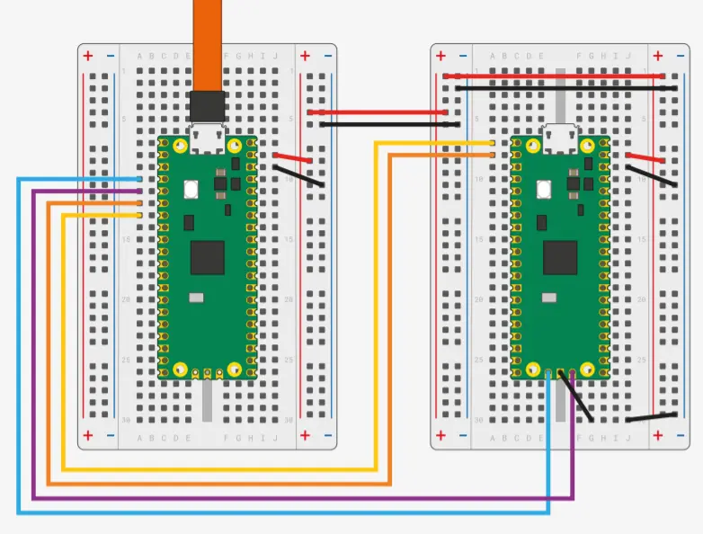
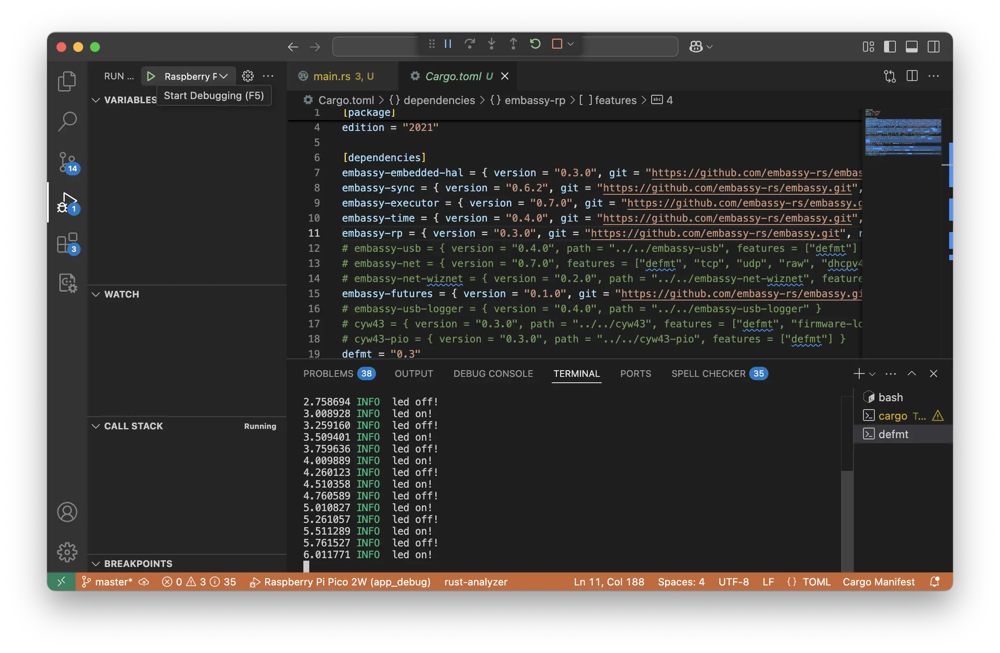

# 01 - Debug

This lab will teach you how to debug and run programs written in Rust and [embassy](https://embassy.dev) on the Raspberry Pi Pico boards.

import Tabs from '@theme/Tabs';
import TabItem from '@theme/TabItem';

## Concepts

- How to debug a microcontroller's firmware
- How the binary of the firmware looks like and how to inspect it
- How to cross-compile Rust software
- How to use `probe-rs` for RP2 processors
- How to print messages from a microcontroller
- How to use the Visual Studio Code probe-rs extension

## Resources

1. **Raspberry Pi Ltd**, *[RP2350 Datasheet](https://datasheets.raspberrypi.com/rp2350/rp2350-datasheet.pdf)*
- Chapter 4 - *Memory*
  - Section 4.1 - *ROM*
  - Section 4.2 - *SRAM*
  - Section 4.3 - *Boot RAM*
- Chapter 5 - *Bootrom*
2. [probe-rs's documentation](https://probe.rs/docs/overview/about-probe-rs/)
3. [rp235x-hal documentation](https://docs.rs/rp235x-hal/latest/rp235x_hal/index.html)
4. [Embassy documentation](https://embassy.dev/book/dev/runtime.html)

## Software Prerequisites

Please make sure that you have these installed.
- [Rust](https://www.rust-lang.org/learn/get-started)
- Rust ARMv8-M target - `rustup target add thumbv8m.main-none-eabihf`
- [probe-rs](https://probe.rs)
- cargo binutils - `cargo install cargo-binutils`
- Rust LLVM Tools - `rustup component add llvm-tools`
- [Visual Studio Code](https://code.visualstudio.com)
  - [Debugger for probe-rs](https://marketplace.visualstudio.com/items?itemName=probe-rs.probe-rs-debugger)

## Debugger

Developing software (*firmware*[^firmware]) on devices is a little different from standard computer applications. The main difference
is that the software is developed and compiled on the computer and then 
uploaded and run on a separate device.

Each development board defines its own way of uploading software to it. Some boards, like the Raspberry Pi Picos, provide a *simulated* USB drive
where users can copy a file, others, like the ESP32 boards, provide a WiFi Access Point and a web interface.

One method that all boards have in common is using the *debug interface*. Microcontrollers provide a special hardware interface
for debugging purposes. Using specialized hardware, developers can:
- stop the processor any time
- ask the processor to execute one instruction at a time
- read and write the processor's memory (RAM)
- read and write the processor's Flash (Storage)
- read the processor's registers
- access special debugging interfaces for sending log messages

These functions allow developers to upload programs and observe the program's behavior.

There are several debugging protocols available, the most common of them being JTAG and SWD. The RP2 processors use SWD.

:::warning
When placed in production, the **debug interface should be disabled**. Users of the production device should 
never be able to access such an interface and tamper with the device's program.

Each microcontroller offers a way in which the debug interface can be permanently disabled or restricted.
:::

The Raspberry Pi Pico can be debugged using one of the two pieces of hardware:
- The Raspberry Pi Debug Probe
- A secondary Raspberry Pi Pico

### Raspberry Pi Debug Probe

Professional debuggers, while offering a lot of features, are usually expensive. Raspberry Pi provides the [Debug Probe](https://www.raspberrypi.com/products/debug-probe/), an affordable debug device
that uses an RP2040 processor. It is similar to a Raspberry Pi Pico board, just that it has a smaller form factor and
provides debug cables. 

The firmware running on the debug device is open source and available on [github](https://github.com/raspberrypi/debugprobe). It is written in C and 
it uses [FreeRTOS](https://www.freertos.org). It is compatible with both versions of the RP2 processors, RP2040 and RP2350.

The details about the wiring are available on the Pico Debug Probe's [website](https://www.raspberrypi.com/documentation/microcontrollers/debug-probe.html#getting-started).

### Secondary Pico

As the debugger's firmware is open source, an additional Raspberry Pi Pico can be used as a debugger.

The details about the wiring are available in the [Getting started with Raspberry Pi
Pico-series](https://datasheets.raspberrypi.com/pico/getting-started-with-pico.pdf) in the *Debug with a second Pico or Pico 2* section. 



:::info
The lab board uses RP2040 processor soldered to the PCB as a debugger. It runs the [debugprobe](https://github.com/raspberrypi/debugprobe) firmware and has 
traces soldered to Raspberry Pi Pico's socket.
:::


## Debugger software

Hardware debuggers require specialized software on the host computer (the computer used for development) to 
communicate with and control the target device (the Raspberry Pi Pico 2 in this case). These software tools provide 
essential debugging capabilities, such as setting breakpoints, inspecting 
memory, and stepping through code execution. While most debugger vendors offer 
proprietary software tailored to their specific hardware, developers often seek 
more flexible or platform-independent solutions. Fortunately, there are several 
open-source alternatives that support a wide range of debugging probes and 
microcontrollers.

One widely used open-source tool is [OpenOCD](https://openocd.org), which 
provides a powerful and configurable interface for debugging and programming 
ARM and RISC-V devices, including the Raspberry Pi Pico 2. OpenOCD supports a 
variety of debug probes and allows integration with GDB for source-level 
debugging.

Another popular option is [PyOCD](https://pyocd.io), a Python-based tool 
designed primarily for ARM Cortex-M microcontrollers. It offers an easy-to-use 
command-line interface, built-in support for CMSIS-DAP debug probes, and 
seamless integration with debugging environments like GDB and Visual Studio 
Code.

For developers working in Rust or looking for an alternative that is optimized 
for modern workflows, [probe-rs](https://probe.rs) provides a Rust-based 
debugging and flashing tool that supports multiple probe types, including 
CMSIS-DAP and J-Link. It offers a simple API, making it a great choice for both 
manual debugging and automated workflows.

## Cross-compiling

Cross-compiling is the process of building software on one system (the host) 
that is intended to run on a different system (the target). This is necessary 
when developing for embedded systems like the Raspberry Pi Pico 2 because the 
target device has a different processor architecture than the development 
computer. Unlike normal compiling, where the compiled binary runs on the same 
system that builds it, cross-compiling generates machine code suitable for the 
target architecture. 

In Rust, this is handled by specifying a target triple. 
For example, when using `cargo build` for embedded development, Rust compiles 
the firmware for the microcontroller's architecture and flashes it to the 
device. 

For example, cross-compiling for the Raspberry Pi Pico 2 requires the
`thumbv8m.main-none-eabihf` triple. It tells the compiler to build code
for:
- the **ARMv8-M Mainline** (`thumbv8m.main`) architecture
- that runs bare metal, **without an operating system** available (`none`)
- and uses the **Embedded Application Binary Interface** (`eabi`) **with hardware floating point** support

```sh
cargo build --target thumbv8m.main-none-eabihf
```

### Using a configuration file

Instead of providing the target triple in the command line every time, `cargo` offers the 
possibility of writing it in a configuration file called `.cargo/config.toml`.
 
```toml
[build]
target = "thumbv8m.main-none-eabihf"
```

This sets the default compilation target to `thumbv8m.main-none-eabihf`,
ensuring that `cargo` always builds the project for an *ARMv8-M Mainline*
microcontroller with hardware floating-point support.

With this setting, running `cargo build` or `cargo run` automatically
compiles for the specified target, making cross-compilation seamless.

:::info
The target triple for the Raspberry Pi Pico 1 is `thumbv6m-none-eabi`.
:::

## Binary format

To be able to properly run the code, the Raspberry Pi Pico (1 and 2) expects a certain binary format.
The compiler and the linker, both provided by Rust, have to make sure that the generated
binary code meets the requirements, otherwise the Raspberry Pi Pico will not start.

### Sections

The binary file is generated as a collection of sections. Each section has:
- size (in bytes)
- the address of the section in RAM when the firmware runs (`VMA`, *Virtual Memory Address*) 
- the address of the section when it is stored into flash (`LMA`, *Load Memory Address*)
- the type

#### Section types
| Type | Description |
|-|-|
| *TEXT* | Contains the binary code the the processor executes |
| *DATA* | Contains data used by the firmware, usually variables |
| *BSS* | Contains uninitialized or initialized with `0` data, usually uninitialized global variables and variables initialized to 0 |
| *DEBUG* | Contains debug information used by the debugger software. |

:::info
DEBUG type sections have no addresses (`0x00000000`), as they are never loaded to the device. These sections
are used by the debugging software to display meaningful information to developers. Among the information
store here we can find:
- source code to binary code mappings
- variable name mappings
- function name mappings
:::

The binary file for the Raspberry Pi Pico 2 is organized to ensure proper 
execution and booting, with specific sections for the developer's code and 
variables. The first section that holds the developer’s code is the *`.text`* 
section. This section contains all the executable instructions that make up 
the application’s logic. It is located after the *`.start_block`* and 
*`.vector_table`* sections, and it is placed into flash memory, ready to 
be loaded and executed when the system starts. This is where the developer's 
main program logic resides.

Following the *`.text`* section, the *`.data`* section contains 
initialized global and static variables. These variables are stored in flash 
memory and are copied into RAM at startup. The developer’s predefined values 
for global variables are stored here, so they can be used during runtime. 
In contrast, the *`.bss`* section holds uninitialized variables. These 
variables are zeroed out during the boot process and are stored in RAM to 
ensure that the program can access them during execution.

The *`.rodata`* section follows, storing read-only data like string literals 
and constant values. These values are also stored in flash memory and are used 
throughout the application without modification. The *`.rodata`* section 
helps to conserve RAM by storing constant data in the flash memory instead.

Once the developer’s code and variables are in place, the firmware image ends 
with the *`.end_block`* section. This section marks the end of the firmware 
and ensures that no additional data is written past this point. It is important 
for memory management, preventing the accidental overwrite of critical memory 
regions during updates or execution.

### Linker Script

The compiler is responsible for generating the sections and the linker is responsible for 
putting the sections in the right place in the binary. Rust uses a linker script to
instruct the linker where to put the sections. The linker script is usually called
`memory.x` and is located in the firmware's root folder.

:::warning
The linker script is in the firmware's crate root folder, not in the `src` folder.
:::

<Tabs>
  <TabItem value="rp2350" label="Raspberry Pi Pico 2" default>

```ld
MEMORY {
    /*
     * The RP2350 has either external or internal flash.
     *
     * 2 MiB is a safe default here, although a Pico 2 has 4 MiB.
     */
    FLASH : ORIGIN = 0x10000000, LENGTH = 2048K
    /*
     * RAM consists of 8 banks, SRAM0-SRAM7, with a striped mapping.
     * This is usually good for performance, as it distributes load on
     * those banks evenly.
     */
    RAM : ORIGIN = 0x20000000, LENGTH = 512K
    /*
     * RAM banks 8 and 9 use a direct mapping. They can be used to have
     * memory areas dedicated for some specific job, improving predictability
     * of access times.
     * Example: Separate stacks for core0 and core1.
     */
    SRAM4 : ORIGIN = 0x20080000, LENGTH = 4K
    SRAM5 : ORIGIN = 0x20081000, LENGTH = 4K
}

SECTIONS {
    /* ### Boot ROM info
     *
     * Goes after .vector_table, to keep it in the first 4K of flash
     * where the Boot ROM (and picotool) can find it
     */
    .start_block : ALIGN(4)
    {
        __start_block_addr = .;
        KEEP(*(.start_block));
        KEEP(*(.boot_info));
    } > FLASH

} INSERT AFTER .vector_table;

/* move .text to start /after/ the boot info */
_stext = ADDR(.start_block) + SIZEOF(.start_block);

SECTIONS {
    /* ### Picotool 'Binary Info' Entries
     *
     * Picotool looks through this block (as we have pointers to it in our
     * header) to find interesting information.
     */
    .bi_entries : ALIGN(4)
    {
        /* We put this in the header */
        __bi_entries_start = .;
        /* Here are the entries */
        KEEP(*(.bi_entries));
        /* Keep this block a nice round size */
        . = ALIGN(4);
        /* We put this in the header */
        __bi_entries_end = .;
    } > FLASH
} INSERT AFTER .text;

SECTIONS {
    /* ### Boot ROM extra info
     *
     * Goes after everything in our program, so it can contain a signature.
     */
    .end_block : ALIGN(4)
    {
        __end_block_addr = .;
        KEEP(*(.end_block));
    } > FLASH

} INSERT AFTER .uninit;

PROVIDE(start_to_end = __end_block_addr - __start_block_addr);
PROVIDE(end_to_start = __start_block_addr - __end_block_addr);
```

  </TabItem>
  <TabItem value="rp2040" label="Raspberry Pi Pico" default>

```ld
MEMORY {
    BOOT2 : ORIGIN = 0x10000000, LENGTH = 0x100
    /*
     * Here we assume you have 2048 KiB of Flash. This is what the Pi Pico
     * has, but your board may have more or less Flash and you should adjust
     * this value to suit.
     */
    FLASH : ORIGIN = 0x10000100, LENGTH = 2048K - 0x100
    /*
     * RAM consists of 4 banks, SRAM0-SRAM3, with a striped mapping.
     * This is usually good for performance, as it distributes load on
     * those banks evenly.
     */
    RAM : ORIGIN = 0x20000000, LENGTH = 256K
    /*
     * RAM banks 4 and 5 use a direct mapping. They can be used to have
     * memory areas dedicated for some specific job, improving predictability
     * of access times.
     * Example: Separate stacks for core0 and core1.
     */
    SRAM4 : ORIGIN = 0x20040000, LENGTH = 4k
    SRAM5 : ORIGIN = 0x20041000, LENGTH = 4k

    /* SRAM banks 0-3 can also be accessed directly. However, those ranges
       alias with the RAM mapping, above. So don't use them at the same time!
    SRAM0 : ORIGIN = 0x21000000, LENGTH = 64k
    SRAM1 : ORIGIN = 0x21010000, LENGTH = 64k
    SRAM2 : ORIGIN = 0x21020000, LENGTH = 64k
    SRAM3 : ORIGIN = 0x21030000, LENGTH = 64k
    */
}

EXTERN(BOOT2_FIRMWARE)

SECTIONS {
    /* ### Boot loader
     *
     * An executable block of code which sets up the QSPI interface for
     * 'Execute-In-Place' (or XIP) mode. Also sends chip-specific commands to
     * the external flash chip.
     *
     * Must go at the start of external flash, where the Boot ROM expects it.
     */
    .boot2 ORIGIN(BOOT2) :
    {
        KEEP(*(.boot2));
    } > BOOT2
} INSERT BEFORE .text;

SECTIONS {
    /* ### Boot ROM info
     *
     * Goes after .vector_table, to keep it in the first 512 bytes of flash,
     * where picotool can find it
     */
    .boot_info : ALIGN(4)
    {
        KEEP(*(.boot_info));
    } > FLASH

} INSERT AFTER .vector_table;

/* move .text to start /after/ the boot info */
_stext = ADDR(.boot_info) + SIZEOF(.boot_info);

SECTIONS {
    /* ### Picotool 'Binary Info' Entries
     *
     * Picotool looks through this block (as we have pointers to it in our
     * header) to find interesting information.
     */
    .bi_entries : ALIGN(4)
    {
        /* We put this in the header */
        __bi_entries_start = .;
        /* Here are the entries */
        KEEP(*(.bi_entries));
        /* Keep this block a nice round size */
        . = ALIGN(4);
        /* We put this in the header */
        __bi_entries_end = .;
    } > FLASH
} INSERT AFTER .text;
```

  </TabItem>
</Tabs>

### Build Script

To connect the linker script (`memory.x`) to the compiler, Rust uses the `build.rs` file
located in the root of the firmware's crate.

:::warning
The `build.rs` file is located in the root of the firmware's crate, not in the `src` folder.
:::

The `build.rs` file compiles before the firmware and is executed by the Rust compiler during
the compilation. The `build.rs` file writes to the *screen* compiler options that the compiler
later uses for the building of the firmware.

```rust
//! This build script copies the `memory.x` file from the crate root into
//! a directory where the linker can always find it at build time.
//! For many projects this is optional, as the linker always searches the
//! project root directory -- wherever `Cargo.toml` is. However, if you
//! are using a workspace or have a more complicated build setup, this
//! build script becomes required. Additionally, by requesting that
//! Cargo re-run the build script whenever `memory.x` is changed,
//! updating `memory.x` ensures a rebuild of the application with the
//! new memory settings.

use std::env;
use std::fs::File;
use std::io::Write;
use std::path::PathBuf;

fn main() {
    // Put `memory.x` in our output directory and ensure it's
    // on the linker search path.
    let out = &PathBuf::from(env::var_os("OUT_DIR").unwrap());
    File::create(out.join("memory.x"))
        .unwrap()
        .write_all(include_bytes!("memory.x"))
        .unwrap();
    println!("cargo:rustc-link-search={}", out.display());

    // By default, Cargo will re-run a build script whenever
    // any file in the project changes. By specifying `memory.x`
    // here, we ensure the build script is only re-run when
    // `memory.x` is changed.
    println!("cargo:rerun-if-changed=memory.x");

    println!("cargo:rustc-link-arg-bins=--nmagic");
    println!("cargo:rustc-link-arg-bins=-Tlink.x");
    // Required for `defmt`
    println!("cargo:rustc-link-arg-bins=-Tdefmt.x");
}
```

This example instructs the linker to use:
- the project's linker script - `memory.x`
- the `cortex-m-rt` linker script - `link.x`
- the `defmt`'s linker script - `defmt.x`

### Inspect binaries

When working in Rust for the Raspberry Pi Pico 2, `rust-objdump` can be used to 
inspect the compiled binary and examine its memory layout. The output includes 
various sections that are crucial for embedded development.  

| Section         | Fixed Offset  | Description |
|----------------|--------------|-------------|
| *`.vector_table`* | `0x10000000` | Contains the initial stack pointer value and interrupt vector table. Essential for system startup and exception handling, allowing the processor to correctly respond to interrupts. |
| *`.start_block`* | `0x10000114` | Holds boot metadata, including information needed by the bootloader to validate and execute the firmware correctly. Ensures that the correct application runs after a reset. |
| *`.text`* | N/A | Stores executable code, typically placed in flash memory. Optimizing this section can reduce flash usage and improve execution efficiency. |
| *`.rodata`* | N/A | Contains read-only data, such as string literals and constants, stored in flash memory. Helps minimize RAM usage. |
| *`.data`* | N/A | Includes initialized variables that are stored in flash and copied to RAM during startup. Used for global and static variables requiring predefined values. |
| *`.bss`* | N/A | Represents uninitialized variables that are zeroed out in RAM before execution. Large `.bss` sections can impact RAM availability. |
| *`.bi_entries`* | N/A | Contains boot information entries used by the RP2350 ROM bootloader and firmware updater to manage and validate firmware images. |
| *`.end_block`* | N/A | Marks the end of the firmware image. This section helps bootloaders determine the total size of the firmware and ensures that no unexpected data is included beyond this point. It is used for integrity checks and defining boundaries for updates or memory protection. |


#### Pico 1 vs Pico 2
The primary difference between the Raspberry Pi Pico 1 and Pico 2 in terms of 
firmware layout is the presence of the *`.boot2`* section in the Pico 1, 
which is not present in the Pico 2. The *`.boot2`* section in the Pico 1 
is located at a fixed offset of `0x10000000` and contains the bootloader code 
along with necessary metadata for bootstrapping the device. 

The *`.vector_table`*  section in the Pico 1 is placed immediately 
after the *`.boot2`* section, 
unlike the Pico 2 where it is located at the beginning of the flash memory at 
`0x00000000`. 

The Pico 2 uses the *`.start_block`* and *`.end_block`* sections 
to handle boot metadata and firmware boundaries, while the Pico 1 relies on the 
bootloader for these tasks. Furthermore, the Pico 1 does not have a fixed 
*`.end_block`* section, which is used in the Pico 2 to mark the end of the 
firmware image. 

Despite these differences, both devices share a similar overall 
firmware structure, with the *`.text`*, *`.rodata`*, *`.data`*, and *`.bss`* 
sections serving similar purposes in both devices.

### Check section headers

If the uploaded firmware does not boot, looking at the firmware's sections is useful.

The `rust-objdumb` tool can be used to inspect firmware binaries. Using the `--section-headers` 
flag will display the sections of the firmware.

<Tabs>
  <TabItem value="rp2350" label="Raspberry Pi Pico 2" default>

```shell
rust-objdump --section-headers target/thumbv8m.main-none-eabihf/debug/$app_name
```

:::tip
Make sure that:
- section `.vector_table` is `0x114` long and at `0x10000000`
- section `.start_block` is at `0x10000114`
- section `.end_block` exists
:::

```shell
Sections:
Idx Name            Size     VMA      LMA      Type
  0                 00000000 00000000 00000000 
  1 .vector_table   00000114 10000000 10000000 DATA
  2 .start_block    00000028 10000114 10000114 DATA
  3 .text           0000b190 1000013c 1000013c TEXT
  4 .bi_entries     00000010 1000b2cc 1000b2cc DATA
  5 .rodata         000030e4 1000b2e0 1000b2e0 DATA
  6 .data           00000488 20000000 1000e3c4 TEXT
  7 .gnu.sgstubs    00000000 1000e860 1000e860 DATA
  8 .bss            000181bc 20000488 20000488 BSS
  9 .uninit         00000400 20018644 20018644 BSS
 10 .end_block      00000000 1000e860 1000e860 DATA
 11 .defmt          00000023 00000000 00000000 
 12 .debug_abbrev   0000b8bb 00000000 00000000 DEBUG
 13 .debug_info     000ea40f 00000000 00000000 DEBUG
 14 .debug_aranges  00009a70 00000000 00000000 DEBUG
 15 .debug_ranges   00032380 00000000 00000000 DEBUG
 16 .debug_str      000eff8d 00000000 00000000 DEBUG
 17 .comment        00000099 00000000 00000000 
 18 .ARM.attributes 0000003a 00000000 00000000 
 19 .debug_frame    0001b444 00000000 00000000 DEBUG
 20 .debug_line     0006ed68 00000000 00000000 DEBUG
 21 .debug_loc      00001e3a 00000000 00000000 DEBUG
 22 .symtab         00007530 00000000 00000000 
 23 .shstrtab       00000101 00000000 00000000 
 24 .strtab         0000f6ca 00000000 00000000 
```

  </TabItem>
  <TabItem value="rp2040" label="Raspberry Pi Pico">

```shell
rust-objdump --section-headers target/thumbv6m-none-eabi/debug/$app_name
```

:::tip
Make sure that:
- section `.boot2` is `0x100` long and at `0x10000000`
- section `.vector_table` is `0x0c0` long and at `0x10000100`
:::

```shell
Sections:
Idx Name            Size     VMA      LMA      Type
  0                 00000000 00000000 00000000 
  1 .vector_table   000000c0 10000100 10000100 DATA
  2 .boot_info      00000000 100001c0 100001c0 DATA
  3 .boot2          00000100 10000000 10000000 DATA
  4 .text           000027d8 100001c0 100001c0 TEXT
  5 .bi_entries     00000000 10002998 10002998 DATA
  6 .rodata         00000d00 10002998 10002998 DATA
  7 .data           00000038 20000000 10003698 DATA
  8 .gnu.sgstubs    00000000 100036e0 100036e0 DATA
  9 .bss            00000008 20000038 20000038 BSS
 10 .uninit         00000400 20000040 20000040 BSS
 11 .defmt          0000000a 00000000 00000000 
 12 .debug_abbrev   00005fc3 00000000 00000000 DEBUG
 13 .debug_info     000aa259 00000000 00000000 DEBUG
 14 .debug_aranges  00006df8 00000000 00000000 DEBUG
 15 .debug_ranges   0001d2d8 00000000 00000000 DEBUG
 16 .debug_str      000e4147 00000000 00000000 DEBUG
 17 .comment        00000099 00000000 00000000 
 18 .ARM.attributes 00000032 00000000 00000000 
 19 .debug_frame    0001466c 00000000 00000000 DEBUG
 20 .debug_line     00049f95 00000000 00000000 DEBUG
 21 .debug_loc      0000141b 00000000 00000000 DEBUG
 22 .symtab         00001ec0 00000000 00000000 
 23 .shstrtab       000000fb 00000000 00000000 
 24 .strtab         000035f6 00000000 00000000 
```
  
  </TabItem>
</Tabs>


:::info

`cargo objdumb` and `rust-objdump` tools use llvm's `objdump` tool.
Some terminals do not parse parameters proxied to `llvm-objdump` command.
If this happens please use `llvm-objdump` script directly like so

```shell
llvm-objdump <path_to_binary> --section.headers
```

:::

[^firmware]: Software that is running on microcontrollers is usually called *firmware*. The words is a combination of the words *firm* and *software* and means the software that the vendor firm of the device has uploaded.

## Empty firmware

An *empty firmware* is a piece of software running on a device that boots and puts 
the device in an endless loop. To boot, the firmware has to perform the following:
- do not depend on the standard library (`#![no_std]`)
- do not provide the standard `main` function called by the operating system (`#![no_main]`)
- provide the `.start_block` and `.end_block` sections (or `.bootloader` for the Pico 1);
- provide the `.interrupt_vector` section with pointers to interrupts;
- copy the DATA sections from Flash to the correct address in RAM;
- initialize the BSS section in RAM with 0 values
- jump to the `main` function and never return.

### The `.interrupt_vector` section

The `.interrupt_section` is provided by `rp235x_hal` crate (or `rp2040_hal` for the Pico 1).
Importing this crate is enough to provide a valid interrupt vector.


```rust
#![no_std]
#![no_main]

// we use as _ to avoid a compiler warning
// saying that the crate is not used
use rp235x_hal as _;
```

### The `.start_block` and `.end_block`s

The `rp235x_hal` crate provides the valid `.start_block` and `.end_block`.

```rust
use rp235x_hal::block::ImageDef;

#[unsafe(link_section = ".start_block")]
#[used]
pub static IMAGE_DEF: ImageDef = ImageDef::secure_exe();
```

:::warning
Older Rust versions do not require `unsafe` around the `link_section` attribute.
:::

This code creates a static variable `IMAGE_DEF` of type `ImageDef` and places it 
in the `.start_block` section, a dedicated section for bootloader 
or secure boot metadata. The `#[used]` attribute ensures the variable is 
included in the binary, even if it isn't directly referenced, 
which is crucial for secure boot functionality or other boot-related processes.

The `secure_exe` function creates a `.start_block` that instructs the `BOOTROM` of the 
Raspberry Pi Pico 2 to start the firmware in secure execution mode. The processor
always starts in secure execution mode and has to be switched to unsecure mode
by the firmware.

:::warning
The `#[used]` attribute is important as linkers will discard code that is
not used to lower the size of the binary. The `IMAGE_DEF` variable is not 
directly used by anything in the firmware and might be discarded.
:::

The `.end_block` is automatically inserted by the linker using the `memory.x` file.

### The `main` function

When writing software that runs on top of an operating system, the operating system
is responsible for initializing the memory of the software and the calling 
of the `main` function. 

Embedded firmware that does not run on top of an operating system has to perform the
memory initialization tasks and calling the `main` function itself.

The Rust Embedded Working Group provides a crate called `cortex_m_rt` (*Cortex-M Runtime*) that
exposes the macro `entry!` to perform these tasks. The macro is placed on top of a function
that takes no parameters and does no return (`!`).

```rust
use cortex_m_rt::entry;

#[entry]
fn main() -> ! {
  loop {}
}
```

:::info
The important aspect is the usage of the `#[entry]` macro, 
while the name of the function does not need to be `main`.
:::

The `entry!` macro will rewrite the `main` function and add all the initialization code.

:::note
Different frameworks like `embassy-rs` will use different entry macros.
:::

## Flashing firmware

To run firmware on the Raspberry Pi Pico 2, the 
compiled program must be transferred to the device's flash (non-volatile) memory. This 
process is called *flashing*, and it ensures that the firmware remains on the 
device even after a power reset. 

A flashing tool is software that communicates 
with the device through a debug probe or other interfaces, such as USB or 
*UART*, to write the firmware to the correct memory location. Many flashing tools 
also verify the uploaded firmware to ensure data integrity and provide 
additional features like chip erasing or memory protection configuration.

When developing Rust firmware for the Raspberry Pi Pico 2, `probe-rs` is the 
preferred flashing tool to upload and debug code. 

After building the firmware using `cargo build`, an ELF file will be generated in
`target/thumbv8m.main-none-eabihf/debug/$app_name`. This file can be flashed to the
board using:

```sh
probe-rs flash --chip RP235x target/thumbv8m.main-none-eabihf/debug/$app_name
```

:::info
Replace $app_name with the name of the firmware's crate, usually the name of the folder
where the firmware source resides.
:::


### Using `cargo run`

On a computer, running a Rust program with `cargo run` compiles the source 
code into an executable and immediately starts it. This command streamlines 
development by combining compilation and execution into a single step.

A similar process applies when using `cargo run` to develop firmware for the Raspberry 
Pi Pico 2. Instead of just compiling and running a program on the host computer, 
`cargo run` cross compiles the firmware and flashes it onto the target device in one 
step. Under the hood, it uses `probe-rs` to detect the connected debug probe 
and handle the flashing process automatically. This eliminates the need for 
separate flashing tools, making firmware development as seamless as running a 
Rust program on a computer.

To be able to use `cargo run` for flashing firmware, a runner has to be specified in the
`.cargo/config.toml` file. The following lines have to be added.

```toml
[target.'cfg(all(target_arch = "arm", target_os = "none"))']
runner = "probe-rs run --chip RP235x"
```

:::warning
Make sure the correct `[target]` is specified in the `.cargo/config.toml` configuration file. See the
[cross-compiling](#using-a-configuration-file) section.
:::

This setup makes flashing firmware to the Raspberry Pi Pico 2 as simple
as running a Rust program on a computer.

## Printing messages

When developing embedded applications, debugging can be challenging due to 
the lack of standard output (such as `println!`). Printed messages need to be generated 
on the target device and sent to the host computer
where they are displayed to a console. 

Two common techniques to 
retrieve debug information from an embedded system are *semihosting* and  
*`defmt`*. Both methods provide insight into program execution but work  
differently and are suited for different use cases.

### Semihosting
Semihosting is a debugging mechanism that allows an embedded system to 
communicate with a host computer via a debugger. It enables operations like:  
- printing debug messages (`println!`)  
- reading input from the host

:::info
Semihosting requires a hardware debugger.
:::

This works in there steps:
1. The embedded firmware executes a special *semihosting instruction*.  
2. The debugger software (e.g., `gdb` with `probe-rs`) intercepts the request.  
3. The debugger software processes the request and returns the result to the firmware.

Semihosting is very simple to implement, but has a big drawback, it is slow 
and cannot be used in production. 

:::note
Printing a panic message takes more than 2 seconds.
:::

#### Printing a message

Semihosting for Cortex-M is implemented by the `cortex_m_semihosting` crate. This
exposes the `hprintln!`, a macro used for printing messages to the host system. 
This macro behaves like `println!`, but instead of 
printing to the terminal, it sends the output to the debugger, which then 
transmits it to the host system.

```rust
#![no_std]
#![no_main]

use cortex_m_rt::entry;
use cortex_m_semihosting::hprintln;

#[entry]
fn main() -> ! {
  hprintln!("Device has started");
  // write the rest of the code here
  loop {}
}
```

:::tip
The main advantage of semihosting is that it works with all the embedded frameworks.
:::

#### Printing the panic

The Rust language provides a special function called the *panic handler* that gets 
called in case things go wrong. For instance attempting to divide to 0 will call the
panic handler.

In embedded systems, the *panic handler* is used to handle unexpected runtime errors.  
Using `hprintln!` in the panic handler allows developers to print helpful debug  
messages when the program encounters a panic, making it easier to solve issues. 

When using `#![no_std]`, developers have to define their own panic handler.

```rust
#![no_std]
#![no_main]

use cortex_m_rt::entry;
use cortex_m_semihosting::hprintln;

#[entry]
fn main() -> ! {
    // Trigger a panic by dividing by zero (for demonstration purposes)
    let result = divide_by_zero();
    hprintln!("Result: {}", result);

    loop {}
}

// Simulate a division by zero panic
fn divide_by_zero() -> u32 {
    let a = 1;
    let b = 0;
    a / b  // This will trigger a panic
}

// Define the panic handler
#[panic_handler]
fn panic(info: &PanicInfo) -> ! {
    // Print a panic message
    hprintln!("Panic occurred: {:?}", info);

    // Enter an infinite loop to halt the system after a panic
    loop {}
}
```

The `divide_by_zero` function is intentionally written to trigger a panic
(dividing by zero).
- the panic_handler is defined using the `#[panic_handler]` attribute, when a panic occurs, this handler will be called;
- inside the panic_handler, `hprintln!` is used to print the panic message (`Panic occurred: ...`) to the host system via semihosting.
- the program enters an infinite loop (`loop {}`) to halt the system after a panic, preventing the device from continuing to run.

:::info
Panic handlers are usually defined by the frameworks. `embassy-rs` does define its own panic handler.
:::

### Using `defmt`

Another drawback of semihosting is that
all the strings used in the debug messages are stored into the firmware's DATA
sections and are flashed to the device. All the formating of these strings
is done by the device.

The [`defmt`](https://github.com/knurling-rs/defmt) crate is a compact logging framework 
designed for Rust-based embedded systems. Its name comes from *Deferred Formatting*. Instead of sending full log messages, 
it transmits compressed binary data, which is later decoded on the host.  

This works in two steps:
1. the firmware sends compressed log data via a debug probe (e.g., using `probe-rs`) or another transport like UART (serial port);
2. the host tool (`defmt-print`) decodes the data and prints human-readable logs.  

Using `defmt` implies working with its own printing macros: 
- `error!` used for logging errors, that mean that the firmware cannot conitnue to correctly run;
- `warn!` used for logging warning messages, that are usually recoverable errors, and the framework can continue to run correctly;
- `info!` used for logging information messages;
- `debug!` used for logging debug messages that should not be displayed under normal functioning;
- `trace!` used for logging almost all the actions of the firmware, messages that should be enabled only when the firmware does not work correctly and needs detailed debugging. 

#### Transports

One of the key features of `defmt` is its flexible transport system, allowing developers 
to choose how the log data is transmitted.  
Here, we'll highlight *RTT* (*Real-Time Transfer*) and *UART*.

*RTT* is one of the most powerful transport solutions for embedded debugging. 
It is a high-speed communication protocol that allows log data to be sent from 
the embedded system to the host system in real time. RTT works through the 
debugger's *SWD* (*Serial Wire Debug*) interface, which allows communication 
between the device and the host without requiring an additional *UART* or *USB* 
connection. 

:::info
Using *RTT* requires a debugger.

*RTT* has several key advantages over traditional *UART*. It offers much higher 
data transfer speeds, making it ideal for applications that need frequent 
log output or high-throughput debugging. Moreover, *RTT* doesn't require a 
separate serial interface or special drivers on the host system, as the 
debugger itself handles the communication. The real-time nature of *RTT* is 
perfect for debugging critical, time-sensitive systems.
:::

*UART* is one of the oldest and most commonly used serial communication protocols 
in embedded systems. It’s well-supported by almost every microcontroller and 
platform, and it provides a straightforward way to send log data to a host system. 
In the context of `defmt`, *UART* can be used to transmit log data as ASCII or 
binary over a serial connection, where it is then decoded by a terminal or 
host application.

:::info
While *UART* is slower than RTT, it remains a popular solution due to its simplicity 
and widespread availability. It can be easily set up on most microcontrollers and 
is supported by many *USB-to-serial* adapters, making it accessible for both 
beginners and experienced developers. However, it has limitations in terms of 
speed and real-time debugging capabilities, especially in cases with large log 
outputs or higher data transfer requirements.
:::

#### Example

This example demonstrates how to use `defmt` for logging in an embedded system, 
handle panics, and send log messages over *RTT*. 

```rust
#![no_std]
#![no_main]

use cortex_m_rt::entry;
use defmt::{error, info};
// use RTT for defmt transport
use defmt_rtt as _;

#[entry]
fn main() -> ! {
  info!("Device has started");
  panic!("panic here");
}

#[panic_handler]
fn panic(info: &PanicInfo) -> ! {
    error!("{:?}", info);
    loop {}
}
```

The `defmt` crate is used for logging, and two macros are employed in this example: `info!` and `error!`. The `info!` macro is used to log informational messages, such as when the device starts up. The `error!` macro is used in the panic handler to log error messages if the system encounters a panic. 
The logging data is transmitted via *RTT* using the `defmt_rtt` crate, which is imported but not explicitly called. 
The use of RTT enables real-time, high-speed communication between the embedded system and the host, 
making it suitable for debugging in time-sensitive applications.

In the `main` function, the program begins by logging the message `"Device has started"` with the `info!` macro. 
Following this, the `panic!` macro is called, simulating a panic condition. This could be triggered for various 
reasons, such as an unexpected error or failed condition in the embedded system.

The *panic handler* logs the panic information using the `error!` macro. The `info` parameter passed to the panic handler contains details about the panic, which are logged for debugging purposes. 
After logging the error, the program enters an infinite loop (`loop {}`) to prevent further execution, 
effectively halting the system in a controlled manner. This is a common pattern in embedded systems when 
handling critical errors or panics.

#### Filtering messages

Messages printed by `defmt` can be filetred using the `DEFMT_LOG` environemnt variable. The value
of this variable represents the lowest priority type of message the will be printed.

| Message | Priority |
|-|-|
| `trace!` | 0 |
| `debug!` | 1 |
| `info!` | 2 |
| `warn!` | 3 |
| `error!` | 4 |

:::warning
The `DEFMT_LOG` variable has to be set during the build.
:::

To avoid setting this variable at every build, a `.cargo/config.toml` entry can be used.

```toml
[env]
DEFMT_LOG = "debug"
```

This example will ask `cargo run` to only print messages with a priority higher or equal to `debug!`.

### Semihosting and `defmt`

This table show the advantages and disadvantages of both methods.

| Feature       | Semihosting                        | `defmt`                         |
|--------------|----------------------------------|--------------------------------|
| **Performance** | Slow (halts CPU)                | Fast (minimal overhead)        |
| **Output Format** | Plain text (`hprintln!`)        | Compressed binary logs        |
| **Debugger Required?** | Yes                              | No (can use other transports) |
| **Memory Usage** | High (standard Rust formatting) | Low (compact binary format)   |
| **Use Case** | Debugging with full text output  | Real-time logging on embedded devices |

## Exercises

1. Create a new project using `cargo init`. Configure the project using a configuration file
  to build for the lab board's target. Test it by running `cargo build`. Take a look at [Empty firmware](#empty-firmware)(**1p**). 
:::tip
*Make sure you are building a binary that does not depend on `std`, has no `main` function
and provides a panic handler.*

To prevent `rust-analyzer` from showing an error on the first line and to automatically
format your source when saving, create a `.vscode/settings.json` file with:

```json
{
    "rust-analyzer.cargo.allTargets": false,
    "[rust]": {
        "editor.defaultFormatter": "rust-lang.rust-analyzer",
        "editor.formatOnSave": true,
        "editor.formatOnSaveMode": "file",
    },
}
```
:::
2. Inspect the binary and figure out what sections are missing. Explain why each of the sections
  is missing. take a look at [Inspect binaries](#inspect-binaries). (**1p**)
3. Add the `cortex-m-rt` crate to your project and define a 
  function as an *entry point* for your firmware. Inspect the binary and see if the required sections
  are present. (**1p**)
:::tip
The `cargo add` command adds crates to a project.
:::
4. Write a linker script to add the correct sections to your binary. 
  Take a look at [Linker script](#linker-script). Inspect the binary and see if the 
  required sections are present. (**1p**)
5. Write the build script to instruct the linker to use the linker script. Take a look at [Build script](#build-script).
  Inspect the binary and see if the required sections are present. Is one of the sections missing? (**1p**) 
  
:::tip
Make sure that the build script only uses linker scripts that exist in the project.
Some crates, like `cortex-m-rt` and `defmt` provide linker scripts.
:::
6. Print a message from the main function using semihosting. Try running 
  the firmware using `probe-rs run target/...$app_name`. Why doesn't it work? Take a look at [Semihosting](#semihosting) (**1p**). 
7. Add the `rp235x_hal` crate to the project and configure the `.start_block` and the `.end_block`. Take 
  a look at [The `.start_block` and `.end_block`](#the-start_block-and-end_blocks). (**1p**)
8. Use semihosting to print the panic message in the *panic handler*. Use the `panic!` macro to 
  generate a panic. Take a look at [Printing the panic](#printing-the-panic) (**1p**).
9. Use the `defmt` and `defmt_rtt` crates to print `info!` and `error!` messages. Generate a panic to verify the error message.
  Take a look at [Using `defmt`](#using-defmt) (**1p**)
:::tip
- Make sure you add all the necessary linker scripts to the `build.rs` build script.
- Make sure you enable the `defmt` and `critical-section-impl` features of the `rp235x_hal` crate.
- Make sure you set the `DEFMT_LOG` variable to `info` when building to see the `info` messages or
  use the `.cargo/config.toml` file (take a look at [Filtering Messages](#filtering-messages)).
- Messages are printed together with the location where the message was issued. To supress this
  use the ` --no-location` parameter for `probe-rs run`.
:::
10. Use the `panic-probe` crate to display better panics. (**1p**)
:::tip
- This crate provides a panic handler.
- Enable the `print-defmt` features of `panic-probe` to use `defmt` to print panics.
:::
11. Make the necessary configuration so that you can use `cargo run` to flash the firmware. Take a look 
  at [Using `cargo run`](#using-cargo-run) (**1p**)
:::tip
You can add the `--no-location` parameter to the runner.
:::

## VS Code probe-rs Extension

The [`probe-rs` extension for *Visual Studio Code*](https://marketplace.visualstudio.com/items?itemName=probe-rs.probe-rs-debugger) is a powerful tool designed to streamline 
the development and debugging of embedded Rust applications. It provides a seamless experience 
for flashing firmware, setting breakpoints, and inspecting memory on embedded devices, 
including the Raspberry Pi Pico 1 and Pico 2. By integrating with `probe-rs`, this extension 
removes the complexity of configuring traditional debugging setups that rely on *GDB* and *OpenOCD*.

Using `probe-rs` within *VS Code* greatly simplifies the debugging workflow. Instead of manually 
invoking command-line tools to flash firmware and debug, users can configure the extension via a 
simple `launch.json` file. This configuration specifies the target chip, the firmware binary 
to flash, and debugging options. Once set up, developers can start debugging with a 
single click or by pressing `F5`, making the process efficient and user-friendly.

It integrates natively with `defmt`, allowing developers to view structured log messages 
directly within VS Code’s terminal. This is especially useful for debugging 
applications running on resource-constrained devices like the Raspberry Pi Pico 1 and Pico 2, 
where traditional logging methods may be impractical.

### Set up `launch.json`

VS Code's `probe-rs` extension uses a configuration file called `launch.json` located in the
`.vscode` folder of the project.

<Tabs>
  <TabItem value="rp2350" label="Raspberry Pi Pico 2" default>

```json
{
    "version": "0.2.0",
    "configurations": [
        {
            "preLaunchTask": "rust: cargo build",
            "type": "probe-rs-debug",
            "request": "launch",
            "name": "Raspberry Pi Pico 2",
            "cwd": "${workspaceFolder}",
            "connectUnderReset": false,
            "chip": "RP235x",
            "flashingConfig": {
                "flashingEnabled": true,
                "haltAfterReset": false,
            },
            "coreConfigs": [
                {
                    "coreIndex": 0,
                    "programBinary": "./target/thumbv8m.main-none-eabihf/debug/${workspaceFolderBasename}",
                    "svdFile": "./rp2350.svd",
                    "rttEnabled": true,
                }
            ]
        }
    ]
}
```

  </TabItem>
  <TabItem value="rp2040" label="Raspberry Pi Pico" default>
```json
{
    "version": "0.2.0",
    "configurations": [
        {
            "preLaunchTask": "rust: cargo build",
            "type": "probe-rs-debug",
            "request": "launch",
            "name": "Raspberry Pi Pico",
            "cwd": "${workspaceFolder}",
            "connectUnderReset": false,
            "chip": "RP2040",
            "flashingConfig": {
                "flashingEnabled": true,
                "haltAfterReset": false,
            },
            "coreConfigs": [
                {
                    "coreIndex": 0,
                    "programBinary": "./target/thumbv6m-none-eabi/debug/${workspaceFolderBasename}",
                    "svdFile": "./rp2040.svd",
                    "rttEnabled": true,
                }
            ]
        }
    ]
}
```

  </TabItem>
</Tabs>

This `launch.json` file configures VS Code's `probe-rs` extension for debugging 
firmware on the Raspberry Pi Pico. It defines how the debugger interacts 
with the `RP235x` or the `RP2040` chip, including *flashing*, *RTT support*, and the 
*firmware's location*.  

The `"version": "0.2.0"` field specifies the configuration format. The 
`"configurations"` array holds debug settings, with a single configuration 
for the Pico.  

Before debugging, `"preLaunchTask": "rust: cargo build"` ensures the firmware 
is compiled. The `"type": "probe-rs-debug"` field tells *VS Code* to use 
`probe-rs` as the debug backend. The `"request": "launch"` mode starts a 
new debugging session. The `"name"` field labels this configuration.  

The `"cwd": "${workspaceFolder}"` sets the working directory to the project 
root. The `"connectUnderReset": false` prevents connecting while the device 
is held in reset. The `"chip": "RP235x"` or `"chip": "RP2040"` tells probe-rs which microcontroller  
is in use.  

The `"flashingConfig"` section controls how firmware is written to flash. 
With `"flashingEnabled": true`, the firmware is flashed before debugging. 
The `"haltAfterReset": false` allows execution to continue after reset.  

The `coreConfigs` array defines how individual CPU cores are handled. Since 
RP235x has multiple cores, this example configures **core 0**. The firmware 
binary is loaded from `./target/thumbv8m.main-none-eabihf/debug/${workspaceFolderBasename}`. 
The `"svdFile": "./rp2350.svd"` provides **register descriptions** for 
debugging.  

The `"rttEnabled": true"` setting enables **Real-Time Transfer (RTT)**, 
allowing debug output to be streamed efficiently without interfering with 
program execution. This is used for reading the messages sent by `defmt`.

### Running the firmware

This is how the `probe-rs` extension for *VS Code* UI looks like when
debugging firmware.



To run firmware on the Raspberry Pi Pico 1 or 2 using the `probe-rs` extension 
in *Visual Studio Code*, open your project and ensure your `launch.json` 
file is [correctly configured](#set-up-launchjson). Before starting, connect
your *debugger** to the Pico and power the board.

:::tip
If you are using the lab board, please make sure you are using the USB-C connector.
:::

#### Starting the Debugging Session
1. Open the **Run and Debug** panel in VS Code by clicking the **Run** icon  
   in the left sidebar or pressing `Ctrl+Shift+D`.  
2. Select *"Raspberry Pi Pico 2"* (or the name of your configuration) from  
   the drop-down menu at the top of the panel.  
3. Click the **Start Debugging** button (<span style={{color: "green"}}>▶</span>), or press `F5`.  

The firmware will be flashed automatically if `"flashingEnabled": true` is 
set in `launch.json`. Once the process completes, execution starts, and the 
debugger attaches to the target.  

#### Checking for Errors and Debug Output
If something goes wrong, look for errors in the **PROBLEMS** tab at the 
bottom of *VS Code*. If flashing fails, check the **TERMINAL** or **DEBUG 
CONSOLE** for `probe-rs` messages. Common issues include:  
- The *debug probe is not detected*. Try reconnecting the hardware.  
- The *Pico is not powered on*. Ensure proper connections.  
- *Flashing errors* due to a missing or corrupted firmware binary.  

If using `defmt` for logging, open the **TERMINAL** to see formatted 
debug messages. If *RTT* is enabled (`"rttEnabled": true`), `defmt` output will 
stream here in real-time.  

#### Stopping the Running Firmware
To stop execution, press the **Stop Debugging** button (<span style={{color: "orange"}}>■</span>) in the debug 
toolbar or use the shortcut `Shift+F5`. This halts the processor and 
disconnects the debugger. If the device is still running after stopping, 
you may need to **power-cycle** the Pico to fully reset it.  

### Using Breakpoints

When debugging firmware on the Raspberry Pi Pico 1 and 2 using the `probe-rs` 
extension in *Visual Studio Code*, breakpoints allow you to pause execution 
at specific lines of code, while stepping lets you *move through code 
line-by-line* to inspect its behavior.

#### Placing a Breakpoint
1. Open the Rust source file you want to debug.  
2. Click in the **gutter** (left margin) next to a line of code where you 
  want execution to pause. A **red dot** will appear, indicating an 
  **active breakpoint**.  
3. Alternatively, place the cursor on a line and press `F9` to toggle a 
  breakpoint.  

Breakpoints are **only effective in code that is actually executed**. If a 
breakpoint is placed on an unused function, it will be ignored.

#### Starting and Hitting a Breakpoint
1. Start debugging with `F5` (or the **Start Debugging** button in the 
  **Run and Debug** panel).  
2. When execution reaches a breakpoint, the program **pauses** at that 
  line, allowing you to inspect variables and memory.  
3. Hover over variables to see their values or use the **Variables** 
  panel in the Debug sidebar.  

#### Stepping Through Code
When a breakpoint is hit, you can control execution using the **Debug Toolbar**:  
- **Step Over (`F10`)** → Executes the current line and moves to the next. 
  If the line contains a function call, the function runs but isn’t entered.  
- **Step Into (`F11`)** → Enters a function call to debug inside it.  
- **Step Out (`Shift+F11`)** → Runs until the current function returns.  
- **Continue (`F5`)** → Resumes execution until the next breakpoint or  
  program end.  

#### Removing or Disabling Breakpoints
To remove a breakpoint, click the **red dot** again or press `F9` on the 
selected line. To temporarily disable a breakpoint, right-click it and 
select **Disable Breakpoint**.  

Using breakpoints and stepping makes it easier to understand how firmware 
executes and diagnose issues efficiently in `probe-rs` with VS Code.


### Watches

The `probe-rs` extension in *VS Code* provides powerful debugging tools  
to inspect variables, function execution, and hardware registers while 
developing firmware for the Raspberry Pi Pico 2.

The **WATCH** panel in VS Code allows developers to track specific 
variables and expressions while debugging. This is useful for monitoring 
register values, checking memory locations, and debugging complex logic.  

1. Start debugging (`F5`) and hit a **breakpoint** where you want to inspect 
  variables.  
2. Open the **WATCH** panel in the Debug sidebar.  
3. Click **"Add Expression"** and enter a variable name or memory address.  
   - Example: `some_variable` (for normal variables).  
   - Example: `*(0xD0000014 as *const u32)` (to read a register).  
4. The expression updates each time the debugger stops.  

### Call Stack: Tracing Function Execution

The **CALL STACK** panel shows the sequence of function calls that led to  
the current execution point. This is essential for understanding how the  
program reached a specific line of code.  

#### How to Use the Call Stack
1. When execution stops at a breakpoint, check the **CALL STACK** panel.  
2. The top function is the **currently executing function**.  
3. Clicking on any function in the stack navigates to its source.  

#### Why Use the Call Stack?
- Understand **nested function calls** (e.g., deep function recursion).  
- Debug **unexpected behavior** by seeing which path the code took.  
- Find where a **panic** originated in case of a crash.  

### Peripherals: Inspecting Hardware Registers

The **Peripherals** panel lets you inspect hardware registers based on 
the **SVD (System View Description) file** for the **RP235x** or **RP2040** chip. This 
allows direct observation of GPIO states, timers, UART, and more.  

:::warning
Please make sure that the project folder contains the correct SVD file.
:::

#### SVD Files for The Raspberry Pi Pico

| Processor | Crate that provides the SVD File |
|-|-|
| *RP2350* | [rp235x_pac](https://github.com/rp-rs/rp235x-pac/tree/main/svd) |
| *RP2040* | [rp2040_pac](https://github.com/rp-rs/rp2040-pac/tree/main/svd) |

:::tip
Make sure you download the `.pacthed` versions of the files.
:::

#### How to Enable Peripheral Debugging
1. Ensure `"svdFile": "./rp2350.svd"` or `"svdFile": "./rp2040.svd"` is set in `launch.json`.  
2. Start debugging and hit a **breakpoint**.  
3. Open the **Peripherals** panel in the Debug sidebar.  
4. Expand peripheral groups (e.g., `GPIO`, `TIMER`, `UART`) to see 
  live register values.  

#### **Why Use the Peripherals Panel?**  
- Observe **hardware state changes** while stepping through code.  
- Debug **GPIO settings, clock configurations, and interrupts**.  
- Avoid manual memory reads by using **structured register views**.  

## Extra exercises

1. Setup the `probe-rs` VS Code Extension to run the firmare directly from *Visual Studio Code*.
2. Define a few variables throughout the firmware and perform some math. Use the `probe-rs` VS Code extension
  to go step by step throughout the running firmware and look at the variables using the **Watches**.
3. Define a few fuctions throughout the firmware and perform some math. Use the `probe-rs` VS Code extension
  to go step by step through the running firmware and look at the called functions using the **Call Stack**.