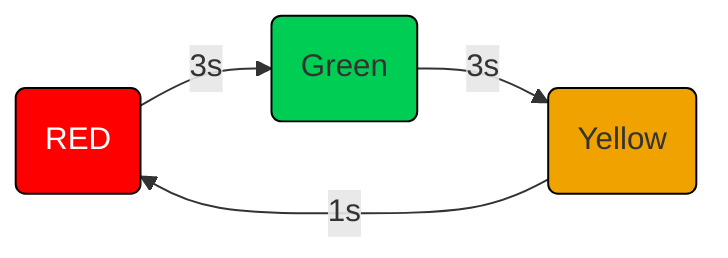
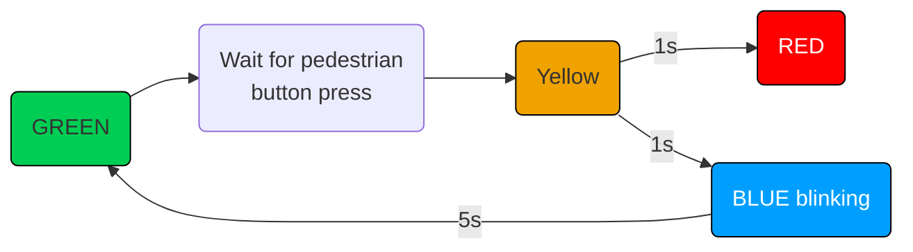

# 02 - GPIO

import { useActiveVersion } from '@docusaurus/plugin-content-docs/client';

export function ElectronicsTutorial({title, anchor}) {
  const version = useActiveVersion();
  return <a href={`/docs/${version?.name}/tutorial/electronics${anchor?"#"+anchor:""}`}>{title?title:"Electronics"}</a>;
}

The purpose of this lab is to understand how to start developing firmware in [Rust](https://www.rust-lang.org/) 
with [Embassy](https://embassy.dev) for the RP2350 MCU.

## Concepts

- How to setup an empty project that uses Embassy;
- How to use the lab board;
- How to use GPIO pins from Embassy;
- How to use the lab board's LEDs
- How to use the lab board's switches

## Resources

1. *[Embassy Book](https://embassy.dev/book/)* - an overview of the *Embassy* framework
   1. *For Beginners*
2. *[`embassy-rp`'s Documentation](https://docs.embassy.dev/embassy-rp/git/rp2040/index.html)* - the API for the RP2040 and RP2350 
3. **The Rusty Bits**, *[Intro to Embassy : embedded development with async Rust](https://www.youtube.com/watch?v=pDd5mXBF4tY)*

### Extra Resources

4. **Raspberry Pi Ltd**, *[RP2350 Datasheet](https://datasheets.raspberrypi.com/rp2350/rp2350-datasheet.pdf)*
5. **Raspberry Pi Ltd**, *[Raspberry Pi Pico 2 Datasheet](https://datasheets.raspberrypi.com/pico/pico-2-datasheet.pdf)*
6. **Raspberry Pi Ltd**, *[Raspberry Pi Pico 2W Datasheet](https://datasheets.raspberrypi.com/picow/pico-2-w-datasheet.pdf)*

## What is GPIO?

General-Purpose Input/Output, or GPIO, is an essential part of embedded systems that serves as a vital conduit between microcontrollers and microprocessors and the outside world. A microcontroller or microprocessor's group of pins that can each be set to operate as an input or an output is referred to as GPIO. The purpose of these pins is to interface external components, including actuators, displays, sensors, and other devices, so that the embedded system may communicate with its surroundings. Standardised communication protocols like SPI, I2C, PCM, PWM, and serial communication may be directly supported by some GPIO pins. There are two varieties of GPIO pins: digital and analog.

## Configuring GPIO Pins

GPIO pins can be used as outputs (LEDs, motors, buzzers) or as inputs (buttons, sensors).

The RP2040 and RP2350 have three peripherals that control the GPIO pins:
 1. *Pads* - control the actual physical pin or pad that the processor has outside. They control the electrical parameters, like maximum current or pull up and pull down resistors
 2. *IO Bank0* - connects and multiplexes the peripheral's pins to the output pads. Several peripherals use the same output pad to communicate with the exterior. For example, in the image below, `GPIO0` can be used either for:
    * `SIO` - the `GPIO` function
    * `SPI_RX` - the receive pin for the `SPI` peripheral
    * `I2C0_SDA` - the data pin for the `I2C0` peripheral
    * `UART0_TX` - the transmit pin for the `UART0` (serial port 0) peripheral
 3. *SIO* - that controls the interior MCU's pins. This is the peripheral that developers use to read and write the value of the pins.


Every pin of the MCU can perform multiple functions. Several peripherals need to use input and output pins.
It is the role of the *IO Bank0* to multiplex and connect the peripherals to the pins.

<div align="center">

</div>

## Hardware access

There are 3 different ways in which the hardware the Raspberry Pi Pico can be used:

1. Embassy framework, with the Embedded HAL implementation
2. Platform Access Crate (PAC)
3. Bare metal

## Embassy Framework

Developing bare metal firmware requires a lot of time. 

In trying to standardize firmware development, The Rust [Embedded devices Working Group](https://www.rust-lang.org/governance/wgs/embedded) has designed 
a set of standard traits (interfaces) for interacting with an MCU. This is called the **Embedded Hardware Abstraction Layer**, or shortly Embedded HAL. The main purpose is to define a common hardware interface that
frameworks, libraries and operating systems can build upon. Regardless of what MCUs the device is using, the upper level software should be as portable as possible.

There are several crates that implement the Embedded HAL traits for the RP2040 and RP2350 MCUs. These
crates are called *HAL Implementations*.
- [rp2350_hal](https://docs.rs/rp235x-hal/latest/rp235x_hal/) crate, implements just the embedded HAL traits, it is *the bare minimum* for developing RP2350 applications
- [rp2040_hal](https://docs.rs/rp2040-hal/latest/rp2040_hal/) crate, implements just the embedded HAL traits, it is *the bare minimum* for developing RP2040 applications
- [embassy-rp](https://docs.embassy.dev/embassy-rp/git/rp2040/index.html) crate implements the Embedded HAL for RP2040 and RP2350 that is used with the [embassy-rs](https://embassy.dev/) framework

Several frameworks are available on top of the *HAL Implementations* to speed things up. The most common used ones are:
- [RTIC - The hardware accelerated Rust RTOS](https://rtic.rs) - *A concurrency framework for building real-time systems*
- [Embassy](https://embassy.dev) - *The next-generation framework for embedded applications*

### The Software Stack

[Embassy](https://embassy.dev/) is a full fledged embedded framework for Rust embedded development.
Besides the implementation of the embedded HAL for different MCUs (RP2040 and RP2350 included), Embassy provides
several functions like timers, BLE and network communication.

<div align="center">

</div>

The crates used by Embassy and their mapping are shown in the table bellow.

| Crate | Position |
|-------|----------|
| [`embassy-executor`](https://docs.embassy.dev/embassy-executor/git/cortex-m/index.html) | Framework |
| [`smoltcp`](https://docs.rs/smoltcp/latest/smoltcp/), [`defmt`](https://docs.rs/defmt/latest/defmt/) | Libraries |
| [`embassy-net`](https://docs.embassy.dev/embassy-net/git/default/index.html), [`embassy-time`](https://docs.embassy.dev/embassy-time/git/default/index.html), [`embassy-usb`](https://docs.embassy.dev/embassy-usb/git/default/index.html), [`embassy-usb-logger`](https://docs.embassy.dev/embassy-usb-logger/git/default/index.html) | Framework Driver |
| [`embassy-usb-driver`](https://docs.embassy.dev/embassy-usb-driver/git/default/index.html), [`embassy-time-driver`](https://docs.embassy.dev/embassy-time-driver/git/default/index.html) | Embassy HAL (API) |
| [`cyw43`](https://docs.embassy.dev/cyw43/git/default/index.html), [`cyw43-pio`](https://docs.embassy.dev/cyw43-pio/git/default/index.html) | Driver (WiFi) |
| [`embedded-hal`](https://docs.rs/embedded-hal/latest/embedded_hal/), [`embedded-hal-async`](https://docs.rs/embedded-hal-async/latest/embedded_hal_async/)| **Rust Embedded HAL (Standard)** |
| [`embassy_rp`](https://docs.embassy.dev/embassy-rp/git/rp2040/index.html) | HAL Implementation |
| [`cortex-m`](https://docs.rs/cortex-m/latest/cortex_m/), [`cortex-m-rt`](https://docs.rs/cortex-m-rt/latest/cortex_m_rt/) | μ-architecture crates |
| [`rp_pac`](https://docs.embassy.dev/rp-pac/git/default/index.html) | Platform Access Crate |

:::info

The name *Embassy* is derived from **Emb**edded **Asy**nchronous Rust.

:::

### *Empty* Embassy Firmware

The Embassy Framework is a collection of crates. Building an *empty* firmware that uses
embassy requires:
- adding the Embassy HAL Implementation for a specific board, in this case RP2350;
- adding the core Embassy crates, that provide the executor, timers and futures;
- adding the `cortex-m-rt` and `defmt` crates that Embassy requires.

```toml
# RP2350 HAL
embassy-rp = { version = "0.3.0", git = "https://github.com/embassy-rs/embassy", rev = "2e7a2b6", features = ["defmt", "unstable-pac", "time-driver", "critical-section-impl", "rp235xa", "binary-info"] }

# Embedded HAL utilities
embassy-embedded-hal = { version = "0.3.0", git = "https://github.com/embassy-rs/embassy", rev = "2e7a2b6", features = ["defmt"] }

# Synchronization primitives and data structures with async support
embassy-sync = { version = "0.6.2", git = "https://github.com/embassy-rs/embassy", rev = "2e7a2b6", features = ["defmt"] }

# Async/await executor
embassy-executor = { version = "0.7.0", git = "https://github.com/embassy-rs/embassy", rev = "2e7a2b6", features = ["task-arena-size-98304", "arch-cortex-m", "executor-thread", "executor-interrupt", "defmt"] }

# Utilities for working with futures, compatible with no_std and not using alloc
embassy-futures = { version = "0.1.0", git = "https://github.com/embassy-rs/embassy", rev = "2e7a2b6" }

# Timekeeping, delays and timeouts
embassy-time = { version = "0.4.0", git = "https://github.com/embassy-rs/embassy", rev = "2e7a2b6", features = ["defmt", "defmt-timestamp-uptime"] }

# USB device
embassy-usb = { version = "0.4.0", git = "https://github.com/embassy-rs/embassy", rev = "2e7a2b6", features = ["defmt"] }

# Network stack
embassy-net = { version = "0.7.0", git = "https://github.com/embassy-rs/embassy", rev = "2e7a2b6", features = ["defmt", "tcp", "udp", "raw", "dhcpv4", "medium-ethernet", "dns"] }
embassy-net-wiznet = { version = "0.2.0", git = "https://github.com/embassy-rs/embassy", rev = "2e7a2b6", features = ["defmt"] }

# USB logging
embassy-usb-logger = { version = "0.4.0", git = "https://github.com/embassy-rs/embassy", rev = "2e7a2b6" }
log = "0.4"

# WiFi Chip
cyw43 = { version = "0.3.0", git = "https://github.com/embassy-rs/embassy", rev = "2e7a2b6", features = ["defmt", "firmware-logs"] }
cyw43-pio = { version = "0.3.0", git = "https://github.com/embassy-rs/embassy", rev = "2e7a2b6", features = ["defmt"] }

# Defmt support
defmt = "0.3"
defmt-rtt = "0.4"

# Low level access to Cortex-M processors
# cortex-m = { version = "0.7.6", features = ["inline-asm"] }
cortex-m-rt = "0.7.0"

# Panic handler that exits `probe-run` with an error code
panic-probe = { version = "0.3", features = ["print-defmt"] }
```

The `embassy-rp` crate provides support for the Raspberry Pi RP2350 
microcontroller within the Embassy framework. It includes features such 
as `defmt` for efficient debugging, `unstable-pac` for accessing low-level 
peripherals, and `time-driver` for handling time-related operations. 
The crate also implements `critical-section` for safe concurrency and 
supports `rp235xa` and `binary-info` for additional RP2350-specific 
functionality.  

The `embassy-embedded-hal` crate provides embedded-hal-compatible utilities 
for asynchronous embedded development. It enables easy interaction with 
hardware peripherals, such as GPIO, SPI, and I2C, while integrating with 
the Embassy async runtime. It includes `defmt` for lightweight debugging.  

The `embassy-sync` crate offers synchronization primitives and data 
structures designed for async environments. It includes mutexes, signal 
primitives, and channel-based communication for safe, cooperative 
multitasking. The crate is optimized for `no_std` systems and supports 
`defmt` for debugging.  

The `embassy-executor` crate provides an async/await executor tailored for 
embedded systems. It supports multitasking via interrupt-based and 
thread-based execution models, with optimizations for Cortex-M 
microcontrollers. Features include configurable task arena sizes and 
`defmt` for debugging.  

The `embassy-futures` crate supplies utilities for working with Rust futures 
in embedded environments. It is designed to be compatible with `no_std` 
and avoids dynamic memory allocation, making it lightweight and efficient 
for constrained devices.  

The `embassy-time` crate handles timekeeping, delays, and timeouts in async 
applications. It provides a high-precision time driver and supports uptime-based 
timestamps for logging. The crate is optimized for `no_std` 
environments and integrates with `defmt`.  

The `embassy-usb` crate provides a USB device stack for embedded systems. It 
supports USB control, bulk, and interrupt transfers, making it useful for 
implementing HID, CDC, and other USB classes. It integrates with `defmt` 
for debugging and logging.  

The `embassy-net` crate implements a network stack with support for TCP, 
UDP, and raw Ethernet frames. It includes DHCPv4 for automatic IP 
configuration and DNS resolution. The crate is designed for embedded 
networking and integrates with `defmt` for efficient debugging.  

The `embassy-net-wiznet` crate adds support for WIZnet Ethernet modules to 
the Embassy networking stack. It provides an async interface for handling 
network communication over SPI-connected WIZnet chips, with `defmt` 
integration for logging.  

The `embassy-usb-logger` crate enables USB-based logging for embedded 
applications. It provides a mechanism for transmitting log messages over 
USB, allowing for real-time debugging and monitoring of embedded systems.  

The `log` crate is a lightweight logging facade that allows messages to be 
recorded using different logging backends. It is widely used in Rust 
projects, including embedded systems, to enable flexible debugging and 
monitoring.  

The `cyw43` crate provides support for the CYW43 Wi-Fi chip, commonly found 
on Raspberry Pi Pico W. It includes firmware logging, `defmt` integration, 
and an async interface for managing Wi-Fi connections in embedded systems.  

The `cyw43-pio` crate offers PIO (Programmable I/O) support for the CYW43 
Wi-Fi chip, enabling efficient SPI communication between the microcontroller 
and the Wi-Fi module. It includes `defmt` logging for debugging low-level 
interactions.  

### Entry

Embassy is a framework built on top of `cortex-m-rt` and provides its own method of defining
the entrypoint and bootloader.

```rust
#![no_main]
#![no_std]

use embassy_executor::Spawner;

#[embassy_executor::main]
async fn main(_spawner: Spawner) {
    let peripherals = embassy_rp::init(Default::default());
}
```

The `embassy_rp::init` function takes care of the peripheral initialization so that developers can jump
right in and use them.

:::note

Embassy is designed to work in an asynchronous way and this is why the `main` function is defined as `async`. For the time being, just take it as a must and ignore it.

:::

### Configure GPIO Output

Embassy provides one single function that returns the GPIO `Output` pin and hides the configuration
details from developers.

The `pin` variable implements the embadded HAL [`OutputPin`](https://docs.rs/embedded-hal/latest/embedded_hal/digital/trait.OutputPin.html) trait.

```rust
use gpio::{Level, Output};

// initialize PIN_n (replace n with a number) and set its
// default value to LOW (0)
let mut pin = Output::new(peripherals.PIN_n, Level::Low);

// set the pin value to HIGH (1)
pin.set_high();

// set the pin value to LOW (0)
pin.set_low();
```

:::tip

While the device initialization is specific to every hardware device (the example uses the 
`embassy_rp` crate that is for RP2350 and RP2040), the pin initialization and usage is portable. It
uses the same code, regardless of the MCU used.

:::

### Configure GPIO Input

Using a pin as input is very similar to using it as output.

```rust
use gpio::{Input, Pull};

let pin = Input::new(peripherals.PIN_n, Pull::Up);

if pin.is_high() {
    // Do something if the pin value is HIGH (1)
} else {
    // Do something if the pin value if LOW (0)
}
```

:::warning 

For a correct use of the buttons, use pull-up, pull-down resistors depending on the mode of operation of the button. Check <ElectronicsTutorial title="Buttons" anchor="buttons"/> section from the <ElectronicsTutorial/>.

:::

### Waiting for GPIO Input

Embassy provides a set of functions that are able to suspend the execution of the task
until a change is detected in the input if a GPIO pin.

| Function | Description |
|-|-|
| [`wait_for_high`](https://docs.embassy.dev/embassy-rp/git/rp2040/gpio/struct.Input.html#method.wait_for_high) | Suspends the execution until the pin state becomes `Level::High`. If the pin state is already `Level::High`, it returns immediately. |
| [`wait_for_low`](https://docs.embassy.dev/embassy-rp/git/rp2040/gpio/struct.Input.html#method.wait_for_low) | Suspends the execution until the pin state becomes `Level::Low`. If the pin state is already `Level::Low`, it returns immediately. |
| [`wait_for_any_edge`](https://docs.embassy.dev/embassy-rp/git/rp2040/gpio/struct.Input.html#method.wait_for_any_edge) | Suspends the execution until the pin state switches. |
| [`wait_for_rising_edge`](https://docs.embassy.dev/embassy-rp/git/rp2040/gpio/struct.Input.html#method.wait_for_rising_edge) | Suspends the execution until the pin state switches from `Level::Low` to `Level::High` |
| [`wait_for_falling_edge`](https://docs.embassy.dev/embassy-rp/git/rp2040/gpio/struct.Input.html#method.wait_for_falling_edge) | Suspends the execution until the pin state switches `Level::High` to `Level::Low` |

### Waiting

Embassy provides support for suspending the execution of the software for an amount of time. It uses
the [`Timer`](https://docs.rs/embassy-time/0.3.0/embassy_time/struct.Timer.html) structure from the
[`embassy_time`](https://docs.rs/embassy-time/latest/embassy_time/) crate.

```rust
// suspend the execution for a period of time
use embassy_time::Timer;

Timer::after_secs(1).await;
```

:::tip

If the MCU provides timers, the Embassy framework will use them to suspend the software. This is very efficient.

:::

## The lab board

This lab makes use of the hardware available on the lab board. The board provides:
- Raspberry Pi Pico/2 Slot
- RP2040 Debugger
- 4 buttons
- 5 LEDs
- potentiometer
- buzzer
- photoresistor
- I2C EEPROM
- BMP280 Pressure & Temp. sensor
- SPI LCD Display
- SD Card Reader
- USB-C connector
- servo connectors


:::danger
Please make sure you use the **USB-C connector** to connect the board to the computer.
:::

### Wiring

All the electronic components, sensors and actuators, have the power pins hard wired
to the board. This means that all the components receive power from the board
and do not have to be powered separately.

The data pins of the components are not wired and have to be connected to the
Raspberry Pi Pico using [jumper wires](https://en.wikipedia.org/wiki/Jump_wire).

### Raspberry Pi Pico Pins

Each pin on the Raspberry PI Pico 2 is connected to **two-hole connectors** positioned 
along the sides of the socket, marked with labels like **GP0, GP1, GP2**, etc. 
These holes provide an easy way to access the **GPIO (General-Purpose Input/Output) 
pins** of the Pico 2.


You have to use jumper wires to interface with the Pico 2’s GPIO pins as follows:
1. Insert a **male jumper wire** into one of the pin holes corresponding to the desired GPIO pin.
2. Connect **the other end** of the jumper wire to an external circuit, such as a breadboard, 
    another microcontroller, or a peripheral device. In this case, it will be LEDs or Switches.
3. Use the **second hole** of the same pin as an additional connection point, 
    allowing multiple devices to share the same GPIO.

:::warning
Pins `GP0` and `GP1` should only be used for UART (Serial) communication
as they are connected to the lab board's debugger chip.
:::


### LEDs and Switches

The board provides four single colored LEDs, red, green, blue and yellow. Each one of them
uses one pin for control. Each LED connector has one single hole on the board,
marked with `RED`, `GREEN', `BLUE` and `YELLOW` respectively. These are located in the **Connectors**
section of the board.

The four switches that the lab board provides are signaled with labels
`SW4`, `SW5`, `SW6` and `SW7` in the connectors section.


:::warning
Switches on the lab board have a pull-up resistor. This means that:
1. The values it provides may be counter-intuitive:

| Position | Value |
|-|-|
| Pressed | `Level::Low` |
| Released | `Level::High` |

2. Pins that connect to switches have to be set up as `Pull::None` to disable the Raspberry Pi 2 Pico's
    internal pull resistor.
:::

### Example

To wire the green LED to pin 7 of the Raspberry Pi Pico 2, a jumper cable is required
between holes `GREEN` and `GP7`.


## Exercises

1. Write an *empty* firmware that uses the Embassy Framework and `defmt`. (**1p**)
Make sure you follow these steps:
- create a new Rust project using `cargo init`;
- add the `.cargo/config.toml` file that instructs `cargo` to [cross-compile](./01#using-a-configuration-file) for the `thumbv8m.main-none-eabihf`
  architecture, add `probe-rs run` as a [runner](./01#using-cargo-run) and set [`defmt` messages filtering](./01#filtering-messages) to `DEBUG`;
- add the [linker script](./01#linker-script) file called `memory.x`;
- add the [build script](./01#build-script) file called `build.rs`;
- add the required *Embassy* dependencies - take a look at [*Empty* Embassy Firmware](#empty-embassy-firmware) - take a look at [*Empty* Firmware](./01#empty-firmware);
- use `defmt_rtt` as a logger, make sure you import it even if you are not using it directly `use ... as _`;
- use `panic-probe` to provide a panic handler, make sure you import it even if you are not using it directly `use ... as _`;
- ask the Rust compiler not to depend on the standard library, 
    not to provide a main function and 
    add the *Embassy* [entry](#entry);
- write the code to print the `info!` message "Device started".

Please make sure you comment out (using `#` in from of the line) all the Embassy's crates 
that you do not plan to use.

:::info
For sure, you will  not use USB and WiFi. This is a trial
and error job, just comment out all the creates that you think you won't use and
add them back if the compiler asks for them.
:::

To prevent `rust-analyzer` from showing an error on the first line and to automatically
format your source when saving, create a `.vscode/settings.json` file with:

:::tip
```json
{
    "rust-analyzer.cargo.allTargets": false,
    "[rust]": {
        "editor.defaultFormatter": "rust-lang.rust-analyzer",
        "editor.formatOnSave": true,
        "editor.formatOnSaveMode": "file",
    },
}
```
:::

2. Write a program using Embassy that set on HIGH the LED connected to GPIO pin 2 (GP2). (**1p**)

:::danger 

Please make sure the lab professor verifies your circuit before it is powered up.

:::

3. Write a program using Embassy that blinks the LED connected to GPIO pin 2 (GP2) 
every 300ms. (**1p**)

:::note

For the purpose of this lab, please use `await` as is, think that for 
using the `Timer`, you have to add `.await` after the `after` function.

:::

4. Write a program using Embassy that will write the
message "The button was pressed" to the console every time button SW5 is pressed. 
Make sure you connect the switch SW5 to a Raspberry Pi Pico 2 pin. (**1p**)

5. Write a Rust program using Embassy that toggles the LED every time button SW5 is pressed.
The message might be printed many times for one press? Why? (**1p**)

:::tip
Read the value of SW5 in a `loop` and print the message if the value is `LOW`.
:::

6. Instead of constantly sampling for the button value, use the [wait pin functions](#waiting-for-gpio-input) to 
wait for the value to change. Why is the message printed only once? (**1p**)

:::tip
Do not forget to write the `.await` keyword at the end of an `async` function call.
:::

7. Build a traffic light using the `GREEN`, `YELLOW` and `RED` LEDs. (**1p**) The flow of the colors
is:



8. Extend the traffic light to include a flashing blue LED for pedestrians.
 When the pedestrian button is pressed, the traffic light switches to yellow
 and waits one second. After that, it switches on the red light and flashed
 the blue pedestrian light. After 5 seconds, the traffic light switches back
 to red and stops the blue flashing. (**2p**)



9. Display letters in Morse Code.
    1. Write a function that takes as an argument a letter and displays
    it in Morse Code using three LEDs. For a dot light up the middle LED,
    for a line light up all three. (**1p**)
    2. Write a firmware that displays a text in Morse Code. (**1p**)


:::note
Letters in mores code are case insensitive. You can use the [`char::to_ascii_uppercase`](https://doc.rust-lang.org/beta/core/primitive.char.html#method.to_ascii_uppercase)
 or [`u8::to_ascii_uppercase`](https://doc.rust-lang.org/std/primitive.u8.html#method.to_ascii_uppercase) functions to convert a `char` or `u8` to uppercase.
:::

:::tip
You can use an array of `&str`s to store the format of the morse code.

```rust
const CODES: [&str; 26] = [
    ".-", // A
    // ...
];
```
:::
