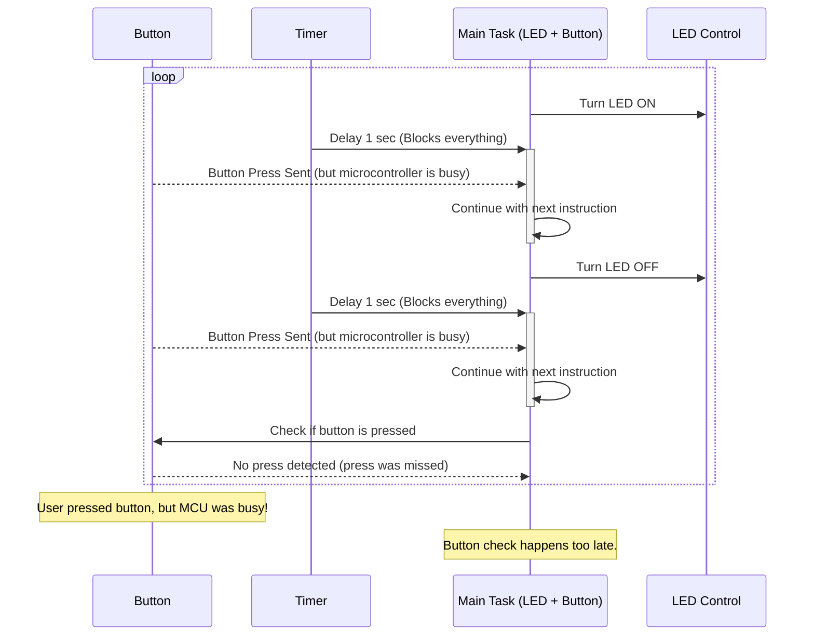
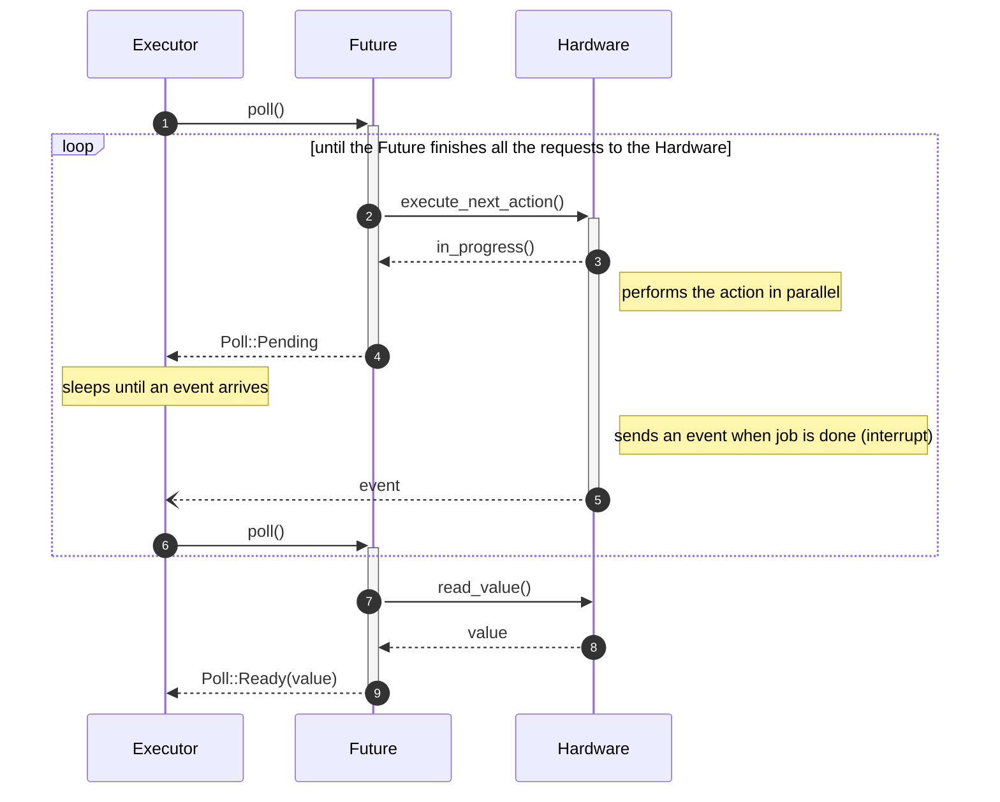
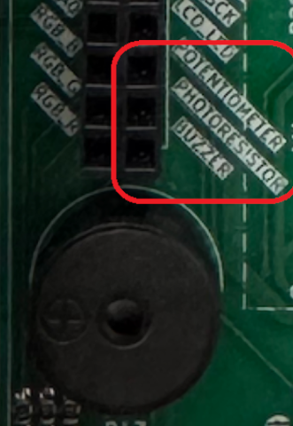

# 04 - Asynchronous Development

This lab will teach you the principles of asynchronous programming, and its application in Embassy.


## Resources

1. **Bert Peters**, *[How does async Rust work](https://bertptrs.nl/2023/04/27/how-does-async-rust-work.html)* 
2. **Omar Hiari**, *[Sharing Data Among Tasks in Rust Embassy: Synchronization Primitives](https://dev.to/apollolabsbin/sharing-data-among-tasks-in-rust-embassy-synchronization-primitives-59hk)* 

## Asynchronous functions and Tasks

Until now you've only worked with simple (almost) serial programs. However, not all programs can be designed to run serially/sequentially. Handling multiple I/O events concurrently usually requires separate parallel tasks. 
Example: Reading a button press while blinking an LED. A single loop would block the button reading event while waiting for the timer to finish.



 To address this issue, we would need to spawn a new task in which we would wait for the button press, while blinking the LED in the `main` function. 

When thinking of how exactly this works, you would probably think that the task is running on a separate *thread* than the `main` function. Usually this would be the case when developing a normal computer application. Multithreading is possible, but requires a preemptive operating system. Without one, only one thread can independently run per processor core and that means that, since we are using only one core of the RP2350 (which actually has only 2), we would only be able to run **one thread at a time**. So how exactly does the task wait for the button press in parallel with the LED blinking? 
Short answer is: it doesn't. In reality, both functions run asynchronously. 

A task in Embassy is represented by an *asynchronous function*. Asynchronous functions are different from normal functions, in the sense that they allow asynchronous code execution. Let's take an example from the previous lab:
```rust
#[embassy_executor::task]
async fn button_pressed(mut led: Output<'static>, mut button: Input<'static>) {
    loop {
	info!("waiting for button press");
        button.wait_for_falling_edge().await;
        led.toggle();
    }
}

#[embassy_executor::main]
async fn main(spawner: Spawner) {
    let peripherals = embassy_rp::init(Default::default());

    let button = Input::new(peripherals.PIN_X, Pull::None);
    let led2 = Output::new(peripherals.PIN_X, Level::Low);

    spawner.spawn(button_pressed(led2, button)).unwrap();

    let mut led = Output::new(peripherals.PIN_X, Level::Low);

    loop {
        led.toggle();
        Timer::after_millis(200).await;
    }
}
```
In this example, we notice that both the `button_pressed` and `main` functions are declared as `async`, telling the compiler to treat them as asynchronous functions. Inside the `main` function (which is also a task, actually), we blink the LED:

```rust
loop {
    led.toggle();

    Timer::after_millis(200).await;
}
```

## `await` keyword

After setting the timer, our `main` function would need to wait until the alarm fires after 200 ms. Instead of just waiting and blocking the current and *only* thread of execution, it could allow the thread to do another action in the meantime. This is where the `.await` keyword comes into play.
When using `.await` inside of an asynchronous function, we are telling a third party (called the **executor**, detailed later) that this action might take more time to finish, so *do something else* until it's ready. Basically, the execution flow of the asynchronous function function is halted exactly where `.await` is used, and the executor starts running another task. In our case, it would halt the main function while waiting for the alarm to go off and it could start running the code inside the `button_pressed` task.
```rust
loop {
    info!("waiting for button press");
    button.wait_for_falling_edge().await;
}
```
We can see that here, we also use the `wait_for_falling_edge` function asynchronously, meaning that until we get a signal that a button has been pressed, the executor can decide to do other stuff. If it has nothing else to do, it goes to sleep, until it receives a signal that either the button has been pressed, or the timer has run out. Then, it will resume execution of the function where the action has completed. 
When the button is pressed the execution flow will resume inside of the `button_pressed` task, until it is interrupted by the next `.await` in that function. If the timer runs out before the `button_pressed` task execution reaches the next `.await`, the resuming of the `main` function will delayed until the `button_pressed` task `.await`s.
This method of development allows our programs to run seemingly "in parallel", without the need of multiple threads. Each task *voluntarily* pauses its execution and passes control over to whatever other task needs it. This means that it's the task's business to allow other tasks to run while it's idly waiting for something to happen on its end.
:::note
On a preemptive operating system, it would be the scheduler's job to decide when and for how long processes get to run.
:::

## `Future`s

Rust has a special datatype that represents an action that will complete sometime in the future. By using `.await` on a `Future`, we are passing control to another task until the `Future` completes.
:::info
In the `button_pressed` task, the `wait_for_falling_edge` returns a `Future`, which is then `.await`ed.
:::
This is a simplified version of what a `Future` in Rust really looks like:
```rust
enum Poll<T> {
    Pending,
    Ready(T),
}

trait Future {
   type Output;
   fn poll(&mut self) -> Poll<Self::Output>;
}
```
The `Future` has an `Output` associated type, that represents the type of the result that it will return once it completes. For `wait_for_falling_edge()`, the Output type is `()` (nothing).
The function `poll` returns a `Poll` type, which can either be `Pending`, or `Ready<T>` (T will be output in this case).
Let's break down what all of this means. A `Future` needs to be checked on, every now and then, to see what its status is. This is the job of the **Executor**. The executor must regularly ask the `Future` if it's completed, or if it needs more time before it can give a result. We can say that the `Future` is `poll`ed, and depending on whether it's ready to give a result or not, it gives its status as `Pending` or `Ready`. If it's still pending, it needs more time before it can return a result, so the executor moves on to poll another `Future`. Whenever the `Future` is completed, it returns `Ready` once polled, and the executor returns execution back to the function where the `Future` `.await`ed.



:::note
An efficient executor will not poll all tasks. Instead, tasks signal the executor that they are ready to make progress by using a `Waker`.
:::

:::info
A real future in Rust looks like this:
```rust
pub trait Future {
    type Output;

    // Required method
    fn poll(self: Pin<&mut Self>, cx: &mut Context<'_>) -> Poll<Self::Output>;
}
```
:::

Under the hood, the Rust compiler is actually transforming our asynchronous function into a state-machine. That is why we can only use `.await` inside of an `async` function, because it needs to be treated differently than an ordinary function in order to work asynchronously.

:::info
Asynchronous programming is widely used in web development. In JavaScript, the equivalent of a `Future` would be a `Promise`.
:::

Read more about how async/await works in Rust [here](https://rust-lang.github.io/async-book/01_getting_started/01_chapter.html).

### `await`ing multiple `Future`s

Sometimes we need to `.await` several futures at the same time. Embassy provides two ways of doing this:
- `select` - wait for several `Future`s, stop as soon as **one** of them **returns**;
- `join` - wait for several `Future`s until they **all return**

#### `select`

In some cases, we might find ourselves in the situation where we need to await multiple futures at a time. For example, we want to wait for a button press *and* wait for a timer to expire, and we deal with each future completion in different ways.

There is a function in Embassy that allows us to do this: `select`. It takes two `Future`s as arguments, and polls both of them to see which one completes first.
```rust
let select = select(button.wait_for_falling_edge(), Timer::after_secs(5)).await;
```

It returns an `Either` type, that looks like this:
```rust
pub enum Either<A, B> {
    First(A),
    Second(B),
}
```
A and B are the results of each `Future`, so we can just use a `match` on the `select` variable to see which `Future` finished first.
```rust
match select {
    First(res1) => {
        // handle case for button press
    },
    Second(res2) => {
        // handle case for alarm firing
    }
}
```

:::warning
After selecting the first `Future` that completes, the other one is *dropped*. For instance, if the button press happens first, the timer will be stopped.
:::

:::info
You can also use [`select3`](https://docs.rs/embassy-futures/latest/embassy_futures/select/fn.select3.html), [`select4`](https://docs.rs/embassy-futures/latest/embassy_futures/select/fn.select4.html) or [`select_array`](https://docs.rs/embassy-futures/latest/embassy_futures/select/fn.select_array.html) when dealing with more than two `Future`s.
:::

#### `join`

Similarly, we can also [`join`](https://docs.rs/embassy-futures/latest/embassy_futures/join/fn.join.html) multiple `Future`s, meaning that we wait for all of them to complete before moving on. 

```rust
let (res1, res2) = join(button.wait_for_falling_edge(), Timer::after_secs(5)).await;
```

`join` returns a tuple containing the results of both `Future`s.


## Channel

Up to this point, to be able to share peripherals or data across multiple tasks, we have been using global `Mutex`s or passing them directly as parameters to the tasks. But there are other, more convenient ways to send data to and from tasks. Instead of having to make global, static variables that are shared by tasks, we could choose to only send the information that we need from one task to another. To achieve this, we can use *channels*.

**Channels** allow a unidirectional flow of information between two endpoints: the *Sender* and the *Receiver*. The sender sends a value through the channel, and the receiver receives this value once it is ready to do so. Until it is ready, the data will be stored inside a queue. Channels in Embassy are *Multiple Producer, Multiple Consumer*, which means that we can have a channel associated with multiple senders and multiple receivers. 

To use a channel in Embassy, we first need to declare a static instance of the channel. 

```rust
static CHANNEL: Channel<ThreadModeRawMutex, bool, 64> = Channel::new();
```
- `ThreadModeRawMutex` - the type of Mutex that the Channel internally uses. It is a mutex that can safely be shared between threads
- `bool` - the type of data that is sent through the channel
- `64` - the maximum number of values that can be stored in the channel's queue

Let's say we spawn a task `task1` that runs a timer. Every second, we want to toggle an LED in the `main` function, based on the timer running in `task1`. For this, `task1` would need to send a signal to the `main` program every time the 1 second alarm has fired, meaning the task and the main program would share the channel. `task1` would *send* over the channel, and `main` would *receive*.

Inside `task1`, we would just set a timer and wait until it fires. After it fires, we send a signal through the channel, to indicate that 1 second has elapsed.

```rust
#[embassy_executor::task]
async fn task1() {
    loop {
        Timer::after_secs(1).await;
        CHANNEL.send(true).await;
    }
}
```

In the `main` function, we need to then wait for the signal, and once it's received, toggle the LED.

```rust
// ---- fn main() ----
loop {
    let value = CHANNEL.receive().await;
    match value {
        true => led.toggle().unwrap(),
        false => info!("We got something else")
    }
}
```

:::info
The reason we need all of this is because Rust doesn't allow us to mutably borrow more than once. To use a peripheral (say PWM) inside multiple tasks, 
we would need to either move it inside the task entirely, or use a mutable reference to it. If we have multiple tasks, though, once we move our peripheral variable *inside* the first task,
we can't pass it to another task, because the value was *moved* inside that task completely. And if we wanted to pass it as a mutable reference instead, we would quickly realize that Rust 
doesn't allow multiple mutable references at once, to avoid concurrent modifications. So this is why we need to either declare a global, static `Mutex` that any task can access, to ensure 
that the value cannot be modified concurrently by two different tasks, or use channels and keep the peripheral inside the `main` function.

To better understand the concepts of ownership and borrowing in Rust, take a look at [chapter 4](https://doc.rust-lang.org/book/ch04-00-understanding-ownership.html) of the Rust Book.
:::

### `Signal`

This is similar to a `Channel` with a buffer size of 1, except “sending” to it (calling `Signal::signal`) when full will overwrite the previous value instead of waiting for the receiver to pop the previous value.

It is useful for sending data between tasks when the receiver only cares about the latest data, and therefore it's fine to “lose” messages. This is often the case for “state” updates.


```rust

use embassy_sync::signal::Signal;

static SIG: Signal<CriticalSectionRawMutex, ()> = Signal::new();

#[embassy_executor::task]
async fn waiter() {
    SIG.wait().await; // Wait until signaled
    defmt::info!("Signal received!");
}

#[embassy_executor::task]
async fn trigger() {
    SIG.signal(()); // Notify the waiting task
}


```

### `PubSubChannel`

This is a type of channel where any published message can be read by all subscribers. A publisher can choose how it sends its message.

- With Pub::publish() the publisher has to wait until there is space in the internal message queue.
- With Pub::publish_immediate() the publisher doesn't await and instead lets the oldest message in the queue drop if necessary. This will cause any Subscriber that missed the message to receive an error to indicate that it has lagged.

Example:

```rust

use embassy_sync::pubsub::PubSubChannel;

static PUB: PubSubChannel<CriticalSectionRawMutex, &'static str, 4, 2> = PubSubChannel::new();

#[embassy_executor::task]
async fn publisher() {
    PUB.publisher().publish("Hello").await;
}

#[embassy_executor::task]
async fn subscriber1() {
    let mut sub = PUB.subscriber().unwrap();
    let msg = sub.next_message().await;
    defmt::info!("Sub 1 got: {}", msg);
}

#[embassy_executor::task]
async fn subscriber2() {
    let mut sub = PUB.subscriber().unwrap();
    let msg = sub.next_message().await;
    defmt::info!("Sub 2 got: {}", msg);
}

```


## Buzzer

A buzzer is a hardware device that emits sound. There are two types of buzzers:
- *active buzzer* - connected to VCC and GND, with a resistance - emits a constant frequency
- *passive buzzer* - connected to a GPIO pin and GND, with a resistance - frequency can be controlled through the pin with PWM


:::tip
To control the buzzer, all you need to do is to set the `top` value of the PWM config to match the frequency you want!
:::

#### How to wire an RGB LED

The buzzer on the development board is connected to a pin in the J9 block.



## Exercises

1. Use two separate tasks to make the RED LED and BLUE LED blink 1 time per second. Instead of using `Timer::after_millis(time_interval).await` use *busy waiting* by starting a timer using `Instant::now();` and checking the elapsed time in a `while` loop using 

```rust
while start_time.elapsed().as_millis() < time_interval {}
```

You should notice that one of the tasks is not running. Why? (**1p**)
    :::tip
    Use a different task instance for each LED. You can spawn multiple instances of the same task, however you need to specify the pool size with `#[embassy_executor::task(pool_size = 2)]`. Take a look at [task-arena](https://docs.embassy.dev/embassy-executor/git/std/index.html#task-arena) for more info.
    Use [`AnyPin`](https://docs.embassy.dev/embassy-rp/git/rp2040/gpio/struct.AnyPin.html) and blinking frequency parameters for the task. 
    :::
    
2. Fix the usage of busy waiting from exercise 1 and make the 4 LEDs (YELLOW, RED, GREEN, BLUE) blink at different frequencies. (**1p**)

Blink:

| LED | frequency |
|-|-|
| YELLOW | 3 Hz |
| RED | 4 Hz |
| GREEN | 5 Hz |
| BLUE | 1 Hz |

:::tip
1 Hz means once per second.
:::

3. Write a firmware that changes the RED LED's intensity, using switch **SW_4** and switch **SW_5**. Switch **SW_4** will increase the intensity, and switch **SW_5** will decrease it. You will implement this in three ways: (**3p**)
   
   1. Use three tasks : `main` to control the LED and another two for each button (one for switch **SW_4**, one for switch **SW_5**). Use a [`Channel`](#channel) to send commands from each button task to the main task.
    :::tip
    Use an `enum` to define the LED Intensity change command for point i.
    :::
   2. Use a single task (`main`). Use [`select`](#select) to check which of the buttons were pressed and change the LED intensity accordingly. 
   3. Use two tasks: `main` to control the LED and another one for both buttons. Use a [`Signal`](#signal) channel to transmit from the buttons task, the new value of the intensity which the LED will be set to. The `main` will wait for a new value on the `Signal` channel and change the intensity accordingly.
    :::tip
    Instead of sending commands over the channel like you did at point i, send the intensity value as a number.
    :::


4. Simulates a traffic light using the GREEN, YELLOW and RED LEDs on the board. Normally the traffic light goes from one state based on the time elapsed (Green -> 5s , Yellow Blink (4 times) -> 1s , Red -> 2s ).
However if the switch **SW4** is pressed the state of traffic light changes immediately as shown in the diagram bellow.(**2p**)

    ```mermaid
    flowchart LR
        green(GREEN) -- Button pressed --> yellow(Yellow)
        green(GREEN) -- 5s --> yellow(Yellow)

        
        yellow(YELLOW - Blink 4 times/second) -- Button pressed --> red(RED)

        yellow(YELLOW - Blink 4 times/second) -- 1s --> red(RED)

        red(RED) -- Button pressed --> red(RED)
        red(RED) -- 2s --> green(GREEN)

        classDef red fill:#ff0000,stroke:#000000,color: #ffffff
        classDef yellow fill:#efa200,stroke:#000000
        classDef green fill:#00ce54,stroke:#000000

        class red red
        class yellow yellow
        class green green
    ```

    :::tip
    For this exercise you only need one task. Define an `enum` to save the traffic light state (`Green`, `Yellow`,`Red`). Use `match` to check the current state of the traffic light. Then you need to wait for two futures, since the traffic light changes its color either because some time has elapsed or because the button was pressed. Use `select` to check which future completes first (`Timer` or button press).
    :::

5.  Continue exercise 4: this time, if switch **SW4** and switch **SW7** are pressed consecutively, change the state of the traffic light. Use `join` to check that both switches were pressed. (**1p**)
   :::note
    The switches don't need to be pressed at the same time, but one after the other. The order does not matter.
   :::

6. Continue exercise 5:
   - add a new task to control the buzzer. The buzzer should make a continuous low frequency (200Hz) sound while the traffic light is green or yellow and should start beeping (at 400Hz) on and off while the traffic light is red (Use the [formula from Lab03](./03#calculating-the-top-value) to calculate the frequency) . (**1p**)
   - add a new task for a servo motor. Set the motor position at 180° when the light is green, 90° the light is yellow, and 0° if its red. (**1p**)
   :::tip
    Use a `PubSubChannel` to transmit the state of the traffic light from the LEDs task to both the buzzer and the servo motor tasks.
   :::

