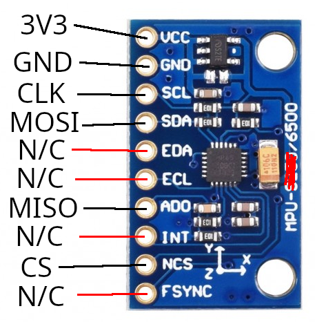
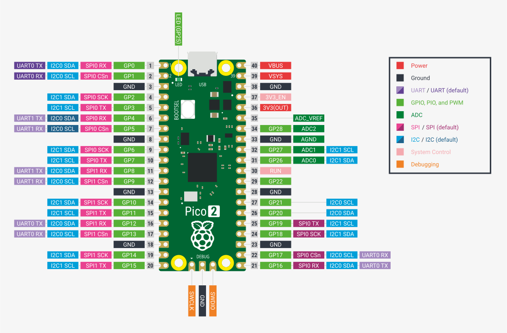
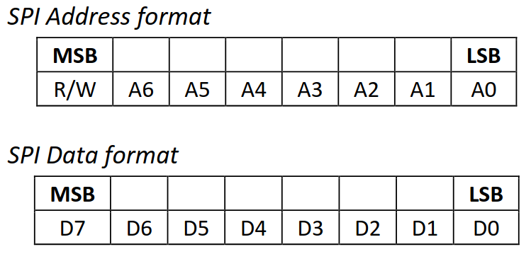
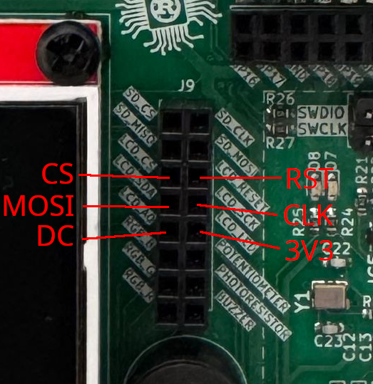

# 05 - Serial Peripheral Interface

This lab will teach you how to communicate with hardware devices using the Serial Peripheral Interface (SPI) protocol, in Embassy. 

## Resources

1. **Raspberry Pi Ltd**, *[RP2350 Datasheet](https://datasheets.raspberrypi.com/rp2350/rp2350-datasheet.pdf)*
   - Chapter 12 - *Peripherals*
     - Chapter 12.3 - *SPI*

2. **Invensense**, *[MPU-6500 Six-Axis (Gyro + Accelerometer) MEMS MotionTracking™ Device](https://invensense.tdk.com/products/motion-tracking/6-axis/mpu-6500/#documentation)*

3. **Paul Denisowski**, *[Understanding SPI](https://www.youtube.com/watch?v=0nVNwozXsIc)*

## Serial Peripheral Interface (SPI)

The Serial Peripheral Interface (or SPI) is a communication protocol used between microcontrollers and peripheral ICs (integrated circuits). It allows synchronous transfer of data between one *main* device and one or more *sub* devices (e.g. sensors). The main device is the one that dictates the communication.

### Data transmission


SPI transmission usually uses 4 lines:

- **CLK** - clock - generated by the main device - subs use it to synchronously read and write to the bus
- **MOSI** - **M**ain **O**ut **S**ub **I**n - used to carry data from the main device to *all* the subs
- **MISO** - **M**ain **I**n **S**ub **O**ut - used to carry data from the *active* sub to the main device
- **CS** - chip select - selects the sub to be activated, or the sub that the main wants to communicate with
                       - one wire per sub
                       - inactive subs will disconnect from the *MOSI* and *MISO* lines

:::info
The communication is *full-duplex*. This means that data is transmitted in both directions simultaneously. With that being said, during data transmission, both the main and the sub **must write** to the MOSI/MISO wires, no matter if that data is relevant or not.
:::

:::note
SPI is most commonly implemented in a 4-wire configuration. However, there is also a 3-wire configuration, where the `MOSI` and `MISO` lines are common. This makes the communication *half-duplex*, since data can be sent only in one direction at a time.
:::

#### Transmission example

1. main sets `CS` to `LOW` - the sub that the main wants to communicate with is activated - all other subs are already disconnected from `MOSI` and `MISO` lines as their CS line is not active
2. main writes the first bit on the `MOSI` line, and, *simultaneously*, sub writes the first bit on the `MISO` line
3. main starts the clock
4. on *rising edge* 
    - main reads data from the `MISO` line 
    - sub reads data from the `MOSI` line
5. on *falling edge*
    - main writes data to the `MOSI` line
    - sub writes data to the `MISO` line
6. repeat steps 4 and 5 until main stops the clock

:::note
Whether steps 4 and 5 happen on rising/falling edge depends on the `CPOL` configuration of the SPI.
:::


In the image above, the main first exchanges data with the first sub by setting its corresponding `CS` line to low. After it finishes transmission with sub 1, it deactivates it and, afterwards, initiates communication with the second sub by setting its `CS` line to low. Notice that both main and sub read and write to the MOSI/MISO line simultaneously.

### SPI modes

SPI has 4 different modes which define when data is read or written. These modes can be configured through `CPOL` and `CPHA` by changing the `SPO` and `SPH` bits of the [`SSPCR0`](https://datasheets.raspberrypi.com/rp2350/rp2350-datasheet.pdf#reg-spi-SSPCR0) register.

| Mode | `CPOL` | `CPHA` | Clock polarity in idle state | Clock phase used to read and/or write data |
|-|-|-|-|-|
| 0 | 0 | 0 | Logic Low | Data read on rising edge and written on falling edge | 
| 1 | 0 | 1 | Logic low | Data read on the falling edge and written on the rising edge |
| 2 | 1 | 0 | Logic high | Data read on the falling edge and written on the rising edge |
| 3 | 1 | 1 | Logic high | Data read on the rising edge and written on the falling edge |

| | | |
|-|-|-| 
| `CPOL` | Clock polarity | defines when the clock is considered *idle*, or when no transfer is occurring |
| `CPHA` | Clock phase | defines when the data bit is read and when it is written: depends on `CPOL` |


### Daisy Chaining

**Daisy chaining** is an SPI configuration through which the sub devices are linked together as such: 


The `MOSI` line connects the main device only to the first sub. Then, the `MISO` output of the first sub ties to the `MOSI` input of the second sub, and so forth. The final sub in the chain ties to the `MISO` line of the main device. All `CS` lines are common, therefore all subs are active concurrently.

For example, if main wants to communicate with the second sub, it will:
- send its data through the `MOSI` line to the first sub
- the first sub will send the data to the second sub, through the common wire
- once the second sub receives the data, it will send its response to the third sub
- at the end of the chain, the last sub will send the data back to the main device through the `MISO` line

## DMA
When it comes to standard communication protocols that rely on [MMIO](../lecture/02), it would be inefficient to rely on the MCU itself to handle all of these data transfers. This is why the **Direct Memory Access** (DMA) is used. Its purpose is to offload the MCU by dealing with simple transmission to and from peripherals, and whenever it finishes a transfer, it raises an interrupt.

## SPI in Embassy

In Embassy, we can use the SPI both blocking and asynchronously. The following example will be using the asynchronous version.

:::warning
The SPI can also be used synchronously, but this means that for every transfer, the thread will be blocked, as we found out in the [previous lab](./04).
:::

First, we initialize the peripherals.

```rust
let p = embassy_rp::init(Default::default());
```

Next, we create the configuration for the SPI. We can set the clock frequency, polarity and phase (the SPI mode).

```rust
let mut config = spi::Config::default();
config.frequency = 1_000_000;
config.phase = spi::Phase::CaptureOnFirstTransition;
config.polarity = spi::Polarity::IdleLow;
```

Once we have the configuration, we can initialize the `MISO`, `MOSI` and `CLK` pins.

```rust
let miso = p.PIN_X;
let mosi = p.PIN_Y;
let clk = p.PIN_Z;
```

Now we can create our SPI instance. The example uses the SPI0 channel, but others can be used. Being an asynchronous SPI, it also needs a pair of `DMA` channels, one that handles the *transmission* of data, and one that handles the *receiving* of data.

```rust
let mut spi = Spi::new(p.SPI0, clk, mosi, miso, p.DMA_CH0, p.DMA_CH1, config);
```

:::info
To figure out which pins work with SPI and what channels they are associated with, you need to take a look at the [pinout](./05#mpu-6500-wiring) of the Raspberry Pi Pico and the [lab board schematic](https://gitlab.cs.pub.ro/pmrust/pm-ma-pcb/-/blob/main/Schematic/MA.pdf).
:::

We also need a `CS` pin, that is simply a GPIO output pin. We will initialize it as such. Any pin can be used. For multiple subs, multiple pins will be initialized. 

```rust
let mut cs = Output::new(p.PIN_N, Level::High);
```

Now we have set up the SPI, and can use it to communicate with the connected sub. To activate the sub, we need to set the `cs` pin to `low`.

```rust
cs.set_low();
```

Once we do this, we can use two buffers:
- `tx_buf` - used to store data to transmit to the sub via the `MOSI` line
- `rx_buf` - one to store data to receive from the sub via the `MISO` line

```rust
let tx_buf = [1_u8, 2, 3, 4, 5, 6];
let mut rx_buf = [0_u8; 6]; // dummy values, will be replaced by received data
```

:::note
`rx_buf` is mutable because the values inside the buffer will be replaced by the data received from the sub.
:::

We then use the two buffers to make the transfer. The values in `tx_buffer` will be sent over the `MOSI` and the values received over the `MISO` will be stored in `rx_buf`.

```rust
spi.transfer(&mut rx_buf, &tx_buf).await;
```

Once we are done with the transfer, we set the `cs` line back to `high` to deactivate the sub.

```rust
cs.set_high();
```

## Digital vs Analog sensors

### Analog sensors
Up to now, during the labs, we have been using *analog sensors* (photoresistor and potentiometer). Analog sensors are just a transducer, which outputs a voltage depending on its measurement (light, temperature, etc.). This output needs to be read using an ADC and processed so that it can resemble something useful to us.
:::info
For example, for an analog temperature sensor, we would be getting a voltage reading that we need to convert to an actual temperature in Celsius by using a specific formula. This formula can usually be found in the datasheet of the analog sensor.
:::


### Digital sensors
For this lab, we will be using a *digital sensor*, which is an *upgraded* version of an analog sensor. It contains a transducer, but also an internal MCU with an ADC. This means that the sensor itself deals with the analog-to-digital conversion and the processing of the voltage reading, and exposes it through a digital interface of registers that can be accessed using a specific communication protocol (e.g. SPI, I2C etc.).


## MPU-6500 Inertial Measurement Unit

The **MPU-6500** is a *digital* gyroscope and accelerometer designed by InvenSense. It can be interfaced both with SPI and with I2C. This means that we can read the acceleration and angular velocity values directly from the registers of the MPU-6500 using SPI.

:::info
**[DATASHEET](https://invensense.tdk.com/wp-content/uploads/2020/06/PS-MPU-6500A-01-v1.3.pdf)**: Describes the chip and its capabilities. \
**[REGISTER MAP](https://invensense.tdk.com/wp-content/uploads/2015/02/MPU-6500-Register-Map2.pdf)**: Describes how to configure and get values from the sensor.
:::

### MPU-6500 Memory Map

| address (HEX) | Name | Access
|-|-|-|
| 1B | GYRO_CONFIG | R/W |
| 1C | ACCEL_CONFIG | R/W |
|...|||
| 3B | ACCEL_XOUT_H | R |
| 3C | ACCEL_XOUT_L | R |
| 3D | ACCEL_YOUT_H | R |
| 3E | ACCEL_YOUT_L | R |
| 3F | ACCEL_ZOUT_H | R |
| 40 | ACCEL_ZOUT_L | R |
|...|||
| 43 | GYRO_XOUT_H | R |
| 44 | GYRO_XOUT_L | R |
| 45 | GYRO_YOUT_H | R |
| 46 | GYRO_YOUT_L | R |
| 47 | GYRO_ZOUT_H | R |
| 48 | GYRO_ZOUT_L | R |
|...|||
| 75 | WHO_AM_I | R |

#### Registers

`WHO_AM_I` register - contains the ID of the MPU-6500

`GYRO_CONFIG` register - used for configuring the gyroscope

| `GYRO_CONFIG` bits | Name | Description |
|-|-|-| 
| [7] | XG_ST X | Gyro self-test |
| [6] | YG_ST Y | Gyro self-test |
| [5] | ZG_ST Z | Gyro self-test |
| [4:3] | GYRO_FS_SEL[1:0] | Gyro Full Scale Select |
| [2] | - | Reserved |
| [1:0] | FCHOICE_B[1:0] | Low Pass Filter Bypass |

| GYRO_FS_SEL[1:0] | Gyro Full Scale |
|-|-|
| 00 | $±250 °/s$ |
| 01 | $±500 °/s$ |
| 10 | $±1000 °/s$ |
| 11 | $±2000 °/s$ |

`ACCEL_CONFIG` register - used for configuring the accelerometer

| `ACCEL_CONFIG` bits | Name | Description |
|-|-|-| 
| [7] | XA_ST X | Accel self-test |
| [6] | YA_ST Y | Accel self-test |
| [5] | ZA_ST Z | Accel self-test |
| [4:3] | ACCEL_FS_SEL[1:0] | Accel Full Scale Select |
| [2:0] | - | Reserved |

| ACCEL_FS_SEL[1:0] | Accel Full Scale |
|-|-|
| 00 | $±2 g$ |
| 01 | $±4 g$ |
| 10 | $±8 g$ |
| 11 | $±16 g$ |

`ACCEL` registers - `ACCEL_XOUT_H`, `ACCEL_XOUT_L`, `ACCEL_YOUT_H`, `ACCEL_YOUT_L`, `ACCEL_ZOUT_H`, `ACCEL_ZOUT_L` - contain the acceleration

`GYRO` registers - `GYRO_XOUT_H`, `GYRO_XOUT_L`, `GYRO_YOUT_H`, `GYRO_YOUT_L`, `GYRO_ZOUT_H`, `GYRO_ZOUT_L` - contain the angular velocity

:::note
The values read from the sensor are 16-bit signed integers and must be interpreted according to the Full Scale selected. By default, they are both set to 0 ($±250 °/s$, $±2 g$).

**g** represents the gravity of Earth and is equal to approximately $9.80665 m/s^2$.
:::


### MPU-6500 wiring

The MPU-6500 has 5 pins:

| Pin | Function |
|-|-|
| `VCC` | power source (3V3) |
| `GND` | ground |
| `SCL` | `CLK` line |
| `SDA` | `MOSI` line |
| `EDA` | external sensors data line|
| `ECL` | external sensors clock |
| `ADO` | `MISO` line |
| `INT` | interrupt line |
| `NCS` | `CS` line, active Low |
| `FSYNC` | synchronizing with external sensors |



:::note
The MPU-6500 can also be interfaced through I2C, using the same pins but with different functions.
:::

:::note
The MPU-6500 can also act as an I2C master and communicate with external sensors. This functionality will be ignored.
:::

The Raspberry Pi Pico has two usable SPI channels: SPI0 and SPI1. Each channel has multiple sets of pins that can be used for `CLK`, `MOSI` and `MISO`. They are marked with pink in the pinout diagram.



:::info
`TX` = transmitter = `MOSI`

`RX` = receiver = `MISO`
:::

:::tip
It is recommended to use the pins connected to the dedicated J12 & J13 headers on the [lab board](https://gitlab.cs.pub.ro/pmrust/pm-ma-pcb/-/blob/main/Schematic/MA.pdf)
:::

### Reading data from the MPU-6500 sensor using Embassy

To get the data we want from the digital sensor, we need to access its internal registers. The MPU-6500 has some rules when it comes to reading and writing to these registers, that must be extracted from the [datasheets](https://invensense.tdk.com/products/motion-tracking/6-axis/mpu-6500/#documentation). Every sensor has different registers, and different ways of interfacing them, so reading the datasheet is usually required, especially when we don't have the leverage of using already existing libraries for these sensors.

First, we make sure our SPI is initialized correctly.

```rust
let p = embassy_rp::init(Default::default());

// default values are fine
let mut config = spi::Config::default();

let miso = p.PIN_X;
let mosi = p.PIN_Y;
let clk = p.PIN_Z;

let mut spi = Spi::new(p.SPI0, clk, mosi, miso, p.DMA_CH0, p.DMA_CH1, config);

// make sure to actually choose a pin
let mut cs = Output::new(p.PIN_N, Level::High);
```

In section 6.5 of the [datasheet](https://invensense.tdk.com/wp-content/uploads/2020/06/PS-MPU-6500A-01-v1.3.pdf), we get the information we need in order to read/write to a register of the MPU-6500. 



To know what is expected from it, the sensor needs to receive a *control byte*. This control byte contains the address of the register that we want to access, except the 7th bit of this address is changed:
- it will be `1` if we want to *read* the register
- it will be `0` if we want to *write* to the register

So, for example, if we wanted to read the register at address 0x1, we would need to send a control byte of `10000001`, and if we wanted to write to it, we would send `00000001`.

This way, we're sending a command to the sensor for it to know what to do: either send back the value of the register we requested or write to this register.

#### Reading a register

To read the value of a register, the main device (the RP2350) needs to first send a control byte containing the address of that register, with the 7th bit a `1`.
The sub device (the sensor) will then send a byte back, containing the value of the requested register.

```rust
cs.set_low();
let tx_buf = [(1 << 7) | REG_ADDR, 0x00]; // first value of buffer is the control byte, second is a *don't care* value
let mut rx_buf = [0u8; 2]; // initial values that will be replaced by the received bytes
spi.transfer(&mut rx_buf, &tx_buf).await.unwrap();
cs.set_high();
let register_value = rx_buf[1]; // the second byte in the buffer will be the received register value
```

:::info
Remember, SPI is full-duplex. When the main writes, the sub also writes, no matter if it has any relevant data to send or not. This is why the `tx_buf` and `rx_buf` both have 2 elements. First, the main will send the register address (`tx_buf[0]`) and the sub will send a dummy value back (stored in `rx_buf[0]`), *at the same time*. Then, the main will send a dummy value (`tx_buf[1]`) and the sub will send the value of the register (stored in `rx_buf[1]`).
:::

:::tip
Once we send the address of a register we want to read, the sensor will continuously send back bytes containing the values of the consecutive registers. For example, if we ask to read `REG_ADDR`, the sensor will first send the register value at address `REG_ADDR`, then the value at address `REG_ADDR+1`, and so on, until we deactivate it.

```rust
cs.set_low();
let tx_buf = [(1 << 7) | REG_ADDR, 0x00, 0x00];
let mut rx_buf = [0u8; 3]; // three receive values instead of two
spi.transfer(&mut rx_buf, &tx_buf).await.unwrap();
cs.set_high();
let register_value = rx_buf[1]; // the second byte in the buffer will be the received register value (REG_ADDR)
let register_value_next = rx_buf[2]; // the third byte in the buffer will be the next received register value (REG_ADDR+1)
```
This is explained in section 6.5 of the datasheet.
:::

#### Writing to a register

To write a value to a register, the main device (the RP2350) needs to first send a control byte containing the address of that register, with the 7th bit a `0`.
The main device then must send the value that it wants to write to that register.

```rust
cs.set_low();
let tx_buf = [!(1 << 7) & REG_ADDR, value_to_write]; // value_to_write is to be replaced with the 8-bit value that we want to write to this register
let mut rx_buf = [0u8; 2]; // we are not expecting any relevant information to be received, but we still need to receive dummy values anyway
spi.transfer(&mut rx_buf, &tx_buf).await;
```

## Screen

### ST7735 TFT Screen Controller

The **ST7735** features a **128x160** screen and an integrated **SD card reader**. For now, we will ignore the SD card reader and focus on the screen.

Because writing an SPI driver for the ST7735 would be out of the scope of the lab, we will be using the one provided by the **mipidsi** crate.

```rust
use embassy_embedded_hal::shared_bus::blocking::spi::SpiDevice;
use embassy_sync::blocking_mutex::{Mutex, raw::NoopRawMutex};
use embassy_time::Delay;
use display_interface_spi::SPIInterface;
use mipidsi::models::ST7735s;
use mipidsi::options::{Orientation, Rotation};


let mut screen_config = embassy_rp::spi::Config::default();
screen_config.frequency = 32_000_000u32;
screen_config.phase = embassy_rp::spi::Phase::CaptureOnSecondTransition;
screen_config.polarity = embassy_rp::spi::Polarity::IdleHigh;

let screen_rst = Output::new(p.PIN_X, Level::Low);
let screen_dc = Output::new(p.PIN_Y, Level::Low);
let screen_cs = Output::new(p.PIN_Z, Level::High);

let spi = Spi::new_blocking(p.SPI0, clk, mosi, miso, screen_config);
let spi_bus: Mutex<NoopRawMutex, _> = Mutex::new(RefCell::new(spi));
let display_spi = SpiDevice::new(&spi_bus, screen_cs);

let di = SPIInterface::new(display_spi, screen_dc);
let mut screen = mipidsi::Builder::new(ST7735s, di)
    .reset_pin(screen_rst)
    .orientation(Orientation::new().rotate(Rotation::Deg180))
    .init(&mut Delay)
    .unwrap();
```

Make sure to wire the pins on **J9** according to the pins chosen in the code and the picture below.



### Embedded Graphics

Because **mipidsi** only provides a very primitive way to draw on the screen, by setting individual pixels, we will be using the **embedded_graphics** framework. This library enables us to do more complex things, such as rendering image files, drawing shapes and displaying text.

```rust
use embedded_graphics::{
    mono_font::{MonoTextStyle, ascii::FONT_6X10},
    pixelcolor::Rgb565,
    prelude::*,
    text::Text,
};

screen.clear(Rgb565::BLACK).unwrap();

let style = MonoTextStyle::new(&FONT_6X10, Rgb565::WHITE);
Text::new("Hello!", Point::new(20, 20), style)
    .draw(&mut screen)
    .unwrap();
```

:::tip
Make sure to check out the [documentation](https://docs.rs/embedded-graphics/latest/embedded_graphics/index.html).
:::

## Exercises

1. Connect the MPU-6500 as described in the [wiring configuration](#mpu-6500-wiring) (**1p**)
2. Read and create a debug log with the [WHO_AM_I](#mpu-6500-memory-map) register. Does the result match the [data sheet](https://invensense.tdk.com/wp-content/uploads/2015/02/MPU-6500-Register-Map2.pdf)? (**1p**)

:::tip
Take a look at the [Reading data from the MPU-6500 sensor using Embassy](#reading-data-from-the-mpu-6500-sensor-using-embassy) section.
:::

:::note
Use the provided [lab skeleton](https://github.com/UPB-PMRust/lab-2025) as a base.
:::

3. Get the acceleration and angular velocity readings from the sensor.
- Configure the full scale as **$±2 g$** for the acceleration and **$±1000 °/s$** for the angular velocity (**2p**)
- Read the raw values for the X axis of the accelerometer and print them in a loop. (**2p**)

:::note
To configure the full scale, just set the ***_FS_SEL** bits and leave the rest as 0.
:::

:::tip
Both the acceleration and the angular velocity are measured over 3 axis, resulting in signed 16-bit [big-endian](https://en.wikipedia.org/wiki/Endianness) values. Each value is split into 2 registers: *_H and *_L.

To compute the **RAW** values, we need to read both registers and reconstruct the 16-bit value, as such:

```rust
val = i16::from_be_bytes([val_h, val_l]);
```
:::
- Read and print the rest of the values. (**1p**)

4. Print the actual value of the accelerations (in $m/s^2$) and the angular velocities (in $°/s$) (**1p**)

:::tip
Make use of the values configured in the **full scale** fields.
:::

5. Show the values on the screen. Use both the sensor and the screen on the same SPI channel. This means that the two devices will be subs in the same common configuration, and therefore will use the same CLK, MOSI and MISO pins, with separate CS. (**1p**)

:::tip
For this, we will need to initialize the sensor to use the same SPI bus as the screen. For this, we can use an Embassy driver called `SpiDevice`, which will allow us to connect both the screen and the sensor in the same SPI configuration! Since the screen [is already using a blocking SPI](#screen), we will use it when creating our SPI sensor device, like this:

```rust
// Import the Trait in order to be able to use imu_spi.transfer()
use embedded_hal_1::spi::SpiDevice as _;

let mut imu_spi = SpiDeviceWithConfig::new(&spi_bus, imu_cs, imu_config);
// Note: you no longer need to manually set the chip select pin when using imu_spi.transfer()
```
:::

:::note
The formatting machine for transforming floating point numbers into strings is much more complex than the integer one. Displaying the values in floating point format would increase the `.text` size by **over 15%**.\
Because of this, it is recommended to manually convert the values to fixed point integers when creating the buffer for the display, as such:

```rust
let mut buf = heapless::String::<10>::new();
core::write!(&mut buf, "{}.{}", f32_value as u32, (f32_value * 1000f32) as u32 % 1000).unwrap();
```

You can write all values in the same buffer. Use `\n` in the format string to write on separate lines.
:::

:::tip
The video buffer does not automatically clear after each write. In order for the text to not overlap over time, clear the screen before drawing.
:::

6. Did you notice that, when resting the board on the table, the acceleration over the **z** axis indicates the acceleration caused by Earth's gravity? Using this fact, if kept still, you can determine the absolute [pitch and roll](https://en.wikipedia.org/wiki/Aircraft_principal_axes) of the sensor. Create a small game where a ball rolls on the screen depending on the tilt. (**1p**)

:::info
You are **not** *required* to simulate gravity and acceleration in the game. Moving the circle proportional to the tilt angle is enough.
:::

:::tip
Compute the pitch and roll as such:

```rust
let pitch = f32::atan2(acc_y, f32::sqrt(acc_x * acc_x + acc_z * acc_z)).to_degrees();
let roll = f32::atan2(-acc_x, f32::sqrt(acc_y * acc_y + acc_z * acc_z)).to_degrees();
```

Make sure to add `micromath = "2.1.0"` to the project `Cargo.toml` dependencies.
:::

:::tip
Check out the example for drawing a [circle](https://docs.rs/embedded-graphics/latest/embedded_graphics/primitives/circle/struct.Circle.html#examples).
:::
:::note
In order to increase the framerate, make sure to decrease the delay.

Clearing the whole screen takes time. In order to optimize further, instead, draw a black circle over the old one before computing the new location.
:::