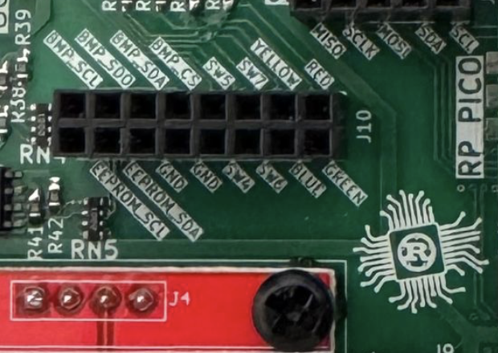

# 06 - Inter-Integrated Circuit

This lab will teach you how to communicate with hardware devices using the Inter-Integrated Circuit (I2C) protocol, in Embassy.

## Resources

1. **Raspberry Pi Ltd**, *[RP2350 Datasheet](https://datasheets.raspberrypi.com/rp2350/rp2350-datasheet.pdf)*
  - Chapter 12 - *Peripherals*
    - Chapter 12.2 - *I2C*

2. **BOSCH**, *[BMP280 Digital Pressure Sensor](https://www.bosch-sensortec.com/media/boschsensortec/downloads/datasheets/bst-bmp280-ds001.pdf)*
  - Chapter 3 - *Functional Description*
  - Chapter 4 - *Global memory map and register description*
  - Chapter 5 - *Digital Interfaces*
    - Subchapter 5.2 - *I2C Interface*

3. **Atmel** *[Two-wire Serial EEPROMs AT24C128 AT24C256](https://ww1.microchip.com/downloads/en/DeviceDoc/doc0670.pdf)*

4. **Paul Denisowski**, *[Understanding Serial Protocols](https://www.youtube.com/watch?v=LEz5UCN3aHA)*
5. **Paul Denisowski**, *[Understanding I2C](https://www.youtube.com/watch?v=CAvawEcxoPU)*

## Inter-Integrated Circuit (I2C)

The Inter-Integrated Circuit (I2C) is a synchronous, multi-controller/multi-target communication protocol. Similarly to the SPI, it allows data transfer between a controller and one or more peripheral ICs, but it uses only 2 wires (1 data line and 1 clock line, making it half-duplex) and has a different way of addressing the peripherals: using their unique *addresses*.

### Configuration


I2C transmission uses 2 lines:

- **SCL** - **S**erial **CL**ock line - clock is generated by the controller - used to synchronize communication between the controller and the targets
- **SDA** - **S**erial **DA**ta line - carries data between the controller and the addressed target
  - targets read data from SDA **only** when the clock is *low*
  - targets write data to SDA **only** when the clock is *high*

:::info Half duplex
The communication is *half-duplex*. This means that data is transmitted only in one direction at a time, since there is only *one* data line that can be used both for sending data to the target and receiving data from the target.
:::

:::info I2C inner works
The `SDA` and `SCL` wires are never actually driven (set to `LOW`/`HIGH`) by the controller/peripherals. The line is controlled by either pulling the line low or releasing the line high. 

When the line is *pulled down*, this means that it is connected directly to `GND`. This electronically translates to `LOW`.

When the line is *released*, or *pulled up*, this means that it connects back to `3V3` (which we can consider as being the "default" state of the wire) through a pull-up resistor. This electronically translates to `HIGH`.

This is called *open-drain connection*. You can read more about how it works [here](https://www.ti.com/lit/an/sbaa565/sbaa565.pdf?ts=1712891793335#:~:text=I2C%20is%20a%20two%2Dwire,and%20receive%20commands%20and%20data.), at section 2.2.
:::

### Data transmission

Each target is associated with a unique *address*. The controller uses this address to initiate communication with that target. This address can either be 7 or 10 bits.

#### Initiation

Before the transmission, both the `SCL` and `SDA` lines are set to `HIGH`. First thing the controller does is to signal a `start` condition by pulling the `SDA` line to `LOW`. All targets understand that the communication is about to commence and listen on the `SDA` line. Next, the controller starts the clock and begins to write the address of the target it wants to talk to, followed by a command bit that signifies whether the controller wants to *read* from the target or *write* to it. Whichever target recognizes its address, responds with an `ACK` (acknowledged), by pulling the `SDA` to `LOW`. If no target responds and the `SDA` stays `HIGH`, then it is considered a `NACK` (not acknowledged). Afterwards, the data transmission can begin.

#### Transmission

Depending on the command bit (R/W), either the controller or the target begins to send data over the `SDA` line. Data is sent one byte at a time, and then acknowledged by the receiver. One sequence of a data byte and `ack` is called a *frame*. 

During the communication, data can be:
- written to the `SDA` line *only* when `SCL` is `LOW` or
- read from the `SDA` line *only* when `SCL` is `HIGH`.

#### End

To end the transmission, the controller signals a `stop` condition. This is done by releasing the `SCL` line to `HIGH`, and then also releasing the `SDA` line. Since data can be written *only* when `SCL` is `LOW`, the target understands that this is a special event, that means that the communication has ended. 


:::note 10-bit addresses
For 10-bit addresses, the controller first issues a specific sequence of bits. This sequence is reserved, therefore targets with 7-bit addresses are prohibited from having addresses that start with this sequence. These bits mark the fact that the controller is attempting to initiate communication with a target with a 10-bit address, so all 7-bit targets ignore the `SDA` line once they recognize this sequence. After the special sequence, the controller sends the upper 2 bits of the address and the command bit, then waits for an `ack` from the target(s) that have an address that begins with these 2 bits. Afterwards, it sends the rest of the address, and waits for an acknowledgement from the target.


:::

### I2C in Embassy

These are the I2C imports we will be using. We will use the functions provided by the `embedded_hal_async` crate, since these are standard and used by most frameworks.

```rust
use embassy_rp::i2c::{I2c, InterruptHandler as I2CInterruptHandler, Config as I2cConfig};
use embedded_hal_async::i2c::{Error, I2c as _};
use embassy_rp::peripherals::I2C0;
```

:::info `I2c` trait importing
We use `I2c as _` from `embedded_hal_async` because in order to use the trait methods, we need to import it.
:::

We start by initializing the peripherals.

```rust
let peripherals = embassy_rp::init(Default::default());
```

Next, we declare the pins we will be using for the SDA and SCL lines. We can find which pins of the Raspberry Pi Pico have these functions by looking at the pinout.

```rust
let sda = peripherals.PIN_X;
let scl = peripherals.PIN_Y;
```

We then initialize our I2C instance, using the pins we defined earlier and a default configuration. It's recommended to use the asynchronous version, since it won't block the executor.

```rust
/// I2C
let mut i2c = I2c::new_async(peripherals.I2CX, scl, sda, Irqs, I2cConfig::default());
```

The first argument of the `new` function is the I2C channel that will be used. The Raspberry Pi Pico 2 has two usable I2C channels: I2C0 and I2C1. Each has multiple sets of pins that can be used for and you can find them marked in blue on the pinout diagram. 

The `Irqs` variable refers to the interrupt that the I2C driver will use when handling transfers. We also need to bind this interrupt, which depends on the I2C channel we are working with.

```rust
bind_interrupts!(struct Irqs {
    I2C0_IRQ => I2CInterruptHandler<I2C0>;
});
```

:::warning `I2cConfig` and `I2cInterruptHandler` are renamed imports
Because of the Embassy project naming convention, multiple `Config`s and `InterruptHandler`s can exist in one file. To solve this without having to prefix them with their respective module in code every time we use them (i.e use `i2c::Config` and `i2c::InterruptHandler`), in the code examples above `I2cConfig` and `I2CInterruptHandler` are renamed imports:
```rust
use embassy_rp::i2c::{I2c, InterruptHandler as I2CInterruptHandler, Config as I2cConfig};
```
:::

#### Reading from a target

To read from a target, we will be using the `read` **async** function of the I2C driver. 

The function takes 2 parameters:
- the address of the target we are attempting to receive the data from
- the *receiving* buffer in which we will store the data received from the target

The following example reads two bytes from the target of address `0x44`.

```rust
const TARGET_ADDR: u16 = 0x44;
let mut rx_buf = [0x00u8; 2];
i2c.read(TARGET_ADDR, &mut rx_buf).await.unwrap();
```

#### Writing to a target

To write data to a target, we will be using the `write` **async** function of the I2C driver.

This function also takes 2 parameters:
- the address of the target we are attempting to transmit the data to
- the *transmitting* buffer that contains the data we want to send to the target

The following example writes two bytes to the target of address `0x44`.

```rust
const TARGET_ADDR: u16 = 0x44;
let tx_buf = [0x01, 0x05];
i2c.write(TARGET_ADDR, &tx_buf).await.unwrap();
```

:::info
We can also use `write_read` if we want to perform both a write and a read one after the other.

```rust
i2c.write_read(TARGET_ADDR, &tx_buf, &mut rx_buf).await.unwrap();
```
:::

## BMP280 Digital Pressure Sensor

The BMP280 is a digital temperature and pressure sensor designed by Bosch. It can be interfaced both with SPI and with I2C. In this lab, we will use the I2C protocol to communicate with the sensor, in order to retrieve the pressure and temperature values.

You can find its datasheet containing more relevant information [here](https://www.bosch-sensortec.com/media/boschsensortec/downloads/datasheets/bst-bmp280-ds001.pdf).

:::tip BMP280 Address
The default I2C address of the BMP280 is `0x76`.
:::

### Register map


Next, we are going to explore some of the key registers we are going to use.

#### Register `ctrl_meas` (0xF4)

The control measurement register sets the data acquisition options of the sensor.

| Address (0xF4)| Name | Description |
| - | - | - |
| Bit 7, 6, 5 | `osrs_t` | This 3 bits control the oversampling of the temperature data. |
| Bit 4, 3, 2 | `osrs_p` | This 3 bits control the oversampling of the pressure data. |
| Bit 1, 0 | `mode` | This 2 bits control the power mode of the device. |

:::info Oversampling
The oversampling value refers to the number of actual measurement taken and averaged out for one measurement of either the pressure or temperature values.
:::

`osrs_t` and `osrs_p` possible values:
  * `000` - Skipped
  * `001` - Oversampling x 1
  * `010` - Oversampling x 2
  * `011` - Oversampling x 4
  * `100` - Oversampling x 8
  * `101`, `110` and `111` - Oversampling x 16

`mode` possible values:
  * `00` - Sleep mode (no measurements are performed, and power consumption is at a minimum)
  * `01` and `10` - Forced mode (a single measurement is performed, then the sensor returns to Sleep mode)
  * `11` - Normal mode (continuously cycles between a measurement period and a standby period)

#### Register `press` (0xF7...0xF9)

The `press` contains the raw pressure measurement data. The measurement output is a **20 bit** value split into 3 registers.

| Address | Name | Description |
| - | - | - |
| 0xF7 | `press_msb` | Contains the most significant 8 bits (**press[19:12]**) of the raw pressure measurement output data. |
| 0xF8 | `press_lsb` | Contains the next 8 bits (**press[11:4]**) of the raw pressure measurement output data. |
| 0xF9 (bit 7, 6, 5, 4) | `press_xlsb` | Contains the last 4 bits (**press[3:0]**) of the raw pressure measurement output data. |

:::tip Reading the raw pressure value
To determine the raw pressure measurement, you need to first read the `press_msb`, `press_lsb` and `press_xlsb` register values, then compute the raw value:

```rust
// Assuming the `press_*` values are i32s. If not, additional
// casts will be necessary.
let raw_press: i32 = (press_msb << 12) + (press_lsb << 4) + (press_xlsb >> 4)
```
:::

#### Register `temp` (0xFA...0xFC)

The `temp` contains the raw temperature measurement data. The measurement output is a **20 bit** value split into 3 registers.

| Address | Name | Description |
| - | - | - |
| 0xFA | `temp_msb` | Contains the most significant 8 bits (**temp[19:12]**) of the raw temperature measurement output data. |
| 0xFB | `temp_lsb` | Contains the next 8 bits (**temp[11:4]**) of the raw temperature measurement output data. |
| 0xFC (bit 7, 6, 5, 4) | `temp_xlsb` | Contains the last 4 bits (**temp[3:0]**) of the raw temperature measurement output data. |

:::tip Reading the raw temperature value
To determine the raw temperature measurement, you need to first read the `temp_msb`, `temp_lsb` and `temp_xlsb` register values, then compute the raw value:

```rust
// Assuming the `temp_*` values are i32s. If not, additional
// casts will be necessary.
let raw_temp: i32 = (temp_msb << 12) + (temp_lsb << 4) + (temp_xlsb >> 4)
```
:::

#### Compensation parameters

These are `u16` and `i16` factory-calibrated parameters stored inside the `BMP280` internal calibration registers. Due to manufacturing variations, no two BMP280 are the same. Because of this, Bosch measures each sensor individually at the factory and saves its *personal correction factors* into a non-volatile, read-only memory to be used to more accurately determine the pressure and temperature values.

| Register Address (LSB / MSB) | Content | Data type |
| - | - | - |
| 0x88 / 0x89 | `dig_T1` | unsigned short (u16) |
| 0x8A / 0x8B | `dig_T2` | signed short (i16) |
| 0x8C / 0x8D | `dig_T3` | signed short (i16) |
| 0x8E / 0x8F | `dig_P1` | unsigned short (u16) |
| 0x90 / 0x91 | `dig_P2` | signed short (i16) |
| 0x92 / 0x93 | `dig_P3` | signed short (i16) |
| 0x94 / 0x95 | `dig_P4` | signed short (i16) |
| 0x96 / 0x97 | `dig_P5` | signed short (i16) |
| 0x98 / 0x99 | `dig_P6` | signed short (i16) |
| 0x9A / 0x9B | `dig_P7` | signed short (i16) |
| 0x9C / 0x9D | `dig_P8` | signed short (i16) |
| 0x9E / 0x9F | `dig_P9` | signed short (i16) |
| OxA0 / 0xA1 | reserved | reserved |

### Temperature computation formula

This formula is based on the **Compensation formula in fixed point** which can be found in section **8.2** of the [datasheet](https://www.bosch-sensortec.com/media/boschsensortec/downloads/datasheets/bst-bmp280-ds001.pdf).

To determine the actual temperature, you need the raw temperature measurement value and the temperature compensation parameters (`dig_t1`, `dig_t2` and `dig_t3`). We will assume these are already determined.

```rust
let var1 = (((raw_temp >> 3) - ((dig_t1 as i32) << 1)) * (dig_t2 as i32)) >> 11;
let var2 = (((((raw_temp >> 4) - (dig_t1 as i32)) * ((raw_temp >> 4) - (dig_t1 as i32))) >> 12) * (dig_t3 as i32)) >> 14;
let t_fine = var1 + var2;

let actual_temp = (t_fine * 5 + 128) >> 8;
```

The `actual_temp` value is in hundredths of a degree Celsius, meaning that a `1234` represents 12.34°C.

### Wiring

The BMP280 has 5 pins with the following functions. Keep in mind that for the I2C protocol, there are **only two wires** we need to connect (excepting the `VCC` and `GND` needed for powering the sensor). 

| Pin | Function |
|-|-|
| `VCC` | power source (3V3) |
| `GND` | ground |
| `SCL` | `SCL` (for I2C) / `CLK` (for SPI) line |
| `SDA` | `SDA` (for I2C) / `MOSI` (for SPI) line |
| `CSB` | `CS` (for SPI) |
| `SDO` | `MISO` (for SPI) |

The BMP280 is integrated already integrated in the lab board, having some of these pins already wired, and some exposed in the **J10** breakout. Consult the board [schematic](https://gitlab.cs.pub.ro/pmrust/pm-ma-pcb/-/blob/main/Schematic/MA.pdf?ref_type=heads) to figure out which ones you need to connect to your *"I2C capable"* pins.



### Reading and writing to the BMP280

Instructions on how to use I2C with the BMP280 can be found in the [datasheet](https://www.bosch-sensortec.com/media/boschsensortec/downloads/datasheets/bst-bmp280-ds001.pdf), at section 5.2.

Before we start, we initialize the I2C driver with the pins and channel we will be using.

```rust
use embassy_rp::i2c::{I2c, InterruptHandler as I2CInterruptHandler, Config as I2cConfig};
use embedded_hal_async::i2c::{Error, I2c as _};
use embassy_rp::peripherals::I2CX;

bind_interrupts!(struct Irqs {
    I2CX_IRQ => I2CInterruptHandler<I2CX>;
});

fn main() {
  let peripherals = embassy_rp::init(Default::default());

  // I2C pins
  let sda = peripherals.PIN_X;
  let scl = peripherals.PIN_Y;

  // I2C definition
  let mut i2c = I2c::new_async(peripherals.I2CX, scl, sda, Irqs, I2cConfig::default()); 

  ...
}
```

:::warning `I2CX`, `PIN_X`, `PIN_Y` do not exist
You will need to replace them with the proper I2C peripheral and corresponding pins. 
:::

In section 5.2.1 and 5.2.2 of the datasheet, we get the information we need in order to read/write to a register of the BMP280 using I2C.

#### Reading a register


To read the value of a register, we first need to send the BMP280 the address of the register we want to read. Afterwards, the sensor will send back the value of the register we requested.

For this, we need to first *write* this register address over I2C and then *read* the value we get back from the sensor. We could use the `write_read_async` function to do this.

```rust
// The tx buffer contains the address of the register we want to read
let tx_buf = [REG_ADDR]; 
// the rx buffer will contain the value of the requested register
// after the transfer is complete.
let mut rx_buf = [0x00u8]; 
// The function's arguments are the I2C address of the BMP280 and the two buffers
i2c.write_read(BMP280_ADDR, &tx_buf, &mut rx_buf).await.unwrap();
```

:::info I2C is *half-duplex*.
The `write_read` function performs two separate transfers: a write and a read. As opposed to SPI, the basic transactions are unidirectional, and that's why we need two of them.
:::

:::tip Consecutive reads
Like with SPI, we can also read multiple registers with consecutive addresses at a time. All we need to do is modify the size of the receive buffer to be able to hold more register values, the rest of the procedure is the same.

```rust
let mut rx_buf = [0x00u8; 3];
```
This is explained in section 5.3 of the datasheet.
:::

#### Writing to a register


To write to a register, we need to send the sensor a buffer containing pairs of register addresses and values we want to write to those registers. For example, if we wanted to write `0x00` to `REG_A`:

```rust
let tx_buf = [REG_A, 0x00];
i2c.write(BMP280_ADDR, &tx_buf).await.unwrap();
```

If we wanted to write both `REG_A` and `REG_B` to `0x00`:

```rust
let tx_buf = [REG_A, 0x00, REG_B, 0x00];
i2c.write(BMP280_ADDR, &tx_buf).await.unwrap();
```

## AT24C256 EEPROM

The AT24C256 is a 256-kilobit **Electrically Erasable Programmable Read-Only Memory** (EEPROM) device that communicates using the I2C protocol. It is commonly used for storing non-volatile data, such as configuration settings or calibration data, which need to persist even when the device is powered off.

### Device Addressing

The AT24C256 uses a 7-bit I2C address, with the most significant 5 bits fixed as `10100`. The remaining 2 bits are configurable by connecting the `A1` and `A0` pins to either `GND` or `VCC`, allowing up to 4 devices to be connected on the same I2C bus. Knowing the state of the pins, you can determine the address using the formula: `0x50 | (A1 << 1) | A0`. To determine the address of the EEPROM used by our board, you can check the [schematic](https://gitlab.cs.pub.ro/pmrust/pm-ma-pcb/-/blob/main/Schematic/MA.pdf?ref_type=heads) or perform an I2C scan.

### Wiring

The AT24C256 has 8 pins with the following functions. For more information, consult the [datasheet](https://ww1.microchip.com/downloads/en/DeviceDoc/doc0670.pdf).

| Pin | Function |
| - | - |
| AO - A1 | Address Inputs |
| SDA | Serial Data |
| SCL | Serial Clock Input |
| WP | Write Protect |
| NC | No Connect |
| GND | Ground |

The AT24C256 is integrated already integrated in the lab board, having some of these pins already wired, and some exposed in the **J10** breakout. Consult the board [schematic](https://gitlab.cs.pub.ro/pmrust/pm-ma-pcb/-/blob/main/Schematic/MA.pdf?ref_type=heads) to figure out which ones you need to connect to your *"I2C capable"* pins.


### Memory Organization

The memory is organized into 32,768 bytes, divided into 512 pages of 64 bytes each. Each byte can be accessed individually, or multiple bytes can be written/read in a single operation using page addressing.

We can connect the EEPROM to the same I2C bus as the BMP280, therefore we can reuse the same `I2c` instance we [previously](./index.mdx#reading-and-writing-to-the-bmp280) initialized.

#### Reading from the AT24C256

To read data from the EEPROM, you first need to write the memory address you want to read, then read the byte at that memory location. Because we are working with 32,768 bytes of memory (which is 2<sup>15</sup> bytes), we are working about 2-byte addresses that need to be sent **High byte** first (big endian).

```rust
let mem_addr: u16 = 0xCAFE; // 16 bit address
let mem_buff: [u8; 2] = mem_addr.to_be_bytes(); // `be` stands for big endian
let mut data: [u8; 1] = [0];

i2c.write_read(EEPROM_ADDR, &memory_address, &mut data).await.unwrap();
```

:::note Sequential read
The AT24C256 supports sequential reads. After the EEPROM sends a data word (byte), if the microcontroller sends a responds with an **ACK** instead of a **Stop Condition** the memory will continue to increment the internal data word address and serially clock out sequential data words. When the memory address limit is reached, the data word address will *"roll over"* (begin writing from the beginning) and the sequential read will continue.

This means that we can read multiple consecutive bytes:

```rust
let mem_addr: u16 = 0xBABE; // 16 bit address
let mem_buff: [u8; 2] = mem_addr.to_be_bytes(); // `be` stands for big endian
let mut data: [u8; 10] = [0; 10];

i2c.write_read(EEPROM_ADDR, &mem_buff, &mut data).await.unwrap();
```
:::

#### Writing to the AT24C256

The EEPROM supports the writing of up to 64 bytes (one page) in a single transaction. The microcontroller performs a write transaction where the first two bytes are the 16-bit memory location in big endian format, followed by a number of bytes that should be written, starting from that respective address. The particularity of this memory module is that, for a write within a **page** when reaching the upper page boundary, the internal data word address would do a *"roll over"* to the address of the first byte of the same page.

```rust
let mem_addr: u16 = 0xBABE; // 16 bit address
let mem_buff: [u8; 2] = mem_addr.to_be_bytes(); // `be` stands for big endian
let data: [u8; 8] = [0xCA, 0xFE, 0xBA, 0xBE, 0xDE, 0xAD, 0xBE, 0xEF];

let mut tx_buf = [0x00; 8 + 2];
tx_buf[..2].copy_from_slice(&mem_buff);
tx_buf[2..].copy_from_slice(&data);

i2c.write(EEPROM_ADDR, &tx_buf).await.unwrap();
```

:::danger Write delay
After each complete memory write transaction, the EEPROM an internally-timed write cycle of roughly **5ms**. If you have to perform a series of consecutive writes, make sure to space them out appropriately.
:::

### `eeprom24x` crate

To simplify the interfacing with the non-volatile memory for your **project**, you can use the [`eeprom24x`](https://crates.io/crates/eeprom24x) crate. It is a is a platform agnostic Rust driver for the 24x series serial EEPROM, based on the [`embedded-hal`](https://docs.rs/embedded-hal/1.0.0/embedded_hal/) traits. This means that you will not be able to harness the power of the async executor, and you will need to use the conventional **blocking** API.

:::tip Call to action
At the end of this lab, you should be familiar with both the **blocking** and **async** I2C traits exported by the [`embedded-hal`](https://docs.rs/embedded-hal/1.0.0/embedded_hal/) and [`embedded-hal-async`](https://docs.rs/embedded-hal-async/1.0.0/embedded_hal_async/) and with a grasp of how I2C works. You could begin your journey into the OpenSource world by contributing to this crate, by creating a PR on their [github repository](https://github.com/eldruin/eeprom24x-rs) that adds support for the async API.
:::

## Exercises
1. Connect both the BMP280 and AT24C256 at the same I2C pins and perform a scan to determine their addresses. (**2p**)

:::tip I2C scan
You can perform an I2C scan by attempting a one byte `read` at every address within the **viable address range**. The addresses used by the I2C protocol are 7-bit address, ranging from `0x00` to `0x7F`, but some of these are either reserved, or have a special function (the general call `0x00` address). The unusable addresses range from `0x00` to `0x07` and `0x78` to `0x7F`. This leaves us with addresses ranging from `0x08` to `0x77`
:::

2. Read the raw temperature value from the BMP280 and print it once a second.

* To do that, you have to configure the `ctrl_meas` register. Writing to a register is explained [here](./index.mdx#writing-to-a-register), and for details about the registers's function, you can consult this [subsection](./index.mdx#register-ctrl_meas-0xf4) of the register map. You can opt for **Normal mode**, a **temperature oversampling of x 2**, and we can **skip** the pressure measurement (Hint `0b010_000_11`). (**2p**)

:::warning Configuring the data acquisition options
This should be done **only once**, before reading the sensor.
:::

* Read the raw temperature value stored in the `temp` register once a second, and print it to the terminal using the `defmt` macros. Details on how this can be performed can be found in this [subsection](./index.mdx#register-temp-0xfa0xfc) of the register map and in the [Reading a register](./index.mdx#reading-a-register) subsection. (**2p**)

3. Based on the raw temperature value previously determined, compute the actual temperature value using the **mock** calibration values provided bellow and the formula described in the [sections above](./index.mdx#temperature-computation-formula). (**1p**)

```rust
let dig_t1: u16 = 27504;
let dig_t2: i16 = 26435;
let dig_t3: i16 = -1000;
```

:::tip Temperature format
You can print the `actual_temp` value like so:

```rust
info!(
    "Temperature {}.{}°C",
    actual_temp / 100,
    actual_temp.abs() % 100
);
```
:::

4. Read the calibration data(`dig_t1`, `dig_t2` and `dig_t3`) from the sensor's internal storage, instead of using the **mock** values previously provided to improve the accuracy of the measurement. (**1p**)

:::note
The reading of the calibration values should be performed only once, after configuring the `ctrl_meas` register.

>**Hint!**
>
>You can read the first 6 byte into a 6 byte long `u8` buffer we will call data, and determine the values of the 3 temperature compensation values like this:
>
>```rust
>let dig_t1: u16 = ((data[1] as u16) << 8) | (data[0] as u16);
>let dig_t2: i16 = ((data[3] as i16) << 8) | (data[2] as i16);
>let dig_t3: i16 = ((data[5] as i16) << 8) | (data[4] as i16);
>```
:::

5. Every time you perform a sensor reading, log the temperature value (in hundredths of a degree) in the non-volatile memory at the address `0xACDC`. To be able to test that this is properly working, the first thing we will do when the board boots will be to print the previously written temperature value. You have more details about reading and writing to the EEPROM in this [section](./index.mdx#memory-organization). (**2p**)

:::tip `i32` to bytes and vice-versa
To quickly convert an `i32` variable into an array of `u8`s, we can use either the `from_be_bytes()` and `to_be_bytes()` or the `from_le_bytes()` and `to_le_bytes()` methods. You can find more details about them in the [`i32` documentation](https://doc.rust-lang.org/core/primitive.i32.html) page.
:::
