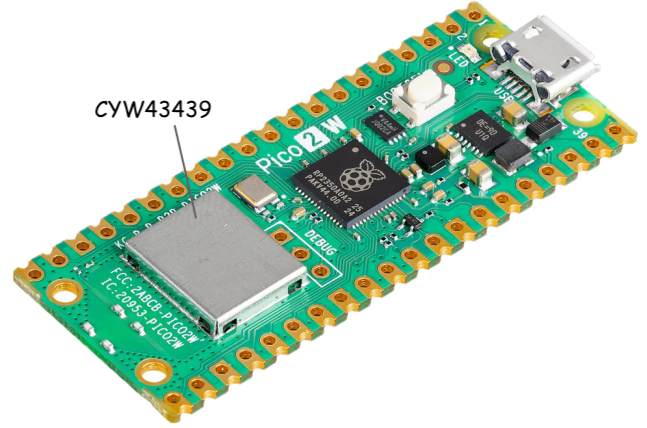

# 07 - Wi-Fi

import { useActiveVersion } from '@docusaurus/plugin-content-docs/client';

export function NetworkingLecture() {
  const version = useActiveVersion();
  return <a href={`/docs/${version?.name}/lecture/08`}>Lecture 08 - Networking</a>;
}

This lab will teach you the basics of networking and Wi-Fi, and how to use Wi-Fi with the Raspberry Pi Pico W, in Embassy.

## Resources

**Andrew Tanenbaum**, *Computer networks (5th edition)*
  - Chapter 1 - *Introduction*
    - Subchapter 1.4.2 - *The TCP/IP Reference Model*

## Networking basics

A network is a set of devices that are linked together in order to share resources. Most of the time, devices communicate to one another within a network using a set of protocols based on a network communication standard called the OSI (Open Systems Intercommunication) Stack.

The OSI stack has 7 layers, out of which 5 are important:
- **L1 - hardware layer** - transmission of bits through a physical medium (copper wire, radio waves, optical fibre)
- **L2 - data link layer** - transmission of packets between two devices in a network (Ethernet, Wi-Fi)
- **L3 - network layer** - transmission of packets between devices in different networks (IP)
- **L4 - transport** - transmission of data from a source to a destination (TCP, UDP)
- **L7 - application** - transmission of data from an application (port) of a device to an application of another device

Devices that communicate in a network have associated addresses. In a TCP/IP network these addresses are called IP (Internet Protocol) addresses. There are two types of IP addresses: 

- **IPv4** - stored on 32 bits
- **IPv6** - newer, stored on 128 bits

The IPv6 solves the problem of an evergrowing number of devices with networking capabilities; a higher resolution for the IP address means more unique addresses that can be assigned. We will be discussing only the IPv4 in this lab, since it is most commonly used in local networks.

### IPv4

An IPv4 address looks like this: `192.168.0.1/24`.

Each number separated by a dot is represented on 8 bits (ranging from 0 to 255). The number after the slash is the *network mask*, which will be described shortly.

:::info IPv4 in binary
The IP address can also be represented in hexadecimal or binary form. Usually, when configuring subnets, it's easier to use the binary form to perform the necessary calculations.

`192.168.0.1` = `11000000.10101000.00000000.00000001`
:::

An IP address is made of two parts:
- **network prefix**: this portion defines the network to which the device belongs
- **host identifier**: this portion uniquely identifies the device in the network

The *network mask* defines the number of bits that are used to represent the network prefix. A smaller mask allows more bits to be used for host identifiers, enabling a larger number of unique devices within the network.

For example, for the above address `192.168.0.1/24`, we know that the network prefix is 24 bits long. Therefore, the first 24 bits give us the network prefix and the last 8 bits give us the host identifier. The mask in this case would look like this: `255.255.255.0`.

:::info Network masks
In binary, `255.255.255.0` is `11111111.11111111.11111111.00000000`. 

The first 24 bits are `1`, the last 8 bits are `0`.
:::

Any device that wants to communicate in this local network (or *subnet*) must have an address ranging from `192.168.0.1` to `192.168.0.254`. Note that the first 24 bits of the address are the same: the network prefix for these addresses is the same, since they can all be allocated to devices within the *same* network.


:::note
In the above example, `192.168.0.0` is the *network address*, and `192.168.0.255` is the *broadcast address* (used to broadcast to *all* endpoints in a subnet). The first and last possible addresses in a subnet are reserved and should not be assigned to devices.

To determine the *network address*, we need to perform a logic `AND` operation between the IP address and the network mask.

To determine the *broadcast address*, we need to perform a logic `OR` operation between the IP address and the *inverse* of the network mask.

This means converting the IP address and network mask to binary, then performing `AND` or `OR` on every bit, then converting it back to decimal.
:::

Learn more about subnetting [here](https://networklessons.com/cisco/ccna-routing-switching-icnd1-100-105/what-is-subnetting).

### Routers

Routers are devices that forward packets between networks. The packets of the sender will be *routed* to the receiver of a different network, depending on the IP of the destination, passing from one router to another until they reach their destination. This happens through complex routing protocols. Routers also deal with traffic filtering, DNS (Domain Name System), DHCP and others.

The *default gateway* in a local network is the router where packets must be sent when the *destination IP* is not in the current local network. From there, packets will be routed further. Read more about it [here](https://en.wikipedia.org/wiki/Default_gateway).

A L3 (Network) packet looks like this:


The L3 packet is contained within the L2 frame. The L2 packet headers contain the MAC address of the source and the destination, and the data contains the L3 packet. The L3 packet has a separate header, with the IP address of the source and the destination. The router is an L3 network device, meaning it is able to descifer the IP address of the source and the destination from the L3 frame and determine where the packet needs to be routed to.


### DHCP

Dynamic Host Configuration Protocol (DHCP) is a network management protocol used by routers to dynamically allocate IP addresses to devices connected to its network. Routers dynamically assign addresses to new devices in the network, if they don't already have a *static* IP. DHCP leases IP, Mask, Gateway and DNS servers.

### Networking protocols

#### TCP (Transmission Control Protocol)

TCP is *connection-oriented*, meaning that a connection must be first established between two devices (client and server) before data can be sent. Packets that are not received correctly must be *retransmitted* by the sender, ensuring that data always reaches its destination. The packet might also be fragmented during the transmission and the receiver might receive it in several smaller packets. TCP is used in cases where data integrity is most important.

#### UDP (User Datagram Protocol)

UDP, on the other hand, is *connectionless*, and prioritizes speed over reliability. Packets that are not received correctly are dropped, **not** retransmitted and **not** fragmented. UDP is used in time-sensitive applications, such as audio streaming.

## Wi-Fi

**Wi-Fi** is a networking technology that allows devices to *wirelessly* communicate in a local network or interface the Internet. 

Wi-Fi devices use radio waves to transmit data to one another in a network, through *wireless access points* (a wireless router, for instance). The access point (AP) connects directly to a local area network (LAN) and provides wireless connections for other devices in its proximity to use. 


### Protocol

Wi-Fi uses the *802.11* IEEE standard, with different radio technologies:

- 2.4 GHz radio band, ultra high frequency, (widely supported; Raspberry Pi Pico W uses this frequency)
- 5 GHz radio band, super high frequency
- others, not widely used

Each radio frequency range is divided into a multitude of *channels*. Each device that uses a frequency band communicates over one channel. Ideally, each device is allocated a separate channel. Sometimes, though, when there are many devices using a Wi-Fi frequency band, devices might end up having to *share* a channel and wait their turn to transmit data, leading to lower communication speeds. 5 GHz provides more channels than 2.4 GHz, allowing more devices to use the band without interference. 

### Security

#### Open Wi-Fi

Open wireless networks don't require any authentication, and all transmissions are unencrypted. Any device that connects to an open network can easily intercept data sent in this network. This is unsecured and unsafe.

#### Wired Equivalent Privacy (WEP)

WEP is the first security protocol ever implemented. It uses data encryption based on generated key values. It was designed in 1997 and has since become obsolete, because it is really easy to crack and basically as unsafe as open Wi-Fi.

#### Wi-Fi Protected Access (WPA/WPA2/WPA3)

WPA, WPA2 and WPA3 were defined in response to the serious weaknesses discovered in WEP. Each version of WPA increments the security of the protocol, using more powerful password encryption methods. 

### Wi-Fi on the Raspberry Pi Pico 2 W

Apart from the RP2350 microcontroller, the Raspberry Pi Pico 2W board also has a separate, on-board wireless interface. It is a 2.4 GHz Infineon chip, *CYW43439*. This chip deals only with Wi-Fi (and Bluetooth) communication, and it is connected to the RP2350 via SPI.



## Wi-Fi in Embassy

### CYW43 driver 

The CYW43 chip also needs to be programmed in order to handle the Wi-Fi connection and transfers. For this, Infineon provides two firmware binaries that need to be loaded into our flash memory. We use the [`include_bytes!`](https://doc.rust-lang.org/core/macro.include_bytes.html) macro to achieve this.

```rust
let fw = include_bytes!("../cyw43-firmware/43439A0.bin");
let clm = include_bytes!("../cyw43-firmware/43439A0_clm.bin");
```

The above example assumes that the binaries have been downloaded and added to the `<crate_root>/cyw43-firmware` folder. They can be downloaded from [here](https://github.com/embassy-rs/embassy/tree/main/cyw43-firmware).

Next, we need to declare the SPI that interfaces the Wi-Fi chip. This SPI will be controlled by PIO (Programmable Input/Output), instead of simple GPIO pins, as we've done so far. PIO contains dedicated hardware that can deal with high-speed input and output operations, therefore offloading the MCU.

```rust
let cs = Output::new(p.PIN_25, Level::High);
let mut pio = Pio::new(p.PIO0, Irqs);
let spi = PioSpi::new(&mut pio.common, pio.sm0, pio.irq0, cs, p.PIN_24, p.PIN_29, p.DMA_CH0);
```

We're also going to need to bind the interrupts that can be triggered by the PIO.

```rust
bind_interrupts!(struct Irqs {
    PIO0_IRQ_0 => InterruptHandler<PIO0>;
});
```
Now we need to instantiate the `CYW43` driver, and spawn a task that will start it. 

```rust
let pwr = Output::new(p.PIN_23, Level::Low);

static STATE: StaticCell<cyw43::State> = StaticCell::new();
let state = STATE.init(cyw43::State::new());
let (net_device, mut control, runner) = cyw43::new(state, pwr, spi, fw).await;
spawner.spawn(wifi_task(runner)).unwrap();

control.init(clm).await;
control
    .set_power_management(cyw43::PowerManagementMode::None)
    .await;
```

Inside this task, the driver will deal with the low-level SPI transfers between the MCU and the Wi-Fi chip.

```rust
#[embassy_executor::task]
async fn wifi_task(runner: cyw43::Runner<'static, Output<'static>, PioSpi<'static, PIO0, 0, DMA_CH0>>) -> ! {
    runner.run().await
}
```

### Network stack

To be able to communicate in a network, our device needs to have an associated IP address. We can configure a static IP address, or we can use DHCP to have an IP address dynamically assigned to our device.

#### Configuring the IP address

1. **Static IP address:** the device defines its own IP address for the WLAN. For this, we also need to know the address of the default gateway.

```rust
let config = embassy_net::Config::ipv4_static(embassy_net::StaticConfigV4 {
   address: Ipv4Cidr::new(Ipv4Address::new(192, 168, 0, 2), 24),
   dns_servers: Vec::new(),
   gateway: Some(Ipv4Address::new(192, 168, 0, 1)),
});
```

2. **Dynamic IP address:** the device asks for an IP address via [DHCP](./index.mdx#dhcp). It also receives other configuration information, such as the default gateway.

```rust
let config = Config::dhcpv4(Default::default());
```

:::note Waiting for an address
This method takes more time, because the device needs to wait to receive an IP address before it can start communicating in the network:

```rust
// After we join a network, we wait to receive an IP
while !stack.is_config_up() {
    Timer::after_millis(100).await;
}
```
:::


Once we have defined the configuration, we need to instantiate and run the network stack driver, to be able to connect to the WLAN.

```rust
// Generate random seed
let seed = 0x0123_4567_89ab_cdef; // chosen by fair dice roll. guarenteed to be random.
// The number of sockets the stack can have open concurrently 
const SOCK: usize = 2;

// Init network stack
static RESOURCES: StaticCell<StackResources<SOCK>> = StaticCell::new();

let (stack, runner) = embassy_net::new(
    net_device,
    config,
    RESOURCES.init(StackResources::new()),
    seed,
);

spawner.spawn(net_task(stack));
```

The network driver deals with the network stack: receiving, building and sending packets over the WLAN.

```rust
/// This task runs the network stack, used for processing network events.
#[embassy_executor::task]
async fn net_task(mut runner: embassy_net::Runner<'static, cyw43::NetDriver<'static>>) -> ! {
    runner.run().await
}
```

#### Scanning for Wi-Fi networks

The `CYW43` driver has a function that allows us to scan all Wi-Fi access points in the device's proximity.

```rust

let mut scanner = control.scan(Default::default()).await;
while let Some(bss) = scanner.next().await {
    if let Ok(ssid_str) = core::str::from_utf8(&bss.ssid) {
        info!("Scanned {}", ssid_str);
    }
}
```

#### Connecting to a Wi-Fi Access Point

To connect to a WPA2 Wi-Fi network, we can use the `join_wpa2` function, providing the network name and the password.

```rust
const WIFI_NETWORK: &str = "my_ssid";
const WIFI_PASSWORD: &str = "password";

loop {
    match control.join(WIFI_NETWORK, JoinOptions::new(WIFI_PASSWORD.as_bytes())).await {
        Ok(_) => break,
        Err(err) => {
            info!("join failed with status={}", err.status);
        }
    }
}

// Wait for DHCP, not necessary when using static IP
info!("waiting for DHCP...");
while !stack.is_config_up() {
    Timer::after_millis(100).await;
}
info!("DHCP is now up!");
```

:::note Open networks
To connect to an open network, we can use the `new_open` method of the `JoinOptions` struct.

```rust
control.join(WIFI_NETWORK, JoinOptions::new_open()).await;
```
:::

#### Creating a Wi-Fi Access Point

The Pico can also be used as an Access Point, that other devices can connect to. We can initialize it as either an open network:

```rust
control.start_ap_open("Pico AP", 5).await;
```

or as a secured, WPA2 network:

```rust
control.start_ap_wpa2("Pico AP", "WeloveRust", 5).await;
```

#### Starting a TCP server

Now that we have connected our Pico to a Wi-Fi network, we can start a server to handle connections to our Pico.

We need to create a TCP socket in order to handle TCP connections and transfers. 

```rust
let mut rx_buffer = [0; 4096];
let mut tx_buffer = [0; 4096];
let mut socket = TcpSocket::new(stack, &mut rx_buffer, &mut tx_buffer);
// If we want to keep the connection open regardless of inactivity, we can set the timeout
// to `None`
socket.set_timeout(Some(Duration::from_secs(10)));
```

Next, we wait for a connection on a specific port. For example, the following snippet waits for a TCP connection on port `1234`.

```rust
info!("Listening on TCP:1234...");
if let Err(e) = socket.accept(1234).await {
    warn!("accept error: {:?}", e);
    continue;
}

info!("Received connection from {:?}", socket.remote_endpoint());
```

Once we have an established connection, we can read and write to the socket, and communicate with the other endpoint.

```rust
let mut buf = [0; 4096];
loop {
    let n = match socket.read(&mut buf).await {
        Ok(0) => {
            warn!("read EOF");
            break;
        }
        Ok(n) => n,
        Err(e) => {
            warn!("read error: {:?}", e);
            break;
        }
    };

    info!("rxd {}", core::str::from_utf8(&buf[..n]).unwrap());

    match socket.write_all(&buf[..n]).await {
        Ok(()) => {}
        Err(e) => {
            warn!("write error: {:?}", e);
            break;
        }
    };
}
```

#### Connecting as a client to a TCP server

The Pico can connect as a client to a TCP server using the `connect` function:

```rust
if let Err(e) = socket.connect(IpEndpoint::new(IpAddress::v4(1,2,3,5), 1234)).await {
    warn!("accept error: {:?}", e);
    continue;
}
```

#### Starting an UDP server

Similarly to the TCP server, we create a new socket, this time one that handles UDP connections.

```rust
let mut rx_buffer = [0; 4096];
let mut rx_metadata_buffer = [PacketMetadata::EMPTY; 3];
let mut tx_buffer = [0; 4096];
let mut tx_metadata_buffer = [PacketMetadata::EMPTY; 3];

let mut socket = UdpSocket::new(
    stack, &mut rx_metadata_buffer, &mut rx_buffer, &mut tx_metadata_buffer, &mut tx_buffer
);
```

Next, we bind our socket to a port (for example port `1234`). Note that the `bind` function is not a future, since we don't need to wait for connections before initiating a transmission.

```rust
if let Err(e) = socket.bind(1234) {
    warn!("accept error: {:?}", e);
    continue;
}
```

Now, we can read and write to the socket, and any endpoint that connects to the port can send/receive data.

```rust
// example read
let mut buf = [0u8; 4096];
loop {
    match socket.recv_from(&mut buf).await {
        Ok((n, endpoint)) => {
            info!("Received from {:?}: {:?}", endpoint, from_utf8(&buf[..n]).unwrap());
        },
        Err(_) => {
            info!("An error occurred when receiving the packet!");
        }
    }
}

// example write
let buffer = "hello\n".as_bytes();
match socket.send_to(&buffer, IpEndpoint::new(IpAddress::v4(192, 168, 100, 45), 1234)).await {
    Ok(()) => {
        info!("sent")
    }
    Err(e) => {
        warn!("send error: {:?}", e);
    }
}
```

:::note Udp is connectionless
Since UDP is connectionless, to send data to an endpoint we need to specify exactly to which IP address and port we want to send it to.
:::

## Exercises

:::note Lab skeleton
We provided some helpers in the [lab skeleton](https://github.com/UPB-PMRust/lab-2025) so you don't have to configure the CYW43 driver and the network stack manually:

- The `embassy_lab_utils::init_wifi!` macro generates an async block that initializes the CYW43 driver and spawns the driver task. The macro expects a reference to a `Spawner` instance and a `Peripherals` instance. The block returns a tuple containing the `NetDriver` instance, needed by the network stack, and the `Control` instance.

```rust
let (net_device, mut control) = init_wifi!(&spawner, peripherals).await;
```

- The `embassy_lab_utils::init_network_stack` function takes a reference to a `Spawner` instance, a `NetDriver` instance, a mutable reference to a `StackResources` instance, and an `embassy_net::Config` of either a static or a dynamic IP. The functions returns an
`embassy_net::Stack` instance.

```rust
let stack = init_network_stack(&spawner, net_device, &RESOURCES, config);
```

:::

1. Write a program that scans for local networks and prints their *SSID* using `defmt`. (**1p**)

2. Connect to one of the available networks you found in the previous exercise. Configure the Pico to use a dynamic IP address provided through [DHCP](./index.mdx#dhcp). Once connected, print using `defmt` the IP address that has been
assigned to your device. (**1p**)

:::tip Drop the `scanner`
You will need to either comment out the **IP scan**, or manually `drop` the `scanner` to be able to connect to any network, because the `scan` function mutably borrows `ctrl`.
:::

3. Configure the Pico as an access point. You will need to set a static IP address both for the Pico and your computer,
to make sure they are both in the same subnet, so that they can communicate. (**1p**)

4. Implement a TCP server on port `6000` that listens for incoming client connections and echoes back any messages received from clients. (**1p**)

:::note Testing your server

In order to test your program, you will need to have a client connect to your server. The easiest way to do that is by using `netcat`, 
a command-line networking utility that allows you to read from and write to network connections using TCP or UDP protocols.

**Installation:**
-	**Linux or macOS**: Netcat is often pre-installed on Linux and macOS systems. If it isn’t already available, you can install it using your preferred package manager:
    -	For Debian/Ubuntu: `sudo apt update && sudo apt install netcat`
    -	For macOS (using Homebrew): `brew install netcat`.
    
-	**Windows**: Netcat is not natively available on Windows, but you can use [NCat](https://nmap.org/download.html#windows).

You can verify your installation by displaying the help menu:

```bash
ncat -h # on Windows
nc -h   # on Linux/MacOS 
```

**Connecting to a TCP socket:**

You can run the following command for establishing a TCP connection to a server:

```shell
ncat [ip_address] [port] # on Windows
nc [ip_address] [port]   # on Linux/MacOS
```

Replace `ip_address` with the server’s IP address and `port` with the port number you want to connect to. Once connected, you can send and receive data directly through the terminal.
Any data received from the server will be displayed in the console. To send data, simply type the desired string and press `Enter`.

**Listen for TCP connections:**

You can run the following command for listening to inbound TCP connections:

```shell
ncat -l [port] # on Windows
nc -l [port]   # on Linux/MacOS
```

Here, `port` specifies the port number on which your system will listen for incoming connections. This is useful for simulating a server during testing or debugging.

:::

5. Connect the `SW4`, `SW5` and `SW6` buttons from the lab board to the Pico. Modify the server 
from the previous exercise so that it sends the connected client
the message `button{4,5,6}:pressed` when one of the buttons is pressed. (**2p**) 

6. Connect the `RED`, `GREEN` and `BLUE` LEDs from the lab board to the Pico. Modify the server from the previous exercise so that when it receives the message `{red,green,blue}:{on,off}` it
turns on or off the corresponding LED. (**2p**)

7. You will have to pair up with another team for this task. The two Picos will have to
communicate through a TCP socket, one being a server and the other, a client. The Pico
which will act as a server will also be the access point. (**2p**)

**The client Pico will need to implement the following functionality:**
- The press of `SW4` will trigger the send of the message `led:toggle` to the server. 
- The press of `SW5` will trigger the send of the message `led:red` to the server. 
- The press of `SW6` will trigger the send of the message `led:green` to the server. 
- The press of `SW7` will trigger the send of the message `led:blue` to the server. 
- The receival of the `error` message will turn on the red LED (and the green LED off).
- The receival of the `ok` message will turn on the green LED (and the red LED off).

**The server Pico will need to implement the following functionality:**
- The default `CHOSEN_LED` to be used will be the red LED 🔴.
- The receival of the `led:toggle` message will toggle the `CHOSEN_LED`.
- The receival of the `led:{red, green, blue}` message will set the `CHOSEN_LED` to be the red🔴, blue🔵 or green🟢 LED.
- If a message wasn't recognized, it will need to send back the message `error`. Otherwise,
it will send the message `ok`.
