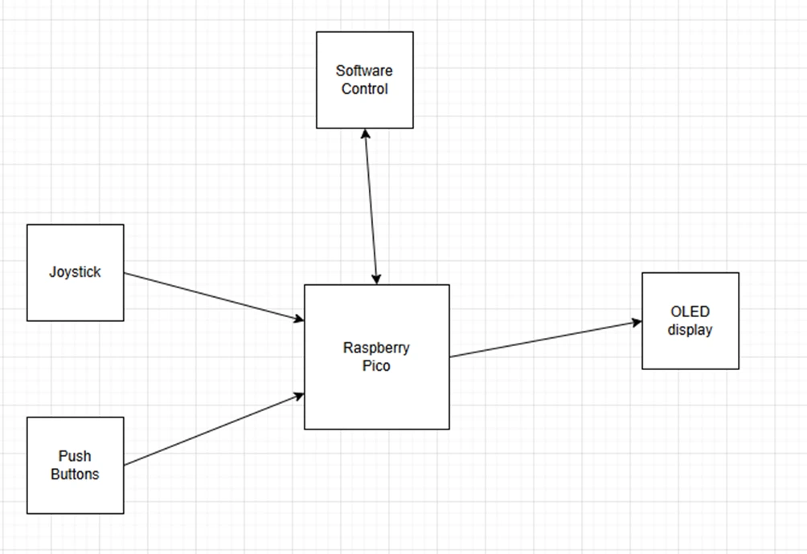

# Chicken Invanders Game

This project represents the Chicken invaders game on a microcontroller.

:::info

**Author:** Fülöp Adelin-Andrei \
**GitHub Project Link:** https://github.com/UPB-PMRust-Students/proiect-Borromeu

:::
## Description

Chicken Invaders is a series of shoot 'em up video games created by Greek indie developer Konstantinos Prouskas. With the release of the first game Chicken Invaders in 1999, the games are one of the longest running series of video games developed in Greece. All six main entries in the series have been developed by Prouskas' InterAction studios, and have been released for Microsoft Windows, OS X, Linux, iOS, Windows Phone, and Android platforms.

The main theme of the games is a battle between a lone combat spacecraft and a technologically advanced race of space-faring chickens, who are intent on subjugating (and later destroying) Earth. The games make heavy use of humor, especially in the form of parodies of Galaxian, Star Wars, Space Invaders and Star Trek.

The main idea of this project is to replicate this OG game on a microcontroller.

## Motivation
I chosen this game to replicate using rust and a microcontroller because I loved this game in my childhood, I find this game exciting and I think can have fun while I'm developing this project with this game.

## Arhitecture

In the diagram below is presented how the components are connected in high level language

## Log
Week 31 March - 4 April: 
-> choose the project idea, hardware components and potential rust libraries to be used
Week 28 April - 2 May:
-> populate documentation page, create repositories on both GitHub and GitLab
TODO - next steps: hardware milestone, software milestone, PM Fair

## Hardware
As hardware components, I chosed the best quality per price components, keeping simple and concise project. I selected a rapsberry pi pico, a joystick, an oled display, a breadboard and wires for connectivity between components.

## Schematics
TODO

## Bill of Materials(not final yet)
| Component | Usage | Price (RON) |
|-----------|---------|-------------|
| Raspberry Pi Pico H | Microcontroller | 39.66 |
| JoyStick Shield V1.A | Input/Controller | 19.99 |
| OLED display | Visual Output | 23.79 |
| 400p BreadBoard | Platform | 4.56 |
| Wires | Wire Connection | 7.99 |
| **Total** | - | **95.99** |

## Software 
As software used, embassy-rs, embedded-graphics, the 1, 2, 3 labs from PM course.

## Links
1. https://github.com/embassy-rs/embassy
2. https://github.com/embedded-graphics/embedded-graphics
3. https://pmrust.pages.upb.ro/docs/acs_cc/lab/03
4. https://pmrust.pages.upb.ro/docs/acs_cc/lab/01
5. https://pmrust.pages.upb.ro/docs/acs_cc/lab/02
