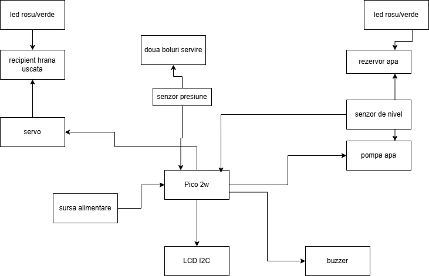

# Automatic feeder for animals
An automatic pet feeder that, at fixed times, dispenses a specific amount of food until the bowls.
:::info 

**Author**: Lazar Alessia-Alessandra \
**GitHub Project Link**: https://github.com/UPB-PMRust-Students/proiect-lalessiaa

:::

## Description

The project involves an automatic pet feeder.
At fixed times (9:00 AM, 12:00 PM, and 7:00 PM), it will refill the food bowls, but not with a fixed amount each time. A sensor will calculate how much the pet has eaten from the bowl and will dispense the remaining amount needed to fill it. The same process applies to kibble and water.
Each week, the feeder will provide specific statistics regarding the quantities consumed by the pet.

To alert the owner when the containers need to be refilled, there will be two LEDs: green means there is enough food in the containers, red indicates they need to be refilled.
There will also be a buzzer that emits three signals at mealtime to notify the pet that the bowls have been refilled.

## Motivation

I chose this project because of my love for animals and the desire to simplify the feeding process on busy days. If the owner has a full day or is away from home all day, the pet will still have enough food, in moderate amounts throughout the day. This way, the feeding process becomes automated and easier to manage in everyday life.

## Architecture 



## Log

<!-- write your progress here every week -->

### Week 5 - 11 May

### Week 12 - 18 May

### Week 19 - 25 May

## Hardware

Pico 2W – control board for the feeder

Servo motor – operates the flap for dispensing kibble

Water pump – fills the water container

Level sensor – measures the water level in the container

Pressure sensor – measures the total weight of dry food

Instrumentation module HX711 – converts the pressure sensor data to control the motor

Buzzer – audio signal

LEDs – reservoir level indicators

### Schematics

Place your KiCAD schematics here.

### Bill of Materials

<!-- Fill out this table with all the hardware components that you might need.

The format is 
```
| [Device](link://to/device) | This is used ... | [price](link://to/store) |

```

-->

| Device | Usage | Price |
|--------|--------|-------|
| [Raspberry Pi Pico 2W](https://www.optimusdigital.ro/ro/placi-raspberry-pi/13327-raspberry-pi-pico-2-w.html) | The microcontroller |39.66 RON|
| [Modul de Instrumentatie HX711](https://www.optimusdigital.ro/ro/senzori-altele/130-modul-de-intrumentatie-hx711.html) | Data convertor |5.99 RON|
| [Servo](https://www.optimusdigital.ro/ro/motoare-servomotoare/271-servomotor-mg90s.html) | Operates the flap |19.33 RON|
| [Mini water pump](https://www.optimusdigital.ro/ro/altele/8141-mini-pompa-de-apa-12-v.html) | Fills the water container |15.99 RON|
| [Pressure sensor](https://www.optimusdigital.ro/ro/senzori-altele/816-traductor-de-apasare-de-50-kg.html) | Data measurement |29.59 RON|


## Software

| Library       | Description                 | Usage                                                                 |
|---------------|-----------------------------|------------------------------------------------------------------------|
| hx711         | HX711 Load Cell Amplifier   | Used for reading weight data from the pressure sensor (load cell).    |
| stepper       | Stepper motor driver        | Controls the stepper motor to dispense food accurately.               |
| lcd-i2c       | I2C LCD display             | Displays real-time data such as time, weight, and alerts.             |
| rtc-pcf8523   | Real-Time Clock (RTC)       | Keeps track of time for scheduled feeding.                            |
| pico-sdk      | Raspberry Pi Pico SDK       | Low-level support for the Pico 2W microcontroller.                    |
| embedded-hal  | Embedded Hardware Abstraction Layer | Provides traits for abstracting embedded hardware peripherals. |


## Links

<!-- Add a few links that inspired you and that you think you will use for your project -->

1. [Pet feeders and water dispensers](https://www.designswan.com/archives/tech-savvy-pet-care-a-deep-dive-into-8-intelligent-pet-feeders-and-water-dispensers.html)
2. [Pet feeder arduino](https://www.youtube.com/shorts/OVoXJtKARpU)

