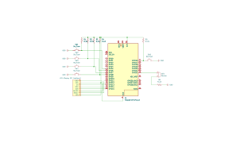

# 2048 game
Implementation of the famous game 2048.

:::info 

**Author**: Diaconu Alexandra-Ioana \
**GitHub Project Link**: [https://github.com/UPB-PMRust-Students/proiect-AlexDia10](https://github.com/UPB-PMRust-Students/proiect-AlexDia10)

:::

## Description

The project consists of an implementation of the famous game 2048. The goal of the game is to reach the value 2048 by combining powers of 2 on a 4x4 board (classic mode). The player combines numbered tiles by moving up, down, left and right, using physical buttons. The game runs on a Raspberry Pi Pico 2 and is displayed on a color LCD.

+ The system utilizes five buttons for the gameplay: up, down, left, right and reset.

+ The LCD screen showcases the grid and the numbered tiles.

+ A buzzer that makes a sound when a milestone is reached.

## Motivation

As a kid, I loved playing simple, clever games like 2048, fascinated by how such a basic concept could be so addictive and satisfying. That experience stuck with me and inspired this project: **building my own version of 2048 from scratch.**

While planning the system — from managing inputs to handling graphics and game logic — I realized it’s more than just code. It’s also about creating a smooth, engaging experience, which taps into my love for design and user interaction.

## Architecture 
The **Raspberry Pi Pico 2W** serves as the central control unit, directing and managing all other components utilized within the project.

The **LCD** serves as an interface for showcasing the grid and numbered tiles, it is connected to the Pico through SPI

The **buttons** act as the primary input method, they are connected directly to the Pico's GPIO pins

The **buzzer** emits sound cues for actions and is connected to a GPIO pin

## Log

<!-- write every week your progress here -->

### Week  -  May

### Week  -  May

### Week  -  May
 

## Hardware

1. **Raspberry Pi Pico 2W**:
- **Purpose**: Controls all components.
- **Function**: Acts as the main controller, coordinating the operations of buttons, buzzer, and the LCD display.

2. **LCD Display**:
- **Purpose**: Displays the grid and numbered tiles of the 2048 game.
- **Function**: Provides a visual interface for the user, updating the display dynamically as the user moves the tiles and merges them.

3. **Buttons**:
- **Purpose**: Serve as the user input method for controlling the game.
- **Function**: Allow the player to move tiles in four directions (Up, Down, Left, Right) and reset the game.

4. **Buzzer**:
- **Purpose**: Provide auditory feedback during gameplay.
- **Function**: Emits sound cues for actions such as tile merges, successful moves, or game over.

### Schematics

### Bill of Materials

| Device | Usage | Price |
|--------|--------|-------|
| [Raspberry Pi Pico 2W](https://datasheets.raspberrypi.com/picow/pico-2-w-datasheet.pdf) | The microcontroller | [39,66 RON](https://www.optimusdigital.ro/en/raspberry-pi-boards/13327-raspberry-pi-pico-2-w.html) |
| [LCD Display](http://www.lcdwiki.com/res/MSP1443/1.44inch_SPI_Module_MSP1443_User_Manual_EN.pdf) | LCD Display | [27,99 RON](https://www.optimusdigital.ro/en/lcds/870-144-lcd-module-128x128-px-red.html) |
| Buttons | Push Buttons| [5 x 0,36 RON](https://www.optimusdigital.ro/en/buttons-and-switches/1119-6x6x6-push-button.html) |
| Buzzer | Active Buzzer | [0,99 RON](https://www.optimusdigital.ro/en/buzzers/635-3v-active-buzzer.html) |

## Software

| Library | Description | Usage |
|---------|-------------|-------|
| [embassy-rp](https://github.com/embassy-rs/embassy/tree/main/embassy-rp) | RP2040 Peripherals | Used for accessing the peripherals |
| [cortex-m-rt](https://github.com/rust-embedded/cortex-m-rt) | Runtime support for Cortex-M devices | Initializes the microcontroller and defines the entry point |
| [rp2040-hal](https://github.com/rp-rs/rp-hal) | Hardware Abstraction Layer for RP2040 | Enables low-level control over GPIO, SPI, PWM, etc. |
| [embedded-hal](https://github.com/rust-embedded/embedded-hal) | Hardware abstraction traits for embedded devices | Provides standard interfaces for hardware components like digital input/output |
| [embedded-input](https://github.com/almindor/embedded-input) | Input abstraction for embedded devices | Simplifies button handling and debounce logic |
| [st7735-lcd](https://github.com/almindor/st7735-lcd) | Driver for ST7735 displays over SPI | Sends display commands and data to the LCD |
| [embedded-graphics](https://github.com/embedded-graphics/embedded-graphics) | 2D graphics library for embedded devices | Renders text, shapes, and tiles on the LCD screen |

## Links

<!-- Add a few links that inspired you and that you think you will use for your project -->