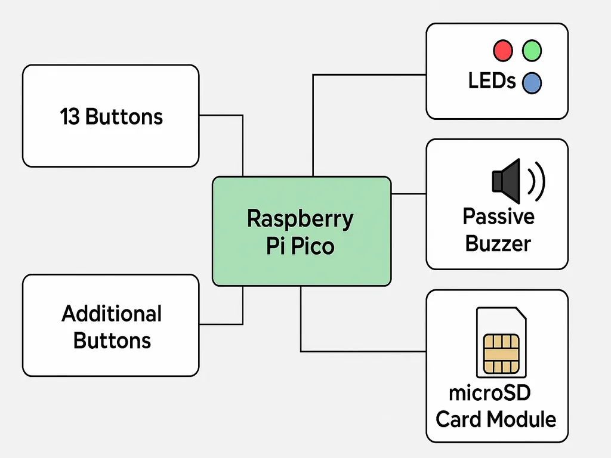
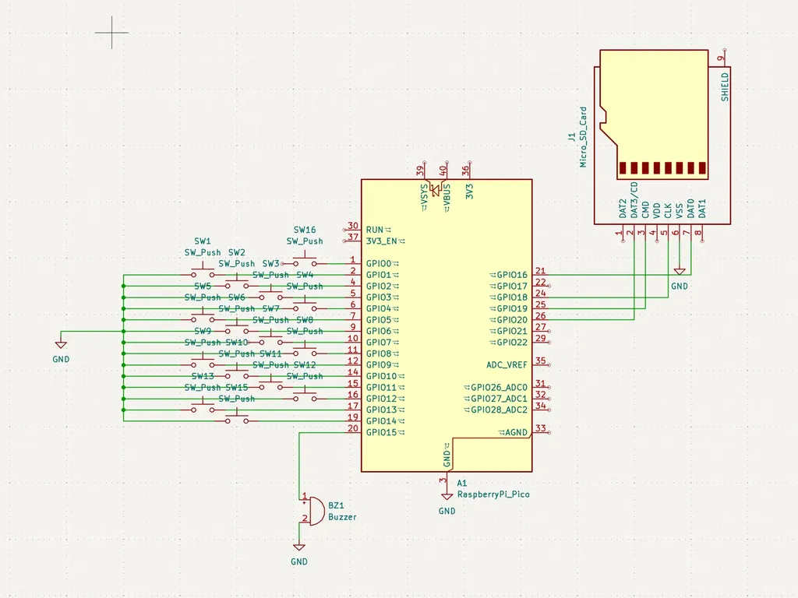

# Electronic Mini Piano
An electronic mini piano with multiple functions like recording and playback.

:::info 

**Author**: Buiac Alexandru-Mihai \
**GitHub Project Link**: https://github.com/UPB-PMRust-Students/proiect-alexbuiac

:::

## Description

This project is a compact electronic piano powered by a Raspberry Pi Pico W (RP2040 microcontroller), featuring 13 tactile  buttons mapped to the notes of a full octave, including sharps and flats. It generates sound through a passive buzzer using PWM, enabling accurate tone synthesis. Additional features include real-time playback, melody recording, and playback of stored sequences. Recordings are saved in the Pico’s internal flash memory, allowing persistent storage between sessions. The project combines digital audio, user input handling, and embedded programming, making it an excellent introduction to interactive electronics with the RP2040 platform.

## Motivation

Ever since I was a child, I’ve had a deep passion for music—spending hours exploring melodies and trying to replicate songs by ear. This ongoing love for music, combined with my interest in electronics and programming, inspired me to create a mini electronic piano. It’s a way to merge creativity with technical skills, allowing me to build a device that not only plays music but also helps understand how digital instruments work behind the scenes.

## Architecture 

<!-- Add here the schematics with the architecture of your project. Make sure to include:
 - what are the main components (architecture components, not hardware components)
 - how they connect with each other -->

### Mini Electronic Piano – System Architecture

- **Microcontroller: Raspberry Pi Pico 2**
  - Handles input, sound generation, playback, and file management.
  - Generates sound using PWM to drive a passive buzzer or speaker.

- **Input Interface**
  - **13 Note Buttons**: Each button corresponds to a musical note (C to C, including sharps/flats).
  - **Function Buttons**: Additional buttons for:
    - Recording start/stop
    - Playback of saved melodies
    - Mode selection (e.g., live/playback)

- **Audio Output**
  - **Passive Buzzer** connected to a PWM-capable GPIO pin for tone generation.

- **Storage**
  - **microSD Card Module** via SPI interface:
    - Stores recorded sequences as files.
    - Allows persistent saving and loading of melodies.

- **User Feedback**
  - **LED Indicators**:
    - Show current mode (recording, playback, standby).
    - Optionally flash in sync with played notes.

> This modular and expandable design allows for future features such as tempo adjustment, multi-track recording, or even a small display.



## Log

<!-- write your progress here every week -->

### Week 5 - 11 May

### Week 12 - 18 May

### Week 19 - 25 May

## Hardware

### 1. **Raspberry Pi Pico 2**
- **Role:** Main microcontroller unit (MCU)
- **Specs:**
  - Dual-core ARM Cortex-M0+ processor @133MHz
  - 264KB SRAM and 2MB onboard flash
  - Built-in Wi-Fi (not essential for this project, but useful for future upgrades)
- **Used for:**
  - Reading button inputs
  - Generating sound via PWM
  - Controlling LEDs
  - Communicating with the SD card module over SPI

### 2. **13 Tactile Push Buttons (for Notes)**
- **Role:** Input for playing individual musical notes (C to C, including sharps/flats)
- **Features:** Debounced in software; each connected to a GPIO pin with a pull-down resistor or using internal pull-downs.

### 3. **3–5 Additional Push Buttons (for Functional Controls)**
- **Purpose:**
  - Start/Stop Recording
  - Playback
  - Mode Switching (e.g., live mode vs. playback mode)

### 4. **Passive Buzzer**
- **Role:** Sound output
- **Type:** Passive (requires frequency signal to produce tones)
- **Connection:** Controlled using a PWM output pin from the Pico to vary frequency and duration.

### 5. **LED Indicators (2–3 Units)**
- **Role:** Visual feedback
  - Red: Recording Mode
  - Green: Playback Mode
  - Blue: Idle/Ready
- **Connection:** GPIO output pins with appropriate current-limiting resistors (220–330Ω).

### 6. **microSD Card Module (SPI)**
- **Role:** Storage for recorded note sequences
- **Interface:** SPI (uses 4 GPIOs: MISO, MOSI, SCK, CS)
- **File System:** Typically FAT32, interfaced via a microcontroller-compatible library (e.g., FatFs or Arduino SD library ported for Pico).

### 7. **Power Supply**
- **Options:**
  - USB power via Pico’s micro-USB port
  - External 5V supply with voltage regulation if powering from a battery
- **Note:** Ensure SD card and buzzer don’t exceed the Pico's current limits.

### 8. **Resistors & Wiring**
- **Pull-down resistors** for buttons (if not using internal)
- **Current-limiting resistors** for LEDs
- **Breadboard or custom PCB** for mounting and connections


### Schematics

<!-- Place your KiCAD schematics here. -->



### Bill of Materials

<!-- Fill out this table with all the hardware components that you might need.

The format is 
```
| [Device](link://to/device) | This is used ... | [price](link://to/store) |

```

-->

| Device | Usage | Price |
|--------|--------|-------|
| [Raspberry Pi Pico 2](https://datasheets.raspberrypi.com/rp2350/rp2350-datasheet.pdf) | This is used as the main microcontroller to read inputs, generate sound, and handle file operations. | [39.66](https://www.optimusdigital.ro/ro/placi-raspberry-pi/13327-raspberry-pi-pico-2-w.html) |
| [2nd Raspberry Pi Pico 2](https://datasheets.raspberrypi.com/rp2350/rp2350-datasheet.pdf) | This is used as a debugger | [39.66](https://www.optimusdigital.ro/ro/placi-raspberry-pi/13327-raspberry-pi-pico-2-w.html) |
| [Tactile Push Buttons (x16)](https://www.optimusdigital.ro/en/buttons-and-switches/1115-white-button-with-round-cover.html?search_query=buttons&results=259) | 13 used as note inputs, 3 for additional functions like record/play/mode. | [32](https://www.optimusdigital.ro/en/buttons-and-switches/1115-white-button-with-round-cover.html?search_query=buttons&results=259) |
| [Passive Buzzer](https://www.electronicoscaldas.com/datasheet/LTE12-Series.pdf?srsltid=AfmBOooG0A2FCw89LVTTiD8VIMPc17M7wxEYLcxzhqs1wGnLAJCQx2__) | Used to generate sound based on PWM signal from the Pico. | [5](https://www.optimusdigital.ro/en/buzzers/634-5v-passive-buzzer.html) |
| [microSD Card Module (SPI)](https://www.optimusdigital.ro/ro/memorii/1516-modul-slot-card-microsd.html?search_query=card+SD&results=191) | For storing recorded melodies and reading them back. | [4.39](https://www.optimusdigital.ro/ro/memorii/1516-modul-slot-card-microsd.html?search_query=card+SD&results=191) |
| [LEDs (x3)](https://www.bitmi.ro/module-electronice/modul-led-rgb-3-culori-10401.html) | Indicate recording, playback, and idle status. | [6](https://www.bitmi.ro/module-electronice/modul-led-rgb-3-culori-10401.html) |
| [Breadboard or Custom PCB](https://www.optimusdigital.ro/ro/kituri/2222-kit-breadboard-hq-830-p.html) | Mounting and prototyping platform. | [22](https://www.optimusdigital.ro/ro/kituri/2222-kit-breadboard-hq-830-p.html) |


## Software

| Library | Description | Usage |
|-----------------------------|-------------|--------|
| [embassy](https://crates.io/crates/embassy) | Core async runtime and framework for embedded Rust | Provides async executor, timers, and task management |
| [embassy-rp](https://crates.io/crates/embassy-rp) | Embassy HAL and drivers for Raspberry Pi Pico (RP2040) | Async GPIO, PWM (for buzzer), SPI (for SD card), and more |
| [embassy-time](https://crates.io/crates/embassy-time) | Timer abstractions and async delays | Used for debouncing, note timing, blinking LEDs |
| [embassy-sync](https://crates.io/crates/embassy-sync) | Async mutexes, channels, signals, etc. | Used to coordinate tasks (e.g. recording and playback) |
| [embedded-sdmmc](https://crates.io/crates/embedded-sdmmc) | Filesystem access to SD cards (FAT32 over SPI) | Read/write melody recordings on microSD via SPI |
| [heapless](https://crates.io/crates/heapless) | Fixed-size data structures for `no_std` | Store note sequences in memory safely without heap |
| [defmt](https://crates.io/crates/defmt) | Efficient logging crate for embedded Rust | Debugging with RTT/log output without large binary size |
| [cortex-m](https://crates.io/crates/cortex-m) | Low-level ARM Cortex-M utilities | Required for low-level control and interrupts |
| [cortex-m-rt](https://crates.io/crates/cortex-m-rt) | Runtime support for ARM Cortex-M | Provides entry point and interrupt table setup |


## Links

<!-- Add a few links that inspired you and that you think you will use for your project -->

1. [link](https://example.com)
2. [link](https://example3.com)
...
