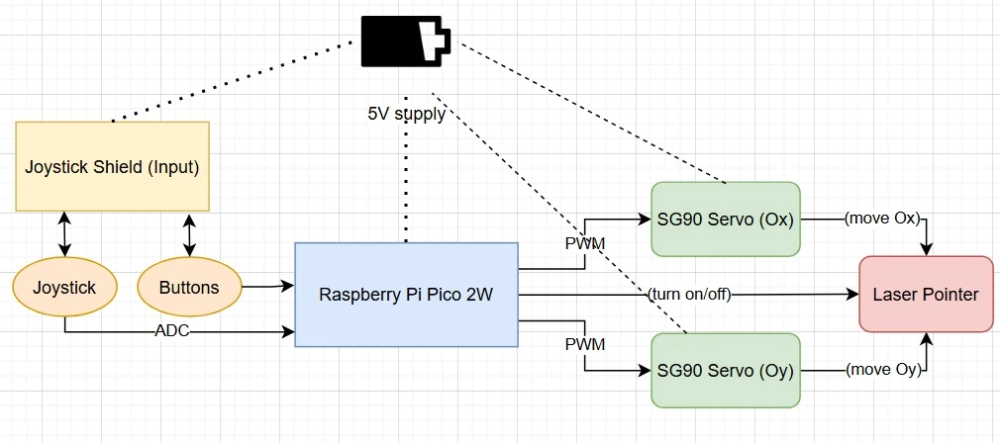
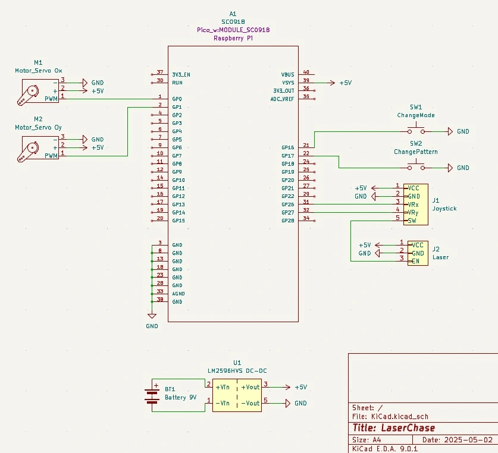

# LaserChase
A smart cat laser toy with manual or automatic movement patterns.

:::info 

**Author**: Ghiță Alexandru \
**GitHub Project Link**: [GitHub](https://github.com/UPB-PMRust-Students/proiect-Ghitzarino)

:::

## Description

LaserChase is a smart, interactive laser toy for cats, powered by a Raspberry Pi Pico 2W. The laser is mounted on two servo motors that allow it to move across two axes, with the capability to be turned on and off by pressing the joystick. It can operate in automatic mode - following random or pre-programmed motion patterns - or in manual mode, controlled by the joystick. Mode and pattern switching is done via button presses, making the experience more dynamic and engaging. The goal is to mimic the unpredictable movement of real prey, keeping your cat entertained and active.

## Motivation

I wanted to create something practical and enjoyable for use at home. As a cat owner, I thought this project would be a perfect blend of utility and fun-bringing joy to my pet while allowing me to experiment with hardware and software in an engaging way. Building LaserChase has given me the opportunity to explore electronics, real-time control, and embedded programming, all while making my cat happy.

## Architecture



The main software components of the project include:
- **Control Module**: Handles manual input from a joystick and button presses to switch modes and patterns.
- **Mode Manager**: Keeps track of the current operating mode and interprets input accordingly.
- **Movement Generator**: Generates movement signals, either random/predetermined (automatic mode) or from joystick (manual mode).
- **Servo Driver**: Sends PWM signals to the two servo motors to move the laser pointer.
- **Laser Pointer Control**: Interfaces with hardware to manage the laser's power state (ON/OFF).

These components interact as follows:

- Input (buttons/joystick) -> Control Module -> Mode Manager -> Movement Generator -> Servo Driver -> Laser

## Log

<!-- write your progress here every week -->

### Week 5 - 11 May
TODO

### Week 12 - 18 May
TODO

### Week 19 - 25 May
TODO

## Hardware

- **Raspberry Pi Pico 2W**: LaserChase uses a Raspberry Pi Pico 2W as the main controller.
- **SG90 Servo (x2) + Laser Pointer**: Two SG90 servos are used to move the laser pointer on two axes.
- **Joystick Shield**: Control is done via a joystick shield and mode switching through push buttons.
- **9V Battery + Holder + DC-DC Step Down Module**: Power is supplied through a 9V battery regulated by a step-down module.
- **Breadboard + Wires**: Components are connected using wires and a breadboard.

### Schematics

Here is presented the KiCad schematic:


### Bill of Materials

<!-- Fill out this table with all the hardware components that you might need.

The format is 
```
| [Device](link://to/device) | This is used ... | [price](link://to/store) |

```

-->

| Device | Usage | Price |
|--------|--------|-------|
| [Raspberry Pi Pico 2W](https://www.raspberrypi.com/documentation/microcontrollers/raspberry-pi-pico.html) | Main microcontroller | [40 RON](https://www.optimusdigital.ro/en/raspberry-pi-boards/13327-raspberry-pi-pico-2-w.html) |
| [2x SG90 Servo Motors](https://docs.m5stack.com/en/accessory/sg90_servo?ref=langship) | Control the X/Y angle of the laser | [24 RON](https://www.optimusdigital.ro/en/servomotors/2261-micro-servo-motor-sg90-180.html) |
| [Joystick Shield V1.A](https://handsontec.com/dataspecs/module/Arduino%20Shield/Joystick%20Shield.pdf) | Manual control of laser | [20 RON](https://www.optimusdigital.ro/en/arduino-shields/1283-shield-joystick-pentru-arduino.html) |
| [DC-DC Step Down Module](https://www.st.com/en/power-management/dc-dc-converter-modules/documentation.html) | Voltage regulation to 5V | [13 RON](https://www.optimusdigital.ro/en/adjustable-step-down-power-supplies/1108-lm2596hv-dc-dc-step-down-module.html) |
| 9V Battery + Holder | Power source | [10.3 RON](https://www.optimusdigital.ro/en/battery-holders/20-9v-battery-support.html) |
| Wires | Connections between components | [8 RON](https://www.optimusdigital.ro/en/wires-with-connectors/890-set-fire-tata-tata-40p-30-cm.html) |
| Breadboard | Circuit prototyping | [4.5 RON](https://www.optimusdigital.ro/en/breadboards/44-400p-hq-breadboard.html) |
| Micro USB Cable | Power and programming cable | [4 RON](https://www.optimusdigital.ro/en/usb-cables/11939-micro-usb-black-cable-1-m.html) |
| Laser Pointer | Red colored laser | [2.6 RON](https://www.emag.ro/jucarie-laser-pentru-pisici-rosu-las02/pd/D6MMH5MBM/?ref=graph_profiled_similar_fallback_1_3&provider=rec&recid=rec_49_02188673a55cfa40086dd06e58c266684d055622826af4a5d7d376fa854708ce_1745921180&scenario_ID=49) |
| Header Pins | Connection to breadboard | [2 RON](https://www.optimusdigital.ro/en/pin-headers/85-40p-254-mm-pin-header-200-pcs.html) |


## Software

| Library | Description | Usage |
|---------|-------------|-------|
| [embassy](https://github.com/embassy-rs/embassy) | Embassy | An asynchronous executor and Hardware Abstraction Layer (HAL) designed for constructing embedded applications in Rust |
| [embassy-executor](https://docs.embassy.dev/embassy-executor/git/std/index.html)|Embassy Executor | Used for task scheduling and asynchronous programming |
|[embassy-rp](https://docs.embassy.dev/embassy-rp/git/rp2040/index.html)| Embassy RP | Used for initializing and interacting with peripherals |
|[gpio](https://docs.embassy.dev/embassy-stm32/git/stm32c011d6/gpio/index.html)| GPIO | Used for interacting with GPIO pins |
| [rand](https://docs.rs/rand/latest/rand/) | Random number generation | For automatic/random movement logic |

## Links

<!-- Add a few links that inspired you and that you think you will use for your project -->

1. [Similar project](https://learn.adafruit.com/raspberry-pi-wifi-controlled-cat-laser-toy/overview)
2. [Controlling SG90 with PWM in Rust](https://blog.theembeddedrustacean.com/esp32-standard-library-embedded-rust-pwm-servo-motor-sweep)
3. [SG90 2-axis 3D print design](https://www.thingiverse.com/thing:2892903)
