# PiBuzz
A multifunctional device which serves as a custom alarm clock, equipped with environmental sensors.

:::info 

**Author**: Samson Alexandru-Valentin \
**GitHub Project Link**: https://github.com/UPB-PMRust-Students/proiect-sammsonn

:::

## Description

A device that has the main functionality of a digital clock displayed on a screen with an alarm function, operated by physical buttons. The alarm has a snooze option and would sing a song loaded from an external audio file. The product is also equipped with a pressure and temperature sensor to observe the environmental conditions surrounding it. Aditionally, a light sensor is used in order to automatically adjust the brightness of the display.

## Motivation

This project is inspired by a real world problem of mine, and it probably affects a lot of the current population, especially teenagers and young adults. When going to bed, I always take my phone with me and end up scrolling mindlessly for 1-2 hours. This has a very negative impact on my sleep, which is way more important than most think. But the main reason why I have my phone next to me in bed is because I use it as an alarm in order to wake up. This is also bad because the phone can overheat under the pillow, causing potential damage, and there is also the concern of EMF radiation exposure when keeping your cell phone close to the head for extended periods of time. So, building this clock by hand I can get rid of all these problems, removing the need of my smartphone at night.

## Architecture 



## Log

<!-- write your progress here every week -->

### Week 5 - 11 May

TODO

### Week 12 - 18 May

TODO

### Week 19 - 25 May

TODO

## Hardware

The main hardware is the Raspberry Pi Pico 2W microcontroller, which provides processing and Wi-Fi connectivity. A DS3231 RTC module is used for precise timekeeping. Environmental sensors include a BMP280 (temperature, pressure) and a BH1750 (ambient light, for automatic display adjustment). The user interface consists of an ILI9341 (2.4 inch) color LCD for display and touch buttons for control. The audio alarm is handled by a DFPlayer Mini module that plays MP3 files from an SD card, with the sound being output through a speaker. The components are interconnected on a breadboard using jumper wires and well powered.

### Schematics

TODO: KiCad schematics.

### Bill of Materials

<!-- Fill out this table with all the hardware components that you might need.

The format is 
```
| [Device](link://to/device) | This is used ... | [price](link://to/store) |

```

-->

| Device | Usage | Price |
|--------|--------|-------|
| [Raspberry Pi Pico 2W](https://www.raspberrypi.com/documentation/microcontrollers/raspberry-pi-pico.html) | The microcontroller | [40 RON x 2](https://www.optimusdigital.ro/en/raspberry-pi-boards/13327-raspberry-pi-pico-2-w.html) |
| [DS3231](https://www.analog.com/media/en/technical-documentation/data-sheets/ds3231.pdf) | RTC module | [19 RON](https://www.optimusdigital.ro/ro/altele/1102-modul-cu-ceas-in-timp-real-ds3231.html?search_query=ds3231&results=6) |
| [BMP280](https://www.bosch-sensortec.com/products/environmental-sensors/pressure-sensors/bmp280/) | Pressure and temperature sensor | [8.5 RON](https://www.optimusdigital.ro/en/pressure-sensors/1666-modul-senzor-de-presiune-barometric-bmp280.html) |
| [BH1750](https://cdn-learn.adafruit.com/downloads/pdf/adafruit-bh1750-ambient-light-sensor.pdf) | Light intensity sensor | [10.4 RON](https://sigmanortec.ro/Senzor-intensitate-lumina-GY-302-BH1750-p137584524) |
| [DFPlayer Mini](https://picaxe.com/docs/spe033.pdf) | MP3 module | [14 RON](https://www.optimusdigital.ro/en/audio/1484-dfplayer-mini-miniature-mp3-player-module.html) |
| 40mm Speaker | 8 ohms 0.5W speaker | [2.75 RON](https://sigmanortec.ro/Boxa-ultra-subtire-40mm-8-ohms-0-5W-p136285784) |
| Button | 12x12x7.3 button | [1.31 RON x 4](https://sigmanortec.ro/Buton-12x12x7-3-p160373654) |
| Button Cap | 12x12x7.3 button cap, multiple colors | [0.4 RON x 4](https://sigmanortec.ro/capac-buton-12x12x73-albastru) |
| Breadboard HQ | Breadboard with 830 slots | [10 RON](https://www.optimusdigital.ro/en/breadboards/8-breadboard-hq-830-points.html) |
| Electrolitic Condenser | 47 uF, 50 V condenser | [0.5 RON](https://www.optimusdigital.ro/ro/componente-electronice-condensatoare/7707-condensator-electrolitic-47-uf-50-v.html?search_query=condensator+47&results=160) |
| Pin Header | 2.54mm (40p) pin header | [1 RON](https://www.optimusdigital.ro/ro/componente-electronice-headere-de-pini/463-header-de-pini-alb-254-mm-40p.html?search_query=header+de+pini+40&results=313) |
| Male-Male Wire Set | 10p, 10cm male-male wires | [2.85 RON](https://www.optimusdigital.ro/ro/fire-fire-mufate/885-set-fire-tata-tata-10p-10-cm.html?search_query=fire+tata-tata&results=73) |
| Female-Male Wire Set | 40p, 10cm female-male wires | [6 RON](https://www.optimusdigital.ro/ro/fire-fire-mufate/653-fire-colorate-mama-tata-40p-10-cm.html?search_query=fire+mama-tata&results=35) |
| Female-Male Wire Set | 40p, 15cm female-male wires | [8 RON](https://www.optimusdigital.ro/ro/toate-produsele/877-set-fire-mama-tata-40p-15-cm.html?search_query=fire+mama-tata&results=35) |


## Software

| Library | Description | Usage |
|---------|-------------|-------|
| [rp-pico-hal](https://crates.io/crates/rp-pico-hal) / [embassy-rp](https://crates.io/crates/embassy-rp) | Hardware Abstraction Layer (HAL) for RP2040 microcontroller.         | Provides fundamental access to peripherals: GPIO, I2C, SPI, UART, PWM, Timers etc. |
| [embassy-executor](https://crates.io/crates/embassy-executor) | Asynchronous runtime executor for embassy.                           | Managing concurrent tasks (e.g., reading sensors, updating display). |
| [panic-probe](https://crates.io/crates/panic-probe) / [panic-halt](https://crates.io/crates/panic-halt) | Panic handler implementation.                                          | Defines behavior on program panic.                      |
| [defmt](https://crates.io/crates/defmt) / [defmt-rtt](https://crates.io/crates/defmt-rtt) | Efficient logging framework for embedded systems.                    | Useful for debugging output over a debug probe.                                    |
| [ds3231](https://crates.io/crates/ds3231)         | Driver for DS3231 Real-Time Clock module.                              | Reading/setting current time and date via I2C.                                     |
| [bmp280](https://crates.io/crates/bmp280)         | Driver for BMP280 Pressure & Temperature sensor.                     | Reading temperature and pressure values via I2C.                                   |
| [bh1750](https://crates.io/crates/bh1750)         | Driver for BH1750 Ambient Light sensor.                              | Reading ambient light level (Lux) via I2C.                                         |
| [ili9341](https://crates.io/crates/ili9341)       | Display driver for ILI9341 LCD controller.                           | Sending commands and pixel data to the LCD display via SPI.                        |
| (HAL UART)                                         | UART communication capability provided by the HAL.                     | Sending serial commands to the DFPlayer Mini module. |
| (HAL GPIO)                                         | GPIO input capability provided by the HAL.                           | Reading the state of the physical buttons.                                         |
| (HAL PWM)                                          | PWM output capability provided by the HAL.                           | Controlling the brightness of the LCD backlight.                                   |                                                      |
| [embedded-graphics](https://crates.io/crates/embedded-graphics) | 2D graphics library for embedded displays.                             | Drawing shapes, text, and UI elements onto the ILI9341 display.                    |
| [embedded-graphics-text](https://crates.io/crates/embedded-graphics-text) | Text rendering capabilities and font data.                             | Displaying time, date, sensor data, and menu text.                               |
| [debouncr](https://crates.io/crates/debouncr) | Utility for debouncing digital inputs (buttons).                   | Preventing multiple triggers from a single button press.                           |
| [embedded-hal](https://crates.io/crates/embedded-hal) / [embedded-io](https://crates.io/crates/embedded-io) | Traits defining hardware abstraction interfaces.                     | Used by most drivers to ensure portability across different HALs.                  |
| [heapless](https://crates.io/crates/heapless)       | Static data structures without dynamic memory allocation.              | Useful for buffers, queues, etc., in no_std environments.                      |

## Links

<!-- Add a few links that inspired you and that you think you will use for your project -->

1. [Raspberry Pi Pico - Alarm Clock Project](https://www.youtube.com/watch?v=EOMcPAKL6RM)
2. [pico-alarm-clock](https://github.com/wahlencraft/pico-alarm-clock)
3. [Raspberry Pi Pico - Alarm Clock](https://www.instructables.com/Raspberry-Pi-Pico-Alarm-Clock/)
