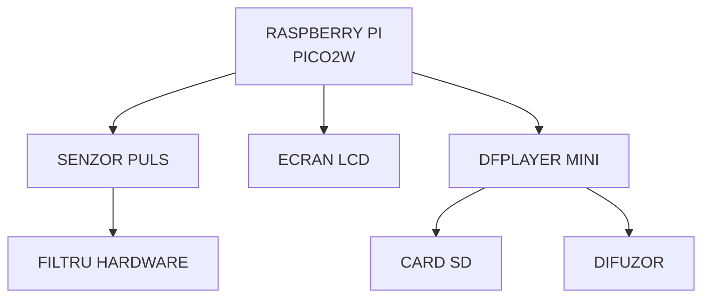

# PulseBeats  
A small device that reads your heart rate and plays matching sound feedback.

:::info

**Author**: Alexia-Andra Mihai \
**GitHub Project Link**: https://github.com/UPB-PMRust-Students/proiect-alexiamihai

:::

## Description  
PulseBeats is a portable embedded device built with a Raspberry Pi Pico W that monitors the user’s heart rate using the MAX30102 sensor. It provides real-time visual and audio feedback through an LCD display and a passive speaker. The goal is to offer a simple way to reflect biometric signals in an engaging way.

## Motivation  
I enjoy working with sound and music, and I wanted to explore how it could be used in a meaningful, helpful way. This project gave me a chance to combine audio output with a real-life use case — monitoring your pulse — and make the data feel more alive through sound and display. It's both fun and potentially useful for relaxation or health awareness.

## Architecture  

Main components of the system:

- **Pulse Sensor (MAX30100)**  
  A digital pulse oximeter and heart-rate sensor that reads the user's heart rate using infrared light. It communicates with the controller via I2C.

- **Controller (Raspberry Pi Pico W)**  
  A low-cost microcontroller that manages the logic, processes sensor data, and controls both the audio and visual outputs.

- **Audio Output (Passive Speaker + Audio Filter)**  
  A small passive speaker driven through a basic audio filter and GPIO/DAC output. It plays rhythmic tones or feedback sounds based on heart rate.

- **Visual Output (LCD 1602 with I2C)**  
  A 16x2 character display with I2C interface, used to show the current BPM (beats per minute) or system messages.

- **DFPlayer Mini**  
  A compact MP3 player module that reads audio files from a microSD card. Controlled via UART, it allows playback of songs or audio messages, enabling richer sound feedback.

- **Optional UI (Buttons, Rotation Angle Sensor)**  
  - **Buttons** are used for starting/stopping measurement or sound.  
  - **Rotation Angle Sensor** (Potentiometer-based) provides analog input for adjusting volume.

- **Storage (MicroSD Card Module)**  
  A module for reading/writing data to a microSD card via SPI. Used for storing the music that will be played according to the user’s pulse.

## Log  

### Week 21 – 27 April

Ordered some of the required hardware components for the project, including the Raspberry Pi Pico W, LCD display, and audio modules. Also explored available alternatives for out-of-stock parts (the pulse sensor).

### Week 28 April – 4 May

Worked on the initial project documentation. Defined the main structure, described the motivation, outlined the architecture, and began listing the components and their roles.

### Week 5 – 11 May
   
### Week 12 – 18 May
   
### Week 19 – 25 May
   

## Hardware  

- **Raspberry Pi Pico W** – The main microcontroller that reads sensor data, controls output devices, and handles logic.
- **MAX30100 Pulse Sensor** – Detects heart rate using infrared light and communicates via I2C.
- **1602 LCD Display (I2C)** – Displays heart rate, system messages, or prompts in real time.
- **DFPlayer Mini** – MP3 audio playback module used to play sound files stored on a microSD card.
- **MicroSD Card Module** – Stores audio files or logs data; used with DFPlayer Mini.
- **Passive Speaker (0.5W)** – Plays simple tones or audio feedback through the DFPlayer or filtered signal.
- **Jumper wires, breadboard** – Used to connect all components for prototyping.
- **RC Filter (resistors + capacitor)** – Smooths the audio signal before sending it to the speaker.

## Schematics  

TBD

## Bill of Materials  

| Device | Usage | Price |
|--------|-------|-------|
| [Raspberry Pi Pico W](https://www.optimusdigital.ro/en/raspberry-pi-boards/12394-raspberry-pi-pico-w.html) | Microcontroller | [39,66 RON](https://www.optimusdigital.ro/en/raspberry-pi-boards/12394-raspberry-pi-pico-w.html) |
| [MAX30100](https://www.optimusdigital.ro/en/others/2166-green-max30100-heart-rate-sensor-module.html?search_query=max+30100&results=4) | Heart rate & SpO₂ sensor | [25 RON](https://www.optimusdigital.ro/en/others/2166-green-max30100-heart-rate-sensor-module.html?search_query=max+30100&results=4) |
| [LCD 1602 (I2C)](https://www.optimusdigital.ro/en/lcds/62-1602-lcd-with-i2c-interface-and-yellow-green-backlight.html) | Display | [15 RON](https://www.optimusdigital.ro/en/lcds/62-1602-lcd-with-i2c-interface-and-yellow-green-backlight.html) |
| [Miniature Speaker (0.5W)](https://www.optimusdigital.ro/en/speakers/120-miniature-speaker-05-w.html) | Sound feedback | [5 RON](https://www.optimusdigital.ro/en/speakers/120-miniature-speaker-05-w.html) |
| [MicroSD Card](https://www.optimusdigital.ro/en/memories/8678-original-microsd-card-16-gb-for-raspberry-pi-4-model-b-preinstalled-with-noobs-bulk.html?search_query=microsd&results=91) | Data storage | [40 RON](https://www.optimusdigital.ro/en/memories/8678-original-microsd-card-16-gb-for-raspberry-pi-4-model-b-preinstalled-with-noobs-bulk.html?search_query=microsd&results=91) |
| [Breadboard](https://www.optimusdigital.ro/en/breadboards/13245-breadboard-750-points.html?search_query=breadboard&results=362) | Prototyping | [12 RON](https://www.optimusdigital.ro/en/breadboards/13245-breadboard-750-points.html?search_query=breadboard&results=362) |
| [DFPlayer Mini](https://www.optimusdigital.ro/en/audio/1484-dfplayer-mini-miniature-mp3-player-module.html) | MP3 Player | [14 RON](https://www.optimusdigital.ro/en/audio/1484-dfplayer-mini-miniature-mp3-player-module.html) |
| [Keyes 300 Rotation Angle Sensor](https://www.pfdeal.com/products/keyes-300-degree-rotation-angle-sensor-for-arduino-red) | Potentiometer | [12 RON](https://www.pfdeal.com/products/keyes-300-degree-rotation-angle-sensor-for-arduino-red) |
| [RC Filter Components](https://www.optimusdigital.ro/en/capacitors/3004-electrolytic-condensator-from-1000-uf-to-35-v.html?search_query=condensator&results=8) | Smooth PWM audio | [5 RON](https://www.optimusdigital.ro/en/capacitors/3004-electrolytic-condensator-from-1000-uf-to-35-v.html?search_query=condensator&results=8) |

---

## Software  

| Library | Description | Usage |
|---------|-------------|-------|
| [embassy-rs](https://github.com/embassy-rs/embassy) | Async multitasking framework for embedded systems | Used to manage asynchronous tasks |
| [embedded-hal](https://github.com/rust-embedded/embedded-hal) | Hardware abstraction layer for embedded systems | Used to interface with embedded peripherals generically |
| [max3010x](https://github.com/almindor/max3010x) | Driver for MAX30100/MAX30102 pulse oximeter sensors | Used to read heart rate and SpO₂ data |
| [dfplayer-rs](https://github.com/samcrow/dfplayer-rs) | Library for controlling the DFPlayer Mini MP3 module | Used for audio playback via serial communication |
| [hd44780-driver](https://github.com/eldruin/hd44780-driver) | LCD driver for HD44780-compatible displays over I2C | Used to show text on LCD1602 screens |

---

## Links  
TBD

