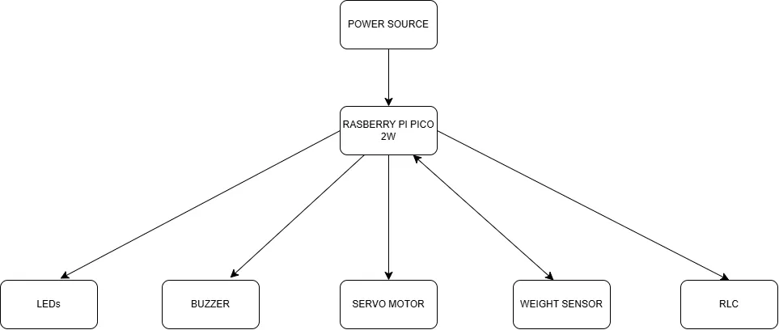

# Pet AutoFeeder

:::info 

*Author*: Alin-Ion Savu

*GitHub Project Link*: https://github.com/UPB-PMRust-Students/proiect-Savuuu11

:::

## Description

Pet AutoFeeder is an automated system designed to manage pet feeding in an efficient and intelligent manner. The project's goal is to continuously monitor the food level in both the bowl and the reservoir to ensure regular feeding without the need for frequent human intervention. When the weight sensor detects that the bowl is nearly empty, a red LED lights up, and a servo motor is activated to dispense food. Once the bowl is successfully refilled, a green LED indicates that the bowl is full.

The system also includes an alert mechanism for situations when the main reservoir runs out of food. In this case, a buzzer emits intermittent sound alerts until the user intervenes by pressing a button to stop the alert and then refills the reservoir.

To avoid excessive and too frequent feedings, the system integrates an RTC module. This module records the time of the last refill and enforces a time interval between feedings. As a result, the bowl will not be refilled again too soon, even if the weight falls below the minimum threshold—helping to prevent food waste and better adapt to the pet's natural consumption rhythm.

## Motivation

As a pet owner, I often faced the problem of ensuring my pets were fed while I was away. This project was born out of the need for a simple, reliable, and automated feeding system that lets owners travel or focus on daily tasks without worrying. It’s a small step toward making pet care smarter and more convenient.

## Architecture

The project has the following architecture:

*   **Raspberry Pi Pico 2W:** Acts as the central microcontroller, orchestrating the interactions between all other components. It processes sensor data, executes the feeding logic based on weight and time, and controls the output devices.
*   **POWER SOURCE:** Provides the necessary electrical power to operate the Raspberry Pi Pico 2W and the connected peripherals, ensuring stable operation.
*   **LEDs:** Connected to the Pico, LEDs serve as visual indicators for the system's status, such as signalling when the food bowl is low or when it has been successfully refilled.
*   **BUZZER:** Controlled by the Pico, the buzzer functions as an audible alarm, alerting the user when the main food reservoir is empty and requires refilling.
*   **SERVO MOTOR:** Controlled by the Pico, the servo motor acts as the mechanical actuator responsible for dispensing food from the reservoir into the pet's bowl when commanded by the control logic.
*   **WEIGHT SENSOR:** This sensor measures the amount of food currently in the pet's bowl. It sends this data to the Pico, which uses it to determine if a refill is necessary.
*   **RTC (Real-Time Clock):** Connected to the Pico, the RTC module maintains accurate timekeeping. This allows the system to log feeding times and enforce rules, such as minimum time intervals between feedings, contributing to a controlled feeding schedule.

## LOG

*   **Week 5 - 11 May**

*   **Week 12 - 18 May**

*   **Week 19 - 25 May**

## HARDWARE

The **Raspberry Pi Pico 2W** serves as the central controller for the Pet AutoFeeder, managing inputs and outputs.

*   **Power Source:**
    *   Connects to the Pico 2W to provide operating voltage.
    *   Also powers peripherals requiring higher current, like the Servo Motor.

*   **Raspberry Pi Pico 2W Connections:**
    *   **To LEDs:** Connects via GPIO output pins to drive status LEDs. Requires current-limiting resistors.
    *   **To Buzzer:** Connects via a GPIO output pin to activate the audible alert.
    *   **To Servo Motor:** Connects via a PWM-capable GPIO pin to send control signals for dispensing food.
    *   **To Weight Sensor (HX711 Amplifier):** Connects via two GPIO pins to read data from the HX711 module, which interfaces with the load cell.
    *   **To RTC Module (DS3231):** Connects via designated I2C pins to communicate with the Real-Time Clock for timekeeping.

## Bill of Materials (BOM)

| Device                                           | Usage                                                       |  Price                |
| :----------------------------------------------- | :---------------------------------------------------------- | :-------------------- |
| [Raspberry Pi Pico 2W](https://datasheets.raspberrypi.com/picow/pico-2-w-datasheet.pdf)                            | Central microcontroller, runs code, controls devices        | [40 lei](https://www.optimusdigital.ro/ro/placi-raspberry-pi/13327-raspberry-pi-pico-2-w.html?search_query=5056561803975&results=1)                |
| [Micro Servomotor SG90 (90°)](http://www.ee.ic.ac.uk/pcheung/teaching/DE1_EE/stores/sg90_datasheet.pdf)                      | Actuator for food dispensing mechanism                      | [14 lei](https://www.optimusdigital.ro/ro/motoare-servomotoare/26-micro-servomotor-sg90.html?search_query=0104110000001368&results=1)               |
| [RTC Module ( DS3231)](https://www.analog.com/media/en/technical-documentation/data-sheets/ds3231.pdf)                             | Real-Time Clock for tracking time                           | [19 lei](https://www.optimusdigital.ro/ro/altele/1102-modul-cu-ceas-in-timp-real-ds3231.html?search_query=0104110000009722&results=1)                |
| [Celula de Sarcina 10kg + Amplificator HX711](https://www.alldatasheet.com/view.jsp?Searchword=Hx711&gad_source=1&gad_campaignid=1434060638&gbraid=0AAAAADcdDU8qlgVBz640sM_wsN9t9w1ha&gclid=Cj0KCQjwoNzABhDbARIsALfY8VPUiHOJoxggQhYgZJUUbJHSnaOb8LQJBMLSS63ogCiZzRZwcJ1RDPAaAnm-EALw_wcB)      | Weight sensor system to measure food in the bowl            | [28 lei](https://www.optimusdigital.ro/ro/altele/5578-celula-de-sarcina-de-10-kg-cu-amplificator-hx711.html?srsltid=AfmBOoqBSK03IKPRy6kaYVDdnmTlQerCQoQSbFMThO8RvU6Z0ykQEHJQ)                |
| [Buzzer](https://www.farnell.com/datasheets/2171929.pdf)                                           | Audible alert for low reservoir                             | [1 lei](https://www.optimusdigital.ro/ro/audio-buzzere/635-buzzer-activ-de-3-v.html?search_query=0104210000003819&results=1)                 |
| [Breadboard](https://components101.com/sites/default/files/component_datasheet/Breadboard%20Datasheet.pdf)                  | Prototyping connections between components                  | [11 lei](https://sigmanortec.ro/Breadboard-830-puncte-MB-102-p125923983?SubmitCurrency=1&id_currency=2&gad_source=1&gad_campaignid=22174019478&gbraid=0AAAAAC3W72PlTkN1EMBw47dmMmOIsklJO&gclid=Cj0KCQjwoNzABhDbARIsALfY8VNnPUUPZ65YHhzaDixdTYPyiScEAABvb-qijJwB6ayO8vK9H18t8bsaAlOdEALw_wcB)          |
| [LED](https://www.farnell.com/datasheets/1498852.pdf)                  | Visual indicator                 | [< 1 lei](https://www.optimusdigital.ro/ro/optoelectronice-led-uri/696-led-rou-de-3-mm-cu-lentile-difuze.html?search_query=0104210000006186&results=1)          |
| [BUTTON](https://components101.com/switches/push-button)                  | User stop buzzer               | [< 1 lei](https://www.optimusdigital.ro/ro/butoane-i-comutatoare/1119-buton-6x6x6.html?search_query=0104210000010862&results=1)          |

## Software

| Library           | Description                                                | Usage in Project                                                                           |
| :---------------- | :--------------------------------------------------------- | :----------------------------------------------------------------------------------------- |
| [rp2040-hal](https://github.com/rp-rs/rp-hal)      | Hardware Abstraction Layer for RP2040.                     | Controls Pico's GPIO (LEDs, Button), PWM (Servo, Buzzer), I2C (RTC), PIO (if WS2812 used).    |
| [embedded-hal](https://github.com/rust-embedded/embedded-hal)    | Standard traits for embedded hardware interaction.         | Provides the standard API traits implemented by `rp2040-hal` and used by peripheral drivers. |
| [embedded-io](https://github.com/rust-embedded/embedded-hal)     | Standard traits for I/O operations (Read/Write).         | Provides standard I/O interfaces, potentially used by sensor or future comms crates.       |
| [cortex-m-rt](https://github.com/rust-embedded/cortex-m)     | Runtime support for ARM Cortex-M.                          | Handles basic microcontroller startup, interrupt vector setup, and program entry point.      |
| [panic-halt](https://github.com/korken89/panic-halt)      | Simple panic handler for `no_std`.                         | Halts the CPU on unrecoverable errors during development/operation.           |
| [fugit](https://github.com/korken89/fugit)           | Types for time duration and frequency.                     | Used for specifying delays, PWM settings, and time intervals for RTC logic.                |
| [hx711](https://github.com/jonas-hagen/hx711)          | Driver for HX711 load cell amplifier.                      | Interfaces with the HX711 chip to read data from the bowl's weight sensor.      |
| [ds3231](https://github.com/eldruin/ds323x-rs)          | Driver for DS3231 Real-Time Clock module.                  | Communicates with the DS3231 RTC to track time for enforcing feeding intervals.  |
| [defmt](https://github.com/knurling-rs/defmt)           | Highly efficient logging framework for embedded.           | Provides fast, formatted logging capabilities crucial for debugging embedded code.         |
| [defmt-rtt](https://github.com/knurling-rs/defmt)       | RTT backend for `defmt`.              | Transmits `defmt` log messages to the host computer via a debug probe connection.          |

## Links

1.  [TOP 5 Pet Feeders](https://www.youtube.com/watch?v=o3sSX-rGJ7U)
2.  [Project Inspiration](https://www.youtube.com/watch?v=U7KqqlYaXgY)
3.  [Comercial Product](https://www.emag.ro/hranitor-automat-pentru-animale-de-companie-ihunt-smart-pet-feeder-6l-cam-programabil-two-way-talk-multifunctional-aplicatie-ihunthome-contol-portii-alimentare-dubla-6l-alb-smart-pet-feeder6l-cam/pd/DY8G3HYBM/?cmpid=264572&utm_source=google&utm_medium=cpc&utm_campaign=DSA_eMAG_-_Desktop&utm_content=22583871520&gad_source=1&gad_campaignid=266872600&gbraid=0AAAAADoc4qgwMq8XxxrBH77ClWCBlrph7&gclid=Cj0KCQjw2tHABhCiARIsANZzDWqh6Sq6LSy5Q8W-Tl8XiDUcAtblMzzxLmL7LR47sX8wc7SjRmQuUekaAq4WEALw_wcB)