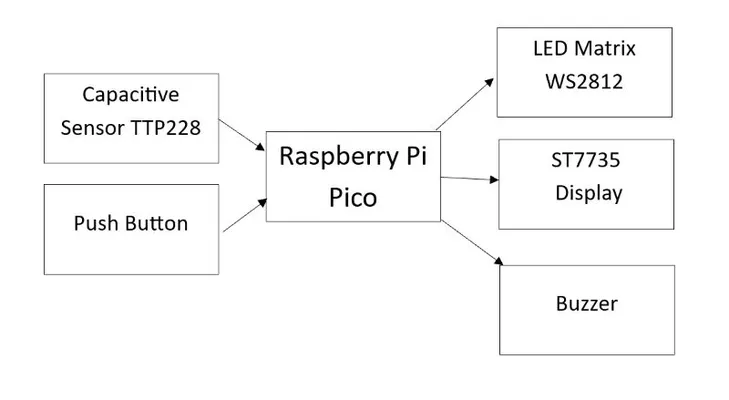

# Light Pattern Memory Game
A light pattern recognition memory game powered by a Raspberry Pi Pico and Rust.

:::info

**Author**: Bogdan Ana-Maria-Iulia \
**GitHub Project Link**: https://github.com/UPB-PMRust-Students/proiect-AnaBogdan

:::

## Description
A fully interactive memory game built on a **Raspberry Pi Pico - RP2040**, using the **Rust** programming language and Embassy async framework, based on recognizing and reproducing light patterns. The player must memorize a sequence of LEDs flashing in a 4x4 grid and reproduce it using capacitive touch sensors. The project features multiple game modes, a scoring system, timeout-based timer, high score storage in flash memory, and audio feedback. In multiplayer mode, two players compete to replicate sequences set by each other. Sequences can be random or predefined, and feedback is also given through varied sounds. At the end of each round, players' scores are compared and displayed.

### Features:
+ **4x4 WS2812 RGB LED matrix** for displaying light sequences.
+ **Capacitive touch sensor (TTP229)** for player input.
+ **240x240 ST7735 OLED Display** for visual game status, scores, and instructions.
+ Audio feedback for correct/incorrect actions and UI sounds.
+ Multiplayer mode with random or user-defined sequences.
+ High score saving to flash memory.
+ Timeout-based turn system to increase challenge.

## Motivation
This project was inspired by a memory game I played during a Neurolympics online assessment. I wanted to recreate the experience in hardware using **Rust** and the **RP2040**, turning a digital challenge into a hands-on embedded system that combines pattern recognition, real-time input, and visual/audio feedback.

## Architecture
The **Raspberry Pi Pico - RP2040** acts as the central unit, managing peripherals and orchestrating the game flow.

- **Capacitive Touch Module (GPIO/I2C)**: detects player input.
- **WS2812 LED Matrix (SPI)**: displays animated light patterns.
- **OLED Display ST7735 (SPI)**: shows current mode, instructions, score, and end results.
- **Audio Buzzer (PWM/GPIO)**: emits feedback tones based on actions.
- **Internal Flash**: stores the highest score between sessions.

### Game Flow Summary:
1. **Startup**: OLED shows welcome message and instructions.
2. **Pattern Display**: A sequence of LEDs light up in the 4x4 grid.
3. **Player Turn**: User reproduces the sequence via touch sensors.
4. **Feedback**: Correct/incorrect tones and visual confirmation.
5. **Scoring**: Points are awarded per round; failure resets current round.
6. **Multiplayer (optional)**: Each player sets a sequence for the other to repeat.
7. **Game End**: Scores are displayed; high score is updated if beaten.

### Block Scheme

## Log

### Week 5 – 11 May

TO DO

### Week 12 – 18 May

TO DO

### Week 19 – 25 May

TO DO

## Hardware

1. **Raspberry Pi Pico - RP2040** 
- Main microcontroller. Manages all peripheral communication, handles game logic, input processing, and feedback signals.

2. **4x4 WS2812 RGB LED Matrix**
- Displays animated light patterns. Controlled via SPI or bit-banged protocol depending on implementation.

3. **TTP229 Capacitive Touch Sensor Module**
- Used for detecting user input. Offers up to 16 touch-sensitive buttons mapped to the LED matrix grid.

4. **ST7735 OLED Display (240x240)**
- Shows game status, round instructions, score updates, and high score.

5. **Audio Buzzer (Piezo)**
- Provides auditory feedback (correct/incorrect sounds, game tones, and timer alerts). Controlled via PWM.

6. **Breadboard and Jumper Wires**
- For prototyping, connecting all components in a modular and easily adjustable layout.

7. **Power Supply (USB / 5V adapter)**
- Powers the Raspberry Pi Pico and peripherals safely and consistently.

### Schematics
TO DO

## Bill of Materials

| Device | Usage | Price |
|--------|--------|-------|
| [Raspberry Pi Pico](https://www.emag.ro/microcontroller-raspberry-pi-rp2040-pico/pd/DKQQWNMBM) | Microcontroller | [30 RON](https://www.emag.ro/microcontroller-raspberry-pi-rp2040-pico/pd/DKQQWNMBM) x 2 |
| [4x4 LED Matrix WS2812](https://www.emag.ro/matrice-led-4x4-16bit-ws2812-rgb-ai1153/pd/DMDBNJMBM) | Game Outputs | [20 RON](https://www.emag.ro/matrice-led-4x4-16bit-ws2812-rgb-ai1153/pd/DMDBNJMBM) |
| [ST7735 OLED 240x240 Display](https://www.emag.ro/display-lcd-ips-1-3-inch-240x240-65k-hd-interfata-spi-controler-st7735-arduino-rx169/pd/DC1HY6YBM) | Visual display | [33 RON](https://www.emag.ro/display-lcd-ips-1-3-inch-240x240-65k-hd-interfata-spi-controler-st7735-arduino-rx169/pd/DC1HY6YBM)|
| [TP229 Capacitive Touch Sensor Module](https://www.optimusdigital.ro/ro/senzori-senzori-de-atingere/1112-modul-senzor-de-atingere-capacitiv-ttp229.html?search_query=tastatura&results=51) | Player Input | [9 RON](https://www.optimusdigital.ro/ro/senzori-senzori-de-atingere/1112-modul-senzor-de-atingere-capacitiv-ttp229.html?search_query=tastatura&results=51) |
| [Breadboard](https://www.optimusdigital.ro/en/breadboards/8-breadboard-hq-830-points.html?search_query=breadboard&results=363) | Connectivity | [10 RON](https://www.optimusdigital.ro/en/breadboards/8-breadboard-hq-830-points.html?search_query=breadboard&results=363) x2 |
| [Breadboard, Jumpers, Power supply etc](https://www.emag.ro/set-componente-electronice-breadboard-830-puncte-led-uri-compatibil-arduino-si-raspberry-pi-zz00044/pd/DRXG4XYBM/?path=set-componente-electronice-breadboard-830-puncte-led-uri-compatibil-arduino-si-raspberry-pi-zz00044/pd/DRXG4XYBM) | Connectivity | [60 RON](https://www.emag.ro/set-componente-electronice-breadboard-830-puncte-led-uri-compatibil-arduino-si-raspberry-pi-zz00044/pd/DRXG4XYBM/?path=set-componente-electronice-breadboard-830-puncte-led-uri-compatibil-arduino-si-raspberry-pi-zz00044/pd/DRXG4XYBM) |

TOTAL: ~200 RON

## Software

| Library | Description | Usage |
|--------|-------------|--------|
| [embassy-rp](https://github.com/embassy-rs/embassy) | RP2040 HAL | Async device and timer management |
| [embedded-hal-async](https://github.com/rust-embedded/embedded-hal) | HAL Traits | I2C abstraction |
| [ttp229](https://docs.rs/ttp229/latest/ttp229/) | Capacitive Sensor Driver | Used for the game input |
| [st7735](https://docs.rs/st7735/0.1.0/st7735/) | OLED Driver | Display game mode and rules |
| [ws2812_spi](https://docs.rs/st7735/0.1.0/st7735/) | LED Matrix Driver | Display game mode and rules |
| [heapless](https://github.com/rust-embedded/heapless) | Fixed capacity collections | Buffer text messages for OLEDs |
| [defmt](https://github.com/knurling-rs/defmt) + [defmt-rtt](https://github.com/knurling-rs/defmt) | Logging Framework | Used for real-time debug output over RTT, ideal for embedded logging |
| [panic-probe](https://github.com/knurling-rs/panic-probe) | Panic Handler | Provides panic messages compatible with defmt |

## Links
1. [Game inspiration - Neurolympics](https://neurolympics.nl/campaign/index-default.html?c=43)
2. [Using TTP229 Capacitive Keypad with Raspberry Pi](https://www.youtube.com/watch?v=AMnMUnouQ9I&ab_channel=TerrySturtevant)

