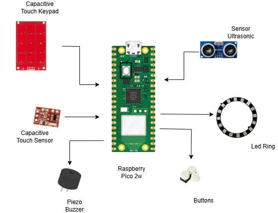

# Musical Box
A multi-instrument musical interaction system using gesture and touch.

:::info
    
**Author:** Duminica Ana-Maria \
    **GitHub Repository:** [github.com/UPB-PMRust-Students/proiect-Ana-MariaDuminica](https://github.com/UPB-PMRust-Students/proiect-Ana-MariaDuminica)

:::

## Description
Musical Box is an interactive embedded system that simulates a small music instrument station, allowing users to play piano notes, drums or guitar-like sounds using hand gestures or capacitive touch. A dedicated AutoPlay mode also plays a pre-programmed melody. The system uses a Raspberry Pi Pico, an ultrasonic sensor, capacitive touch sensors, RGB LEDs and a piezo buzzer, creating both audio and visual feedback.

## Motivation
Being passionate about music, I wanted to incorporate this personal interest into a technical project that would allow me to explore creativity through embedded systems.
This project offered the opportunity to design an interactive musical device by combining sensor input, real-time audio feedback and visual effects. It represents a blend of artistic expression and engineering and allowed me to apply and deepen my knowledge of embedded programming while creating something both functional and engaging.

## Architecture

**Mode Manager**
The central control component that handles input from buttons and switches between the four interaction modes (Piano, Drums, Guitar, AutoPlay).  
**Input Handler**
Unified interface that reads user interaction from different sensors, depending on the active mode (capacitive touches, gestures or distance sensing).  
**Sensor Controller**
Generates musical output by translating inputs into tone frequencies. It handles note playback, percussive sounds and automatic melodies.  
**Visual Feedback Controller**
Manages the RGB LED effects and synchronizes lighting animations with user input and active mode.  

The **Input Handler** receives data from the physical interface (buttons, touchpads, sensors) and forwards it to the **Mode Manager**.  
The **Mode Manager** activates the corresponding logic for the selected mode (Piano, Drums, etc.).  
Based on the mode, the **Sound Controller** is triggered to play audio and the **Visual Feedback Controller** is triggered to animate lights.  
The architecture ensures that all input-output actions are synchronized and each mode operates independently but within the same event-driven structure.  

## Log

### Week 5 - 11 May

### Week 12 - 18 May

### Week 19 - 25 May

## Hardware

### Schematics 

### Bill of Materials
| Device                          | Usage                                            | Price |
|---------------------------------|--------------------------------------------------|-------|
| Raspberry Pi Pico W (x2)        | The microcontroller (main logic & debug probe)   | 60 RON |
| Breadboard (x2)                 | Prototyping area for each Pico                   | 15 RON |
| Capacitive Touch Sensor TTP223  | Detecting touch for interaction                  | 5 RON |
| Push Buttons (x3)               | Manual input (mode switching, triggering sounds) | 3 RON |
| WS2812B RGB LED Ring (24 LEDs)  | Visual feedback and lighting effects             | 25 RON |
| Piezoelectric Buzzer (x2)       | Audio output for instruments                     | 3 RON |
| HC-SR04 Ultrasonic Sensor       | Gesture-based distance control (e.g., drums)     | 15 RON |
| MPR121 Touch Keypad Module      | Piano input (capacitive keys)                    | 10 RON |
| Jumper Wires M-M                | Connecting components on breadboards             | 20 RON |
| Jumper Wires F-M (approx. 10)   | For sensors/modules requiring different headers  | 20 RON |

## Software
| Library              | Description                                      | Usage                                                |
|----------------------|--------------------------------------------------|------------------------------------------------------|
| embassy-rp           | HAL for Raspberry Pi Pico                        | Access to hardware peripherals (GPIO, PWM, I²C, etc.)|
| embassy-time         | Async delays & timers                            | Used for non-blocking delays and timing              |
| defmt + defmt-rtt    | Embedded logging via RTT                         | Sending debug messages to the host                   |
| panic-probe          | Minimal panic handler with logging               | Displays panic messages through RTT                  |
| embedded-hal         | Hardware Abstraction Layer traits                | Interface for I²C, PWM, and other peripheral drivers |
| smart-leds           | WS2812 RGB LED control                           | Controls the RGB LED ring                            |
## Links