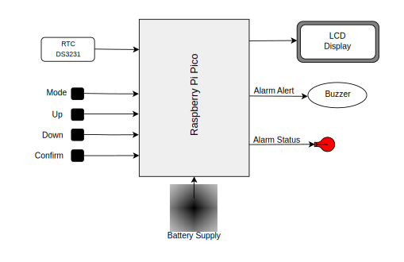
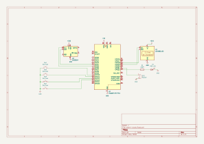

# Alarm Clock
An embedded alarm clock using Raspberry Pi Pico that displays time/date and lets you set alarms/timer using buttons.

:::info

**Author**: Anastasia Luca \
**GitHub Project Link**: [https://github.com/UPB-PMRust-Students/proiect-anastasia-luca](https://github.com/UPB-PMRust-Students/proiect-anastasia-luca)  

:::

## Description
An intelligent alarm clock that greets your mornings with a warm message, gently raises the volume of your wake-up melody, and transforms the “Wake up!” moment into a more pleasant experience. It allows easy alarm setting through a minimalist interface and clearly signals when the alarm is set, also includes a basic countdown timer.

## Motivation
I chose to build an alarm clock because it solves a common student need: waking up reliably and gently each day. But most importantly: it helps us develop practical skills like planning, prioritizing, and turning an idea into a real, useful product — skills we’ll need in our future careers.

## Architecture

The intelligent alarm clock is driven by the Raspberry Pi Pico, which coordinates the system's behavior through a continuous loop of reading inputs, updating outputs, and managing time-based events. _Here's how they operate with each other:_

- __Raspberry Pi Pico__: _The core of the system._ It reads inputs from the buttons and the RTC, processes the logic for display, and controls the outputs: the screen, buzzer, and LED.
- __RTC DS3231__ – Continuously tracks the current time and provides it to the Pico via the I2C interface, even when the system is powered off.
- __The LCD display__ - Displays time, date, and other information such as setting screens or messages, based on Pico’s commands.
- __Four Buttons__ – Used for user input:
    - __Mode__ → switches between modes (Clock – displays current time/date, Set Timer, Set Alarm, Set Clock & Date)
    - __Up / Down__ → modifies the values (minutes, hours, etc.)
    - __Confirm__ → saves the current value and moves to the next step (e.g., from hour to minute)
- __Red LED__ is turned on by the Pico when the alarm is active.
- __Alarm Alert__ –  The Pico activates the buzzer to produce an audible signal when the current time matches the set alarm, using PWM to gradually increase the sound's intensity until the alarm is turned off.
- __Battery Pack__ – Provides power to the entire system, making it portable.

## Log

### Week 5 - 11 May

### Week 12 - 18 May

### Week 19 - 25 May

## Hardware
The hardware used in this project includes the following essential compnpm audit fix --forceonents:
* 2x Raspberry Pi Pico 2W (one for debugging)
* 1x DS3231 RTC Module
* 1x LCD Display 1602 wih I²C Module and Yellow-Green Backlight
* 4x Push Buttons
* 1x Passive Buzzer (5V)
* 1x Red LED (5mm)
* 1x 3×AA R6 Battery Supply

### Schematics

### Bill of Materials

| Device                                                                                                                               | Usage                               | Price     |
|--------------------------------------------------------------------------------------------------------------------------------------|-------------------------------------|-----------|
| [Raspberry Pi Pico 2W](https://www.raspberrypi.com/documentation/microcontrollers/pico-series.html) (2x)                             |          The microcontroller        | [79.32 RON](https://www.optimusdigital.ro/ro/placi-raspberry-pi/13327-raspberry-pi-pico-2-w.html?srsltid=AfmBOopT8Y9ultcTpCnplLLBvfYiR-1ehIjvuN4Q_uidpizk46YSSxWM) |
| [RTC Module](https://www.analog.com/media/en/technical-documentation/data-sheets/DS3231.pdf)                                         |          Real Time Clock            | [15.98 RON](https://www.optimusdigital.ro/en/others/12402-ds3231-real-time-clock-module.html?srsltid=AfmBOoqrYd9IkMA_gzq1RFnnLJ6zbSUzYXB-1QRXEe3tHhhYkv9898sM) |
| [LCD Display 1602, I²C, Yellow-Green Backlight](https://components101.com/displays/16x2-lcd-pinout-datasheet)                        |        Display with I²C interface   | [14.99 RON](https://www.optimusdigital.ro/ro/optoelectronice-lcd-uri/62-lcd-1602-cu-interfata-i2c-si-backlight-galben-verde.html?search_query=LCD+1602+cu+Interfata+I2C&results=4) |
| [Push Button](https://components101.com/switches/push-button) (4x)                                                                   |            User input controls      | [1.80 RON](https://www.optimusdigital.ro/en/buttons-and-switches/1119-6x6x6-push-button.html) |
| [Passive Buzzer 5V](https://components101.com/misc/buzzer-pinout-working-datasheet)                                                  |          Audible alarm output       | [1.40 RON](https://www.optimusdigital.ro/ro/audio-buzzere/634-buzzer-pasiv-de-5-v.html?gad_source=1&gad_campaignid=19615979487&gbraid=0AAAAADv-p3AcTGZShwGGGHyKb6hmiamUi&gclid=Cj0KCQjwt8zABhDKARIsAHXuD7YPMtgXTFjWKLn3MWBlraNUlYMT4JcFVcbQl9i0ydQGvLpv05ozqvAaAqUQEALw_wcB)|
| [Red LED 5mm](https://components101.com/diodes/5mm-round-led) (1x)                                                                   |    Indicates active alarm state     | [0.39 RON](https://www.optimusdigital.ro/ro/optoelectronice-led-uri/29-led-set-3-culori-x-10-pcs-fiecare.html?search_query=led+rosu&results=166) |
| 3×AA R6 Battery Case                                                                                                                 |        Holds 3 AA batteries         | [8.00 RON](https://www.emag.ro/suport-baterie-3xaa-r6-hold-bat-3r6/pd/DMGBBGMBM/?X-Search-Id=aed5d39dda76ab906e51&X-Product-Id=120857934&X-Search-Page=1&X-Search-Position=0&X-Section=search&X-MB=0&X-Search-Action=view) |
| 3×AA Batteries                                                                                                                       |     Powers the system (4.5 V total) | 10.00 RON |
| [Breadboard](https://components101.com/misc/breadboard-connections-uses-guide)                                                       |     For assembling the prototype    | [14.28 RON](https://www.emag.ro/breadboard-830-puncte-mb102-cl01/pd/DF0C5JBBM/) |
| [Resistor 220Ω](https://components101.com/resistors/resistor) (1x)                                                                   |     Current limiter for the LED     | [0.10 RON](https://www.optimusdigital.ro/en/resistors/1097-025w-220-resistor.html?search_query=+Resistor&results=368&HTTP_REFERER=https%3A%2F%2Fwww.optimusdigital.ro%2Fen%2Fsearch%3Fcontroller%3Dsearch%26orderby%3Dposition%26orderway%3Ddesc%26search_query%3D%2BResistor%26submit_search%3D) |
| Colored 40p 2.54 mm Pitch Male Pin Header - Yellow (2x)                                                                              | For mounting the PICO on breadboard | [1.98 RON](https://www.optimusdigital.ro/en/pin-headers/465-colored-40p-254-mm-pitch-male-pin-header-yellow.html?search_query=0104210000002966&results=1) |
| Jumper Wires (Male to Male, 10pcs - 20cm, 10pcs - 10cm)                                                                              |      Connections on breadboard      | 5.38 RON |
| Jumper Wires (Male to Female, 20pcs, 20cm)                                                                                           | Connections breadboard - components | 3.99 RON |

## Software

| Library                                                                 | Description                            | Usage                                                  |
|-------------------------------------------------------------------------|----------------------------------------|--------------------------------------------------------|
| [ds323x](https://lib.rs/crates/ds323x)                                  | DS3231 RTC Rust library                | For reading/writing time over I2C                      |
| [ag-lcd](https://crates.io/crates/ag-lcd)                               | LCD driver library                     | To control LCD via I2C                                 |
| [embassy-rp](https://docs.embassy.dev/embassy-rp/git/rp2040/index.html) | Peripheral access library	           | Access to GPIOs, I2C, PWM, clocks, etc.                |
| [embassy-time](https://docs.rs/embassy-time/latest/embassy_time/)       | Async timers and delays                | Used for delays, alarms, and countdown logic           |

## Links

1. [Raspberry Pi Pico - Alarm Clock Project](https://www.youtube.com/watch?v=EOMcPAKL6RM)
