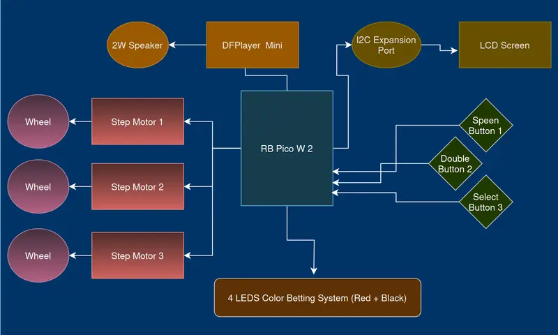

# Mini Slot Machine
A miniature slot machine inspired by early electromechanical casino models.

:::info

**Author**: Androne Andrei \
**GitHub Project Link**: https://github.com/UPB-PMRust-Students/proiect-AndroneAndrei

:::

## Description
This demonstrative project functions around a Raspberry Pi Pico 2W. It drives three mechanical reels with stepper motors, plays sounds through a DFPlayer Mini, shows doubling process with leds, and displays live game information on a 1602 LCD. Software is impleneted using Embassy and Rust.

## Motivation
Nowadays, gambling has become an unhealthy addiction for many people, so I wanted to build a project that showcases how slot machines work today. Ever since most slot machines became fully electronic, the outcome of each game has been largely determined by the underlying software. Therefore, I created a machine that lets the user choose between several game modes (Fair – completely random; Real – small cumulative losses, similar to modern machines that foster addiction; Unfair – large losses that generally do not create the same addictive behaviour).

Alongside its educational purpose, the project applies several concepts covered in the lab work, such as UART communication for the MP3 player, I2C for the screen, and the Rust code needed to implement the three game modes.

## Architecture

### Raspberry Pi Pico W 2 - RP2350

**Role:** Central component; controls everything else.

### Mini MP3 player

**Role:** Provides music and sound effects, communicating with the Pico via UART and using its internal DAC to drive the small 2 W speaker.

### Small speaker

**Role:** Effectively propagates the audio output from the sound module.

### Step Motor 5V with Driver

**Role:** Spins the reels; communicates with the Pico through a ULN2003 driver using parallel transmission.

### Small LCD screen with I2C adapter for easier communication

**Role:** Displays live game elements and allows the user to view selectable options.

### Buttons

**Role:** Used for selecting options or for activating the spin and doubling features during gameplay.

### Leds

**Role:** A pair of bi‑colour LEDs (simulating card‑colour betting) used for the gain‑doubling option if the player desires.

## Log

### Week 5 - 11 May

### Week 12 - 18 May

### Week 19 - 25 May

## Hardware
The electronics are simple and modular, centred on one Raspberry Pi Pico W:

Reels – Three 28BYJ‑48 stepper motors spin the reels through ULN2003 driver boards. The Pico sends signals and stops exactly on the right symbol.

Sound – A DFPlayer Mini holds MP3 files on a micro‑SD card. The Pico tells it what to play over UART (it just sends a number of the respective sound effect index). A small 2W speaker propagates the audio.

Display – A1602 LCD with a PCF8574 I2C backpack shows credits, mode, and symbols.

Controls – Three push‑buttons (Start/Spin, Mode/Bet-Double/Stop, Select-Sum) give input. Two bi‑colour LEDs flash alternatively in fast succesion to allow for betting on colour.

Power – Everything runs from a 5 V USB supply (a battery will be added in later developement). The Pico makes its own 3.3 V for logic; motors and audio stay on 5 V.

## Schematics
TO DO (KiCad)

## Bill of Materials

| Device | Usage | Price |
|:------:|:-----:|:-----:|
| [2x Raspberry Pi Pico 2 W](https://www.optimusdigital.ro/ro/placi-raspberry-pi/13327-raspberry-pi-pico-2-w.html?search_query=rb+pi+pico&results=33) | Microcontroller | 80 RON |
| [DFPlayer Mini](https://www.optimusdigital.ro/ro/audio/1484-modul-mp3-player-in-miniatura-dfplayer-mini.html?search_query=Modul+MP3+Player+in+Miniatura+DFPlayer+Mini+&results=1) | MP3 Mini Player | 14 RON |
| [50mm Speaker - 2W - 32ohm](https://ardushop.ro/en/electronics/1962-50mm-speaker-2w-32ohm-6427854029898.html) | Generic Mini Speaker | 5 RON |
| [1602A](https://www.conexelectronic.ro/afisaje-lcd/16628-DISPLAY-LCD-1602A-I2C-ALBASTRU.html?srsltid=AfmBOooUZ1h1w4HOgB00LHVgVOKTkkAHYW9aRtFuG0dBQyG3iZTs1Qiw) | LCD display | 29 RON |
| [IO PCF8574](https://www.optimusdigital.ro/ro/adaptoare-i-convertoare/902-modul-de-expansiune-io-pcf8574.html?search_query=Modul+de+Expansiune+IO+PCF8574+&results=4) | Expansion module for Screen's I2C communication | 9 RON |
| [3x 28BYJ-48 5V + 3x ULN2003](https://www.optimusdigital.ro/ro/motoare-motoare-pas-cu-pas/101-driver-uln2003-motor-pas-cu-pas-de-5-v-.html?search_query=Set+Motor+Pas+cu+Pas+28BYJ-48+5V+%C8%99i+Driver+ULN2003+Albastru+&results=1) | Step Motor + Driver | 51 RON |
| [2GB MicroSD Card](https://www.vexio.ro/carduri-memorie/transcend/74893-micro-sd-2-gb/) | Card for storing sounds effects | 20 RON |
| Minor Components (buttons, wires, leds, battery, etc.) | Taken from an Arduino Starter Pack | - | < 20 RON |

## Software

| Library | Description | Usage |
|:------:|:-----:|:-----:|
| [embassy‑executor](https://crates.io/crates/embassy-executor/) | Async runtime | Runs cooperative tasks on the Pico |
| [embassy-time](https://docs.rs/embassy-time/latest/embassy_time/) | Timers within async developement | Different pauses |
| [embassy-rp](https://embassy.dev/) | RP2350 hardware abstraction | GPIO, UART, I2C, etc. |
| [ag-lcd](https://docs.rs/ag-lcd/latest/ag_lcd/) | LCD diplsay library | Used for my mini screen display |
| [port_expander](https://docs.rs/port-expander/latest/port_expander/index.html) | Library providing a common abstraction for I2C port-expanders | Used for my PCF8574 |
| [rand](https://docs.rs/rand/latest/rand/) | Utilities for random number generator | Used in software part that controls game flow |

## Links
- [similar arduino project 1](https://www.youtube.com/watch?v=IyDhjCFHC0Q)
- [similar arduino project 2](https://www.youtube.com/watch?v=QCF7HrBWTgs)
- [labs](https://pmrust.pages.upb.ro/docs/acs_cc/category/lab)
- [addiction explanation](https://www.youtube.com/shorts/iFQr5vMsKwQ)