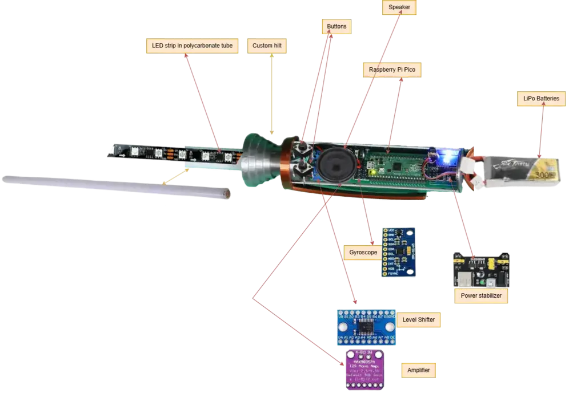
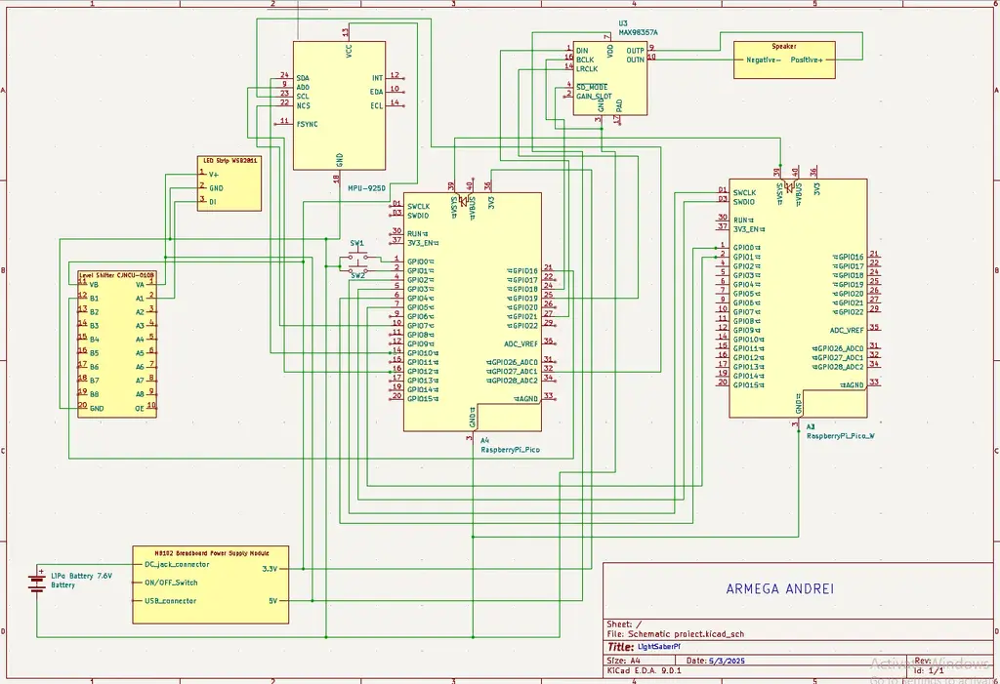

# LightSaber Pi

Straight out of Star Wars — with just a bit of Rust — we bring you... **The LightSaber Pi**.

:::info
**Author**: Armega Andrei 331CC \
**GitHub Project**: [UPB-PMRust-Students/proiect-AndreiArmega](https://github.com/UPB-PMRust-Students/proiect-AndreiArmega)
:::

## Description

The project revolves around — as much as fictional laser technology allows — a lightsaber, the iconic weapon from the *Star Wars* franchise. Instead of Kyber crystals from Ilum, the blade will be powered by batteries and an addressable LED strip (WS2811). Iconic sound effects will be played through a speaker, while a gyroscope detects movement to trigger those sounds. Finally, all components will be encapsulated in a DIY hilt.

## Motivation

The primary drive behind this project is simple: **lightsabers are cool**. Beyond that, it brings a fun and creative break from the seriousness of everyday life and demonstrates embedded systems in an engaging way.

## Architecture

### 3D Model  

### Components

- **Raspberry Pi Pico W**
- **LED strip WS2811**
- **Level Shifter HW-221**
- **Gyroscope MPU6500**
- **Current Source Stabilizer (5V to 3.3V)**
- **LiPo Battery: GENS ACE Tattu 7.6V / 300 mA / 75C**
- **Amplifier: MAX98357A**
- **4-pin Buttons**
- **Breadboards**

## Log

### Week 5 (May 11)
- Created the initial documentation, 3D concept, and schematic of the project.
- Ordered all the necessary components.
- Researched libraries for audio and LED control.

### Week 12 (May 18)
*(To be filled)*

### Week 19 (May 25)
*(To be filled)*

## Hardware

We use two **Raspberry Pi Pico W** boards — one for the core functionality, the other for debugging.

Movement detection (e.g., to play a _whoosh_ sound) is done using the **MPU6500 gyroscope**.

For sound output, we use an **8Ω 2W speaker** and a **MAX98357A amplifier**.

The lightsaber blade is illuminated using a **WS2811 addressable LED strip**. A **level shifter** ensures proper communication between the 3.3V logic of the Pico and the 5V LEDs.

Power is supplied via a **7.6V LiPo battery**, regulated to 5V and 3.3V using a **power supply module**.

User input (powering on/off, switching modes) is handled via **4-pin push buttons**.

### Schematic  

## Bill of Materials

| Device | Usage | Price |
|--------|--------|-------|
| [2× Raspberry Pi Pico W](https://www.raspberrypi.com/documentation/microcontrollers/raspberry-pi-pico.html) | Main microcontroller and debugging | [75 RON](https://www.optimusdigital.ro/en/raspberry-pi-boards/12394-raspberry-pi-pico-w.html) |
| [WS2811 48 LED](https://cdn-shop.adafruit.com/datasheets/WS2811.pdf) | Blade lighting | [25 RON](https://www.emag.ro/banda-led-digitala-ws2811-48-led-1094/pd/D19VR7MBM) |
| [Level Shifter HW-221](https://www.dnatechindia.com/hw-221-txs-0108e-8-bit-birectional-voltage-converter-8-way-india.html) | Voltage conversion (3.3V to 5V) | [8 RON](https://ardushop.ro/ro/electronica/1806-modul-convertor-nivel-logic-bidirectional-8-canale-cjmcu-0108-6427854027399.html) |
| [MPU6500 Gyroscope](https://invensense.tdk.com/wp-content/uploads/2020/06/PS-MPU-6500A-01-v1.3.pdf) | Movement detection | [15 RON](https://ardushop.ro/ro/electronica/741-mpu6500-modul-accelerometru-si-giroscop-6427854009449.html) |
| [MAX98357A Amplifier](https://www.robofun.ro/module/amplificator-3w-i2s-max98357a.html) | Audio output | [17 RON](https://ardushop.ro/ro/module/1549-amplificator-3w-i2s-max98357a-clasa-d-6427854022967.html) |
| Power Supply Module (5V–3.3V) | Voltage regulation | [5 RON](https://ardushop.ro/en/power-supply/2296-power-supply-module-5v-33v-for-breadboard-6427854032867.html) |
| GENS ACE Tattu 7.6V LiPo Battery | Power source | [60 RON](https://www.sierra.ro/cumpara/acumulator-lipo-gens-ace-tattu-7-6v-300-ma-75c-1951) |
| 6×6×6 Push Button | Control interface | [1 RON](https://www.optimusdigital.ro/en/buttons-and-switches/1119-6x6x6-push-button.html) |
| 2× Breadboard (750 Points) | Circuit prototyping | [18 RON](https://www.optimusdigital.ro/en/breadboards/13245-breadboard-750-points.html) |
| Jumper Wires | Circuit connections | [8 RON](https://www.optimusdigital.ro/en/wires-with-connectors/12-breadboard-jumper-wire-set.html) |
| 20cm 40p Male-Female Wires | Circuit connections | [8 RON](https://www.optimusdigital.ro/en/wires-with-connectors/92-female-male-wire40p-20-cm.html) |
| USB to MicroUSB Adapter Shim | Connectivity | [3 RON](https://www.optimusdigital.ro/en/connectors/5583-usb-to-microusb-adapter-shim.html) |
| USB Cable | Power and data | [6 RON](https://ardushop.ro/ro/fire-si-conectori/914-cablu-usb-a-la-usb-c-1m-negru-6427854012159.html) |
| Speaker (8Ω, 2W) | Audio playback | [5 RON](https://ardushop.ro/ro/module/1898-difuzor-36mm-2w-8ohm-6427854028723.html) |

## Software

| Library              | Description                                                 | Usage |
|----------------------|-------------------------------------------------------------|--------|
| `defmt`              | Logging framework for embedded systems                      | Efficient development-time logging |
| `defmt_rtt`          | Real-Time Transfer logger                                   | Real-time debug output |
| `embassy_executor`   | Async task executor for embedded devices                    | Manages async task scheduling |
| `embassy_rp`         | Embassy support for the RP2040                              | Low-level hardware access |
| `embassy_time`       | Time abstraction for async systems                          | Timers and delays |
| `panic_probe`        | Lightweight panic handler with logging                      | Debugging panic causes |
| `ws2811-spi`         | SPI driver for WS2811/WS2812 LED strips                     | Controls RGB lighting |
| `embedded-audio`     | Audio traits and tools for embedded systems                 | Audio playback abstraction |
| `mpu6050`            | I²C driver for MPU6050 motion sensor                        | Motion detection |

## Links

1. [Building a Lightsaber Wall Light with the Raspberry Pi Pico W](https://www.youtube.com/watch?v=UhkDcSiaN-k)
2. [New Toby made us RP2040 lightsabers for SiliCon](https://www.raspberrypi.com/news/new-toby-made-us-rp2040-lightsabers-for-silicon/)
3. [Making Anakin/Luke/Rey's Lightsaber — Lights, Sounds & FREE 3D Files](https://www.youtube.com/watch?v=An3GZPRD6do)
