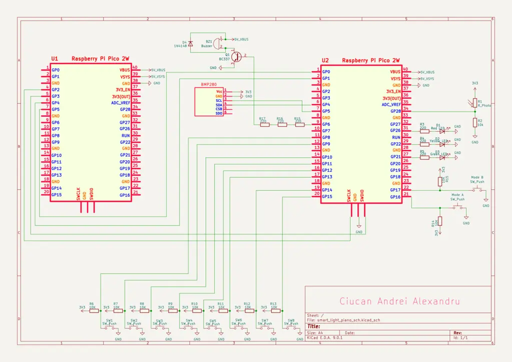
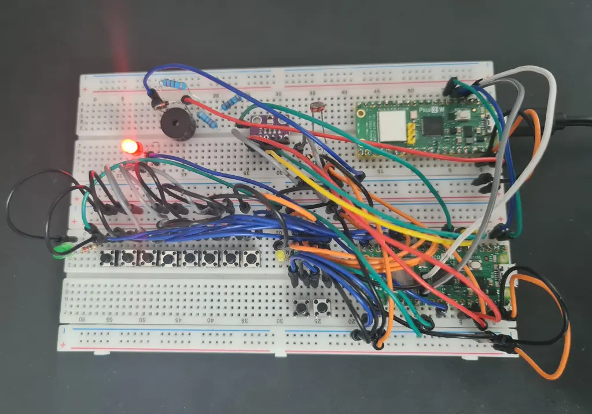
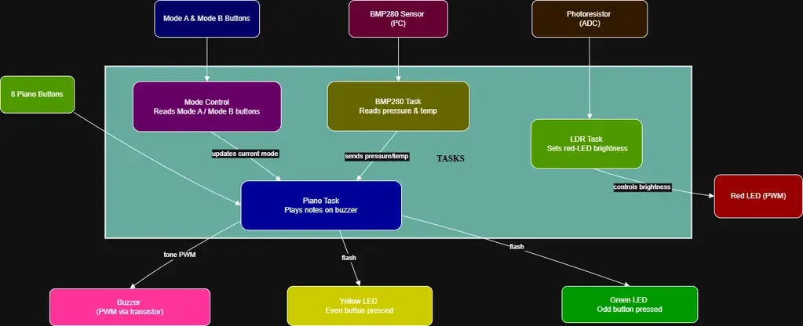

# Smart Light Piano

Digital piano project built on a Raspberry Pi Pico 2W, featuring auto-light detection, multi-mode play and optional Wi-Fi integration.

:::info 

**Author**: Andrei-Alexandru Ciucan \
**GitHub Project Link**: [source code](https://github.com/UPB-PMRust-Students/proiect-Andrei2K3)

:::

## Description

Smart Light Piano is a **mini digital piano** based on a **Raspberry Pi Pico 2W**.  
It allows the player to interact with eight physical keys, triggering musical notes generated via PWM on a **5V passive buzzer**.  
The system integrates three LEDs for dynamic visual feedback:
- **Red LED**:  
  - Connected to the **photoresistor (LDR)**.
  - **Behavior**: As the environment gets darker, the red LED **brightens** proportionally; as ambient light increases, the red LED **dims** progressively.
- **Yellow LED**:  
  - **Triggered** when a button located at an **even position** (2, 4, 6, 8) is pressed.
  - **Purpose**: Highlights even-positioned key presses.
- **Green LED**:  
  - **Triggered** when a button located at an **odd position** (1, 3, 5, 7) is pressed.
  - **Purpose**: Highlights odd-positioned key presses.

The piano offers **three operating modes**, selected through two dedicated buttons:

| Mode Trigger | Mode Name | Description |
|--------------|-----------|-------------|
| **Button A pressed** | **Note Guess Mode** | A random note is played and the player must identify it by pressing the corresponding key. Each correct guess is stored and the sequence of correct notes is replayed as a melody after the first mistake. |
| **Button B pressed** | **Effects Mode** | Applies real-time audio effects (such as vibrato, tremolo, or frequency shifts) to the notes for a more dynamic sound experience. |
| **Both Button A and Button B pressed** | **Pressure-Controlled Pitch Mode (optional)** | An advanced mode where note pitch varies according to air pressure measurements from the **BMP280** sensor, allowing players to modify sounds by moving the device up or down. This mode is optional and intended to enrich the overall interaction. |

>If, during testing, the BMP280 pressure readings do not provide a clear-enough delta when I move the piano up or down, the pitch‑modulation logic will seamlessly fall back to temperature‑based mapping from the same sensor.

> **Optional**: In a future update, Wi-Fi connectivity may be added to:
> - Display the current ambient **temperature** remotely
> - Transmit or record the sequence of **played notes** through a network connection

## Motivation

This project combines my passion for embedded systems, music and real-time hardware interaction.  
It involves reading analog and digital inputs, communicating with sensors over I²C, generating real-time audio signals and coordinating everything through asynchronous Rust programming.  
The result is a responsive system that seamlessly blends low-level hardware control with modern approaches to embedded software development.

## Architecture

The project has the following architecture:

- __Raspberry Pi Pico 2W:__ Handles the main logic of the project - reading piano key inputs, controlling the buzzer through PWM to generate musical notes, adjusting LED brightness based on the photoresistor (LDR) reading, handling mode selection through buttons and communicating with the BMP280 sensor over I²C.
- __Raspberry Pi Pico 2W (Debugger Controller):__  Dedicated to debugging and monitoring the operation of the first Pico.
- __Passive 5V Buzzer (via transistor):__ Controlled via PWM from the first Pico. Generates audible musical notes corresponding to key presses, with real-time modulation depending on the selected mode.
- __Piano Buttons (8 Buttons):__ Connected to the main Pico's GPIO pins. Each button corresponds to a musical note; pressing a button triggers sound generation.
- __Mode Selection Buttons (2 Buttons):__ Connected to separate GPIO pins.  
  - Pressing Button A selects Note Guess Mode.  
  - Pressing Button B selects Effects Mode.  
  - Pressing both simultaneously activates Pressure-Controlled Pitch Mode.
- __Photoresistor (LDR) with Voltage Divider:__ Provides analog light measurements read by the ADC module of the main Pico. Controls the brightness behavior of the red LED depending on the ambient light level.
- __LED Indicators (Red, Yellow, Green):__ 
  - The **red LED** adjusts its brightness dynamically based on the ambient light measured by the LDR — brighter in darkness, dimmer in strong light.  
  - The **yellow LED** lights up when a piano key at an even position is pressed.  
  - The **green LED** lights up when a piano key at an odd position is pressed.
- __BMP280 Sensor:__   Connected to the main Pico via I²C. Provides real-time pressure and temperature data, used in Pressure-Controlled Pitch Mode to adjust the buzzer sound dynamically.
- __Power Source:__ Provides USB power to the primary Raspberry Pi Pico 2W, which in turn supplies power to the second Pico used for debugging, along with all the connected peripherals.
- __Breadboard__: Used to build and run the entire project without soldering. All components are connected directly using jumper wires for flexibility and ease of assembly.
- __Prototype Board (Optional)__: May be used later to solder the final version of the circuit for improved durability and long-term use.

## Log

### Week 23 - 30 April
I started working on the project documentation and set up the GitLab repository to manage the documentation separately. I created the first version of the system block diagram using diagrams.net, drafted the initial list of hardware and software components and began designing the hardware schematic in KiCad, covering the main modules. I also outlined the structure for the final `index.md` file.

### Week 5 - 11 May

### Week 12 - 18 May

### Week 19 - 25 May

## Hardware

I am using two Raspberry Pi Pico 2W boards in this setup. The main Pico handles all piano functionalities (PWM audio output, button reading, LED brightness control via ADC and BMP280 communication over I²C), while the second Pico acts as a debug interface through UART.

| Hardware Device | Purpose | Usage |
|-----------------|---------|-------|
| Raspberry Pi Pico 2W (Main Controller) | Main microcontroller | Handles piano note generation, button input, LED control, LDR reading and BMP280 data acquisition |
| Raspberry Pi Pico 2W (Debugger) | Debugging | Monitors the main controller's state via UART during development |
| Passive 5V Buzzer (controlled via transistor) | Sound output | Emits musical notes generated by PWM signals |
| Switching Transistor (for Buzzer) | PWM signal control | Ensures safe driving of the 5V passive buzzer without overloading GPIO pins |
| 8 Piano Buttons | User input | Triggers different musical notes corresponding to each button |
| 2 Mode Buttons | Mode switching | Selects the operating mode (Note Guess Mode, Effects Mode, Pressure-Controlled Mode) |
| Red, Yellow and Green LEDs | Visual feedback | Indicates light intensity or button presses (even/odd keypresses) |
| Light Dependent Resistor (LDR) | Ambient light sensor | Measures light intensity |
| Fixed Resistor for LDR (10kΩ) | Voltage divider | Forms a divider circuit with the LDR for ADC reading |
| BMP280 Sensor | Pressure and temperature measurement | Connected over I²C |
| Current-Limiting Resistors (220Ω–470Ω) | LED protection | Limits current through each LED to safe values |
| Breadboard (830 pts) | Project assembly | Used to build and connect all components without soldering |
| Prototype PCB 10x15cm (Optional) | Permanent wiring | Can be used to solder the final circuit for improved robustness |
| USB Power Supply | Power source | Supplies 5V via USB directly to the debugger Pico 2W |

### Schematics

### Photos

## Software

The project firmware is written entirely in Rust, using an asynchronous multitasking model with Embassy libraries, running on a Raspberry Pi Pico 2W. \
Four independent asynchronous tasks manage real-time behavior: 
- A mode control task that monitors the two mode selection buttons and configures the piano behavior accordingly. 
- A piano task that plays musical notes based on key presses, dynamically adapting to the active mode (Note Guess, Effects, Pressure-Controlled Pitch).
- An LDR task that adjusts the brightness of the red LED depending on ambient light measured by the photoresistor. 
- A BMP280 task that reads environmental data asynchronously via I²C, supporting optional dynamic pitch adjustment based on pressure.
### Detailed Design

The main software modules are:
Module | Functionality
|-----------------|---------|
Mode Control Task | Continuously monitors the two mode buttons. Depending on which button(s) are pressed, it updates a shared state variable that configures how the piano task operates: random note guessing, sound effects, or pressure-based pitch shifting.
Piano Task | Reads the 8 piano buttons. Generates different behaviors based on the current selected mode: normal tone playing, sound effects applied, or pitch dynamically influenced by atmospheric pressure.
LDR Task | Reads the photoresistor (LDR) values using ADC and adjusts the PWM duty cycle to smoothly control the brightness of the red LED.
BMP280 Task | Communicates with the BMP280 sensor over I²C to acquire temperature and pressure readings every second. Pressure values are used optionally to influence musical note characteristics when in Pressure-Controlled Mode.
PWM and GPIO Handling | PWM is used for buzzer sound modulation and LED brightness control. GPIO pins are used for button inputs with pull-up configurations and non-blocking reads.
Task Synchronization | Embassy's async framework ensures cooperative multitasking and real-time responsiveness without requiring threads or RTOS features.

### Functional Diagram

## Bill of Materials

### Hardware

| Device | Usage | Price |
|--------|--------|-------|
Raspberry Pi Pico 2W | Main microcontroller running piano, LDR, BMP280 | [42 RON](https://www.optimusdigital.ro/en/raspberry-pi-boards/13327-raspberry-pi-pico-2-w.html?search_query=RP2350&results=4)
Raspberry Pi Pico 2W | Debugger | [42 RON](https://www.optimusdigital.ro/en/raspberry-pi-boards/13327-raspberry-pi-pico-2-w.html?search_query=RP2350&results=4)
BMP280 Sensor Module | Air pressure and temperature readings | [9 RON](https://www.optimusdigital.ro/en/pressure-sensors/1666-modul-senzor-de-presiune-barometric-bmp280.html?search_query=BMP280&results=17)
LDR Sensor  | Measures ambient light intensity | [2 RON](https://www.optimusdigital.ro/en/others/28-5528-photoresistor.html?search_query=Photoresistor&results=19)
Passive Buzzer 5V | Audio output for piano notes (with PWM) | [1.5 RON](https://www.optimusdigital.ro/en/buzzers/634-5v-passive-buzzer.html)
2N2222 NPN Transistor | Amplifies PWM signal to drive 5V buzzer | [0.2 RON](https://www.optimusdigital.ro/en/transistors/935-transistor-npn-2n2222-to-92.html)
Resistor 1kΩ 0.25W | Base resistor for transistor | [0.1 RON](https://www.optimusdigital.ro/en/resistors/859-025w-1k-resistor.html)
Resistor 10kΩ 0.25W | Voltage divider with LDR | [0.1 RON](https://www.optimusdigital.ro/en/resistors/1088-025w-10k-resistor.html?search_query=0.25+W+10K+%CE%A9+Resistor&results=5)
Red LED 5mm | Shows brightness level (PWM-controlled) | [0.4 RON](https://www.optimusdigital.ro/en/leds/29-5-mm-red-led-with-difused-lens.html?search_query=Red+led&results=1378)
Green LED 5mm | Lights up for odd keys pressed | [0.4 RON](https://www.optimusdigital.ro/en/leds/38-5-mm-green-led-with-difused-lens.html?search_query=green+led&results=237)
Yellow LED 5mm | Lights up for even keys pressed | [0.4 RON](https://www.optimusdigital.ro/en/leds/698-led-galben-de-3-mm-cu-lentile-difuze.html?search_query=yellow+led&results=198)
Resistor 220Ω 0.25W | Current limiting resistors for LEDs | [0.2 RON (each) ×3](https://www.optimusdigital.ro/en/resistors/1097-025w-220-resistor.html?search_query=220%CE%A9&results=7)
Tactile Push-Button 6x6mm | Piano keys (8x) + Mode selection (2x) | [0.4 RON × 10](https://www.optimusdigital.ro/en/buttons-and-switches/1119-6x6x6-push-button.html?search_query=6+x+6+x+6+Push+Button&results=85)
Breadboard Jumper Wires Set | Connections | [8.5 RON](https://www.optimusdigital.ro/en/wires-with-connectors/12-breadboard-jumper-wire-set.html?search_query=Breadboard+Jumper+Wires+Set&results=22)
Colored 40p 2.54 mm Pitch Male Pin Header | Soldered on Pico 2W for connection | [1 RON x 5](https://www.optimusdigital.ro/en/pin-headers/465-colored-40p-254-mm-pitch-male-pin-header-yellow.html?search_query=Colored+40p+2.54+mm+Pitch+Male+Pin+Header+-+Yellow&results=1)
Breadboard 830 pts | Assembly platform for the entire project| [10 RON x 2](https://www.optimusdigital.ro/en/breadboards/8-breadboard-hq-830-points.html)
20p Female Pin Header 2.54 mm(Optional) | Socket for Pico W on PCB | [4.3 RON x 4](https://www.optimusdigital.ro/en/pin-headers/4166-20p-female-pin-header-254-mm.html?search_query=20p+Female+Pin+Header+2.54+mm&results=6)
Prototype PCB 10x15cm(Optional) | For soldering permanent project | [7.4 RON](https://www.optimusdigital.ro/en/others/12552-10x15cm-universal-pcb-prototype-board-single-sided-254mm-hole-pitch.html?search_query=prototype+pcb&results=25)

#### Total: 161 RON

### Software

Library | Description | Usage
|--------|--------|-------|
[embassy-rp](https://crates.io/crates/embassy-rp) | Embassy Hardware Abstraction Layer (HAL) for Raspberry Pi RP2040 microcontrollers. | Handles GPIO, PWM, ADC and I2C peripherals.
[embassy-time](https://crates.io/crates/embassy-time) | Timekeeping utilities for no-std embedded systems. | Timing delays and periodic tasks using async/await.
[embassy-executor](https://crates.io/crates/embassy-executor) | Async executor for embedded environments. | Runs multiple async tasks concurrently.
[embedded-hal-async](https://crates.io/crates/embedded-hal-async) | Async traits for embedded devices (I2C, SPI, etc.). | Provides async I2C operations (write, write_read) for BMP280 communication.
[defmt](https://crates.io/crates/defmt) | Lightweight logging framework for embedded systems. | Debugging and runtime information output.
[panic-probe](https://crates.io/crates/panic-probe) | Minimal panic handler using defmt. | Captures panics and outputs debug info through RTT.

## Links

1. [RP2350 (Raspberry Pi Pico 2) – Datasheet & Pinout](https://datasheets.raspberrypi.com/rp2350/rp2350-datasheet.pdf)
2. [Using PWM on RP2350](https://pico.implrust.com/led/pwm-rp2350.html)
3. [Embedded‑HAL async (embassy) – Quick Start](https://embassy.dev/book/#/faq)
4. [Driving a 5 V Passive Buzzer with an NPN Transistor](https://forums.raspberrypi.com/viewtopic.php?t=207312)
5. [LDR Voltage Divider Explained](https://www.petervis.com/electronics%20guides/calculators/LDR/LDR.html)
6. [BMP280 Pressure & Temperature Sensor – Application Notes](https://cdn-shop.adafruit.com/datasheets/BST-BMP280-DS001.pdf)
7. [LED Current‑Limiting Resistor Calculator](https://www.digikey.com/en/resources/conversion-calculators/conversion-calculator-led-series-resistor)
8. [Breadboard Wiring Best Practices](https://learn.sparkfun.com/tutorials/how-to-use-a-breadboard/all)
9. [Prototype PCB Soldering Tips (Perfboard)](https://www.youtube.com/watch?v=l9Kbr8cPqOE)

