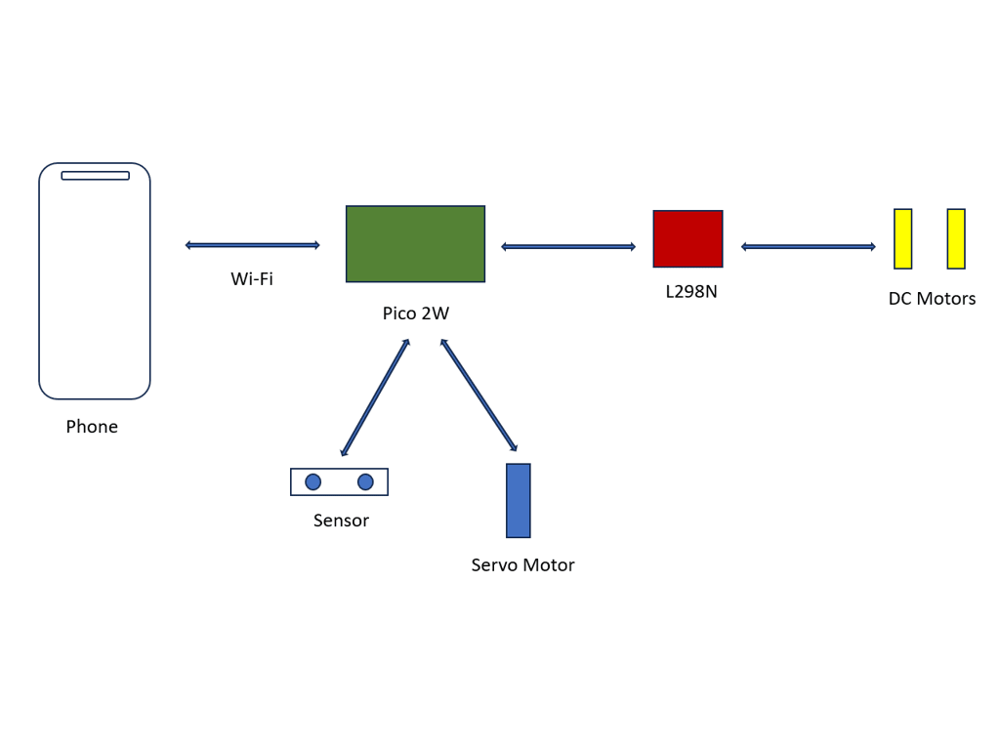
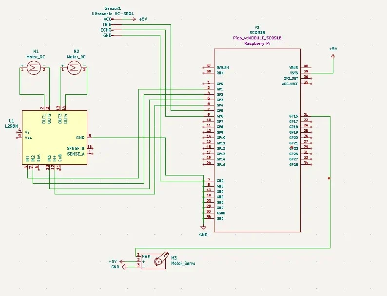

# RoboKart

Developed a phone-controlled robot using Raspberry Pi Pico 2W.

:::info

**Author**: Girleanu Andrei Alexandru \
**GitHub Project Link**: https://github.com/UPB-PMRust-Students/proiect-andreialex6

:::

## Description

My projects consists of developing a 2-wheeled robot that has in front of it a ball caster,
using Raspberry Pi Pico 2W. The robot will be controlled with a phone application.
I am also going to install a rotating sensor on the top of the robot that will send informations
to the application about the observed obstacles such as the distance and direction untill objects.

## Motivation

I always wanted to learn how to build a mini-car controlled by my phone. I find my ideea very interesting and I also think that it is a quite challenging project and, after a hard work, I am looking forward to play with the robot I created. It is also a useful project because, whenever you are bored, you can use the project as a matter of entertainment.

## Architecture

UI:
I am using a phone application connected via wi-fi to control the movement of the robort.
On the phone, I also receive data about detected objects nearby the robot.

Components: The phone communicates through wi-fi with the microcontroller. Pico is connected with L298N, which has its own connection with the DC motors. Pico is also connected with the sensor and the servo motor.

## Log

## Hardware

Raspberry Pi Pico 2W: Microcontroller with Wi-Fi integrated for the interraction of the application,
acts as the central controller.\
L298N Dual Motor Driver Module Red: Used for the rotation of the sensor placed above the robot.\
Micro Servo Motor SG90 180°: Controls steering.\
DC motor 3V-6V with 1:48 reducer: Drives the robot's wheels, providing high torque and controlled movement at low speeds.\
Ultrasonic sensor HC-SR04: It detects the obstacles and sends information to the application.\
Cables of all types, to connect the components: Male-to-Male, Male-to-Female, Female-to-Female.\
Breadboard: Where components are assembled together.\
Ball Caster: Used as a "front wheel".

### Schematics

### Bill of Materials

| Device | Usage | Price |
|--------|--------|--------|
| [Raspberry Pi Pico 2W](https://www.optimusdigital.ro/ro/placi-raspberry-pi/13327-raspberry-pi-pico-2-w.html?search_query=pico+2w&results=33) | Microcontroller with Wi-Fi for communication with the phone application | [39.66 lei](https://www.optimusdigital.ro/ro/placi-raspberry-pi/13327-raspberry-pi-pico-2-w.html?search_query=pico+2w&results=33) |
| [L298N Dual Motor Driver Module Red](https://www.optimusdigital.ro/ro/drivere-de-motoare-cu-perii/145-driver-de-motoare-dual-l298n.html?search_query=driver+motor&results=119) | Used for sensor rotation | [10.99 lei](https://www.optimusdigital.ro/ro/drivere-de-motoare-cu-perii/145-driver-de-motoare-dual-l298n.html?search_query=driver+motor&results=119) |
| [Micro Servo Motor SG90 180°](https://www.optimusdigital.ro/ro/motoare-servomotoare/2261-micro-servo-motor-sg90-180.html?search_query=sg90+180&results=3) | Controls steering | [11.99 lei x 2](https://www.optimusdigital.ro/ro/motoare-servomotoare/2261-micro-servo-motor-sg90-180.html?search_query=sg90+180&results=3) |
| [DC motor 3V-6V with 1:48 reducer](https://ardushop.ro/ro/electronica/752-motor-dc-3v-6v-cu-reductor-1-48-6427854009609.html?gad_source=1&gclid=Cj0KCQjwqv2_BhC0ARIsAFb5Ac-8VGoL9aczoUDEjPVoVkbA7AgP9sp1qTW2A3ZMXhVTh6p6pa4lTaUaAi8OEALw_wcB) | Drives the robot wheels | [7.14 lei x 2](https://ardushop.ro/ro/electronica/752-motor-dc-3v-6v-cu-reductor-1-48-6427854009609.html?gad_source=1&gclid=Cj0KCQjwqv2_BhC0ARIsAFb5Ac-8VGoL9aczoUDEjPVoVkbA7AgP9sp1qTW2A3ZMXhVTh6p6pa4lTaUaAi8OEALw_wcB) |
| [Ultrasonic sensor HC-SR04](https://www.optimusdigital.ro/ro/senzori-senzori-ultrasonici/9-senzor-ultrasonic-hc-sr04-.html?search_query=ultrasonic&results=47) | Detects objects | [6.49 lei](https://www.optimusdigital.ro/ro/senzori-senzori-ultrasonici/9-senzor-ultrasonic-hc-sr04-.html?search_query=ultrasonic&results=47) |
| [Male-to-Male cables](https://www.optimusdigital.ro/ro/fire-fire-mufate/884-set-fire-tata-tata-40p-10-cm.html?search_query=fire&results=430) | Connects components | [4.99 lei](https://www.optimusdigital.ro/ro/fire-fire-mufate/884-set-fire-tata-tata-40p-10-cm.html?search_query=fire&results=430) |
| [Male-to-Female cables](https://www.optimusdigital.ro/ro/fire-fire-mufate/878-set-fire-mama-tata-40p-30-cm.html?search_query=fire&results=430) | Connects components | [9.99 lei](https://www.optimusdigital.ro/ro/fire-fire-mufate/878-set-fire-mama-tata-40p-30-cm.html?search_query=fire&results=430) |
| [Female-to-Female cables](https://www.optimusdigital.ro/ro/fire-fire-mufate/882-set-fire-mama-mama-40p-30-cm.html?search_query=fire&results=430) | Connects components | [9.99 lei](https://www.optimusdigital.ro/ro/fire-fire-mufate/882-set-fire-mama-mama-40p-30-cm.html?search_query=fire&results=430) |
| [Breadboard](https://www.optimusdigital.ro/ro/prototipare-breadboard-uri/13244-breadboard-175-x-67-x-9-mm.html?search_query=breadboard&results=128) | Puts all pieces together | [11.99 lei](https://www.optimusdigital.ro/ro/prototipare-breadboard-uri/13244-breadboard-175-x-67-x-9-mm.html?search_query=breadboard&results=128) |

## Software

## Links
