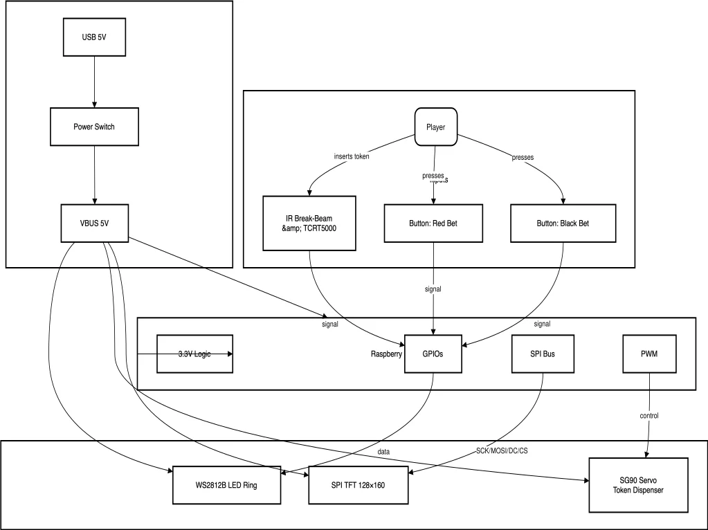
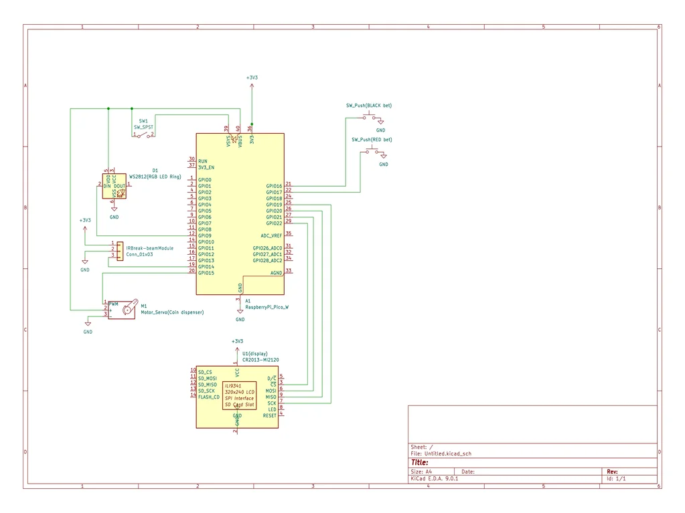

# Embedded Roulette Machine  
An interactive roulette game with LED ring, token detection and SPI display, powered by Raspberry Pi Pico 2W.

:::info
**Author**: Andrei Oprişor \
**GitHub Project Link**: https://github.com/UPB-PMRust-Students/proiect-andreioprisor.git 
:::

## Description  
A prototype of an electronic roulette: the player inserts a token, bets on red/black, the “roulette” with 24 LEDs “spins” and, if the correct color comes up, wins a token; if not, loses the token.

The device is equipped with an IR sensor for token detection, a TCRT5000 sensor to confirm token passage, a servo for dispensing the winning token, an SPI display for messages, and a WS2812B LED ring for the “spin” animation.

The brains of the device is a Raspberry Pi Pico 2W microcontroller, which manages all interactions between sensors, servo, LEDs and display.

## Motivation  
I chose this project to combine physical token detection with LED animations and SPI‐display messages, exploring integrations between sensors, motors and a graphical interface on a modern microcontroller (Pico W).

## Architecture  
The device is organized into four main blocks, interconnected by the Raspberry Pi Pico 2W:

- **Token I/O**  
  - *IR Break-beam Module* → detects slot entry  
  - *TCRT5000 Reflective Sensor* → confirms the token passed

- **Game Logic & Control**  
  - *Raspberry Pi Pico 2W* → reads sensors, “spins” LEDs, decides the winner and dispenses the winning token

- **User I/O**  
  - *2 × Buttons (Red / Black)* + *1 × Start Button* → bet inputs and game start  
  - *SPI 128×160 ST7735 Display* → shows messages (“You won!”, “You lost!”, “Choose a color!”, “Insert token!”, etc.)

- **Physical Output**  
  - *24 × WS2812B LEDs* (ring) → “spin” animation  
  - *Servo SG90* → token dispensing mechanism

### Game Flow Summary  
1. **Insert token** → IR break-beam ⏩ TCRT5000 confirms  
2. **Select bet** (Red/Black) + **Start**  
3. **LED “wheel” animation** via LED Ring: cycling lights  
4. **Determine result** (Red/Black) randomly  
5. **Display message** on the SPI ST7735 display  
6. **If the player wins** → `dispenseTokens()` via SG90  
7. **Reset** for the next player  

### Block Scheme  

## Log

| Week               | Completed                                                     |
|--------------------|---------------------------------------------------------------|
| **Week 5 – 11 May**   | Documentation milestone and setup            |
| **Week 12 – 18 May**  | |
| **Week 19 – 25 May**  |  |

## Hardware

1. **Raspberry Pi Pico 2W**  
   - Main microcontroller, handles SPI, GPIO, PWM, and Wi-Fi.

2. **IR Break-beam Module**  
   - Detects the token passing through the slot (~3–4 mm).

3. **TCRT5000 Reflective Sensor**  
   - Confirms the token’s passage vertically.

4. **Servo SG90**  
   - Barrier mechanism for holding and releasing tokens.

5. **37 × WS2812B LEDs** (ring)  
   - Colorful “spin” animation.

6. **SPI Display 128 × 160 ST7735**  
   - Shows status messages and results.

7. **3 × Buttons (Red, Black, Start)**  
   - Bet inputs and game start.

8. **5 V / 2 A Power Supply**  
   - Common power for Pico W, servo, and LEDs.

9. **PCB / Plexiglass Enclosure / Wiring**  
   - Mechanical support and connections.

## Schematics

## Bill of Materials

| Device                                | Usage                             | Price (RON) |
|---------------------------------------|-----------------------------------|------------:|
| Raspberry Pi Pico 2W                  | Microcontroller                   |         40  |
| IR Break-beam Module                  | Token entry detection             |         10  |
| TCRT5000 Reflective Sensor Module     | Token passage confirmation        |         10  |
| Servo SG90 9 g                        | Token dispensing                  |         12  |
| WS2812B LED Ring (37 LEDs)            | “Spin” animation ring             |         30  |
| SPI 128×160 ST7735 Display Module     | Game message display              |         35  |
| Push Button (Red / Black / Start) ×3  | Betting and START input           |          6  |
| Power Supply 5 V / 2 A                | Power                                |       25  |
| PCB + Enclosure + Wiring              | Assembly and structure            |       20  |
| **Total**                             |                                   |    **188**  |

## Software

| Library / Driver       | Description                                   | Usage                                         |
|------------------------|-----------------------------------------------|-----------------------------------------------|
| **Arduino-Pico**       | Core for RP2040                               | HAL for GPIO, SPI, PWM                        |
| **FastLED**            | WS2812B LED control                           | “Spin” LED animation                          |
| **Adafruit_ST7735**    | SPI driver for ST7735 display                  | Rendering game text and graphics              |
| **Adafruit_GFX**       | 2D graphics abstraction                       | Font and primitive drawing on the display     |
| **Servo.h**            | Servo motor control                           | Precise-angle token dispensing                |
| **TinyUSB / LWIP**     | USB / TCP-IP stack (optional Wi-Fi)            | OTA updates or remote monitoring              |

## Links

1. [ST7735 SPI Display – Adafruit](https://www.adafruit.com/product/358)  
2. [FastLED Library](https://github.com/FastLED/FastLED)  
3. [WS2812B LED Ring 24](https://docs.adafruit.com/adafruit-neopixel-uberguide)  
4. [TCRT5000 Sensor Tutorial](https://lastminuteengineers.com/tcrt5000-arduino-tutorial/)  
5. [IR Break-beam Module Guide](https://learn.sparkfun.com/tutorials/photointerrupter-hookup-guide)  