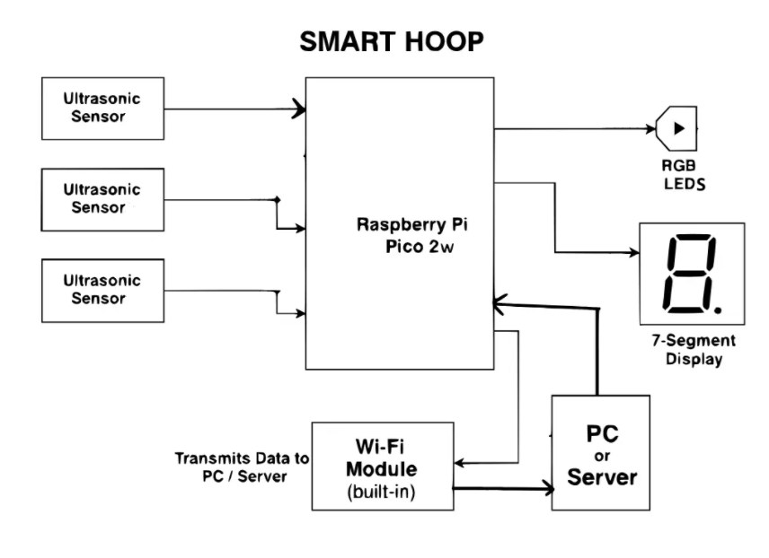

# Smart Hoop
A smart basketball hoop powered by a Raspberry Pi Pico 2W and Rust.

:::info

**Author**: Radu Andrei-Laurențiu \
**GitHub Project Link**: https://github.com/UPB-PMRust-Students/proiect-andreilaurentiuradu

:::

## Description
A smart basketball hoop built on a **Raspberry Pi Pico 2W**, using the **Rust** programming language and Embassy async framework.

### Features:
+ Ball trajectory detection using 3 ultrasonic sensors
+ Real-time shot quality feedback with RGB LEDs
+ Score counter on a 7-digit display

## Motivation
As a sports enthusiast and basketball fan, I wanted to create a project that helps players improve their shooting accuracy. This smart system provides instant, data-driven feedback to optimize performance during training.

## Architecture
**Processing Unit**: the Raspberry Pi Pico 2W interprets sensor data, decides on shot accuracy, updates score, and controls visual feedback.

**Feedback Layer**: includes the RGB LEDs and the 7-digit display to provide immediate, local feedback.

**Communication Layer**: the built-in Wi-Fi module transmits shot statistics to an external device for visualization or analysis.

**Data Acquisition Layer**: composed of ultrasonic sensors, which collect real-time data after each shot.

### Flow Summary:
After a shoot, the sensors will send the data via WIFI to PC for processing.
If the ball goes through the hoop, the score increases on the display.
Based on the shoot, the RGB LEDs will show one of the color:
- green for a perfect one
- yellow for a good one
- red for a fail

### Block Scheme

## Log

### Week 5 – 11 May

TO DO

### Week 12 – 18 May

TO DO

### Week 19 – 25 May

TO DO

## Hardware

The **Raspberry Pi Pico 2W** serves as the core controller, interfacing with the sensors and peripherals.

- **IOE-SR05 Ultrasonic sensors** : measure the distance between the ball and the rim to analyze the trajectory.
- **RGB LEDs** : light up based on shot accuracy (e.g., green for perfect, red for miss).
- **7-digits display** : increments the score when a basket is made.
- **Wireless module(built-in)**: sends data to a PC or mobile device for further analysis.

## Schematics

## Bill of Materials

| Device | Usage | Price |
|--------|--------|-------|
| [Raspberry Pi Pico 2](https://www.optimusdigital.ro/en/raspberry-pi-boards/13327-raspberry-pi-pico-2-w.html?search_query=raspberry+pi+pico+2&results=36) | Microcontroller | 40 RON x 2 |
| [Small basketball hoop](https://www.decathlon.ro/p/mini-cos-de-baschet-sk100-negru-auriu/_/R-p-346317?mc=8901657) | Skeleton | 65 RON
| [Jumpers](https://www.bitmi.ro/componente-electronice/40-fire-dupont-tata-mama-30cm-10504.html) | Connectivity | 8 RON |
| [IOE-SR05 Ultrasonic Distance Sensor with Serial Interface (3 - 5.5 V)](https://www.optimusdigital.ro/ro/senzori-senzori-de-distanta/8152-senzor-de-distana-ultrasonic-ioe-sr05-cu-interfaa-seriala-3-55-v.html?search_query=ultrasonic&results=47) | Getting data | 20 RON x 3
| [74HC595 2 Digits 7 Segment LED Display](https://www.optimusdigital.ro/en/led-displays/5605-74hc595-2-digits-7-segment-led-display.html?srsltid=AfmBOooWyQfFC3hv-Gp_PNDsWUwUZ5Xn56lRWl8V-sAAV3vUrpmnz7F7) ×9 | Visual display | 9 RON |
| [RGB LEDS](https://www.optimusdigital.ro/en/leds/5618-144-pcs-rgb-led-neopixels-ws2812b.html?gad_source=1&gad_campaignid=21360696715&gbraid=0AAAAADv-p3B2c0vBEDSIvQOgdRjvNBiy7&gclid=Cj0KCQjwoNzABhDbARIsALfY8VPsUSj4vp2kUib3_-QPmvutuwetDTkopSimuhPmvOD4ns7v9FyjVNIaAqXsEALw_wcB ) | Feedback for Player | 50 RON |

TOTAL: ~210 RON

## Software

| Crate / Tool | Role in Project | Description |
|--------------|------------------|-------------|
| [panic-probe](https://github.com/knurling-rs/panic-probe) | Panic handler | Provides minimal panic messages compatible with `defmt` |
| [defmt](https://github.com/knurling-rs/defmt) + [defmt-rtt](https://github.com/knurling-rs/defmt) | Logging framework | Used for real-time debug output over RTT, ideal for embedded systems |
| [rp-pico](https://github.com/rp-rs/rp-hal) | Board support crate | Hardware abstraction for the Raspberry Pi Pico 2 (RP2040 chip) |
| [embedded-hal](https://github.com/rust-embedded/embedded-hal) | Hardware abstraction layer | Unifies access to GPIO, I2C, PWM, and other peripherals across MCUs |
| [embedded-graphics](https://github.com/embedded-graphics/embedded-graphics) | Graphics library | Renders text and shapes on OLED displays |
| [fugit](https://github.com/knurling-rs/fugit) | Time utilities | Manages time-based tasks like LED blinking and debouncing |
| [embedded-nal](https://github.com/rust-embedded-community/embedded-nal) | Networking abstraction | Defines traits for network communication (TCP/UDP) over Wi-Fi modules |
| [esp-idf-sys](https://github.com/esp-rs/esp-idf-sys) / [arduino-rs](https://github.com/Rahix/arduino-hal) | Platform support crates | Enables wireless networking and board support for ESP32 or Arduino |
| [serde](https://github.com/serde-rs/serde) | Serialization/deserialization | Converts score and analytics data to/from formats like JSON |
| [reqwest](https://github.com/seanmonstar/reqwest) / [rumqttc](https://github.com/bytebeamio/rumqtt) | Network clients | Sends data to servers using HTTP or MQTT |
| [nalgebra](https://github.com/dimforge/nalgebra) | Math and linear algebra | Used for trajectory estimation and analytics (e.g. angle, velocity) |

## Links
1. [Connect ultrasonic sensors](https://www.youtube.com/watch?v=Xn_oAiH0ZsM)
2. [RGB LED - Raspberry Pi Pico](https://www.youtube.com/watch?v=uUcs37StEoY)
3. [Connecting To The Internet With The Raspberry Pi](https://www.youtube.com/watch?v=GiT3MzRzG48)
