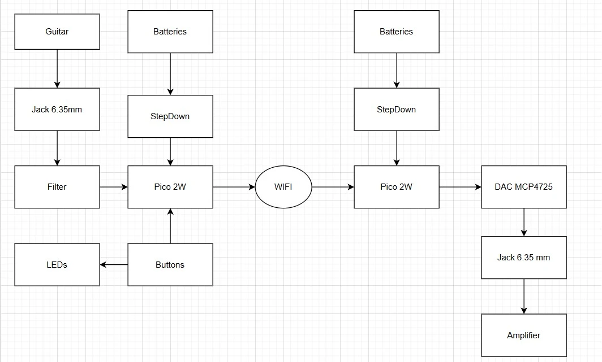
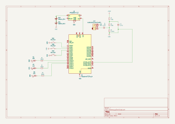
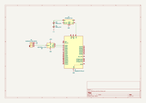

# Wireless Guitar Signal Transmitter
A transmitter and a receiver that transmit wireless the guitar signal and modify it.

:::info 

**Author**: Salomia Andrei-Gabriel \
**GitHub Project Link**: [link_to_github](https://github.com/UPB-PMRust-Students/proiect-andreisalomia)

:::

## Description

This project implements a wireless guitar transmitter based on two Raspberry Pi Pico 2W boards, enabling basic audio transmission over Wi-Fi from a guitar to an amplifier. Additionally, the system applies simple real-time audio effects using software processing: **mute**, **tremolo**, and **clipping**.

## Motivation

I am passionate about guitar, and I wanted to see if it is possible to create a basic wireless transmitter using low-cost components. Through this project, I am exploring how can I interact with real-time audio while also making my first steps in the world of embedded systems.

## Architecture 

- **Transmitter (Pico 1)**:
  - Audio input from electric guitar (6.35 mm jack)
  - Signal filtering using capacitors
  - Analog-to-Digital Conversion (ADC)
  - Apply software audio effects (tremolo, mute, clipping)
  - Transmit data via Wi-Fi (UDP)

- **Receiver (Pico 2)**:
  - Receive audio data over Wi-Fi
  - Digital-to-Analog Conversion using MCP4725 DAC (I2C)
  - Output to amplifier

- **Effect Control**:
  - 3 buttons to switch between effects
  - 3 LEDs indicating the selected effect

## System Diagram



---

## Log

<!-- write your progress here every week -->

### Week 28 Apr - 4 May
- Started the documentation for the project, cloned the repository and created the KiCad schematic for the transmitter and receiver, which I'll probably
modify later.

### Week 12 - 18 May

### Week 19 - 25 May

## Hardware

| Device | Purpose | Usage |
|--------|---------|-------|
| Raspberry Pi Pico W (2 pcs) | Main microcontrollers | Used for Wi-Fi audio transmission and reception, real-time effect processing |
| MCP4725 DAC Board | Digital-to-Analog Conversion | Converts received digital audio into analog output on the receiver side |
| Breadboard HQ 400p (2 pcs) | Prototyping | Assembles and connects the circuit components temporarily |
| Step-Down Converter MP1584EN (2 pcs) | Voltage regulation | Converts 2x18650 battery voltage down to 3.3V for Pico and peripherals |
| Battery Holders for 2x 18650 (2 pcs) | Power supply | Supplies portable power for the transmitter and receiver |
| Jack 6.35mm Connectors (2 pcs) | Audio interfacing | Used for guitar input and amplifier output |
| Buttons (3 pcs) | User input | Selects between different audio effects (mute, tremolo, clipping) |
| LEDs (3 pcs) | Visual feedback | Indicates the currently selected audio effect |
| Capacitors: |
| - 220nF | AC coupling | Removes DC offset from the guitar input |
| - 4.7nF | Signal filtering | Used in low-pass filters for anti-aliasing |
| - 100nF | Power decoupling | Stabilizes the power supply rails for Pico and DAC |
| Jumper wires (set) | Connections | Breadboard wiring between all components |
| Headers 1.27mm (2 pcs) | Pico connection | Allows mounting the Pico onto the breadboard securely |

### Schematics

---


---

### Bill of Materials

<!-- Fill out this table with all the hardware components that you might need.

The format is 
```
| [Device](link://to/device) | This is used ... | [price](link://to/store) |

```

-->
| Device | Usage | Price |
|--------|-------|-------|
| [Raspberry Pi Pico 2W](https://www.optimusdigital.ro/en/raspberry-pi-boards/13327-raspberry-pi-pico-2-w.html?srsltid=AfmBOorfxsKBK_R9DsBvAqh9ukOUWlrtqjYqnyMHTle13vWuMTmG6LAA)| Main microcontroller (2 units) | 2 × 39,66 RON = 79,32 RON |
| [Breadboard HQ 400 Points](https://www.optimusdigital.ro/en/breadboards/44-400p-hq-breadboard.html?search_query=Breadboard+HQ+400+Points&results=6)| Prototyping (2 units) | 2 × 4,56 RON = 9,12 RON |
| [Suport de Baterii 2x18650](https://www.optimusdigital.ro/ro/suporturi-de-baterii/941-suport-de-baterii-2-x-18650.html?search_query=0104110000008671&results=1)| Power supply (2 units) | 2 × 3,99 RON = 7,98 RON |
| [Modul DC-DC Step-Down MP1584EN](https://www.optimusdigital.ro/ro/surse-coboratoare-reglabile/166-modul-dc-dc-step-down-mp1584en.html?search_query=MP1584EN&results=2)| Voltage regulation (2 units) | 2 × 6,49 RON = 12,98 RON |
| [Kit Rezistoare 250 buc Plusivo](https://www.optimusdigital.ro/ro/componente-electronice-rezistoare/10928-plusivo-kit-250-buc-rezistoare.html?srsltid=AfmBOooS_MK_DSIFq6qoQYJqFhBMF1c8LAm8dI19q3fKIhulvq3Mpd8m)| Biasing, Filters | 14,99 RON |
| [Set Fire Mama-Tata pentru Breadboard](https://www.optimusdigital.ro/ro/fire-fire-mufate/92-fire-colorate-mama-tata-40p.html?search_query=Set+Fire+Mama-Tata+pentru+Breadboard&results=18)| Connections | 7.99 RON |
| [Header Pini 1.27mm 40p](https://www.optimusdigital.ro/ro/componente-electronice-headere-de-pini/8799-header-de-pini-tata-de-127-mm-40p.html?search_query=40p&results=41)| Mounting Pico on breadboard | (2 pcs) 2.56 RON |
| [Buton 6x6x6](https://www.optimusdigital.ro/ro/butoane-i-comutatoare/1119-buton-6x6x6.html?search_query=6x6x6&results=1)| User input| (2 sets of 3) 0.72 RON |
| [LED-uri 5mm și 3mm roșu/verde/galben]| Visual feedback| (12 pcs) 4.68 RON  |
| [MCP4725 Breakout DAC Board](https://www.robofun.ro/mcp4725-breakout-board-12-bit-dac-i2c.html?gad_source=1&gbraid=0AAAAApSyPJXzKMTSv3QXwnuq2FRlqgSjR&gclid=Cj0KCQjwiLLABhCEARIsAJYS6uniR1284s5gtHtuYNV6sznW5xQ2xUFsa9Gz0afqaUugftkyoJm-OtIaAkX9EALw_wcB)| Digital-to-Analog conversion | 38,86 RON |
| [Condensator MC5-220N (220nF, Poliester)](https://www.tme.eu/ro/details/mc5-220n/condensatoare-de-film-tht/kemet/r82dc3220dq60k/)| AC coupling (audio input) | (4 pcs) 5,77 RON |
| [Jack Audio 6.35mm ACJM-IH](https://www.tme.eu/ro/details/acjm-ih/conectorii-jack/amphenol/)| Guitar input and amplifier output | (2 pcs) 15,24 RON |
| [Condensator FG28C0G1H472JNT06 (4.7nF, ceramic C0G)](https://www.tme.eu/ro/details/fg28c0g1h472jnt06/condensatoare-mlcc-tht/tdk/)| Low-pass filter | (10 pcs) 5,92 RON |
| [Condensator K104K10X7RF5UL2 (100nF, ceramic X7R)](https://www.tme.eu/ro/details/k104k10x7rf5ul2/condensatoare-ceramice/vishay/)| Power decoupling | (3 pcs) 2,89 RON |

---


## Software

<!-- | Library | Description | Usage |
|---------|-------------|-------|
| [st7789](https://github.com/almindor/st7789) | Display driver for ST7789 | Used for the display for the Pico Explorer Base |
| [embedded-graphics](https://github.com/embedded-graphics/embedded-graphics) | 2D graphics library | Used for drawing to the display | -->

## Links

<!-- Add a few links that inspired you and that you think you will use for your project -->

<!-- 1. [link](https://example.com)
2. [link](https://example3.com) -->
...