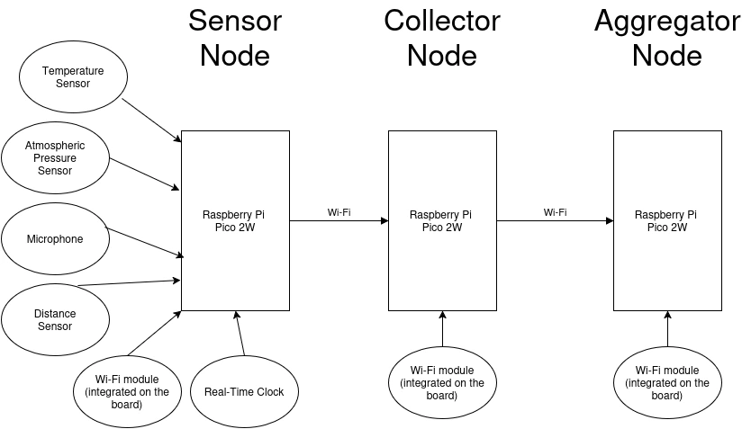

# City Data Collector
A network of sensors which can collect enviromnent data and transmit it without internet access.

:::info 

**Author**: Andrei Stan \
**GitHub Project Link**: [link_to_github](https://github.com/UPB-PMRust-Students/proiect-Andreis0605/tree/main)

:::

## Description

This project aims to collect and process environmental data within a city using a network of sensors placed at fixed locations (bus stops). The data to be collected initially includes: **temperature**, **atmospheric pressure**, and **noise level**. Data transmission to the central server will be carried out without using an internet connection, relying solely on communication between nodes in the network.

The network will consist of three types of nodes:

- **Sensor nodes**: Collect data from the field, installed at bus stops.  
- **Collector nodes**: Mobile units that gather data from sensor nodes, installed on buses.  
- **Aggregator nodes**: Receive all the data from the collectors, installed at the bus depot.

Several laboratories that are particularly relevant to the implementation of this project include:
- **Lab02: GPIO**
- **Lab04: Asynchronous Development**
- **Lab06: Inter-Integrated Circuit**
- **Lab07: Wi-Fi**

## Motivation

I chose this project because it addresses a real need for monitoring urban environmental quality, leveraging existing infrastructure (bus stops and buses) to create an efficient and autonomous data collection network without relying on internet connectivity. This system can support local authorities in making informed decisions to improve living conditions.

## Architecture

## Log

## Hardware

The three types of nodes will be based on Raspberry Pi Pico 2W boards. Sensor nodes will be equipped with a temperature and atmospheric pressure sensor, as well as a sound sensor. Additionally, these nodes will include distance sensors to detect when a bus is at the stop, allowing data transfer to begin. A Real-Time Clock (RTC) will also be used to record the exact time when the data is collected.

Collector and Aggregator nodes will consist of Raspberry Pi Pico 2W boards, which will store and forward the collected data.

## Bill of Materials

| Device | Usage | Price |
|--------|--------|-------|
| [Raspberry Pi Pico 2W](https://datasheets.raspberrypi.com/picow/pico-2-w-datasheet.pdf) | Microcontroller | [39,66 RON](https://www.optimusdigital.ro/ro/placi-raspberry-pi/13327-raspberry-pi-pico-2-w.html?search_query=+pico+pi+2+W&results=33) |
| [BMP180](https://ro.mouser.com/datasheet/2/783/BST-BMP180-DS000-1509579.pdf) | Temperature and Pressure Sensor | [6,98 RON](https://www.optimusdigital.ro/ro/senzori-senzori-de-presiune/149-modul-senzor-de-temperatura-si-presiune-bmp180.html?search_query=BMP180&results=7) |
| [HC-SR04+](https://www.optimusdigital.ro/ro/index.php?controller=attachment&id_attachment=1) | Distance Sensor | [14,99 RON](https://www.optimusdigital.ro/ro/senzori-senzori-ultrasonici/2328-senzor-ultrasonic-de-distana-hc-sr04-compatibil-33-v-i-5-v.html?search_query=HC-SR04+&results=32) |
| [DS3231](https://www.analog.com/media/en/technical-documentation/data-sheets/ds3231.pdf) | Real Time Clock | [18,99 RON](https://www.optimusdigital.ro/ro/altele/1102-modul-cu-ceas-in-timp-real-ds3231.html?search_query=DS3231&results=6) |
| [MAX4466](https://www.analog.com/media/en/technical-documentation/data-sheets/MAX4465-MAX4469.pdf) | Microphone | [14,51 RON](https://www.emag.ro/microfon-cu-amplificare-cu-max4466-ajustabil-ai1082/pd/DFLMTFMBM/) |

## Software

| Library | Description | Usage |
|---------|-------------|-------|
| [cyw43](https://github.com/embassy-rs/embassy/tree/main/cyw43) | Wi-Fi chip driver | Used for communication with the integrated Wi-Fi chip |
| [embedded-hal](https://github.com/golemparts/rppal) | Hardware Abstraction Layer | Used for I2C and GPIO control |
| [embassy](https://github.com/embassy-rs/embassy) | Async framework  | Used for async task scheduling, timers, and peripheral drivers |

## Links

