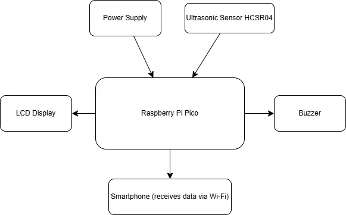
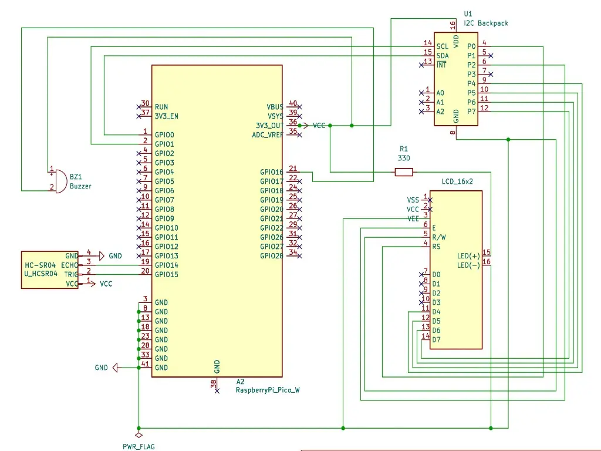

# Water Level Monitoring System
Measures the water level in a container.

:::info 

**Author**: Calu Andrei-Daniel \
**GitHub Project Link**: https://github.com/UPB-PMRust-Students/proiect-andreic13

:::

## Description

The project aims to measure the water level in real time using a Raspberry Pi Pico board and an ultrasonic sensor. The sensor detects the water level by calculating the time it takes for sound waves to travel to the water surface and back, and the result is displayed on an LCD. Additionally, a buzzer alerts when the water level is too high.

## Motivation

**The idea for this project** came from a conversation with a friend who explained how his dad uses a water tank to estimate recent rainfall. This inspired me to create a simple and practical system to automatically measure water levels using a Raspberry Pi Pico and an ultrasonic sensor. In agriculture, depending on the amount of rainfall collected in an initially empty tank, the farmer can decide which type of fieldwork is most suitable. By turning this manual observation into a digital process, the system improves accuracy and convenience, making it a useful tool for small-scale farms and rural applications.

## Architecture

*Main Components used in the Water Level Monitoring System project:*

**1-Raspberry Pi Pico**: Microcontroller unit that processes data from the sensor and controls outputs.

**2-Ultrasonic Sensor HC-SR04**: Measures the distance to the water surface to determine the water level.

**3-LCD Display**: Displays the measured water level in real time. Also, prints appropiate messages based on the water level.

**4-Buzzer**: Emits a sound alert if the water level is too high.

**5-Smartphone**: Receives water level data via built-in Wi-Fi for remote monitoring.

**6-Power Supply**: Provides power to the entire circuit.

## Log

<!-- write every week your progress here -->

### Week  -  May

### Week  -  May

### Week  -  May

## Hardware

The Raspberry Pi Pico W serves as the core microcontroller for the water level monitoring system. It features built-in Wi-Fi, which allows it to transmit data wirelessly to a smartphone on the same network. The system uses an HC-SR04 ultrasonic sensor to measure the water level in a tank by calculating the distance to the surface. The measured data is displayed on a 16x2 LCD screen using the I2C interface for efficient communication. A buzzer is used to alert the user when water levels fall outside predefined thresholds. The entire setup is powered by a power supply and assembled using a breadboard and jumper wires for quick prototyping.

### Schematics

### Bill of Materials

| Device                            | Usage                        | Price       |
|-----------------------------------|------------------------------|-------------|
| Raspberry Pi Pico W x2            | The microcontroller          | [79,22 RON](https://www.optimusdigital.ro/en/raspberry-pi-boards/13327-raspberry-pi-pico-2-w.html?search_query=raspberry+pi+pico+2&results=36) | 
| HC-SR04+ Ultrasonic Sensor        | Measures distance            | [14,99 RON](https://www.optimusdigital.ro/ro/senzori-senzori-ultrasonici/2328-senzor-ultrasonic-de-distana-hc-sr04-compatibil-33-v-i-5-v.html?search_query=senzor+ultrasonic&results=42) |
| LCD Display (16x2)                | Displays water level         | [11,00 RON](https://sigmanortec.ro/LCD-1602-p125700685) |
| HC-SR04 Ultrasonic Sensor Support | Holds the sensor             | [4,99 RON](https://www.optimusdigital.ro/ro/mecanica-accesorii-de-prindere/211-suport-pentru-senzor-ultrasonic-hc-sr04.html?search_query=senzor+ultrasonic&results=42)  |
| Active Buzzer Module              | Sound Alert                  | [3,57 RON](https://sigmanortec.ro/Modul-buzzer-activ-p136261325)  |
| Breadboard HQ (830 Points)        | Prototyping board            | [9,98 RON](https://www.optimusdigital.ro/ro/prototipare-breadboard-uri/8-breadboard-830-points.html)  |
| Jumper Wires M-F (15 cm, 40p)     | Connecting components        | [7,99 RON](https://www.optimusdigital.ro/ro/toate-produsele/877-set-fire-mama-tata-40p-15-cm.html)  |
| Resistors (330Ω x10)              | LCD Backlight, Pull-ups, etc | [0,15 RON](https://www.optimusdigital.ro/ro/componente-electronice-rezistoare/7794-rezistor-3-w-033-.html?gad_source=1&gclid=Cj0KCQjw2tHABhCiARIsANZzDWqnykDpLlPpah0CTaAy0VjRNIQ4zMaC14ScpLXnBJU6PH_bIniU5ZYaAkaeEALw_wcB)  |
| Resistors (10kΩ x10)              | LCD Backlight, Pull-ups, etc | [0,15 RON](https://www.electronicmarket.ro/ro/product/rezistor-10k-025-watt?gad_source=1&gclid=Cj0KCQjw2tHABhCiARIsANZzDWp0jKq0nljob-80ObhxSmjnB2PDugY8a8t4_HNZuI4vX_COFNQF3VYaAuKtEALw_wcB)  |
| Pin Header (2.54mm, 40p, White)   | Connectors/Pins              | [0,99 RON](https://www.optimusdigital.ro/ro/componente-electronice-headere-de-pini/463-header-de-pini-alb-254-mm-40p.html)  |

## Software

| Library | Description | Usage |
|---------|-------------|-------|
| [cortex-m](https://crates.io/crates/cortex-m)                     | Low-level access to Cortex-M processors         | Provides core CPU primitives and access                                  |
| [cortex-m-rt](https://crates.io/crates/cortex-m-rt)               | Cortex-M runtime support                        | Handles microcontroller startup, vector table, memory setup              |
| [embassy-executor](https://crates.io/crates/embassy-executor)     | Async task executor for Embassy                 | Manages asynchronous tasks like sensor reading and Wi-Fi communication   |
| [embassy-rp](https://crates.io/crates/embassy-rp)                 | Embassy support for Raspberry Pi RP2040         | Provides HAL implementations for RP2040 peripherals                      |
| [embassy-time](https://crates.io/crates/embassy-time)             | Timing utilities for Embassy                    | Provides async delays, timers, and timeouts                              |
| [embassy-net](https://crates.io/crates/embassy-net)               | TCP/IP network stack for Embassy                | Enables Wi-Fi-based communication and networking                         |
| [embassy-sync](https://crates.io/crates/embassy-sync)             | Synchronization primitives for Embassy          | Async mutexes, channels, and coordination primitives                     |
| [embedded-hal](https://crates.io/crates/embedded-hal)             | Hardware abstraction layer for embedded systems | Standard blocking traits used by many drivers                            |
| [embedded-hal-async](https://crates.io/crates/embedded-hal-async) | Asynchronous HAL traits                         | Used for drivers that support async behavior, like I2C, SPI, etc.        |
| [cyw43](https://crates.io/crates/cyw43)                           | Wi-Fi driver for CYW43 chips (used by Pico W)   | Controls the Pico W’s built-in Wi-Fi module                              |
| [ag-lcd](https://crates.io/crates/ag-lcd)                         | LCD driver with I2C/PCF8574 support             | Drives 16x2 LCDs connected via I2C                                       |
| [log](https://crates.io/crates/log)                               | Logging facade for Rust                         | Provides a universal logging interface for embedded and std environments |
| [defmt](https://crates.io/crates/defmt)                           | Efficient logging for embedded                  | Compact, structured logging for low-memory targets                       |
| [defmt-rtt](https://crates.io/crates/defmt-rtt)                   | RTT target for defmt logging                    | Outputs logs over RTT for debug probes                                   |
| [panic-probe](https://crates.io/crates/panic-probe)               | Panic handler with debug output                 | Sends panic messages over defmt for debugging                            |
| [panic-halt](https://crates.io/crates/panic-halt)                 | Minimal panic handler                           | Halts execution on panic without debug output                            |
| [static\_cell](https://crates.io/crates/static_cell)              | Static allocation utilities                     | Statically allocates buffers or singletons needed in no-std environments |
| [heapless](https://crates.io/crates/heapless)                     | Heapless data structures                        | Provides `Vec`, `String`, etc., that work without dynamic memory         |
| [futures](https://crates.io/crates/futures)                       | Async utilities for Rust                        | Foundation for writing async logic, required by Embassy and drivers      |
| [embedded-graphics](https://crates.io/crates/embedded-graphics)   | 2D drawing primitives                           | Used for rendering text or graphics on displays                          |
| [st7789](https://crates.io/crates/st7789)                         | Display driver for ST7789 LCDs                  | Driver for displays often used with Pico Explorer or similar boards      |
| [display-interface](https://crates.io/crates/display-interface)   | Display interface traits                        | Abstraction layer between graphics drivers and display hardware          |
| [byte-slice-cast](https://crates.io/crates/byte-slice-cast)       | Safe casting between byte slices and arrays     | Useful for dealing with binary data                                      |
| [micro-rand](https://crates.io/crates/micro-rand)                 | No-std random number generator                  | Used to add randomness, e.g., for simulating events or randomness        |
| [shared-bus](https://crates.io/crates/shared-bus)                 | Shared I2C/SPI bus management                   | Enables multiple devices to safely share a bus                           |
| [no\_std\_strings](https://crates.io/crates/no_std_strings)       | String types for no-std environments            | Helps work with strings when heap allocation isn’t available             |

## Links

<!-- Add a few links that inspired you and that you think you will use for your project -->

1. [Ultrasonic Water Level Indicator using HC-SR04 & Arduino](https://www.youtube.com/watch?v=o5Qo_I0TdOY&ab_channel=talkingStuffNetwork)