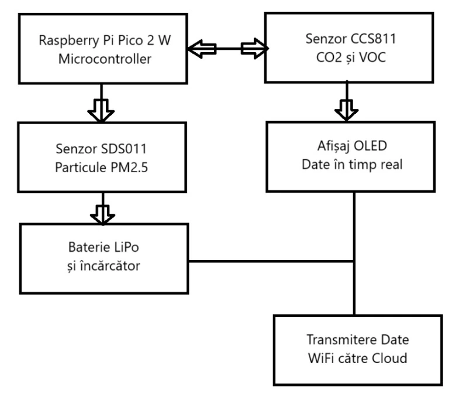

# Portable Air Quality Measurement System
A one line project description

:::info 

**Author**: Crantea Antonio-Cristian \
**GitHub Project Link**: [link_to_github](https://github.com/UPB-PMRust-Students/proiect-AntonioCC147)

:::

## Description

The project consists of a portable device that measures air quality, monitoring parameters such as CO₂ levels, volatile organic compounds (VOCs) and PM2.5 particles. The data is displayed in real time on an OLED screen and transmitted via WiFi to a server for storage and analysis. The project will be implemented on a Raspberry Pi Pico 2 W, using the Rust language and integrating specialized sensors for precise measurements. The device will operate on a LiPo battery for portability and autonomy.

## Motivation

The motivation for this project is that I have always wanted to create something real, tangible that I could use for something. The idea of ​​an air quality filter started from the area where I live, namely Crângasi where there is a panel that displays the air quality in the area. From there I took this idea and thought of trying to recreate such a project myself.

## Architecture 



The project architecture consists of several software and hardware components, which work together to collect, display and transmit air quality data. The main architectural components and the connections between them are:
1. Data collection module (Sensors)
- Includes the CCS811 (for CO₂ and VOC) and SDS011 (for PM2.5 particles) sensors.
- These sensors are controlled by dedicated Rust drivers and communicate via I2C/UART with the microcontroller.
2. Main controller (Raspberry Pi Pico 2 W)
- Runs the code written in Rust, using frameworks such as embassy or rtic for concurrent tasks.
- Integrates the HAL (Hardware Abstraction Layer) libraries for interaction with sensors and external components.
3. Display module
- The OLED is used to display the measured values ​​in real time.
- Controlled by the ssd1306 library.
4. Communication module
- Data transmission to a server is done via WiFi using the abstractions provided by embedded-nal.
- Data can be serialized to JSON using the serde and serde_json libraries.
5. Power module
- Includes the LiPo battery and a TP4056 charging/protection module.
- Ensures system portability and autonomy.

## Log

<!-- write your progress here every week -->

### Week 5 - 11 May

Soon...

### Week 12 - 18 May

Soon...

### Week 19 - 25 May

Soon...

## Hardware

The project uses the following hardware components:

- Raspberry Pi Pico 2 W – Microcontroller with integrated WiFi, compatible with Rust, which manages the sensors, display and communication.
- CCS811 Sensor – Measures CO₂ and volatile organic compounds (VOC) concentrations in the air.
- SDS011 Sensor – Detects PM2.5 particulate matter, relevant for air pollution assessment.
- 1.44” LCD module (ST7735S) – Displays collected data in real time, via SPI interface, at a resolution of 128x128 px.
- Li-Ion battery 3.7V, 1200 mAh – Provides portable power to the device.
- Battery holder – Allows safe connection of the battery to the microcontroller.
- TP4056 charger module – Manages charging and protection of the Li-Ion battery.
- Breadboard and jumper cables – Facilitates connection and testing of circuits during the prototyping phase.
- Case – Provides protection and portability of the assembly.

### Schematics

Soon...

### Bill of Materials

<!-- Fill out this table with all the hardware components that you might need.

The format is 
```
| [Device](link://to/device) | This is used ... | [price](link://to/store) |

```

-->

| Device | Usage | Price |
|--------|--------|-------|
| [Raspberry Pi Pico W](https://www.raspberrypi.com/documentation/microcontrollers/raspberry-pi-pico.html) | The microcontroller | [35 RON](https://www.optimusdigital.ro/en/raspberry-pi-boards/12394-raspberry-pi-pico-w.html) |
| [CCS811 Sensor](https://www.alldatasheet.com/view.jsp?Searchword=Ccs811&gad_source=1&gbraid=0AAAAADcdDU_F4Pc-M2_tAcBmuLUgEsPky&gclid=Cj0KCQjwlMfABhCWARIsADGXdy9es8Gq25MHrkqpIDHPUDvC4Cd2_QtlVInSv-9lcE9behNyh7-0RpEaAsBjEALw_wcB) | CO₂ sensor | [97 RON](https://www.bitmi.ro/senzor-monitorizare-calitate-aer-co2-ccs811-compatibil-arduino-11164.html) |
| [SDS011 Sensor](https://learn.watterott.com/sensors/sds011/) | PM2.5 particle sensor | [54 RON](https://ardushop.ro/ro/senzori/1391-senzor-optic-pentru-particule-fine-6427854020314.html) |
| [LCD Module ST7735S](https://www.optimusdigital.ro/ro/optoelectronice-lcd-uri/870-modul-lcd-144.html) | Displays visual information | [28 RON](https://www.optimusdigital.ro/ro/optoelectronice-lcd-uri/870-modul-lcd-144.html) |
| [Li-Ion battery .7V, 1200 mAh](https://www.emag.ro/acumulator-li-ion-7v-1200mah-capacitate-mare-reincarcabil-dimensiuni-65-x-17-x-12-mm-albastru-foxmag24-acumulatoralbastru/pd/DGSFNWYBM/) | Ensures the portability and autonomy of the device | [12 RON](https://www.emag.ro/acumulator-li-ion-7v-1200mah-capacitate-mare-reincarcabil-dimensiuni-65-x-17-x-12-mm-albastru-foxmag24-acumulatoralbastru/pd/DGSFNWYBM/) |
| [Battery holder](https://www.emag.ro/suport-priza-baterie-terminale-arc-18650-3-7vdc-00797/pd/DLBL7FYBM/) | Secure connection and fixation of portable battery | [5 RON](https://www.emag.ro/suport-priza-baterie-terminale-arc-18650-3-7vdc-00797/pd/DLBL7FYBM/) |
| [Li-Ion battery charger module (TP4056)](https://www.alldatasheet.com/view.jsp?Searchword=Tp4056%20datasheet&gad_source=1&gbraid=0AAAAADcdDU_-Dk88ddzb5rAj3U-4aOqTd&gclid=Cj0KCQjwlMfABhCWARIsADGXdy_AM16TaMYU8QGKVtIUIcAcZIh-08prfFD1d7BlyRBK6-3Q8_IVKTIaAuj3EALw_wcB) | Charges, protects and manages the Li-Ion battery. | [12 RON](https://www.emag.ro/modul-incarcare-li-ion-li-pol-tp4056-cu-mufa-usb-c-3874784221268/pd/DGLGZKYBM/) |
| [Breadboard](https://www.optimusdigital.ro/ro/prototipare-breadboard-uri/8-breadboard-830-points.html?search_query=Breadboard+HQ&results=145) | Prototyping and organizing electronic circuits without soldering | [10 RON](https://www.optimusdigital.ro/ro/prototipare-breadboard-uri/8-breadboard-830-points.html?search_query=Breadboard+HQ&results=145)

## Software

| Library | Description | Usage |
|---------|-------------|-------|
| [embedded-hal](https://github.com/rust-embedded/embedded-hal) | Hardware abstraction layer for embedded systems | Provides a common set of traits for interfacing with hardware peripherals |
| [rp2040-hal](https://github.com/rp-rs/rp-hal) | Hardware abstraction layer for Raspberry Pi RP2040 microcontroller | Used to access and control peripherals of the Raspberry Pi Pico |
| [st7735-lcd](https://github.com/MKme/ST7735-Color-TFT-Display) | Driver for ST7735 LCD over SPI | Used to control the ST7735 display module |
| [ccs811](https://github.com/maarten-pennings/CCS811) | Driver for CCS811 air quality sensor | Used to read CO₂ and TVOC data from the CCS811 sensor |
| [sds011](https://github.com/paulvha/sds011) | Driver for SDS011 particulate matter sensor | Used to read PM2.5 and PM10 data from the SDS011 sensor |
| [embassy](https://github.com/embassy-rs/embassy) | Asynchronous embedded framework | Used for async, real-time embedded applications |
| [heapless](https://github.com/japaric/heapless) | Data structures without dynamic allocation | Provides fixed-capacity data structures useful in no_std environments |
| [serde](https://github.com/serde-rs/serde) & [serde_json](https://github.com/serde-rs/json) | Serialization framework and JSON support | Used to serialize and deserialize data, e.g., for sending to a server |
| [embedded-nal](https://github.com/rust-embedded-community/embedded-nal) | Network abstraction layer for embedded systems | Provides traits for abstracting network sockets and communication |

## Links

<!-- Add a few links that inspired you and that you think you will use for your project -->

1. [link](https://example.com)
2. [link](https://example3.com)
...