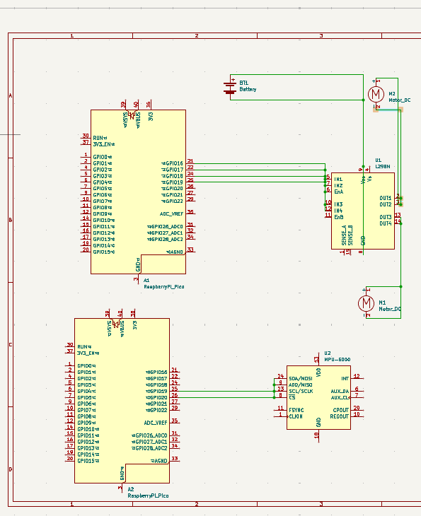

# Hand controlled Wi-Fi car
A car controlled based on hand gestures

:::info 

**Author**: Popa Bogdan-Florin \
**GitHub Project Link**: https://github.com/UPB-PMRust-Students/proiect-BogdanPopa123

:::

## Description
A device that acts as a UDP server and waits for another device to send commands to the first one.
Based on the command, the car will move accordingly


+ The system utilizes a gyroscope to detect the inclination which orders the command

+ A motor controller to control the motors

+ The commands are sent via Wi-Fi

+ The gyroscope will send its params to the UDP server (the car) via Wi-Fi, and according to that it will action the motor controller


## Motivation

This project represents the perfect opportunity for me to step into the embedded world, while also 
learning a new programming language, Rust, highly praised for its speed and safety.

I ve always been pasionate about techology. As a kid I always wondered about how toys are made, especially
remote control cars. This project also helps me have a better understanding of computer networks.

## Architecture 
+ 2 x  **Raspberry Pi Pico 2W 2350** - the microcontrollers of the project, serving as the "brains" of the project

+  **L298N motor driver** - the units that commands the two motors

+ 2 x **motor** - does the moving

+ 2 x **Wi-Fi chip** - responsable for the communication between the two devices


## Log

<!-- write every week your progress here -->

### Week  -  May


### Week  -  May


### Week  -  May
 

## Hardware

1. **Raspberry Pi Pico 2W**:
- **Purpose**: Controls all components.
- **Function**: Acts as the main controller, controlling all other modules

2. **Motors**:
- **Purpose**: Helps the car move.
- **Function**: Used to move the car.

3. **L298N motor controller**:
- **Purpose**: Controls the motors.
- **Function**: Serves as the controller of the motors, dictating their speed and rotation

4. **MPU-6500**:
- **Purpose**: Gyroscope and accelerometer.
- **Function**: Measures the acceleration and incline on all 3 axes.

### Hardware Overview:
- The **Raspberry Pi Pico** controls and coordinates all components.
- The **motors** are used to move the car.
- The **MPU-6500** Measures the acceleration and incline on all 3 axes
- The **L298** Serves as the controller of the motors, dictating their speed and rotation


### Schematics


### Bill of Materials

<!-- Fill out this table with all the hardware components that you might need.

The format is 
```
| [Device](link://to/device) | This is used ... | [price](link://to/store) |

```

-->

| Device | Usage | Price |
|--------|--------|-------|
| [Rapspberry Pi Pico 2W](https://datasheets.raspberrypi.com/picow/pico-2-w-datasheet.pdf) | The microcontroller | [40 RON](https://www.optimusdigital.ro/en/raspberry-pi-boards/13327-raspberry-pi-pico-2-w.html?search_query=raspberry+pi+pico+2&results=36) |
| [L298](https://www.alldatasheet.com/view.jsp?Searchword=L298%20datasheet&gad_source=1&gbraid=0AAAAADcdDU_HO4Gk0-2KnySAdVBFEwmua&gclid=CjwKCAjwq7fABhB2EiwAwk-YbGDTXwqx2sFUnXVPdDU_VyVZLNT1fFd8y33XUJzGRXN-yek7PtIURRoCflIQAvD_BwE) | Colour Sensor| [11 RON](https://www.optimusdigital.ro/ro/drivere-de-motoare-cu-perii/145-driver-de-motoare-dual-l298n.html?search_query=L298&results=5) |
| [Motor](https://www.gearmotordc.com/product/round-dc-gear-motor/?gad_source=1&gad_campaignid=428039411&gbraid=0AAAAADb67YXehbIFUfjyDMWnUp_Lo_RVt&gclid=Cj0KCQjwt8zABhDKARIsAHXuD7ZUQqd_un7E1r3YSvcZfi8haMUL-EHpOOBMN6E4rvNkqO2hZcvjA1gaAmhPEALw_wcB) | Motor DC | [15 RON](https://www.optimusdigital.ro/ro/motoare-altele/139-motor-cu-reductor-si-roata.html?search_query=motor+cu+roata&results=34) |
| [MPU-6500](https://invensense.tdk.com/download-pdf/mpu-6500-datasheet/) | Gyroscope/accelerometer | [20 RON](https://www.optimusdigital.ro/ro/senzori-senzori-inertiali/1672-modul-accelerometru-i-giroscop-mpu6500-gy.html?search_query=MPU+6500&results=3) |


## Software

| Library | Description | Usage |
|---------|-------------|-------|
| [embassy-rp](https://github.com/embassy-rs/embassy/tree/main/embassy-rp) | RP2040 HAL | Access to RP2040 hardware peripherals |
| [embassy-net](https://github.com/embassy-rs/embassy/tree/main/embassy-net) | Networking stack | TCP/IP, UDP, DHCP, DNS over Ethernet/Wi-Fi |
| [embassy-executor](https://github.com/embassy-rs/embassy/tree/main/embassy-executor) | Async executor | Runs async tasks on embedded devices |
| [embassy-sync](https://github.com/embassy-rs/embassy/tree/main/embassy-sync) | Async synchronization | Primitives like mutexes, channels |
| [embassy-time](https://github.com/embassy-rs/embassy/tree/main/embassy-time) | Time utilities | Delays, timeouts, timers |
| [embassy-usb](https://github.com/embassy-rs/embassy/tree/main/embassy-usb) | USB stack | USB device support |
| [embassy-usb-logger](https://github.com/embassy-rs/embassy/tree/main/embassy-usb-logger) | USB logging | Logging over USB via defmt |
| [cyw43](https://github.com/embassy-rs/embassy/tree/main/cyw43) | Wi-Fi chip driver | Driver for CYW43 Wi-Fi chip |
| [embedded-hal](https://docs.rs/embedded-hal/) | HAL traits | Common embedded interfaces (SPI, I2C) |
| [embedded-hal-async](https://docs.rs/embedded-hal-async/) | Async HAL traits | Async SPI/I2C interfaces |

## Links

<!-- Add a few links that inspired you and that you think you will use for your project -->

1. [Hand gesture car](https://www.youtube.com/shorts/KaHWxW0gfho)
