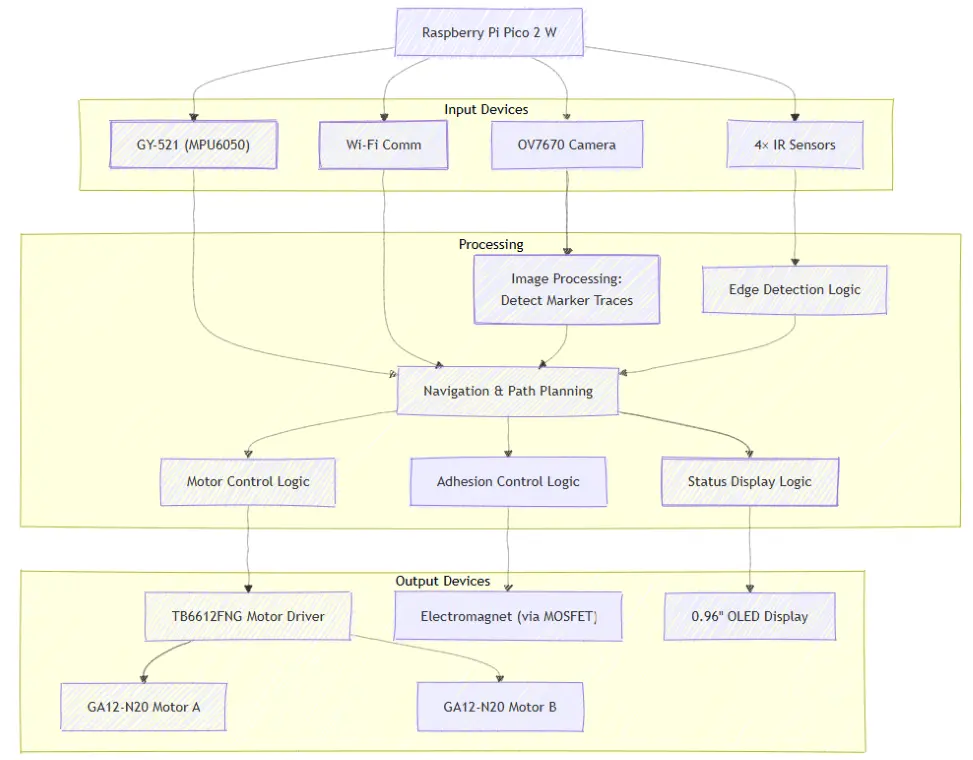

# SpongeBot SteelPants
Magnetic robot that erases whiteboard marker strokes using camera detection

:::info 

**Author**: Daniel ION \
**GitHub Project Link**: [SpongeBot Repository](https://github.com/UPB-PMRust-Students/proiect-DaniPTRK)

:::

## Description

SpongeBot SteelPants is a two-wheel robot designed to automate the process of cleaning
whiteboards. Clinging magnetically to surfaces via a PWM-controlled electromagnet, the
robot uses a low-res OV7670 camera to detect marker strokes. Once a trace is identified,
the robot navigates over it and wipes it clean using an attached sponge. \
The system is built around a Raspberry Pi Pico 2W which handles image processing,
sensor input and motor control. The components have been chosen to keep the bot as
lightweight as possible.

## Motivation

The main premise I went with when deciding to build this project was fairly simple:
*Why not automate something boring?*\
Cleaning whiteboards is a repetitive chore that eats up a bit of time every day, so
I decided to build a small robot that could take over that chore - and the good news is,
this robot won't take anyone's job!

## Architecture 



## Log

<!-- write your progress here every week -->

### Week 5 - 11 May
**To be updated**

### Week 12 - 18 May
**To be updated**

### Week 19 - 25 May
**To be updated**

## Hardware

The main components which I've chosen for the robot are the following:
1. **Raspberry Pi Pico 2W**
* Core component that handles image processing, Wi-Fi commands and GPIO for all
peripherals

2. **TB6612FNG Dual Motor Driver**
* Dual H-bridge Motor Driver powered directly from battery rail, receives direction
and PWM speed from the Pico
* Drives the two GA12-N20 Gearmotors

3. **D4184 MOSFET Module**
* Logic-level gate which receives commands from Pico
* Adjusts the grip of the electromagnet depending on the tilt angle

4. **GY-521 (MPU-6050 IMU)**
* 3-axis accelerometer + 3-axis gyroscope, supplies tilt angle
* The tilt angle commands the adhesion force through the Pico and towards the MOSFET
module

5. **GA12-N20 Gearmotors**
* Small and light, these motors provide the torque needed to pull a sponge and a magnet
across a whiteboard

6. **OV7670 Camera Module**
* Provides low-res frames, good enough to determine by applying a grayscale where the
marker strokes are

7. **IR Obstacle Sensors (x4)**
* IR LEDs mounted at the corners to prevent the robot from falling off the edge of the
whiteboard.

8. **Electromagnet 5 V/25 N**
* Strong enough to cling the small robot to the whiteboard
* PWM-driven grip allows for adjustable adhesion

9. **0.96 OLED Display**
* Indicates the mode which the robot is currently using (cleaning by using the camera
module or just simply going around)
* Displays remaining battery charge

Other components:
* WAGO Connectors split the battery rail into separate current branches
* 4xAA Battery Holder powers the robot
* Sponge
* Wires, Breadboards, Jumpers, Diodes, Wheels, Chassis etc.

### Schematics

**Schematics will be added soon**

### Bill of Materials

<!-- Fill out this table with all the hardware components that you might need.

The format is 
```
| [Device](link://to/device) | This is used ... | [price](link://to/store) |

```

-->

| Device | Usage | Price |
|--------|--------|-------|
| [Raspberry Pi Pico 2W](https://datasheets.raspberrypi.com/pico/pico-datasheet.pdf) | Main microcontroller with Wi-Fi; controls all peripherals | [39.66 RON](https://www.optimusdigital.ro/en/raspberry-pi-boards/13327-raspberry-pi-pico-2-w.html) |
| [GA12-N20 100:1 Gearmotor](https://temperosystems.com.au/wp-content/uploads/2021/03/N20-Micro-Speed-Gear-Motor.pdf) | Drives wheels with high torque for sponge movement | [24.99 RON × 2](https://www.optimusdigital.ro/en/micro-gearmotors/680-micro-motor-cu-reductor-ga12-n20-110.html) |
| [TB6612FNG Motor Driver](https://cdn.sparkfun.com/datasheets/Robotics/TB6612FNG.pdf) | Dual H-bridge to control 2 DC motors via PWM | [24.99 RON](https://www.optimusdigital.ro/en/brushed-motor-drivers/134-tb6612fng-dual-motor-driver-1-a.html) |
| [D4184 MOSFET Module](https://protosupplies.com/product/d4184-mosfet-control-module/) | Switches the electromagnet on/off using PWM | [5.00 RON](https://www.optimusdigital.ro/en/relay-modules/12509-d4184-mosfet-control-module-replacement-relay.html) |
| [GY-521 (MPU-6050)](https://invensense.tdk.com/wp-content/uploads/2015/02/MPU-6000-Datasheet1.pdf) | Measures tilt to adjust magnet force dynamically | [24.16 RON](https://sigmanortec.ro/Modul-giroscopic-si-accelerometru-3-axe-GY-521-p126016326) |
| [OV7670 Camera Module](https://web.mit.edu/6.111/www/f2016/tools/OV7670_2006.pdf) | Captures low-res frames to detect marker strokes | [12.66 RON](https://sigmanortec.ro/Modul-camera-OV7670-p135315688) |
| [IR Obstacle Sensor](https://protosupplies.com/product/ir-obstacle-avoidance-sensor-module/) | Detects whiteboard edges to prevent falling | [3.07 RON × 4](https://sigmanortec.ro/Senzor-obstacol-IR-p125423458) |
| [0.96″ OLED Display (SSD1306)](https://cdn-shop.adafruit.com/datasheets/SSD1306.pdf) | Shows battery level and operating mode | [16.35 RON](https://sigmanortec.ro/Display-OLED-0-96-I2C-IIC-Albastru-p135055705) |
| [Electromagnet 5V / 25N](https://www.adafruit.com/product/3872#technical-details) | Holds robot against whiteboard via magnetic force | ~[27.00 RON](https://ampul.eu/ro/electromagnei-adezivi/2169-1602-electromagnet-25kg-25n-20x15mm#/432-tensiune-5_v_dc) |
| WAGO 5-pin Connector (221-415) | Splits battery power and ground safely | [2.98 RON × 2](https://sigmanortec.ro/en/wago-5-pin-connector) |
| 4×AA Battery Holder | Powers the robot with 4 AA batteries | [6.24 RON](https://sigmanortec.ro/Suport-4-baterii-AA-cu-capac-si-intrerupator-p172447738) |
| Miscellaneous (breadboards, wires, diodes, etc.) | Circuit prototyping, motor connection, edge detection, and mechanical assembly | ~70 RON |
| Total | - | 294.28 RON |

## Software

| Library | Description | Usage |
|---------|-------------|-------|
| [embassy](https://embassy.dev/) | Async embedded framework with executors and timers. | Runs tasks concurrently (e.g. motor control, sensors). |
| [embassy-net](https://docs.embassy.dev/embassy-net) | Async network stack (TCP/UDP, DNS, etc.). | Handles communication over Wi-Fi. |
| [embassy-rp](https://crates.io/crates/embassy-rp) | Embassy HAL for RP2040/RP2350 chips (Pico & Pico W). | Gives async access to GPIO, I²C, SPI, PWM, PIO, etc. |
| [tb6612fng](https://docs.rs/tb6612fng) | Driver for the TB6612FNG dual motor driver. | Used to control direction and speed of both gearmotors. |
| [mpu6050](https://crates.io/crates/mpu6050) | I²C driver for MPU-6050 accelerometer + gyro. | Reads tilt to adjust magnet grip and detect movement. |
| [ssd1306](https://docs.rs/ssd1306) | OLED driver for SSD1306 controller over I²C/SPI. | Displays robot mode or battery on 0.96″ screen. |
| [embedded-graphics](https://github.com/embedded-graphics/embedded-graphics) | 2D graphics primitives and text rendering. | Renders UI elements on the OLED screen. |
| [cyw43](https://docs.embassy.dev/cyw43) | Async Wi-Fi driver for the Pico W’s CYW43439 chip. | Enables Wi-Fi for control or telemetry via Embassy. |

## Links

<!-- Add a few links that inspired you and that you think you will use for your project -->

1. [Project Inspiration – YouTube Prototype](https://www.youtube.com/watch?v=DSR4BmmaPEk)
2. [Competition - Wipy the Overly Motivated Whiteboard Cleaner](https://www.instructables.com/Wipy-the-Overly-Motivated-Whiteboard-Cleaner/)
3. [Rust Embedded Labs – PM Course Resources](https://pmrust.pages.upb.ro/docs/acs_cc/category/lab)