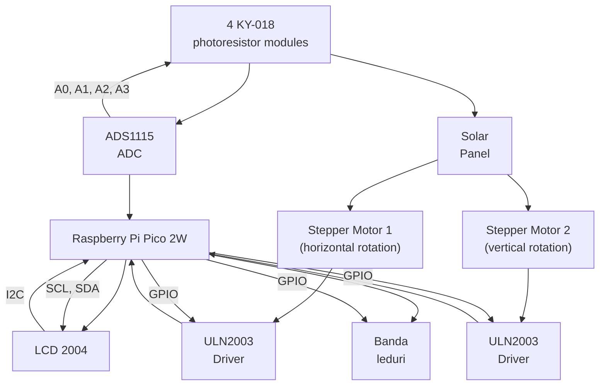

# Light tracker with solar pannel & LEDs 
A one line project description

:::info 

**Author**: Daria-Catalina Banu \
**GitHub Project Link**: https://github.com/UPB-PMRust-Students/proiect-Scarlett-stack

:::

## Description

A system that follows the most intense light source using photoresistors and rotates and translates vertically a mini-solar panel to maximize light capture. 

## Motivation

I chose this project because it allows me to explore embedded systems through a practical application that combines environmental awareness with precise motion control. Using stepper motors to orient a solar panel towards the most intense light source offers both a technical challenge and an opportunity to improve energy efficiency. This project also gives me hands-on experience with ADCs, real-time light tracking, and low-level motor control using Rust and the Embassy framework.

## Architecture 



- Light Sensor Module (ADC Sampling + Filtering)
Continuously reads values from 4 photoresistors (via ADC), applies a basic smoothing/filtering algorithm, and computes which direction has the strongest light intensity.

- Motor Control Module
Controls two stepper motors for horizontal and vertical movement. Uses a state machine to determine the required movement based on the output of the light sensor module.

- Tracking Algorithm
Coordinates input from the sensors and sends precise motor commands. Includes logic for tolerance thresholds, and movement limits.

- Display Module
Shows real-time status info (e.g., direction, light levels, current position) on the LCD2004 screen using `hd44780-driver`

- Debug & Logging (defmt)
All internal states, sensor readings, and motor steps are logged via RTT for debugging and tuning purposes.

## Log

<!-- write your progress here every week -->
### Week 21 – 27 April 
Ordered hardware components updated the project's initial diagram, and also started exploring some rust crates compatible with my components.(uln2003, ads1x1x)
### Week 28 April – 4 May 
I tested some of the components on the breadboard to see if they work properly. (ky-018 photoresistor module, ads1115 adc convertor). I am also thinking of using a port expansion module for the led band, in case i run out of gpios on the pico.
### Week 5 - 11 May

### Week 12 - 18 May

### Week 19 - 25 May

## Hardware

- **Raspberry Pi Pico W** – The main microcontroller that runs the firmware using Rust and the Embassy async framework.

- **4× KY-018 Photoresistors + ADS1115 ADC** – Used to sense light intensity from different directions. The ADS1115 allows me to read data from the 4 modules

- **2× Stepper Motors (28BYJ-48) + ULN2003 Drivers** – Control the rotation and tilt of the solar panel. Each motor is driven by a ULN2003 driver module.

- **LCD2004 Display** – Displays real-time tracking information. Controlled using the hd44780-driver crate over I²C.

- **12-segment LED bar (4 red + 8 green)** – Optional. Visual feedback for system status or light intensity. May be driven via port expander (PCF8574).

- **Mini Solar Panel** – Rotates to face the brightest light source. Mounted on the motor platform.

- **PCF8574 I²C Port Expander** (optional) – If GPIO pins run out, this expands the number of digital outputs, useful for controlling LEDs or other components.

- **Breadboard, jumper wires, resistors** – For prototyping and building the circuit.

### Schematics

TBD
Place your KiCAD schematics here.

### Bill of Materials

<!-- Fill out this table with all the hardware components that you might need.

The format is 
```
| [Device](link://to/device) | This is used ... | [price](link://to/store) |

```

-->

| Device                        | Usage                                               | Price     |
|------------------------------|-----------------------------------------------------|-----------|
| Raspberry Pi Pico 2W          | The main microcontroller        | 39.66 RON    |
| ADS1115 ADC Module           | 16-bit analog-to-digital converter for photoresistors | 32.98 RON    |
| KY-018 Photoresistor Module (x4) | Detects light intensity from different directions | 9.12 RON   |
| 28BYJ-48 Stepper Motor (x2)  | Provides panel rotation and tilt                    | 33.94 RON    |
| ULN2003 Driver Module (x2)   | Drives the stepper motors                           | inclus in stepper|
| LCD2004 Display with I²C     | Displays real-time tracking status                  | 26 RON    |
| PCF8574 I²C Port Expander    | Optional I/O expansion for controlling LEDs         | 9.99 RON    |
| 12-segment LED Bar           | Visual feedback on light intensity (4 red, 8 green) | 6 RON     |
| Mini Solar Panel             | panel that follows light                | 18 RON    |
| Breadboard, wires, resistors | Prototyping and circuit building                    | ~15 RON   |

**Estimated Total**: 190.69 RON

## Software


| Library / Crate        | Description                                                                 | Usage                                           |
|------------------------|-----------------------------------------------------------------------------|-------------------------------------------------|
| [embassy](https://crates.io/crates/embassy)                | Async embedded framework for Rust                                           | Used for async task scheduling and peripherals  |
| [embassy-rp](https://crates.io/crates/embassy-rp)           | Embassy HAL implementation for RP2040/RP2350                               | Used for GPIO, ADC, PWM, I²C on the Pico W      |
| [embassy-time](https://crates.io/crates/embassy-time)       | Timing utilities for async delays                                           | Used for blinking LEDs, servo control, debouncing |
| [embassy-sync](https://crates.io/crates/embassy-sync)       | Async-safe synchronization primitives                                       | Coordination between async tasks (e.g., tracking + UI) |
| [defmt](https://crates.io/crates/defmt)                     | Lightweight logging framework                                               | Used for debugging over RTT                     |
| [defmt-rtt](https://crates.io/crates/defmt-rtt)             | Transports defmt logs over Real-Time Transfer                              | Debug output                                    |
| [panic-probe](https://crates.io/crates/panic-probe)         | Panic handler with defmt logging                                            | Used to capture and print panics in embedded code |
| [ads1x1x](https://crates.io/crates/ads1x1x)                 | Driver crate for ADS1115/ADS1015 ADCs                                       | Used to read analog values from photoresistors |
| [hd44780-driver](https://crates.io/crates/hd44780-driver)   | Driver for HD44780-based displays (like LCD2004 via I²C)                   | Used to display data on LCD screen              |
| [embedded-hal-async](https://crates.io/crates/embedded-hal-async) | Async traits for embedded-hal peripherals                              | Required by embassy for async I²C, ADC, etc.    |
| [fixed](https://crates.io/crates/fixed)                     | Fixed-point arithmetic crate                                                | Used for precise PWM timing (e.g. servo control) |
| [pcf857x](https://crates.io/crates/pcf857x)                 | Driver for PCF8574 I²C port expander                                        | Used if GPIO pins run out (for LED control)     |
| [fugit](https://crates.io/crates/fugit)                     | Time duration representation used by Embassy and drivers                    | Used internally for time-related configs        |


## Links

<!-- Add a few links that inspired you and that you think you will use for your project -->

1. [link](https://example.com)
2. [link](https://example3.com)
...
