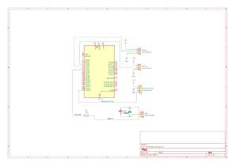

# Music-Responsive Smart Lighting System

:::info 

**Author**: Daria-Maria Ion \
**GitHub Project Link**: [link_to_github](https://github.com/UPB-PMRust-Students/proiect-darimari21)


:::

## Description

This project is an interactive lighting system built around a disco globe, designed to synchronize both light and motion with music. It utilizes a KY-037 sound sensor to capture audio intensity, two MG996R servo motors for movement effects, and RGB LEDs for vibrant lighting. All components are controlled by a Raspberry Pi Pico W running Rust code.

## Motivation

I chose this project to bring together my interests in music, visual design, and embedded systems. It’s a hands-on way to explore real-time signal processing, PWM-based control, and servo motor coordination, while creating a visually engaging and technically rewarding result.


## Architecture 


The project is structured around the following architecture components:

- **Audio Input Module (Sound Sensor KY-037)**: Captures environmental audio levels and sends the analog output to the Raspberry Pi Pico W.
- **Microcontroller (Raspberry Pi Pico W)**: Acts as the central processing unit. It reads the analog signal from the sensor, analyzes the sound intensity, and sends appropriate PWM signals to the servo motors and LED strip.
- **Motion Module (2x MG996R Servos)**: Receives PWM signals from the Pico to control rotation or vibration based on audio dynamics.
- **Lighting Module (RGB LEDs)**: A WS2812 that displays effects driven by the audio signal.
- **Power Distribution**: A shared 5V power source, with decoupling components like a 470Ω resistor and a 1000µF capacitor for LED stability.

Connections:
- KY-037 → Analog pin on Pico 
- Servos → GPIO2 and GPIO3
- LED Strip → GPIO4 via a 470Ω resistor + capacitor for power smoothing
- All components share a common ground and 5V line from the Pico's VBUS pin

## Log

<!-- write your progress here every week -->

### Week 5 - 11 May
 Connecting the hardware components

### Week 12 - 18 May

### Week 19 - 25 May

## Hardware

The project uses the following hardware:
- Raspberry Pi Pico W as the main controller
- KY-037 sound sensor for audio detection
- Two MG996R servo motors for motion effects
- RGB LED connector for visual lighting
- Power smoothing components: 470Ω resistor and 1000µF capacitor


### Schematics



### Bill of Materials

<!-- Fill out this table with all the hardware components that you might need.

The format is 
```
| [Device](link://to/device) | This is used ... | [price](link://to/store) |

```

-->

| Device | Usage | Price |
|--------|--------|-------|
| [Raspberry Pi Pico W](https://www.optimusdigital.ro/ro/placi-raspberry-pi/13327-raspberry-pi-pico-2-w.html?search_query=pico&results=33) | Main microcontroller | ~39 RON |
| [KY-037 Sound Sensor](https://www.bitmi.ro/modul-senzor-sunet-cu-sensibilitate-ridicata-ky-037-10634.html) | Detects sound intensity | ~5 RON |
| [MG996R Servo Motor](https://sigmanortec.ro/servomotor-mg996r-180-13kg) | Rotation / motion effect | ~30 RON x2 |
| [WS2812B RGB LED Strip](https://ardushop.ro/ro/electronica/900-1193-leduri-rgb-la-banda-neopixels-ws2812b-pretul-este-pentru-un-led.html) | Visual LED effects | ~2.5 RON/LED |
| [Rezistor 330Ω](https://www.emag.ro/rezistor-tht-330-0-25-w-5-toleranta-galben-z000431/pd/D8DQLHYBM/) | Data line protection for LED | ~2.62 RON |
| [Condensator 1000μF / 6.3V](https://www.emag.ro/condensator-electrolitic-1000uf-6-3v-pentru-pc-135250/pd/DZ614KMBM/) | Voltage stabilization for LED | ~3.5 RON |
| [Fire jumper (M-M)](https://www.optimusdigital.ro/ro/fire-fire-mufate/881-set-fire-mama-mama-40p-15-cm.html) | Wiring connections | ~7 RON |
| Breadboard | Rapid prototyping | ~10 RON |

## Software

| Library | Description | Usage |
|---------|-------------|-------|
| [rp-hal](https://github.com/rp-rs/rp-hal) | Hardware Abstraction Layer for Pico | Base control of GPIOs, ADC, and PWM |
| [embedded-hal](https://github.com/rust-embedded/embedded-hal) | Hardware abstraction traits | Interfaces with servos and LEDs |
| [ws2812-pio](https://github.com/rp-rs/ws2812-pio) | LED driver using PIO | Control WS2812 LEDs |
| [rustfft](https://github.com/ejmahler/RustFFT) | Fast Fourier Transform in Rust | For future implementation of beat detection |
| [defmt + probe-rs](https://github.com/knurling-rs/defmt) | Debugging tools | Debugging embedded Rust code easily |

## Links

<!-- Add a few links that inspired you and that you think you will use for your project -->

1. [link](https://pmrust.pages.upb.ro/docs/fils_en/project/2024/catalin.barabas)
2. [Lab 03 - PWM & ADC](https://pmrust.pages.upb.ro/docs/acs_cc/lab/03)
3. [Lab 02 - GPIO](https://pmrust.pages.upb.ro/docs/acs_cc/lab/02)
4. [04 - Asynchronous Development](https://pmrust.pages.upb.ro/docs/acs_cc/lab/04)

...
