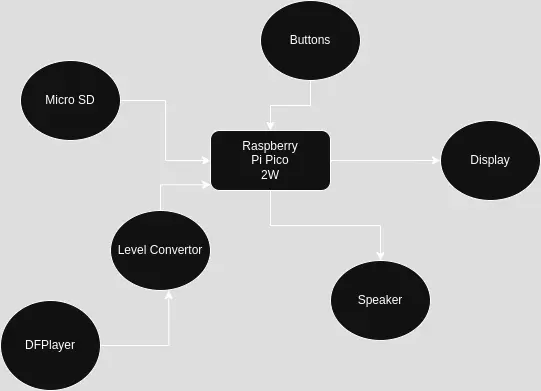
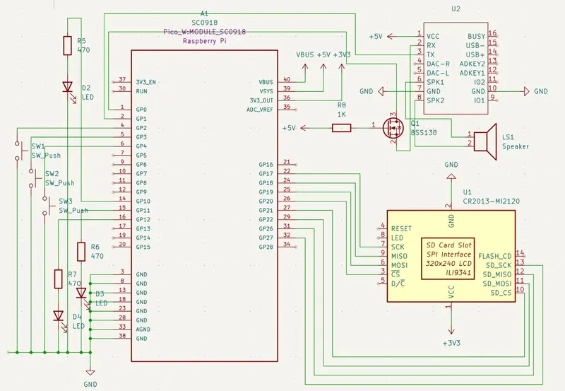

# DoubleUp!
An interactive reaction and strategy game inspired by casino experiences.

:::info 

**Author**: Bobelniceanu Darius-Andrei \
**GitHub Project Link**: https://github.com/UPB-PMRust-Students/proiect-dariusbbl

:::

## Description

DoubleUp! is an interactive game where the user must react quickly and make strategic decisions to double their points.


+ The user presses the start button to begin the game.

+ In the first phase, a green LED lights up randomly within a preset interval (maximum 30 seconds). The user must quickly press the reaction button.

+ If the user presses in time, they enter the "doubling" mode; otherwise, a points penalty is applied.

+ In the doubling mode, the user bets points and chooses between two buttons (Red/Blue), each accompanied by a corresponding LED.

+ Each correct choice doubles the gain (x2, x4, x8), while an incorrect choice results in the loss of the bet.

+ The LCD display shows the current balance, user actions, and a history of the last 5 doubling rounds.

+ Specific sounds (inspired by Shining Crown game) are played for correct or incorrect actions via a dedicated audio module.

## Motivation

**DoubleUp!** was born from my passion for interactive, fast-paced games and my interest in embedded programming. I wanted to create a project that not only challenges user reflexes but also brings a strategic layer to the gameplay.

Choosing Rust as the programming language was a natural decision, given its strong emphasis on performance, memory safety, and increasing relevance in embedded systems development.

Through this project, I aim to deepen my understanding of hardware-software integration, explore human-machine interaction concepts, and bring an engaging user experience to life by combining LEDs, displays, buttons, and authentic audio feedback.

## Architecture
The architecture of DoubleUp! is centered around the following key components:

**Raspberry Pi Pico 2W** serves as the central microcontroller, managing all core functions of the system, such as controlling LEDs, handling user interactions, updating the display, and triggering audio feedback.

**LCD SPI 128x160** display (ST7735) is connected via SPI interface and shows the user's balance, messages, and the history of the last 5 doubling actions.

**LEDs (green, red, blue)** provide immediate visual feedback to the user about game phases and choices.

**DFPlayer Mini** module handles the playback of preloaded .mp3 sound effects, offering an authentic audio experience for correct and incorrect actions.

**MicroSD Card** installed on the DFPlayer Mini stores the sound files needed for the different events during gameplay.

**Speaker** connected to the DFPlayer Mini outputs the sound effects during the game.

**Level Converter (logic level shifter)** ensures safe UART communication between the Raspberry Pi Pico (operating at 3.3V) and the DFPlayer Mini (operating at 5V), preventing damage to the microcontroller and ensuring reliable data transmission.




## Log

<!-- write every week your progress here -->

### Week  -  May


### Week  -  May


### Week  -  May
 

## Hardware

1. **Raspberry Pi Pico 2W**:
- **Purpose**: Central control unit.
- **Function**: Coordinates LEDs, buttons, LCD, and audio module.

2. **LCD SPI 128x160 (ST7735)**:
- **Purpose**:  Displays text (balance, messages, history).
- **Function**: Displays real-time information such as the user's current score, system messages (e.g., "Start", "Correct", "Wrong"), and the history of the last 5 bets.

3. **Buttons**:
- **Purpose**: Provide physical input for the user to interact with the game.
- **Function**:  - Start Button: Initiates a new game session.
    - Red/Black Buttons: Allow the player to make their bet selection during the doubling phase.

4. **LEDs**:
- **Purpose**: Visual indication (start, red, blue).
- **Function**: Light up according to the game state.
     - Green LED: Signals when the user must quickly react.
     - Red and Blue LEDs: Represent the choices during the doubling phase.

5. **DFPlayer Mini**:
- **Purpose**: Dedicated audio playback module.
- **Function**: Plays preloaded .mp3 sound effects stored on a MicroSD card to enhance the gaming experience with authentic casino sounds for correct or incorrect actions.

6. **MicroSD Card**:
- **Purpose**: Storage medium for audio files.
- **Function**: Stores .mp3 files that are triggered during the gameplay events.

7. **Speaker (3W)**:
- **Purpose**: Sound output.
- **Function**: Outputs the audio files played by the DFPlayer Mini, providing clear feedback to the user.

8. **Level Converter (3.3V - 5V)**:
- **Purpose**: Voltage compatibility bridge between the Pico and the DFPlayer Mini.
- **Function**: Ensures safe signal levels when sending commands from the Pico (3.3V logic) to the DFPlayer (5V logic).

9. **Breadboard + Jumper Wires**:
- **Purpose**: Prototyping and modular connection.
- **Function**: Facilitates quick setup, testing, and modification of the circuit during development.

10. **Current-Limiting Resistors**:
- **Purpose**: Protect LEDs and microcontroller outputs.
- **Function**: Limits the amount of current flowing through each LED to safe levels.

### Hardware Overview:

- **Pico** coordinates the entire system.
- **LCD** communicates the game state.
- **LEDs** signal visual actions.
- **Buttons** provide manual input.
- **DFPlayer Mini** plays authentic sounds.
- **Level Converter** ensures safe voltage communication.


### Schematics


### Bill of Materials

<!-- Fill out this table with all the hardware components that you might need.

The format is 
```
| [Device](link://to/device) | This is used ... | [price](link://to/store) |

```

-->

| Device | Usage | Price |
|--------|--------|-------|
| [Rapspberry Pi Pico 2W](https://datasheets.raspberrypi.com/picow/pico-2-w-datasheet.pdf) | The microcontroller | [39,66 RON](https://www.optimusdigital.ro/en/raspberry-pi-boards/13327-raspberry-pi-pico-2-w.html?search_query=raspberry+pi+pico+2&results=36) |
| [MicroSD 4GB](https://docs.rs-online.com/1438/0900766b81084d74.pdf) | Sound Storage | [15 RON](https://www.amazon.de/s?k=microSD+4gb&crid=2LS5KMKYH1PCR&sprefix=microsd+4gb%2Caps%2C112&ref=nb_sb_noss_1) |
| [LCD Display](https://www.openhacks.com/uploadsproductos/tutorial_display_tft.pdf) | LCD Display| [25 RON](https://www.amazon.de/-/en/iHaospace-Display-Screen-Arduino-Raspberry/dp/B07BQWPH4L) |
| [DFPlayer Mini](https://picaxe.com/docs/spe033.pdf) | Plays mp3 sounds | [13,99 RON](https://www.optimusdigital.ro/ro/audio/1484-modul-mp3-player-in-miniatura-dfplayer-mini.html?search_query=dfplayer&results=1) |
| [Level Convertor](https://www.ti.com/lit/ds/symlink/sn74aup1t34.pdf?ts=1746309856215&ref_url=https%253A%252F%252Fwww.google.com%252F) | Converts from 3v3 to 5v | [15,99 RON](https://www.optimusdigital.ro/ro/interfata-convertoare-de-niveluri/182-translator-de-nivel-bidirectional-cu-2-canale.html?search_query=translator+nivel&results=19) |
| [Speaker](https://www.ti.com/lit/ds/symlink/lm4991.pdf?ts=1746331860267&ref_url=https%253A%252F%252Fduckduckgo.com%252F) | Converts from 3v3 to 5v | [7,00 RON](https://sigmanortec.ro/Speaker-40mm-3W-p134573662?SubmitCurrency=1&id_currency=2&gad_source=1&gbraid=0AAAAAC3W72OZa7WdDMTAUrEFKmPeVyFvm&gclid=Cj0KCQjwh_i_BhCzARIsANimeoGjy_bFZV_plKD0feyHcYhhv2kPtrQGDb3ipaz-3WZKvxSHrsCp8qEaAthFEALw_wcB) |


## Software

| Library | Description | Usage |
|---------|-------------|-------|
| [embassy-rp](https://github.com/embassy-rs/embassy/tree/main/embassy-rp) | RP2040 Peripherals | Used for accessing the peripherals |
| [embedded-hal] | Hardware abstraction layer | Used to abstract common embedded traits like digital output, delay, SPI, etc. |
| [embedded-graphics] | Drawing 2D graphics in embedded environments | Used to render text and visuals on the LCD |
| [st7735-lcd] | Driver crate for ST7735 LCDs | Used to communicate with the LCD via SPI |
| [dfplayer-mini] | UART-based MP3 module interface | Used to send commands like play, stop, volume to DFPlayer |
| [defmt] | Lightweight logging framework for embedded Rust | Used for debugging and tracing game logic |
| [fugit] | Time management | Used for scheduling delays and timeouts (e.g., LED reaction window) |

## Links

<!-- Add a few links that inspired you and that you think you will use for your project -->

<!-- 1. []() -->