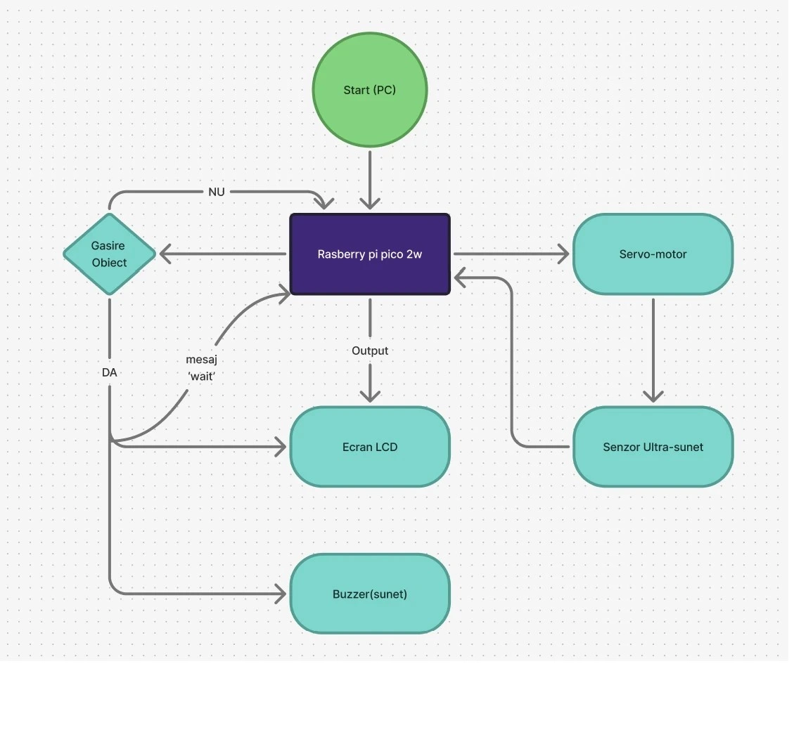

# Sistem de Detectare Obiecte
A one line project description

:::info 

**Author**: Popescu Darius-Stefan \
**GitHub Project Link**: https://github.com/UPB-PMRust-Students/proiect-darius-afk

:::

## Description

Proiectul presupune constructia unui sistem de securitate care detecteaza miscarea si care afiseaza un mesaj cu informatii despre aceasta.
Voi folosi un senzor ultrasonic pe care il voi lipi pe un motoras care se va invarti 360 de grade si va detecta miscarea. Cand se observa un obiect, voi afisa un mesaj cu cateva informatii despre acesta pe un display.

## Motivation

Sunt pasionat de securitate. Am vrut sa fac ceva din acest domeniu, dar ma pasioneaza si conceptul de aparat cu ultra-sunete.

## Architecture 

Voi folosi un servo-motor, breadboard, Ultrasonic Sensor HC -SR04, Display LCD I2C, Fire de legatura.

## Log

<!-- write your progress here every week -->

### Week 5 - 11 May

### Week 12 - 18 May

### Week 19 - 25 May

## Hardware

Aparatura hardware folosita este una interactiva, oarecum asemanatoare cu ce am folosit la laborator. Am ales aceste piese pentru ca au un raport pret/calitate mare (dupa cum spun review-urile de pe optimus digital)

### Schematics


### Bill of Materials

<!-- Fill out this table with all the hardware components that you might need.

The format is 
```
| [Device](link://to/device) | This is used ... | [price](link://to/store) |

```

-->

| Device | Usage | Price |
|--------|--------|-------|
| [Raspberry Pi Pico W](https://www.raspberrypi.com/documentation/microcontrollers/raspberry-pi-pico.html) | The microcontroller | [35 RON](https://www.optimusdigital.ro/en/raspberry-pi-boards/12394-raspberry-pi-pico-w.html) |
| [Buzzer Pasiv de 5 V](https://www.optimusdigital.ro/ro/audio-buzzere/634-buzzer-pasiv-de-5-v.html) | The buzzer | [2 RON](https://www.optimusdigital.ro/ro/audio-buzzere/634-buzzer-pasiv-de-5-v.html) |
| [Micro Servomotor FS90MR cu Rotatie Continua si Reductor din Metal](https://www.optimusdigital.ro/ro/motoare-micro-motoare-cu-reductor/3168-micro-servomotor-fs90mr-cu-rotatie-360-si-reductor-din-metal.html?search_query=micro+servomotor&results=31) | The Servomotor | [53 RON](https://www.optimusdigital.ro/ro/motoare-micro-motoare-cu-reductor/3168-micro-servomotor-fs90mr-cu-rotatie-360-si-reductor-din-metal.html?search_query=micro+servomotor&results=31) |
| [	Breadboard (750 Puncte)](https://www.optimusdigital.ro/ro/prototipare-breadboard-uri/13245-breadboard-750-puncte.html) | The Breadboard | [9 RON](https://www.optimusdigital.ro/ro/prototipare-breadboard-uri/13245-breadboard-750-puncte.html) |
| [	LCD Hat 1602 pentru Raspberry Pi](https://www.optimusdigital.ro/ro/lcd-uri/1158-lcd-hat-1602-pentru-raspberry-pi.html) | The LCD Hat | [2 RON](https://www.optimusdigital.ro/ro/lcd-uri/1158-lcd-hat-1602-pentru-raspberry-pi.html) |
| [Condensator Electrolitic 220 uF, 50 V](https://www.optimusdigital.ro/ro/componente-electronice-condensatoare/7850-condensator-electrolitic-220-uf-50-v.html) | The Condensator | [1 RON](https://www.optimusdigital.ro/ro/componente-electronice-condensatoare/7850-condensator-electrolitic-220-uf-50-v.html) |
| [Modul Buzzer Pasiv](https://www.optimusdigital.ro/ro/componente-electronice/12598-modul-buzzer-pasiv.html) | The buzzer | [2 RON](https://www.optimusdigital.ro/ro/componente-electronice/12598-modul-buzzer-pasiv.html) |
| [Senzor ultrasonic HC-SR04](https://www.optimusdigital.ro/ro/senzori-senzori-ultrasonici/9-senzor-ultrasonic-hc-sr04-.html?search_query=Ultrasonic+Sensor+HC+-SR04&results=5) | The Sensor | [7 RON](https://www.optimusdigital.ro/ro/senzori-senzori-ultrasonici/9-senzor-ultrasonic-hc-sr04-.html?search_query=Ultrasonic+Sensor+HC+-SR04&results=5) |


## Software

| Library | Description | Usage |
|---------|-------------|-------|
| [st7789](https://github.com/almindor/st7789) | Display driver for ST7789 | Used for the display for the Pico Explorer Base |
| [embedded-graphics](https://github.com/embedded-graphics/embedded-graphics) | 2D graphics library | Used for drawing to the display |

## Links

<!-- Add a few links that inspired you and that you think you will use for your project -->

1. [link](https://github.com/darius-afk/PM-Proiect)
2. [link](https://example3.com)
...
