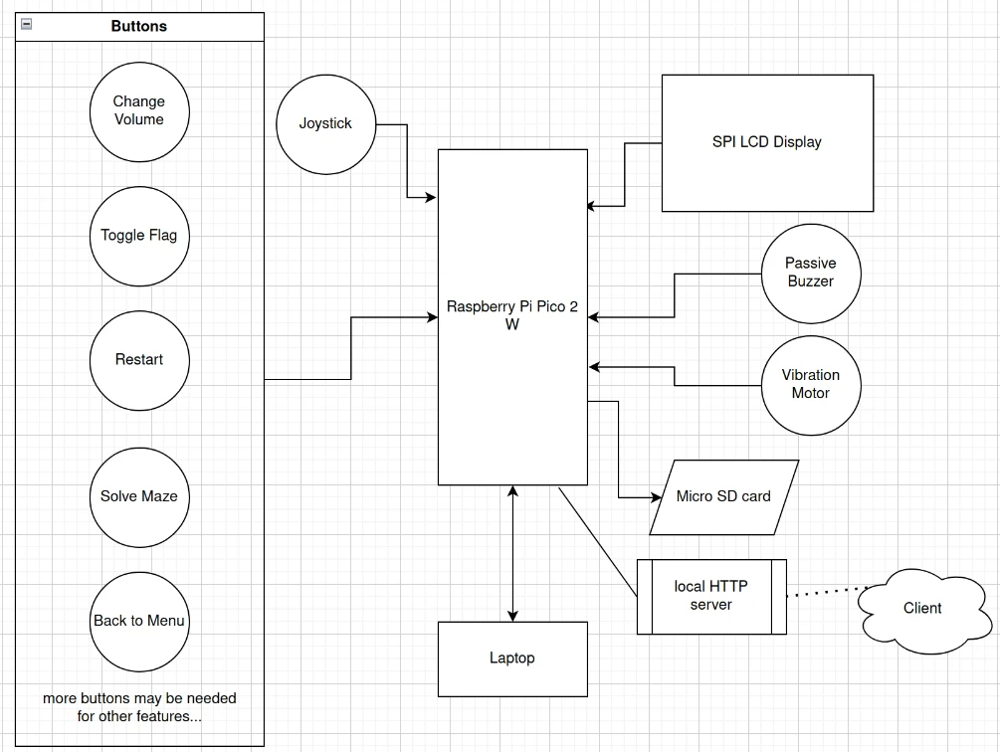

# Pico Minesweeper

The classic minesweeper game, ported to the Raspberry Pi Pico.

:::info

**Author**: Iuga Darius-Gabriel-Ioan \
**GitHub Project Link**: https://github.com/UPB-PMRust-Students/proiect-DariusIuga

:::

## Description

This project implements an interactive Minesweeper game, controlled via a joystick (for navigation) and buttons (for placing flags/menu interaction), with output displayed on an LCD screen. The player sets the grid size and the number of mines through a graphical menu, adjusting values with the joystick. At the end of the game, sounds (via a passive buzzer) signal victory or explosion. If a mine explodes, a vibration motor will be activated.

Game states can be saved locally (on a microSD card). Saved maps can be visualized on a dedicated website, served by an HTTP server hosted on the Pico W.

## Motivation

I chose to implement Minesweeper over other games because it seemed to offer an appropriate level of difficulty (harder than Tic-Tac-Toe or Space Invaders, but easier than Chess). By using the chosen peripherals and incorporating save/load functionality, along with the ability to view saved games via a web interface, I hope to provide an engaging gameplay loop for the player.

## Architecture



## Log

### TODO

<!-- write your progress here every week -->

### Week 5 - 11 May

### Week 12 - 18 May

### Week 19 - 25 May

## Hardware

The project utilizes a Raspberry Pi Pico W microcontroller as the central processing unit. User interaction is handled by a biaxial joystick for grid navigation and menu control, along with several push buttons for actions like placing flags, restarting, accessing the menu, and potentially other features. Visual feedback is provided through a 2.8" SPI LCD display (ILI9341 controller). Audio and haptic feedback are implemented using a passive buzzer and a vibration motor. Game state persistence and map storage are managed using a microSD card connected via SPI. The Pico W's wireless capability is used to host a local HTTP server, allowing saved maps to be viewed remotely. A second Pico is used as a debug probe (Picoprobe).

### Schematics

### TODO

Place your KiCAD schematics here.

### Bill of Materials

<!-- Fill out this table with all the hardware components that you might need.

The format is
```
| [Device](link://to/device) | This is used ... | [price](link://to/store) |

```

-->

| Device                                                                                                                                                        | Usage                                             | Price                                                                                                                                                                                                                                                                           |
| ------------------------------------------------------------------------------------------------------------------------------------------------------------- | ------------------------------------------------- | ------------------------------------------------------------------------------------------------------------------------------------------------------------------------------------------------------------------------------------------------------------------------------- |
| Breadboard HQ (830 Puncte)                                                                                                                                    | Breadboard                                        | [10 RON](https://www.optimusdigital.ro/ro/prototipare-breadboard-uri/8-breadboard-830-points.html?search_query=breadboard+HQ+830&results=15)                                                                                                                                    |
| Set de fire Rigide pentru Breadboard                                                                                                                          | Jumper cables                                     | [12.5 RON](https://www.optimusdigital.ro/ro/fire-fire-nemufate/899-set-de-fire-pentru-breadboard-rigide.html?search_query=Set+de+fire+Rigide+pentru+Breadboard&results=1)                                                                                                       |
| [Modul LCD SPI de 2.8" cu Touchscreen - Controller ILI9341 și XPT2046 (240x320 px)](https://cdn-shop.adafruit.com/datasheets/ILI9341.pdf)                     | The LCD display                                   | [70 RON](https://www.optimusdigital.ro/ro/optoelectronice-lcd-uri/3544-modul-lcd-spi-de-28-cu-touchscreen-controller-ili9341-i-xpt2046-240x320-px.html?search_query=Modul+LCD+SPI+de+2.8%27%27+cu+Touchscreen+-+Controller+ILI9341+%C8%99i+XPT2046+%28240x320+px%29+&results=2) |
| [Motor cu vibratii A1027](https://buybestelectronic.com/part-image/15684/datasheet/15684.pdf)                                                                 | The Vibration motor                               | [10 RON](https://www.optimusdigital.ro/ro/motoare-motoare-cu-vibratii/86-motor-cu-vibratii-a1027.html?search_query=Motor+cu+vibratii+A1027&results=2)                                                                                                                           |
| Buzzer Pasiv de 3.3V sau 3V                                                                                                                                   | Passive buzzer                                    | [1 RON](https://www.optimusdigital.ro/ro/audio-buzzere/12247-buzzer-pasiv-de-33v-sau-3v.html?search_query=Buzzer+Pasiv+de+3.3V+sau+3V+&results=1)                                                                                                                               |
| Modul Joystick Biaxial Negru cu 5 pini                                                                                                                        | Joystick with button                              | [5.35 RON](https://www.optimusdigital.ro/ro/senzori-senzori-de-atingere/742-modul-joystick-ps2-biaxial-negru-cu-5-pini.html?search_query=+Modul+Joystick+Biaxial+Negru+cu+5+pini+&results=1)                                                                                    |
| [Card MicroSD Original de 16 GB cu NOOBs Compatibil cu Raspberry Pi 4 Model B Varianta Bulk](https://datasheets.raspberrypi.com/picow/pico-2-w-datasheet.pdf) | SD card + adapter                                 | [40 RON](https://www.optimusdigital.ro/ro/memorii/8678-card-microsd-original-de-16-gb-cu-noobs-compatibil-cu-raspberry-pi-4-model-b-varianta-bulk.html?search_query=+Card+MicroSD+Original+de+16+GB+cu+NOOBs+Compatibil+cu+Raspberry+Pi+4+Model+B+Varianta+Bulk+&results=2)     |
| [Raspberry Pi Pico 2W (2 pieces)](https://www.raspberrypi.com/documentation/microcontrollers/raspberry-pi-pico.html)                                          | 2 microcontrollers, one used as a debug interface | [80 RON](https://www.optimusdigital.ro/ro/placi-raspberry-pi/13327-raspberry-pi-pico-2-w.html?search_query=+Raspberry+Pi+Pico+2W+&results=26)                                                                                                                                   |
| Header de pini (40p) (4 pieces)                                                                                                                               | Header pins                                       | [4 RON](https://www.optimusdigital.ro/ro/componente-electronice-headere-de-pini/85-header-de-pini.html?search_query=+Header+de+pini+%2840p%29+&results=22)                                                                                                                      |
| Buton 6x6x6 (10 pieces)                                                                                                                                       | Buttons                                           | [3.6 RON](https://www.optimusdigital.ro/ro/butoane-i-comutatoare/1119-buton-6x6x6.html?search_query=+Buton+6x6x6+&results=1)                                                                                                                                                    |
| Cablu Albastru Micro USB 50 cm                                                                                                                                | Micro USB cable                                   | [3 RON](https://www.optimusdigital.ro/ro/cabluri-cabluri-usb/4576-cablu-albastru-micro-usb-50-cm.html?search_query=+Cablu+Albastru+Micro+USB+50+cm+&results=5)                                                                                                                  |

## Software

| Library                                                                        | Description                                                                                           | Usage                                                                                              |
| ------------------------------------------------------------------------------ | ----------------------------------------------------------------------------------------------------- | -------------------------------------------------------------------------------------------------- |
| [embassy-executor](https://github.com/embassy-rs/embassy)                      | async/await executor designed for embedded usage                                                      | Runs and manages all asynchronous tasks (input handling, display updates, networking, game logic). |
| [embassy-rp](https://github.com/embassy-rs/embassy)                            | Embassy Hardware Abstraction Layer (HAL) for the Raspberry Pi RP2040 microcontroller                  | Interfacing with Pico W hardware: GPIO (buttons, joystick, buzzer, motor), SPI (LCD, SD card).     |
| [embassy-time](https://github.com/embassy-rs/embassy)                          | Instant and Duration for embedded no-std systems, with async timer support                            | Implementing delays, timeouts, debouncing inputs, potentially game timers.                         |
| [embassy-net](https://github.com/embassy-rs/embassy)                           | Async TCP/IP network stack for embedded systems                                                       | Providing the underlying networking capabilities for the HTTP server.                              |
| [cyw43](https://github.com/embassy-rs/embassy)                                 | Rust driver for the CYW43439 WiFi chip, used in the Raspberry Pi Pico W.                              | Enabling WiFi connectivity via the Pico W's onboard wireless chip.                                 |
| [picoserve](https://github.com/sammhicks/picoserve)                            | An async no_std HTTP server suitable for bare-metal environments                                      | Implementing the HTTP server to serve saved game maps over WiFi.                                   |
| [defmt](https://github.com/knurling-rs/defmt)                                  | A highly efficient logging framework that targets resource-constrained devices, like microcontrollers | Debug logging during development via the debug probe.                                              |
| [mipidsi](https://github.com/almindor/mipidsi)                                 | MIPI Display Command Set compatible generic driver usage                                              | Low-level driver for communicating with the ILI9341 LCD controller over SPI.                       |
| [embedded_graphics](https://github.com/embedded-graphics/embedded-graphics)    | Embedded graphics library for small hardware displays                                                 | Drawing the game grid, menus, text, and other UI elements on the LCD.                              |
| [embedded-sdmmc](https://github.com/rust-embedded-community/embedded-sdmmc-rs) | A basic SD/MMC driver for Embedded Rust.                                                              | Reading from and writing to the microSD card for game save/load functionality.                     |
| [oorandom](https://hg.sr.ht/~icefox/oorandom)                                  | A tiny, robust PRNG implementation.                                                                   | Generating random numbers for placing mines on the game board.                                     |

## Links

<!-- Add a few links that inspired you and that you think you will use for your project -->

1. [embedded_graphics - GUI library](https://docs.rs/embedded-graphics/latest/embedded_graphics/)
2. [picoserve - HTTP library, built on top of embassy-net](https://docs.rs/picoserve/latest/picoserve/)
3. [embedded_sdmmc - SD card library](https://docs.rs/embedded-sdmmc/0.8.1/embedded_sdmmc/)
4. [Embassy book](https://embassy.dev/book/)
