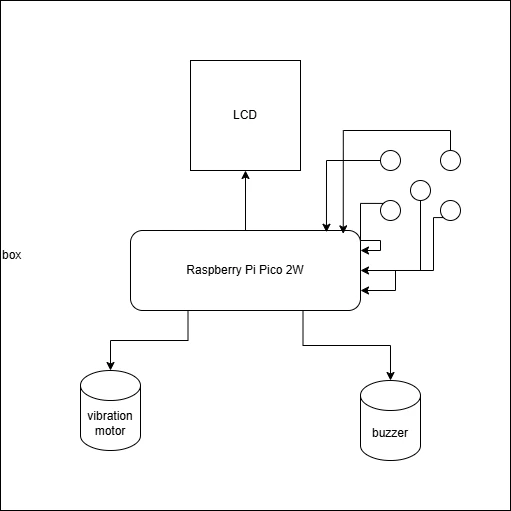
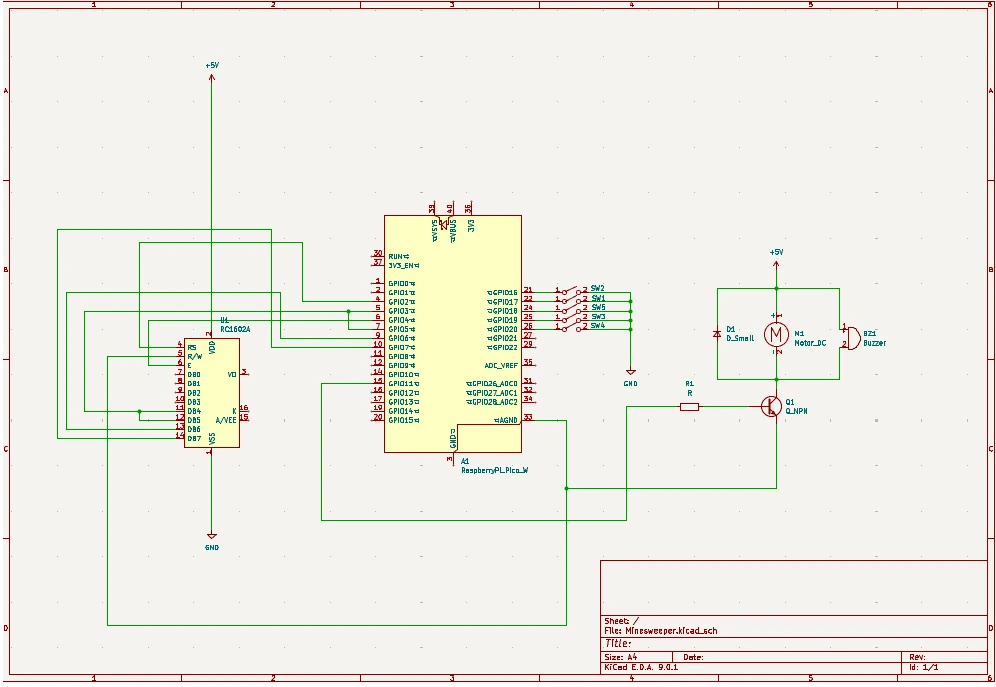

# Minesweeper
Classic implementation of the minesweeper game where the goal is to reveal all the cells without hitting a mine.

:::info 

**Author:** Dobrin David-Andrei \
**GitHub Project Link:** https://github.com/UPB-PMRust-Students/proiect-ddavid03dda

:::

## Description

Classic implementation of the minesweeper game where the goal is to reveal all the cells without hitting a mine. Also several difficulty levels that increase the number of mines on the map. The player can see in a menu the battery status and select the difficulty before the game starts and then play until he loses or wins.

## Motivation

It was a favorite game I used to play as a kid when the internet was down. I wanted to build a physical version I could keep around the house—complete with sounds and vibration—to give it a fresh, tactile feel.  

## Architecture

- **Raspberry Pi Pico 2 W** as central control unit, running the game logic in Rust.  
- **Vibration motor** to signal when the player hits a mine (loss).  
- **Buzzer** for sound effects—menu navigation, tile selection, win/loss alerts.  
- **ILI9341 LCD** to display the menu, battery status, and game grid.  
- **Buttons** for cursor movement, selection, and menu control.

## Log ­#

### Week 5 – 11 May

### Week 12 – 18 May

### Week 19 – 25 May

## Hardware

1. **Raspberry Pi Pico 2 W**  
   * **Purpose**: Main controller.  
   * **Function**: Runs the Minesweeper game logic in Rust, reads button inputs, and drives the display, buzzer, and vibration motor.

2. **Vibration Motor**  
   * **Purpose**: Haptic feedback.  
   * **Function**: Vibrates briefly when the player uncovers a mine (loss).

3. **Buzzer**  
   * **Purpose**: Audio feedback.  
   * **Function**: Emits tones for menu navigation, tile reveals, and win/loss alerts.

4. **ILI9341 LCD**  
   * **Purpose**: Visual interface.  
   * **Function**: Displays the difficulty menu, battery status, game grid, and end-game messages.

5. **Push-buttons (×5)**  
   * **Purpose**: User controls.  
   * **Function**: Up, Down, Left, Right for cursor movement; Select for revealing tiles and confirming menu choices.

### Hardware Overview

- The **Raspberry Pi Pico 2 W** orchestrates all inputs and outputs, executing the Minesweeper logic.  
- **Push-buttons** let the player navigate menus and move the cursor across the minefield.  
- The **ILI9341 LCD** renders the game grid, menus, and battery level in real time.  
- The **Buzzer** provides immediate audio cues for safe tile reveals, mine hits, and victories.  
- The **Vibration Motor** delivers a tactile buzz when a mine is uncovered, reinforcing the loss event.

## Schematics

## Bill of Materials

| Device                                                                                                                                   | Usage                                 | Price                                                                                                                                     |
|------------------------------------------------------------------------------------------------------------------------------------------|---------------------------------------|-------------------------------------------------------------------------------------------------------------------------------------------|
| [Raspberry Pi Pico 2 W](https://www.optimusdigital.ro/ro/placi-raspberry-pi/13327-raspberry-pi-pico-2-w.html)                             | Main microcontroller                  | [80 RON](https://www.optimusdigital.ro/ro/placi-raspberry-pi/13327-raspberry-pi-pico-2-w.html)                                              |
| [Vibration motor module](https://www.optimusdigital.ro/ro/motoare-motoare-cu-vibratii/8251-modul-cu-motor-cu-vibraii.html)                 | Loss feedback vibration               | [15 RON](https://www.optimusdigital.ro/ro/motoare-motoare-cu-vibratii/8251-modul-cu-motor-cu-vibraii.html)                                  |
| [Colored wires male–male (40 × 10 cm)](https://www.optimusdigital.ro/ro/fire-fire-mufate/881-set-fire-mama-mama-40p-15-cm.html)             | Wiring between Pico and peripherals   | [5 RON](https://www.optimusdigital.ro/ro/fire-fire-mufate/881-set-fire-mama-mama-40p-15-cm.html)                                            |
| [Colored wires male–female (40 × 15 cm)](https://www.optimusdigital.ro/ro/toate-produsele/877-set-fire-mama-tata-40p-15-cm.html)             | Wiring sensor/buttons                 | [8 RON](https://www.optimusdigital.ro/ro/toate-produsele/877-set-fire-mama-tata-40p-15-cm.html)                                             |
| [Colored wires female–female (40 × 15 cm)](https://www.optimusdigital.ro/ro/fire-fire-mufate/881-set-fire-mama-mama-40p-15-cm.html)           | Breadboard‐to‐module wiring           | [7 RON](https://www.optimusdigital.ro/ro/fire-fire-mufate/881-set-fire-mama-mama-40p-15-cm.html)                                            |
| [Passive buzzer (3.3 V)](https://www.optimusdigital.ro/ro/audio-buzzere/12247-buzzer-pasiv-de-33v-sau-3v.html)                              | Sound effects                         | [1 RON](https://www.optimusdigital.ro/ro/audio-buzzere/12247-buzzer-pasiv-de-33v-sau-3v.html)                                               |
| [NPN Transistor 2N2222 TO-92](https://www.optimusdigital.ro/ro/componente-electronice-tranzistoare/935-tranzistor-s9013-npn-50-pcs-set.html) | Driving buzzer/vibration motor        | [0.17 RON](https://www.optimusdigital.ro/ro/componente-electronice-tranzistoare/935-tranzistor-s9013-npn-50-pcs-set.html)                  |
| [Breadboard HQ (400 pts)](https://www.optimusdigital.ro/ro/prototipare-breadboard-uri/44-breadboard-400-points.html)                         | Prototyping                           | [4.50 RON](https://www.optimusdigital.ro/ro/prototipare-breadboard-uri/44-breadboard-400-points.html)                                       |
| [Resistor 0.25 W 2.2 kΩ](https://www.optimusdigital.ro/ro/fire-fire-mufate/884-set-fire-tata-tata-40p-10-cm.html)                             | Current limiting                      | [0.10 RON](https://www.optimusdigital.ro/ro/fire-fire-mufate/884-set-fire-tata-tata-40p-10-cm.html)                                           |
| [Diode 1N4007](https://www.optimusdigital.ro/ro/componente-electronice-diode/7457-dioda-1n4007.html)                                          | Flyback protection                    | [0.50 RON](https://www.optimusdigital.ro/ro/componente-electronice-diode/7457-dioda-1n4007.html)                                            |
| [40-pin male header, 2.54 mm (×5)](https://www.optimusdigital.ro/en/pin-headers/464-colored-40p-254-mm-pitch-male-pin-header-red.html)        | GPIO breakout                         | [5 RON](https://www.optimusdigital.ro/en/pin-headers/464-colored-40p-254-mm-pitch-male-pin-header-red.html)                                 |
| [ILI9341 LCD (2.4″, SD slot)](https://www.bitmi.ro/module-electronice/ecran-lcd-ili9341-cu-touch-si-slot-pentru-card-sd-2-4-10797-bitmi-ro.html) | Display                               | [67 RON](https://www.bitmi.ro/module-electronice/ecran-lcd-ili9341-cu-touch-si-slot-pentru-card-sd-2-4-10797-bitmi-ro.html)                |
| Push-buttons × 5                                                                                                                          | User input                            | 10 RON                                                                                                                                     |

## Software

| Library                                            | Description                                    | Usage                                      |
|----------------------------------------------------|------------------------------------------------|--------------------------------------------|
| [rp2040-hal](https://github.com/rp-rs/rp2040-hal)   | Hardware Abstraction Layer for Raspberry Pi Pico | GPIO, PWM, ADC, timers                     |
| [embedded-hal](https://github.com/rust-embedded/embedded-hal) | Common traits for embedded hardware access   | Digital I/O, SPI bus, delay timers         |
| [embedded-graphics](https://github.com/embedded-graphics/embedded-graphics) | 2D graphics library for embedded displays   | Rendering grid, menus, battery indicator   |
| [ili9341](https://github.com/almindor/ili9341)      | ILI9341 TFT display driver                     | SPI communication with the LCD             |
| [panic-halt](https://crates.io/crates/panic-halt)   | Minimal panic handler                          | Halts MCU on unrecoverable errors          |
| [nb](https://crates.io/crates/nb)                   | Non-blocking I/O traits                        | Debouncing buttons, reading battery level  |
