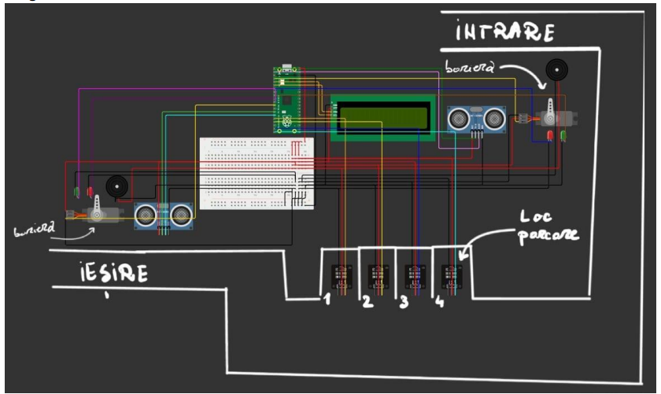
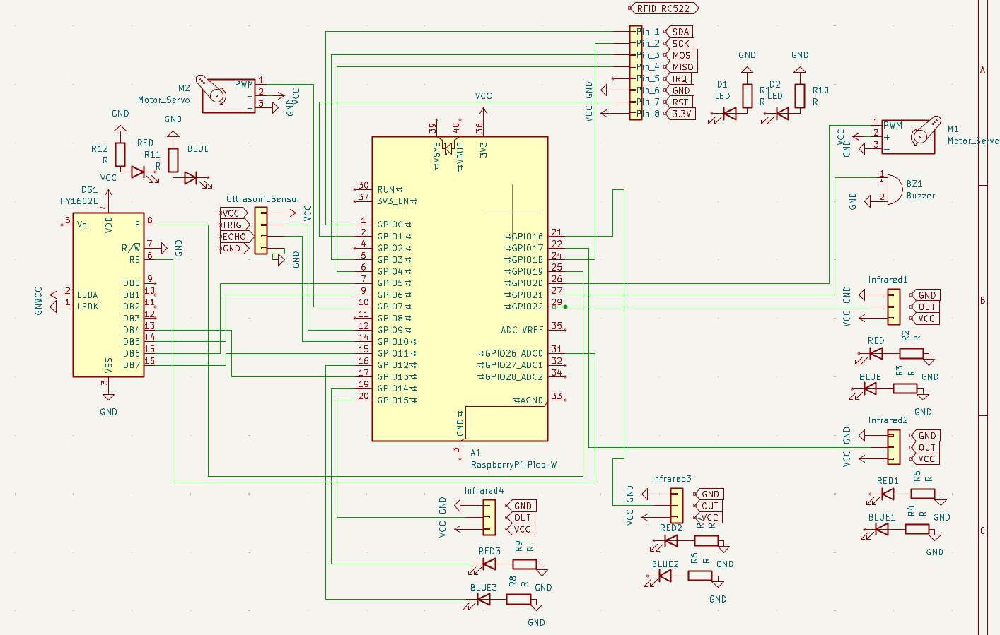

# Sistem de Parcare Inteligent de Acces si Control
Parcare automatizată cu acces controlat RFID, monitorizare locuri în timp real și feedback vizual și sonor.

:::info 

**Author**: Dragos - Andrei Rosu \
**GitHub Project Link**: [https://github.com/UPB-PMRust-Students/proiect-AndreiRosu17](https://github.com/UPB-PMRust-Students/proiect-AndreiRosu17)

:::

## Description

Acest proiect constă într-un sistem inteligent de parcare automatizată, bazat pe microcontrolerul Raspberry Pi Pico W. Sistemul controlează accesul într-o parcare simulată și monitorizează în timp real locurile disponibile. La intrare, un senzor ultrasonic detectează apropierea unei mașini. După detectare, utilizatorul trebuie să apropie un card RFID pentru autentificare.

Dacă cardul este valid, un semnal sonor scurt confirmă accesul, bariera controlată de un servomotor se deschide automat, iar un LED verde indică starea „deschis”. Dacă cardul este invalid, un semnal sonor diferit, mai lung sau întrerupt, avertizează utilizatorul, iar LED-ul roșu rămâne aprins pentru a indica refuzul accesului.

Locurile de parcare sunt monitorizate cu senzori IR, care detectează automat ocuparea fiecărui loc. Un display LED afișează în timp real numărul de locuri disponibile în parcare.

Sistemul oferă o experiență interactivă și eficientă, simulând funcționalități moderne de parcare — cu accent pe automatizare, securitate și feedback vizual și sonor în timp real. Este ideal ca proiect educațional sau ca bază pentru prototipuri funcționale în medii reale.

## Motivation

Am ales acest proiect deoarece combină mai multe concepte esențiale din domeniul sistemelor embedded: controlul perifericelor (LED-uri, servo, senzori), comunicarea cu un modul RFID și afișarea informației în timp real. În plus, ideea unei parcări inteligente este una foarte practică și actuală, fiind des întâlnită în viața de zi cu zi. Acest proiect îmi oferă ocazia să aplic cunoștințele teoretice într-un mod concret și interactiv, dezvoltând în același timp abilități de proiectare hardware și software. Totodată, integrează elemente de automatizare și securitate, ceea ce îl face interesant și util ca prototip pentru aplicații reale.

## Architecture 

Sistemul este compus din următoarele **module arhitecturale**:

- **Modul de detecție a prezenței**  
  Format dintr-un **senzor ultrasonic**, folosit pentru a detecta apropierea unui vehicul la **intrare** și **ieșire**.

- **Modul de control al accesului**  
  Gestionează **autentificarea cardurilor RFID** și decide dacă **bariera se deschide sau nu**.  
  - La card **valid**: se activează **LED-ul verde** și **servomotorul**.  
  - La card **invalid**: se emite un **semnal sonor de eroare** și **LED-ul roșu** rămâne aprins.

- **Modul de monitorizare a locurilor de parcare**  
  Format din **senzori IR** plasați pe fiecare loc de parcare, care detectează ocuparea acestora.  
  Informațiile sunt centralizate și afișate pe un **ecran LED**.

- **Modul de interfață cu utilizatorul**  
  Asigură comunicarea **vizuală și auditivă** cu utilizatorul prin:
  - **LED-uri colorate**
  - **Buzzer**
  - **Afișaj LCD**

- **Unitatea centrală de control – Raspberry Pi Pico 2W**  
  Coordonează toate modulele, **primește datele** de la senzori și **ia decizii în timp real**, în funcție de logica programată.

- **Schema arhitecturala:**
  

## Log

<!-- write your progress here every week -->

### Week 5 - 11 May

### Week 12 - 18 May

### Week 19 - 25 May

## Hardware

Detail in a few words the hardware used.

### Schematics



### Bill of Materials

<!-- Fill out this table with all the hardware components that you might need.

The format is 
```
| [Device](link://to/device) | This is used ... | [price](link://to/store) |

```

-->

| Device | Usage | Price |
|--------|--------|-------|
| [Raspberry Pi Pico W](https://www.raspberrypi.com/documentation/microcontrollers/raspberry-pi-pico.html) | The microcontroller | [40 RON](https://www.optimusdigital.ro/en/raspberry-pi-boards/13327-raspberry-pi-pico-2-w.html?search_query=raspberry+pi+pico+2w&results=36) |
| [InfraRed Sensor](https://www.handsontec.com/dataspecs/sensor/IR%20Obstacle%20Detector.pdf)|InfraRed sensor|[2 RON](https://www.optimusdigital.ro/en/optical-sensors/4514-infrared-obstacle-sensor.html?gad_source=1&gbraid=0AAAAADv-p3B5TYhyjMqYSQe-vwiSkvVW-&gclid=Cj0KCQjw2tHABhCiARIsANZzDWpv0ATp4vrhxmQuIVtcPEh5240yeynntxsHnxl_uz7O-bKgiAcnlEUaAuzEEALw_wcB)|
| [ServoMotors](http://www.wecl.com.hk/distribution/PDF/Robotics_IoT/58-01-9024.pdf)|ServoMotors|[20 RON](https://www.optimusdigital.ro/ro/motoare-servomotoare/5706-servomotor-sg92r-9g-25-kgcm-48-v.html?search_query=servomotor&results=116)|
| [LCD](https://www.handsontec.com/dataspecs/module/I2C_1602_LCD.pdf)|LCD|[17 RON](https://www.optimusdigital.ro/ro/optoelectronice-lcd-uri/2894-lcd-cu-interfata-i2c-si-backlight-albastru.html?search_query=LCD&results=217)|
| [Active Buzzer](http://www.electronicoscaldas.com/datasheet/LTE12-Series.pdf?srsltid=AfmBOooG0A2FCw89LVTTiD8VIMPc17M7wxEYLcxzhqs1wGnLAJCQx2__)|Active Buzzer|[1.5 RON](https://www.optimusdigital.ro/ro/audio-buzzere/634-buzzer-pasiv-de-5-v.html?search_query=buzzer&results=63)|
| [RED LED](https://www.farnell.com/datasheets/1498852.pdf)|RED LED|[0.4 RON](https://www.optimusdigital.ro/ro/optoelectronice-led-uri/696-led-rou-de-3-mm-cu-lentile-difuze.html?search_query=red+led&results=121)|
| [BLUE/GREEN LED](https://www.farnell.com/datasheets/1498852.pdf)|BLUE/GREEN LED|[0.4 RON](https://www.optimusdigital.ro/ro/optoelectronice-led-uri/697-led-verde-de-3-mm-cu-lentile-difuze.html?search_query=led&results=779)|
| [Ultrasonic Sensor](https://www.handsontec.com/dataspecs/HC-SR04-Ultrasonic.pdf)|Ultrasonic Sensor|[15 RON](https://www.optimusdigital.ro/ro/senzori-senzori-ultrasonici/2328-senzor-ultrasonic-de-distana-hc-sr04-compatibil-33-v-i-5-v.html?search_query=ultrasonic+&results=47)|


## Software

| Library | Description | Usage |
|--------|-------------|-------|
| [`embassy`](https://github.com/embassy-rs/embassy) | Asynchronous embedded framework in Rust | Core framework for async multitasking on microcontrollers |
| [`embassy-rp`](https://github.com/embassy-rs/embassy) | RP2040-specific support for Embassy | Enables async support and peripheral access on Raspberry Pi Pico W |
| [`embedded-hal`](https://github.com/rust-embedded/embedded-hal) | Hardware abstraction layer for embedded devices | Standard interface for GPIO, SPI, I2C, PWM, etc. |
| [`embassy-time`](https://github.com/embassy-rs/embassy/tree/main/embassy-time) | Async timers and delays | Used for non-blocking delays and timeouts |
| [`panic-halt`](https://docs.rs/panic-halt/latest/panic_halt/) / [`defmt-rtt`](https://docs.rs/defmt-rtt/latest/defmt_rtt/) | Minimal panic handler / RTT logging | Used for debugging/logging in embedded Rust |
| [`rp-pico`](https://github.com/rp-rs/rp-hal) | Board Support Crate for Raspberry Pi Pico | Maps GPIOs and defines board-level abstractions |
| [`hd44780-driver`](https://crates.io/crates/hd44780-driver) | Driver for HD44780 parallel LCDs | Controls 1602 LCDs in 4-bit mode |
| [`hd44780-i2c`](https://crates.io/crates/hd44780-i2c) | I2C interface for HD44780 displays via PCF8574 | For LCDs with I2C backpack modules |
| [`rc522`](https://crates.io/crates/rc522) | SPI interface for RFID RC522 module | For reading/writing RFID tags via MFRC522 |
| [`mfrc522`](https://github.com/gbrlsnchs/mfrc522-rs) | Low-level SPI driver for MFRC522 | Alternative to `rc522`, more direct control |
| [`ultrasonic-sensor`](https://crates.io/crates/ultrasonic-sensor) | Driver for HC-SR04 ultrasonic sensor | Measures distance via trigger/echo GPIO |
| [`embedded-graphics`](https://github.com/embedded-graphics/embedded-graphics) | 2D graphics primitives for embedded | Used with OLED/LCD for rendering UI |
| [`ssd1306`](https://github.com/eldruin/ssd1306) | Driver for SSD1306 OLED displays | Combined with `embedded-graphics` for I2C/SPI OLEDs |

## Links

<!-- Add a few links that inspired you and that you think you will use for your project -->

1. [link](https://example.com)
2. [link](https://example3.com)
...
