# Smart Recycling Bin

The project represents a smart recycling bin that can be used to sort objects through AI material detection from photo.

:::info

**Author**: Niță Eduard-Eugen \
**GitHub Project Link**: https://github.com/UPB-PMRust-Students/proiect-edwardnita

:::

## Description

The project is a smart recycling bin for waste, which automatically sorts an object based on the material it is made of. A camera will take a picture of the waste, which will be analyzed using AI and the result will determine the compartment into which the bin will automatically dispose of the waste.

## Motivation

I always wondered what is the best method to sort waste as the public bins are still too generic when it comes to sorting trash by material. This idea was firstly explored in a hackathon but because of the insufficient time was only a proof of concept, now wanting to make it real.

## Architecture





## Log

<!-- write your progress here every week -->

### Week 5 - 11 May

### Week 12 - 18 May

### Week 19 - 25 May

## Hardware

### Raspberry Pi Pico W (Pico 2W)
Central controller for all peripherals, used for:

Wi-Fi: To communicate with the PC running the AI classifier.

GPIO: To control servos, camera trigger, LED, and read sensor input.

I²C: To communicate with the LED display.

Power Supply: Via USB (5V), also powers other 3.3V components via onboard regulator.


### OV7670 Camera Module
Captures an image of the object placed in the bin, connected via SPI (via PIO or a dedicated SPI interface on Pico).


### LED
Provides lighting for consistent image capture, connected to a GPIO pin via a current-limiting resistor.

It is turned ON/OFF by the Pico before/after taking a photo.


### LED Display
Displays the material type detected (e.g., “Plastic”) and is connected through I²C.

Power: 3.3V or 5V depending on display model.


### IR Proximity Sensor
Detects when an object is placed for analysis.

Power: 3.3V or 5V depending on sensor.

Connection:

VCC → 3.3V or 5V.

GND → GND.

OUT → GPIO pin on Pico.

### SG90 Servo Motors
Move trays to direct waste into one of the four compartments, controlled with PWM.


### USB Cable & Laptop
Powers the bin through the USB port and the laptop will use AI 
to analyze the data.


### Schematics

Place your KiCAD schematics here.

### Bill of Materials

<!-- Fill out this table with all the hardware components that you might need.

The format is
```
| [Device](link://to/device) | This is used ... | [price](link://to/store) |

```

-->

| Device                                                                                                   | Usage               | Price                                                                                         |
| -------------------------------------------------------------------------------------------------------- | ------------------- | --------------------------------------------------------------------------------------------- |
| [Raspberry Pi Pico 2W](https://datasheets.raspberrypi.com/rp2350/rp2350-datasheet.pdf) | The microcontroller | [39.66 RON ](https://www.optimusdigital.ro/ro/placi-raspberry-pi/13327-raspberry-pi-pico-2-w.html) x 2|
| OV7670 Camera Module | Camera for object recognition | [16.33 RON](https://www.optimusdigital.ro/ro/senzori-senzori-optici/624-modul-camera-ov7670.html?search_query=camera&results=134) |
| SG90 Servo Motor | Controls the rotating trays | [19.90 RON](https://www.optimusdigital.ro/ro/motoare-servomotoare/5706-servomotor-sg92r-9g-25-kgcm-48-v.html?search_query=servomotor&results=116) × 3 |
| IR Proximity Sensor | Detects when an object is placed | [29.99 RON](https://www.optimusdigital.ro/ro/senzori-senzori-de-distanta/1348-modul-senzor-de-proximitate-ap3216.html?search_query=senzor+proximitate&results=21) |
| White LED 5mm | Lights the object during photo | [0.30 RON](https://www.optimusdigital.ro/ro/optoelectronice-led-uri/930-led-alb-de-3-mm-cu-lentile-transparente.html?search_query=led&results=779) |
| LCD 1602 | Displays the detected material | [14.99 RON](https://www.optimusdigital.ro/ro/optoelectronice-lcd-uri/62-lcd-1602-cu-interfata-i2c-si-backlight-galben-verde.html?search_query=lcd&results=217) |
| Breadboard & Jumper Wires | For prototyping | [22 RON](https://www.optimusdigital.ro/ro/kituri/2222-kit-breadboard-hq-830-p.html?search_query=breadboard&results=127) |
|  | Total | 222.63 RON

## Software

| Library                                                                     | Description               | Usage                                           |
| --------------------------------------------------------------------------- | ------------------------- | ----------------------------------------------- |
| [embassy](https://github.com/embassy-rs/embassy)                        | Async embedded framework          | Manages GPIO, PWM, I²C, Wi-Fi, tasks          |
| [embedded-hal](https://github.com/rust-embedded/embedded-hal)          | Hardware abstraction              | Standard interface for controlling peripherals |
| [hd44780-driver](https://github.com/JohnDoneth/hd44780-driver)         | LCD driver for HD44780 via I²C    | Used to display material name on LCD          |
| [defmt](https://github.com/knurling-rs/defmt)                           | Lightweight debug logging         | Debug output over USB serial                  |

### AI Classifier (Python, runs on Laptop/PC)

| Library                              | Description                              | Usage                                           |
|--------------------------------------|------------------------------------------|-------------------------------------------------|
| [opencv-python](https://pypi.org/project/opencv-python/) | Image capture & preprocessing           | Captures image from the Pico and resizes/crops |
| [tensorflow](https://www.tensorflow.org/) or [torch](https://pytorch.org/) | Loads pretrained model and runs inference | Classifies material (e.g., plastic, glass)     |
| [numpy](https://numpy.org/)         | Numerical operations                      | Image array manipulation                        |


## Links

<!-- Add a few links that inspired you and that you think you will use for your project -->

1. [Smart Trash Bin using Arduino and ML](https://circuitdigest.com/microcontroller-projects/smart-trash-bin-using-arduino-and-machine-learning)
2. [PWM lab](https://pmrust.pages.upb.ro/docs/acs_cc/lab/03)
3. [SPI lab](https://pmrust.pages.upb.ro/docs/acs_cc/lab/05)
4. [I2C lab](https://pmrust.pages.upb.ro/docs/acs_cc/lab/06)

