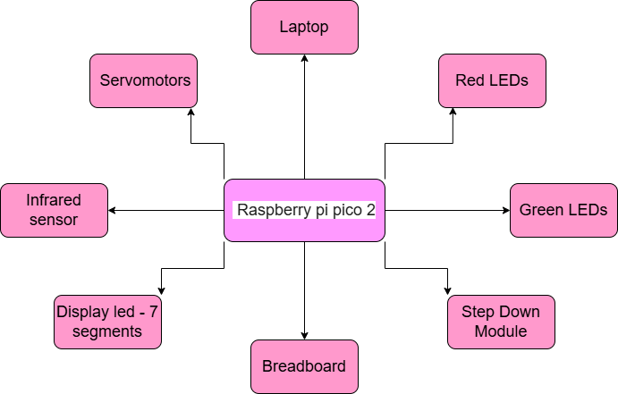
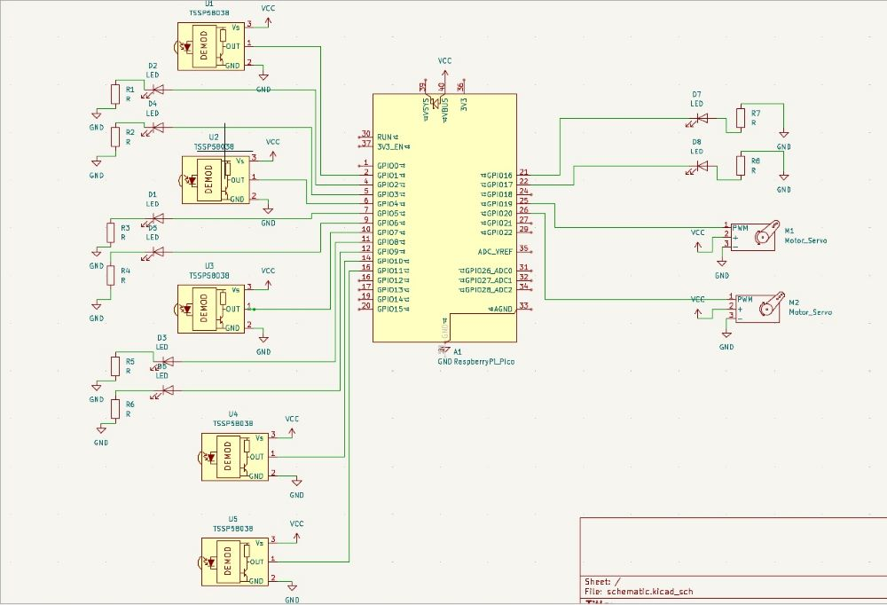

# Automated Parking System

A parking system utilizing infrared sensors, Leds an servo-motors, with Raspberry Pi Pico 2 for enhanced efficiency.

:::info

**Autor**: Tanase Elena-Ramona

**Link GitHub**: (https://github.com/UPB-PMRust-Students/proiect-tanase-ramona)

:::

---

## Description

The project aims to create a smart parking system that efficiently manages vehicles. When a car arrives and wants to enter the parking lot, an infrared sensor detects its presence and commands the servo motor to lift the barrier if there is at least one free parking spot; otherwise, the barrier will remain closed. At the entrance, a screen constantly displays the number of available parking spots. This is complemented by a traffic light with two LEDs: Green – parking available, Red – parking full.
Each parking spot is equipped with an infrared sensor to detect whether it is occupied or not, along with a green LED and a red LED. If the spot is free, the green LED will be on; if a car is parked there, the red LED will light up.
At the exit, there is another infrared sensor that detects when a car wants to leave and commands the servo motor to lift the barrier.

---

## Motivation

Nowadays, cars have become a necessity rather than a luxury. People rely on them for everyday activities—whether commuting to work, going shopping, or enjoying their leisure time. One of the main challenges they face is finding a parking spot wherever they go, which can often be stressful and time-consuming. Whether it’s for work, entertainment, or errands, having a convenient and secure parking space is essential for comfort and peace of mind.
I chose this project because it addresses this widespread issue. My solution focuses on enhancing parking safety and improving the overall user experience. The concept is versatile enough to be implemented in both public areas (such as parks) and private spaces (like supermarkets and shopping malls).

---

## Architecture

The smart car parking system is composed of several electronic components, each working for a specific role. The following list presents a detailed description of each component and how they are interconnected to ensure the proper functioning of the system:

1. Infrared Sensors 
Quantity: One at the entrance, one at the exit, and one for each parking spot.
Function: Detect the presence of a vehicle. The entrance IR sensor detects the presence of any vehicle attempting to access the parking area, triggering the barrier if needed. The exit sensor detects when a car is leaving, allowing the system to decrement the number of available spots. Each parking spot IR sensor determines whether that particular spot is occupied or not.
Connection: All IR sensors are connected to the microcontroller’s digital input pins. The entrance and exit sensors are positioned to detect motion in front of the respective barriers.

2. Servo Motors
Quantity: One for the entrance barrier, one for the exit barrier.
Function: Control the physical movement of the barriers.
Connection: Connected to the PWM-capable pins of the microcontroller. Activated when the IR sensor detects a car and the system logic allows entry(free spots)/exit(anytime).

3. LED Indicators (Traffic Light & Spot LEDs)
Traffic Light LEDs: 2 (1 Red, 1 Green)
Function: Indicate parking availability at the entrance.
Connection: Controlled by the microcontroller’s digital output pins.
Spot LEDs: 2 per parking spot (1 Red, 1 Green)
Function: Show the status of each parking spot: green - free, red - occupied.
Connection: Connected to the microcontroller, controlled based on the state of the IR sensor for each spot.

4. 7-segment display
Quantity: one at the entrance
Function: Displays the number of free parking spots at the entrance.
Connection: Communicates with the microcontroller via I2C or SPI, depending on the model used.

5. Raspberry Pi Pico 
Quantity: two
Function: The central unit that processes sensor input, manages logic, controls servos, LEDs, and the display.
Connection:
Inputs: Receives signals from all IR sensors.
Outputs: Sends PWM signals to servos, digital signals to LEDs, and communication signals to the display.
Logic: Based on IR inputs, calculates free spots, updates display, changes LED colors, and controls barrier movement.

Interconnection Overview:
When a car approaches the entrance, the entrance IR sensor sends a signal to the microcontroller. The microcontroller checks the states of all parking spot IR sensors to determine availability.
If a spot is free: the entrance barrier servo is activated to lift the barrier, the LCD display shows updated available spots, the traffic light shows green.
If no spots are free: the barrier remains down, the traffic light shows red.
Inside the parking lot, each parking spot's IR sensor updates its LED indicators (green for free, red for occupied).
At the exit, the IR sensor triggers the exit barrier servo to lift and allows the car to leave. The system then updates the spot count and indicators accordingly.

---

## Weekly Log

### Week 6 - 12 May

- nothing yet

### Week 7 - 19 May

- nothing yet

### Week 20 - 26 May

- nothing yet

---

### Hardware design
Raspberry Pi Pico:
- Acts as the central control unit of the system
- Processes input from sensors and controls servos and LEDs

Each parking spot includes:
- Green LED: Indicates the spot is available
- Red LED: Indicates the spot is occupied
- Infrared sensor: Detects the presence of a vehicle

The entrance and exit of the parking lot include:
- Servo motor: Controls the raising and lowering of the barrier
- Infrared sensor: Detects whether a car is entering or exiting the parking lot
- 7-segment display: Shows the number of available parking spots
- Traffic light (Red and Green LEDs): Indicates whether parking spaces are available or the lot is full

## Schematics

---

## Software

| Library           | Description                                 | Usage                                               |
|-------------------|---------------------------------------------|-----------------------------------------------------|
| embassy-executor| Asynchronous executor for Rust embedded systems | Used for task scheduling and asynchronous programming |
| embassy-time    | Time management library                     | Used for time-based operations such as delays       |
| embassy-rp     | Peripheral access library                   | Used for initializing and interacting with peripherals |
| gpio            | GPIO manipulation                           | Used for interacting with GPIO pins                 |

## Bill of Materials

| Component                         | Price     | Purchase Link                                                                    |
|-----------------------------------|-----------|----------------------------------------------------------------------------------|
| Raspberry Pi Pico W               | 40 RON(x2)| (https://www.optimusdigital.ro/ro/placi-raspberry-pi/13327-raspberry-pi-pico-2-w.html?gad_source=1&gad_campaignid=21513560576&gbraid=0AAAAADv-p3BtMLgBGxmye2m1Hx8HLgZxw&gclid=CjwKCAjwn6LABhBSEiwAsNJrjr_jKogX7k0cIoRKC8VEKq2uHSqPLyEO79oLR82e_Op5hOkao0lMkhoCNNsQAvD_BwE)                      |
| Battery holder                    | 10 RON    | (https://www.optimusdigital.ro/ro/suporturi-de-baterii/941-suport-de-baterii-2-x-18650.html?gad_source=1&gad_campaignid=19615979487&gbraid=0AAAAADv-p3CvnArKFfesdW7ejb5uQYPxV&gclid=Cj0KCQjwzrzABhD8ARIsANlSWNNKyDWxrNR2NLfMMoJnc50pUgImo0tOk07SrOf6IoHkVKU-_Y6T1V8aAgyZEALw_wcB)                   |
| Male Pin Header                  | 4 RON  | (https://www.optimusdigital.ro/en/pin-headers/8445-20-x-2p-254-mm-male-pin-header.html?gad_source=1&gad_campaignid=19615979487&gbraid=0AAAAADv-p3DST91rElLA-XfsBRapIVDc8&gclid=Cj0KCQjw_dbABhC5ARIsAAh2Z-TB6ZEt81QPMAH3fPMNrtDzq-nu8il1ocDpH1nNzUDEW4GInWKfHGYaAqJvEALw_wcB)                  |
| Female Pin Header                 | 1 RON  | (https://www.optimusdigital.ro/en/pin-headers/4162-10p-female-pin-header-254-mm.html?gad_source=1&gad_campaignid=19615979487&gbraid=0AAAAADv-p3DST91rElLA-XfsBRapIVDc8&gclid=Cj0KCQjw_dbABhC5ARIsAAh2Z-QHHzNd26mzuY6uEFydO-MELDCFn1bNAvo-JR28si6PVMd_ewVQ2RgaAi91EALw_wcB)                  |
| Micro Servo Motor SG90 90°       | 12 RON(x2)| (https://www.optimusdigital.ro/ro/motoare-servomotoare/2261-micro-servo-motor-sg90-180.html)                    |
| Kit Breadboard                  | 22 RON    | (https://www.optimusdigital.ro/ro/kituri/2222-kit-breadboard-hq-830-p.html?search_query=Kit+Breadboard+HQ830+cu+Fire+%C8%99i+Sursa&results=1)                             |
|  Step Down Module                 | 13 RON         | (https://www.optimusdigital.ro/en/adjustable-step-down-power-supplies/1108-lm2596hv-dc-dc-step-down-module.html?gad_source=1&gad_campaignid=19615979487&gbraid=0AAAAADv-p3DST91rElLA-XfsBRapIVDc8&gclid=Cj0KCQjw_dbABhC5ARIsAAh2Z-QuAcgYjAExLR6D1QNnlLo5c5EJJE6ZyaOiQp4VM0DdK4_x_4kCS68aAh1KEALw_wcB)              |
|  Wires                            | 8 RON         | (https://www.optimusdigital.ro/en/wires-with-connectors/90-20-cm-40p-female-female-wire.html)              |
|  LEDs + resistors                 | 27 RON         | (https://www.optimusdigital.ro/en/optimus-digital-kits/9517-set-de-led-uri-asortate-de-5-mm-si-3-mm-310-buc-cu-rezistoare-bonus.html?gad_source=1&gad_campaignid=19615979487&gbraid=0AAAAADv-p3DST91rElLA-XfsBRapIVDc8&gclid=Cj0KCQjw_dbABhC5ARIsAAh2Z-RVARvHHPLWIl5vuA5DU6HZ_jsTIFXsR_YN7WDm-mgwGUgJKEEB7l4aAu7CEALw_wcB)              |
|  Infrared Obstacle Sensor         | 3,5 RON(x6)    | (https://www.optimusdigital.ro/en/optical-sensors/4514-infrared-obstacle-sensor.html?gad_source=1&gad_campaignid=19615979487&gbraid=0AAAAADv-p3DST91rElLA-XfsBRapIVDc8&gclid=Cj0KCQjw_dbABhC5ARIsAAh2Z-T27ZX_imeYCGaxgXTUkUH-xLCDqYNOOcXF3YkLwBYEPD6n_b7CsZsaArY1EALw_wcB)              |
---

## Links

[Link 1] (https://www.youtube.com/watch?v=8XOsXdNOa4g&ab_channel=svsembedded)
