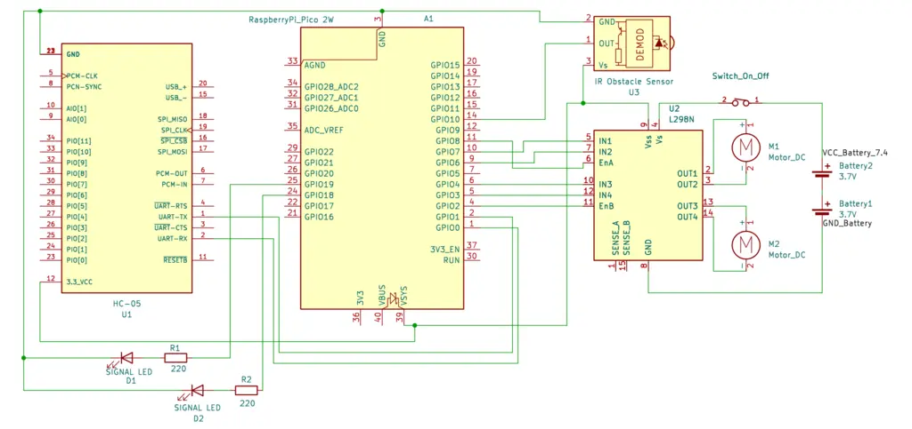

# Bluetooth-Controlled Car
A Bluetooth-controlled robotic car powered by Raspberry Pi Pico 2W with obstacle avoidance.

:::info 

**Author**: Stiuj Emanuel-Ștefan \
**GitHub Project Link**: https://github.com/UPB-PMRust-Students/proiect-emanuelstiuj

:::

## Description

This project is a Bluetooth-controlled car that can be operated using an Android application. The vehicle responds to directional commands such as forward, backward, left, and right, and can also stop on demand. An onboard obstacle detection system allows the car to avoid collisions without user input.
In addition to movement, the car features LED indicators for visual signaling and a basic control system that manages motor speed and direction in real time based on incoming commands.

## Motivation

This project was inspired by a strong interest in cars and remote-controlled systems. It provided an opportunity to better understand how various components, such as microcontrollers, motor drivers, sensors, and communication modules, interact in a real-world embedded system. Working on this allowed for both creative and technical exploration, combining hardware and software to build something functional, interactive, and fun.

## Architecture 


#### System Architecture

The system is built around a central microcontroller, the **Raspberry Pi Pico 2W**, which interfaces with multiple peripherals to enable wireless control and feedback:

- **Bluetooth (HC-05 module)**: Connects to the Pico via **UART** for serial communication, receiving commands from an Android device over the **Bluetooth Serial Port Profile (SPP)**. The HC-05 operates typically as a slave device, allowing the phone to initiate and send control data.
- **Motor Driver (L298N)**: Receives **PWM** signals (for speed control) and **GPIO** signals (for direction control) from the Pico to drive DC motors. The L298N provides high-current output to the motors based on the Pico’s low-power signals.
- **IR Sensor**: Outputs **digital signals** to a GPIO pin on the Pico when detecting obstacles within its range, enabling proximity-based decision-making.
- **LEDs**: Controlled via **GPIO pins** to provide visual feedback on system states (e.g., power status, collision detection, or turning left/right).
- **Power Supply (2x 18650 batteries)**: Supplies power to the L298N motor driver directly (typically at 7.4V) and to the Pico through a voltage regulator (e.g., 5V step-down converter) to ensure stable operation.

#### Flow of Control

1. The Android device sends commands wirelessly to the HC-05 module via **Bluetooth SPP**.
2. The HC-05 relays these commands to the Pico over **UART**, where they are interpreted by the firmware.
3. The Pico processes the commands and generates **PWM** and **GPIO** signals to the L298N, controlling motor speed and direction.
4. If the **IR sensor** detects an obstacle, it sends a digital signal to the Pico, which can override the received commands to stop or redirect the motors, preventing collisions.
5. **LEDs** are optionally toggled via GPIO to provide visual feedback on system states (e.g., power status, collision detection, or turning left/right).

## Log

<!-- write your progress here every week -->

### Week 5 - 11 May

### Week 12 - 18 May

### Week 19 - 25 May

## Hardware

- **Raspberry Pi Pico 2W**: Microcontroller handling communication, logic and motor control.
- **HC-05 Bluetooth Module**: Wireless interface for receiving remote control commands.
- **L298N Motor Driver**: Allows control of DC motors via GPIO and PWM.
- **IR Obstacle Sensor**: Detects objects in front of the car and sends digital feedback.
- **LEDs + Resistors**: Used as visual indicators.
- **2x DC Motors + Wheels**: Provide mobility.
- **Power Supply (2x 18650 Batteries)**: Delivers sufficient voltage and current.
- **Chassis, Wires, Breadboard**: Assembly and connectivity.

### Schematics



### Bill of Materials

<!-- Fill out this table with all the hardware components that you might need.

The format is 
```
| [Device](link://to/device) | This is used ... | [price](link://to/store) |

```

-->

| Device | Usage | Price |
|--------|--------|-------|
| [Raspberry Pi Pico 2W (x2)](https://datasheets.raspberrypi.com/picow/pico-2-w-datasheet.pdf) | One microcontroller handles main control; the second is used for  debugging | [80 RON](https://www.optimusdigital.ro/en/raspberry-pi-boards/13327-raspberry-pi-pico-2-w.html) |
| [HC-05 Bluetooth Module](https://components101.com/sites/default/files/component_datasheet/HC-05%20Datasheet.pdf) | Enables wireless communication with an Android app for remote control | [28 RON](https://www.optimusdigital.ro/en/wireless-bluetooth/153-hc-05-master-slave-bluetooth-module-with-adapter-33v-and-5v-compatible.html) |
| [L298N Motor Driver](https://www.handsontec.com/dataspecs/L298N%20Motor%20Driver.pdf) | Drives two DC motors and also provides 5V output to power the Raspberry Pi Pico | [11 RON](https://www.optimusdigital.ro/en/brushed-motor-drivers/145-l298n-dual-motor-driver.html) |
| [3-6V DC Motor with Wheel (x2)](https://www.moog.com/literature/MCG/moc23series.pdf) | Provides motion using gear-reduced DC motors | [30 RON](https://www.optimusdigital.ro/en/others/139-gearmotor-with-wheel.html) |
| [IR Obstacle Sensor](https://www.optimusdigital.ro/en/optical-sensors/2388-modul-senzor-infrarou-de-obstacole-2-180-cm.html) | Detects nearby objects to support autonomous navigation | [20 RON](https://www.optimusdigital.ro/en/optical-sensors/2388-modul-senzor-infrarou-de-obstacole-2-180-cm.html) |
| [LED Headlights (x2)](https://www.farnell.com/datasheets/1519875.pdf) | Indicator lights for signaling | [1 RON](https://www.optimusdigital.ro/en/leds/38-5-mm-green-led-with-difused-lens.html) |
| [18650 Li-ion Battery (x2)](https://www.ineltro.ch/media/downloads/SAAItem/45/45958/36e3e7f3-2049-4adb-a2a7-79c654d92915.pdf) | Power supply (7.4V) | [40 RON](https://www.optimusdigital.ro/en/li-ion-batteries/1725-samsung-2600-mah-18650-li-ion-battery-icr18650-26f.html) |
| [Battery Holder (2x18650)](https://www.optimusdigital.ro/en/battery-holders/941-2x18650-battery-case.html) | Holds two 18650 batteries in series for higher voltage output | [4 RON](https://www.optimusdigital.ro/en/battery-holders/941-2x18650-battery-case.html) |
| [Switch](https://components101.com/switches/spst-rocker-switch-non-illuminated) | Used to turn the power supply on or off | [3 RON](https://www.optimusdigital.ro/en/buttons-and-switches/7377-kcd10-101-switch.html) |
| [220Ω Resistors (x2)](https://www.digchip.com/datasheets/parts/datasheet/1838/CFR-25JB-220R-pdf.php) | Limits current for LEDs | [1 RON](https://www.optimusdigital.ro/en/resistors/1097-025w-220-resistor.html) |
| [Breadboard 830p](https://ro.mouser.com/datasheet/2/58/BPS_DAT__BB830__Datasheet-1842667.pdf) | Rapid prototyping and testing of circuit connections | [11 RON](https://www.optimusdigital.ro/en/breadboards/8-breadboard-hq-830-points.html) |
| [Male–Female Wires (set)](https://www.cedist.com/sites/default/files/associated_files/s-w604_spec.pdf) | Connects modules to the Pico or to the breadboard | [5 RON](https://www.optimusdigital.ro/en/all-products/876-15-cm-male-female-wires-10p.html) |
| [Jumper Wires (set)](https://www.cedist.com/sites/default/files/associated_files/s-w604_spec.pdf) | General-purpose wires for connecting components on the breadboard | [8 RON](https://www.optimusdigital.ro/en/wires-with-connectors/12-breadboard-jumper-wire-set.html) |
| [Male Header Pins (40x2)](https://www.farnell.com/datasheets/2585485.pdf) | For plugging Raspberry Pi Pico into breadboard | [2 RON](https://www.optimusdigital.ro/en/pin-headers/463-colored-40p-254-mm-pitch-male-pin-header-white.html) |
| [Chassis](https://roboromania.ro/produs/sasiu-2wd-robot-car-chassis-v1/) | Main platform for mounting all components | [25 RON](https://roboromania.ro/produs/sasiu-2wd-robot-car-chassis-v1/) |
| [Support Wheel](https://roboromania.ro/produs/roata-pivotanta-robot/) | Balances and stabilizes the rear of the car | [5 RON](https://roboromania.ro/produs/roata-pivotanta-robot/) |

**Total Estimated Cost**: ~274 RON (excluding shipping).

## Software

| Library | Description | Usage |
|---------|-------------|-------|
| [embassy](https://github.com/embassy-rs/embassy) | Asynchronous embedded framework in Rust | Core framework for async multitasking on the Pico 2W |
| [embassy-rp](https://github.com/embassy-rs/embassy/tree/main/embassy-rp) | RP23450-specific support for Embassy | Enables async support and peripheral access on Raspberry Pi Pico 2W (GPIO, PWM, UART, etc.) |
| [embedded-hal](https://github.com/rust-embedded/embedded-hal) | Hardware Abstraction Layer | Standard traits for embedded peripherals |
| [embassy-time](https://github.com/embassy-rs/embassy/tree/main/embassy-time) | Async timers and delays | Used for non-blocking delays and timeouts |
| [embassy-executor](https://github.com/embassy-rs/embassy/tree/main/embassy-executor) | Task executor for async Embassy  | Runs async tasks in cooperative scheduling |
| [defmt](https://github.com/knurling-rs/defmt) | Logging for embedded Rust | Efficient debug output via probe |
| [panic-probe](https://github.com/knurling-rs/defmt/tree/main/firmware/panic-probe) | Panic handler | Reports panics via probe in development |
| [L298N](https://docs.rs/l298n/latest/l298n/struct.L298N.html) | Motor driver implementation | Speed and direction control |

## Links  

1. [Raspberry Pi Pico 2W Documentation](https://datasheets.raspberrypi.com/picow/pico-2-w-datasheet.pdf)  
2. [HC-05 Bluetooth Module Guide](https://www.instructables.com/How-to-Use-HC-05-Bluetooth-With-Raspberry-Pi-Pico-/)  
3. [L298N Motor Driver Guide](https://microcontrollerslab.com/dc-motor-l298n-driver-raspberry-pi-pico-tutorial/)
4. [IR Obstacle Sensor Guide](https://www.electronicshub.org/interfacing-ir-sensor-with-raspberry-pi/)
