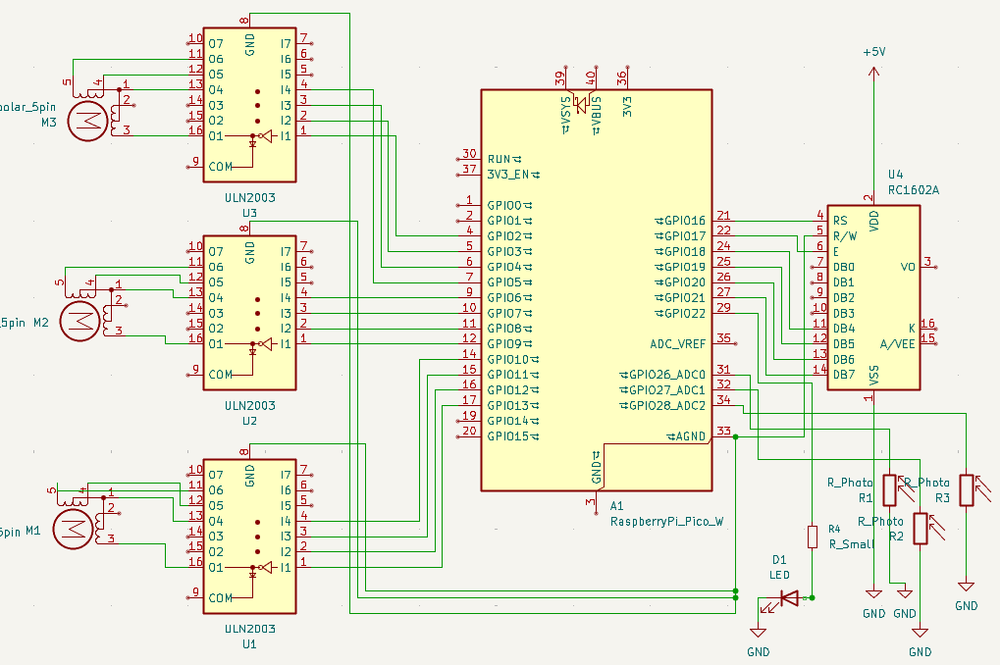

# Hit the Target

Laser tag style game where the player uses a laser pointer to hit targets

:::info

**Author**: Echim Eugen Andrei \
**GitHub Project Link**: [Link to github](https://github.com/UPB-PMRust-Students/proiect-EchimAndrei)

:::

## Description

This project replicates a laser tag style game where the player uses a laser pointer to hit targets. The system consists of three targets that rise using servo motors. Each target is equipped with a photoresistor to detect laser hits. When a hit is registered, the corresponding target drops and a point is added to the player's score.

## Motivation

Laser tag and arcade shooting games are widely popular and engaging. This project merges fun with technical learning, making it ideal for exploring electronics, sensors, microcontrollers, and motor control. It also enables skill development in coding, circuit design, and hardware-software integration.

## Architecture

-   Raspberry Pi Pico 2W x2 - One reads sensor input, controls servo motors, and handles game logic and the other is used for debugging.
-   Photoresistors (LDRs) - Detect laser light intensity. Connected via voltage divider circuits to ADC pins on the Pico.
-   Push Buttons - Used for game control (reset, start game, type name, stop game).
-   Stepper Motors - Physically raise and lower targets. Driven using motor driver modules connected to GPIO pins.
-   Green LED - Flashes when target is hit. Connected to GPIO pin with a current-limiting resistor.
-   LCD Display - Shows current score and possibly additional messages. Connected via I2C interface to Pico 2W
-   Buttons - Used to write score name on LCD. Connected to digital input pins with pull-down or pull-up resistors

## Log

### Week 5 - 11 May

### Week 12 - 18 May

### Week 19 - 25 May

## Hardware:

**Raspberry Pi Pico 2W**

-   **Purpose:** Controls all components
-   **Function:** Coordinates operations of sensors, motors, and LCD display

**Photoresistors (LDRs)**

-   **Purpose:** Detect laser hits
-   **Function:** Monitor light intensity

**Stepper Motors**

-   **Purpose:** Raise/lower targets
-   **Function:** Trigger movement upon hit detection

**Push Buttons**

-   **Purpose:** User interface
-   **Function:** Write score name, reset game

**Green LED**

-   **Purpose:** Visual hit feedback
-   **Function:** Blink on hit detection

**LCD Display**

-   **Purpose:** Show score and interface
-   **Function:** Real-time game info

### Schematics

### Bill of Materials

| Device               | Usage                 | Price |
| -------------------- | --------------------- | ----- |
| Raspberry Pi Pico 2W | Main microcontrollers | 39.66 |
| Stepper Motors       | Target actuation      | 16.97 |
| LDR                  | Detects laser light   | 9.60  |
| LCD Display          | LCD for score         | 23.99 |
| Resistor 220 ohm     | For LED               | 0.07  |
| Push Buttons         | For LCD navigation    | 0.37  |
| Breadboard           | Circuit prototyping   | 9.98  |
| Jumper wires         | Circuit connections   | 0.37  |
| LED Green            | Visual feedback       | 0.39  |
| Cardboard/Wood       | Target construction   | -     |

## Software

| Library                                                                  | Description                             | Usage                                                 |
| ------------------------------------------------------------------------ | --------------------------------------- | ----------------------------------------------------- |
| [embassy-rp](https://github.com/embassy-rs/embassy/tree/main/embassy-rp) | RP2040 Peripherals                      | Used for accessing the peripherals with async support |
| [rp2040-hal](https://github.com/rp-rs/rp-hal)                            | Raspberry Pi Pico HAL                   | Low-level peripheral access                           |
| [embedded-hal](https://github.com/rust-embedded/embedded-hal)            | Abstraction traits for embedded devices | Used for writing generic driver code                  |
| [lcd1602](https://crates.io/crates/lcd1602-rs)                           | LCD Display via I2C                     | To display the score and messages on the LCD          |
| [stepper](https://crates.io/crates/stepper)                              | Stepper motor control                   | Used to raise and lower targets                       |

## Links

1. [Inspiration](https://projecthub.arduino.cc/ksulamanidze/hit-the-target-shooting-game-5c1638)
