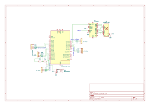

# Car parking monitoring
  A smart car parking monitoring system built with Rust and Raspberry Pi Pico
:::info 

**Author**: Florin-Cristian Dinu \
**GitHub Project Link**: [link_to_github](https://github.com/UPB-PMRust-Students/proiect-d-florin03)

:::

## Description

The project uses Raspberry Pi Pico 2 and proximity sensors to monitor the occupancy of parking spaces. When a car enters, the system detects where it is parked and updates a 7-segment digital display, which counts the number of free spaces in the parking lot.

## Motivation

Why did you choose this project?

​I chose to develop this project to address the growing challenges of vehicle parking in congested urban areas. The rapid growth of the number of cars often exceeds the capacity of the existing parking infrastructure, leading to congestion, additional carbon emissions and time loss for drivers looking for a free space.​

The implementation of a smart parking system, based on Raspberry Pi Pico 2 and proximity sensors, allows for real-time monitoring of parking space occupancy. By displaying the number of available spaces on a 7-segment digital display, drivers can be promptly informed about parking availability, thus reducing the time spent searching for a space and contributing to traffic flow.​


## Architecture 
 
    
   A 7-segment display has segments A–G and sometimes a dot (DP). Each segment connects to a Shift Register pin, then to the Pico.
    | Segment | 74HC595 Pin  |
|---------|---------------|
| A       | Q0            |
| B       | Q1            |
| C       | Q2            |
| D       | Q3            |
| E       | Q4            |
| F       | Q5            |
| G       | Q6            |
| DP      | Q7  (optional)|

  | Pico Pin | 74HC595 Pin  |
|--------------|---------------|
| GPIO17       | 14 (SER)      |
| GPIO16       | 11 (SCLK)     |
| VCC(external)| 10            |
| GPIO14       | 12(RCLK)      |
| GND          | 13(OE)        |


- HC-SR04 NR.1 connection diagram

| HC-SR04 Pin | Connection                                                  |
|-------------|-------------------------------------------------------------|
| VCC         | 5V (external source)                                        |
| GND         | GND (Pico)                                                  |
| TRIG        | GPIO2 (Pico)                                                |
| ECHO        | GPIO3 through voltage divider                               |

- HC-SR04 NR.2 connection diagram

| HC-SR04 Pin | Connection                                                  |
|-------------|-------------------------------------------------------------|
| VCC         | 5V (external source)                                        |
| GND         | GND (Pico)                                                  |
| TRIG        | GPIO6 (Pico)                                                |
| ECHO        | GPIO7 through voltage divider                               |

- HC-SR04 NR.3 connection diagram

| HC-SR04 Pin | Connection                                                  |
|-------------|-------------------------------------------------------------|
| VCC         | 5V (external source)                                        |
| GND         | GND (Pico)                                                  |
| TRIG        | GPIO10 (Pico)                                               |
| ECHO        | GPIO11 through voltage divider                              |

- HC-SR04 NR.4 connection diagram

| HC-SR04 Pin | Connection                                                  |
|-------------|-------------------------------------------------------------|
| VCC         | 5V (external source)                                        |
| GND         | GND (Pico)                                                  |
| TRIG        | GPIO18 (Pico)                                               |
| ECHO        | GPIO19 through voltage divider                              |

- HC-SR04 NR.5 connection diagram

| HC-SR04 Pin | Connection                                                  |
|-------------|-------------------------------------------------------------|
| VCC         | 5V (external source)                                        |
| GND         | GND (Pico)                                                  |
| TRIG        | GPIO20 (Pico)                                               |
| ECHO        | GPIO21 through voltage divider                              |

- Servomotor SG-90 Full connection 

| SG90 Servo Pin    | Connecting to Raspberry Pi Pico 2           |
|-------------------|---------------------------------------------|
| Orange (PWM)      | GPIO15 (or other PWM compatible GPIO)       |
| Red (VCC)         | 5V from an external source                  |
| Brown(GND)        | GND common with Pico                        |

## Log

<!-- write your progress here every week -->

### Week 21 April - 5 May
    Connecting the hardware components
### Week 12 - 18 May

### Week 19 - 25 May

## Hardware

Detail in a few words the hardware used.

Here’s a concise description of the hardware components used in my project:
- Raspberry Pi Pico 2 – the main microcontroller that controls all components and processes sensor data.
- HC-SR04 – an ultrasonic proximity sensor used to detect the presence of a vehicle in a parking space.
- SG90 Servo + Barrier – the servo motor lifts or lowers a physical barrier to control access when a car is detected.
- 7-Segment Display – shows the number of free parking spaces available in real time.
- Voltage Source – provides 5V power to the sensors, servo, and display.

### Schematics

Place your KiCAD schematics here.


### Bill of Materials

<!-- Fill out this table with all the hardware components that you might need.

The format is 
```
| [Device](link://to/device) | This is used ... | [price](link://to/store) |

```

-->

| Device | Usage | Price |
|--------|--------|-------|
| [Raspberry Pi Pico W](https://www.raspberrypi.com/documentation/microcontrollers/raspberry-pi-pico.html) | The microcontroller | [35 RON] |
| [HC-SR04](https://ardushop.ro/ro/electronica/2289-modul-senzor-ultrasonic-detector-distanta-hc-sr04-6427854030726.html)| The ultrasonic proximity sensor | [9.75 RON] |
|[SG90 Servomotor](https://www.optimusdigital.ro/ro/motoare-servomotoare/26-micro-servomotor-sg90.html?srsltid=AfmBOopKXtGX60luO695Tvzw_UmyYDY2AVdHKWGqszYpztqod6F_pLZN)| The servomotor | [14 RON] |
|[7-Segment Display](https://www.optimusdigital.ro/ro/optoelectronice-afisaje-led/5605-display-led-cu-2-cifre-i-7-segmente-74hc595.html?gad_source=1&gad_campaignid=19615979487&gbraid=0AAAAADv-p3DfPn0jghDBkW5rmkni4ZwoA&gclid=Cj0KCQjwlMfABhCWARIsADGXdy-OraLBms9ZdxBJ7DhzMblAXSjsZkZPA4ghGoul2ohbogpIc2ylieAaAoJKEALw_wcB)| Display | [9 RON] |


## Software

| Library | Description | Usage |
|---------|-------------|-------|
| [st7789](https://github.com/almindor/st7789) | Display driver for ST7789 | Used for the display for the Pico Explorer Base |
| [embedded-graphics](https://github.com/embedded-graphics/embedded-graphics) | 2D graphics library | Used for drawing to the display |

## Links

<!-- Add a few links that inspired you and that you think you will use for your project -->

1. [link](https://example.com)
2. [link](https://example3.com)
...
