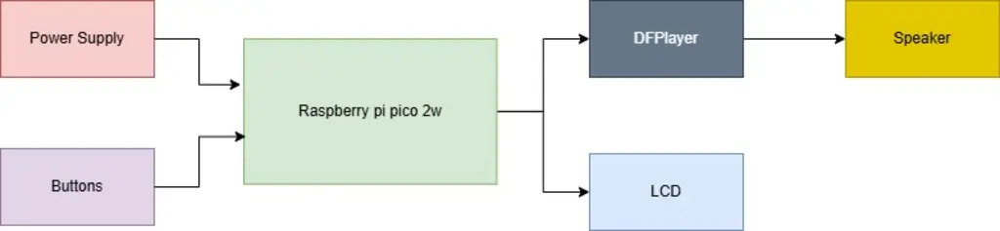
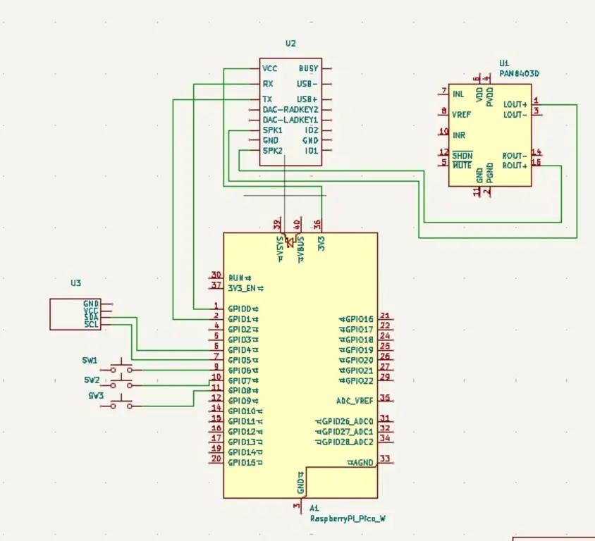

# MP3 Player
Mini music player based on Raspberry Pi Pico 2.

:::info
**Author**: Liță Gabriel-Laurențiu \
**GitHub Project Link**: https://github.com/UPB-PMRust-Students/proiect-gabruellita
:::

---

## Description
The project consists of a **mini music player** built around a **Raspberry Pi Pico 2**, capable of:
- Playing music from a microSD card.
- Displaying song information on a small LCD screen.
- Supporting **play**, **pause**, **next**, and **previous** controls through physical buttons.
- Using **Rust** with **Embassy** for efficient multitasking.

At first, the device will play audio through a **small speaker** connected via a **PAM8403 mini amplifier**.  
**Optionally**, if the basic setup is successful, the player may be expanded with **headphone jack output** and/or **Bluetooth audio** support.

---

## Motivation
I wanted a **simple external device** that can **play and control music independently** without being tied to a laptop.  
Rust and Embassy provide **the necessary performance and multitasking tools** to manage this efficiently on the Raspberry Pi Pico.

---

## Architecture
The **Raspberry Pi Pico 2W** acts as the brain of the system, managing all peripherals:

- **microSD card**: Stores the audio files.
- **DFPlayer Mini**: Handles audio file playback directly from the SD card.
- **Speaker (through PAM8403 amplifier)**: Outputs the audio.
- **LCD 1602 + I2C interface**: Displays the current track information and playback status.
- **Buttons**: Allow control of music playback.

Data flow:
- Pico sends commands to the DFPlayer Mini via UART.
- DFPlayer plays the file and outputs audio to the amplifier and then the speaker.
- Pico updates the LCD and handles button presses asynchronously.

---

## Diagrama Block

---

## Components

| Component | Purpose | Details |
|-----------|---------|---------|
| **Raspberry Pi Pico 2W** | Main controller | Runs firmware and manages all components |
| **microSD card + adapter** | Storage | Holds audio files |
| **DFPlayer Mini** | MP3 player module | Reads and plays audio from SD |
| **PAM8403 Mini Amplifier** | Audio amplification | Boosts the signal for speaker output |
| **Speaker** | Audio output | Basic sound output |
| **LCD 1602 with I2C Interface** | Display | Shows track info and playback status |
| **Push Buttons** | User control | Play, Pause, Next, Previous actions |

---

## Hardware Overview
- The **Pico** controls the music player by sending commands over UART to the **DFPlayer Mini**.
- **DFPlayer Mini** reads the audio files from the **microSD card**.
- The audio output is amplified by the **PAM8403 amplifier** and played through a **small speaker**.
- The **LCD 1602** displays song and status info via the I2C interface.
- **Buttons** provide direct user interaction for playback controls.

---

## Optional Features (Future Extensions)

If the basic functionality is successfully implemented, the project could be extended with:

- **Headphone Jack Output**:  
  Using a **3.5mm Audio Jack Module**, allowing headphone connections.

- **Bluetooth Audio Output**:  
  Integrating a **Bluetooth Audio Receiver Module** to allow wireless music playback.

- **High-Power Amplifier Upgrade**:  
  Switching from the **PAM8403** to a more powerful **TPA3118 amplifier** for better speaker output.

**Note**: These features are optional and depend on the success of the core implementation.

---

## Bill of Materials (Hardware)

| Product Code | Device | Usage | Price |
|--------------|--------|-------|-------|
| 0104110000013743 | [DFPlayer Mini MP3 Module](https://www.optimusdigital.ro/ro/module-audio/456-dfplayer-mini-mp3-player-module.html) | Audio playback from microSD | 13,99 lei |
| 0104110000003584 | [LCD 1602 + I2C Interface](https://www.optimusdigital.ro/ro/display-uri/934-display-lcd-1602-i2c-albastru.html) | Display song info | 16,34 lei |
| 0104110000035356 | [TPA3118 Mono Audio Amplifier (60W)](https://www.optimusdigital.ro/ro/module-audio/2832-modul-amplificator-audio-mono-tpa3118-60w.html) | High power audio (optional) | 19,99 lei |
| 0104110000003737 | [PAM8403 Mini Stereo Amplifier (3W)](https://www.optimusdigital.ro/ro/module-audio/400-mini-amplificator-audio-2x3w-pam8403.html) | Basic speaker amplification | 2,99 lei |
| 0104110000006547 | [3.5mm Audio Jack Module](https://www.optimusdigital.ro/ro/conectori-si-adaptoare/1454-modul-jack-audio-35-mm.html) | Headphone output (optional) | 4,99 lei |
| 0104110000019561 | [Bluetooth Audio Receiver Module](https://www.optimusdigital.ro/ro/module-wireless/2830-modul-audio-bluetooth-50-stereo.html) | Wireless playback (optional) | 23,99 lei |
| 5056561803975 | [Raspberry Pi Pico 2W](https://www.optimusdigital.ro/ro/raspberry-pi-placi/13327-raspberry-pi-pico-2w.html) | Main controller | ~39,66 lei |

---

| Setup Type | Components |
|------------|------------|
| **Core Setup** | Pico 2W, DFPlayer Mini, microSD, LCD 1602 I2C, Buttons, PAM8403, Speaker |
| **Optional Setup** | + 3.5mm Audio Jack, + Bluetooth Receiver, + TPA3118 Amplifier |

---

## Software Design
Rust will be used for firmware development, utilizing asynchronous programming with Embassy.

| Library | Purpose | Description |
|---------|---------|-------------|
| [embassy-rp](https://github.com/embassy-rs/embassy/tree/main/embassy-rp) | Raspberry Pi Pico-specific drivers | Accesses and controls RP2040 peripherals (UART, GPIO, I2C, etc.) |
| [embassy](https://embassy.dev/) | Async executor | Manages efficient multitasking |
| [embedded-hal](https://github.com/rust-embedded/embedded-hal) | Hardware abstraction layer | Unified API for embedded peripherals |
| [ssd1306](https://github.com/jamwaffles/ssd1306) | Display driver | Controls the LCD screen through I2C |
| [heapless](https://github.com/japaric/heapless) | Static data structures | Provides memory-safe buffers without dynamic allocation |
| [embedded-sdmmc](https://github.com/rust-embedded-community/embedded-sdmmc-rs) | SD card filesystem | Handles file reading from microSD |
| **DFPlayer Mini UART driver** (to be implemented) | Serial commands | Sends control commands to DFPlayer Mini module |

---

## Functional Diagram

---

## Log

(*To be completed as the project progresses*)

---

## Photos

(*To be added after prototype assembly*)

---

## Links

(*To be added once resources and documentation are finalized*)

---
