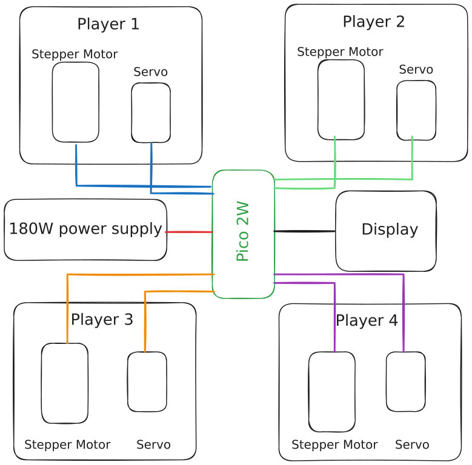

# 4Clash
Battleground of buttons, motors, and multiplayer mayhem!

:::info 

**Author**: Gabriel-Valentin Pitic \
**GitHub Project Link**: [https://github.com/UPB-PMRust-Students/proiect-gabrielpitic](https://github.com/UPB-PMRust-Students/proiect-gabrielpitic)

:::

## Description

4Clash is a DIY multiplayer gaming table that brings players together in physical space for competitive digital battles. Using 3D printed components, stepper motors, servos, and Raspberry Pi Pico 2W microcontrollers, this project creates an interactive tabletop gaming experience where multiple players can compete simultaneously. The system combines physical controls with digital gameplay elements, all powered by custom Rust software that handles game mechanics, player interactions, and visual feedback.

## Motivation

I created 4Clash to explore the intersection between digital gaming and physical social interaction. In an era dominated by online multiplayer experiences, I wanted to build something that brings people together in the same room, fostering face-to-face competition. The project also serves as an excellent platform to deepen my understanding of embedded systems programming with Rust, physical computing, and real-time multiplayer game development. Building 4Clash has allowed me to combine my interests in gaming, electronics, and software development while creating something that friends can gather around and enjoy together.

## Architecture 
 

## Log

<!-- write your progress here every week -->

### Week 5 - 11 May

### Week 12 - 18 May

### Week 19 - 25 May

## Hardware

- Raspberry Pi Pico 2W - Used as the main microcontroller handling all the motors, as well as the wi-fi connections for the players.
- 17HS4401 Stepper motor - Used for the linear movement of the player.
- MG90S Servo - Used for the shooting mechanism of the player.
- DRV8825 and A4988 - Stepper motor drivers used to control the stepper motors.
- ST7735 display - Used to display the QR code for the players to connect to the game.
- 3D printed parts - Used to create the physical structure of the game, including the player housing and shooting mechanism.
- Power supply - Used to power the entire system, including the motors and microcontroller.
- Wood parts - Used to create the base of the game.
- Bolts and nuts - Used to assemble the 3D printed parts and wood parts together.
- Wires and connectors - Used to connect the various components together.
- Breadboard - Used for prototyping and testing the circuit connections before final assembly.

### Schematics


### Bill of Materials

<!-- Fill out this table with all the hardware components that you might need.

The format is 
```
| [Device](link://to/device) | This is used ... | [price](link://to/store) |

```

-->

| Device | Usage | Price |
|--------|--------|-------|
| 2x [Raspberry Pi Pico 2W](https://www.optimusdigital.ro/ro/placi-raspberry-pi/13327-raspberry-pi-pico-2-w.html) | The microcontroller | 80 LEI |
| 4x [17HS4401 Stepper Motor](https://www.optimusdigital.ro/ro/motoare-motoare-pas-cu-pas/5057-motor-pas-cu-pas-17hs4401-17-a-40-ncm.html) | Used for the linear movement of the player | 136 LEI |
| 4x [MG90S Servo](https://www.optimusdigital.ro/ro/motoare-servomotoare/271-servomotor-mg90s.html) | Used for the shooting mechanism of the player | 78 LEI |
| 4 x [A4988 Stepper Motor Driver](https://www.optimusdigital.ro/ro/drivere-de-motoare-pas-cu-pas/866-driver-pentru-motoare-pas-cu-pas-a4988-rosu.html) | Used to control the stepper motors | 32 LEI |
| [ST7735 Display](https://www.amazon.de/GERUI-Display-Module-Screen-ST7735/dp/B0CWN27HVB/ref=sr_1_14_sspa) | Used to display the QR code for the players to connect to the game | 29 LEI |
| [Switched Power Supply](https://www.optimusdigital.ro/ro/surse-ac-dc-de-12-v/1947-sursa-de-tensiune-in-comutaie-12v-15a-180-w.html) | Used to power the entire system, including the motors and microcontroller | 60 LEI |
| Consumables (3D printed parts, wood parts, bolts, nuts, wires, connectors etc.) | Used to create the physical structure of the game | 80 LEI |

## Software

| Library | Description | Usage |
|---------|-------------|-------|
| [st7735](https://docs.rs/st7735/latest/st7735/) | Display driver for ST7789 | Used for the display |
| [embedded-graphics](https://github.com/embedded-graphics/embedded-graphics) | 2D graphics library | Used for drawing to the display |
| [embassy-rp](https://crates.io/crates/embassy-rp) | Embassy HAL for RP2040 | Hardware abstraction layer for the Raspberry Pi Pico 2 |
| [embassy-net](https://crates.io/crates/embassy-net) | Embassy networking library | Used for network communication |
| [cyw43](https://crates.io/crates/cyw43/0.1.0) | Wi-Fi driver for Raspberry Pi Pico 2 | Used for Wi-Fi connectivity |
| [qrcode](https://crates.io/crates/qrcode) | QR code generator | Used to generate the QR code for the players to connect to the game |

## Links

<!-- Add a few links that inspired you and that you think you will use for your project -->

1. [link](https://example.com)
2. [link](https://example3.com)
...
