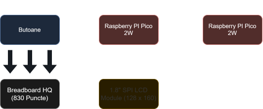

## Summary
A project about mixing classic 2D games in a single one on Raspberry Pico, having 2048 in the main stage.

:::info

**Author**: Nenciu George-Robert \
**GitHub Project Link**: https://github.com/UPB-PMRust-Students/proiect-robertnen

:::info

## Description
The objective of the project is to show the knowledge gained throughout the semester by making functional hardware that runs games written in Rust. Starting with a 2048 games, it can be very
fast changed to Tetris, creating more fun for the player.

## Motivation
For many years I loved playing games, even it is not in a computer. While trying to prove what I
learn this semester about Rust and hardware, I wanted to show that anyone can create a game on
anything that has electricity.

## Arhitecture

## Log

### Week 28 April - 4 May
Forked the project and started the documentation. Added the bill of materials and the software most likely used.

### Week 5 May - 11 May

### Week 12 April - 18 May

### Week 19 April - 25 May

## Hardware

This project is using the following components:
- 2x Raspberry Pi Pico 2W for controlling the display and the results intented while pressing the buttons;
- 1x 1.8" SPI LCD Module (128 x 160) to display the game;
- 5x push buttons (4 for movements, 1 to change / reset a game).

## Schematics
Will be displayed soon.

## Bill of materials
| Name                            	| Quantity 	| Usage                                                                   	| Price     	|
|---------------------------------	|----------	|-------------------------------------------------------------------------	|-----------	|
| [Raspberry Pi Pico 2W](https://datasheets.raspberrypi.com/picow/pico-2-w-datasheet.pdf)          	| 2        	| One for debugging (UART), the other for controlling the architecture 	| [39,66 lei](https://www.optimusdigital.ro/ro/placi-raspberry-pi/13327-raspberry-pi-pico-2-w.html?search_query=Raspberry+Pi+Pico+2W&results=26) 	|
| [1.8" SPI LCD Module (128 x 160)](https://www.openhacks.com/uploadsproductos/tutorial_display_tft.pdf) 	| 1        	| Display for game status, score etc.                                     	| [28,99 lei](https://www.optimusdigital.ro/en/lcds/1311-modul-lcd-spi-de-18-128x160.html) 	|
| [Breadboard Jumper Wires Set](https://www.optimusdigital.ro/en/wires-with-connectors/12-breadboard-jumper-wire-set.html)     	| 66       	| Connections between components (picos, buttons,  LCD, etc.)          	| [7,99 lei](https://www.optimusdigital.ro/en/wires-with-connectors/12-breadboard-jumper-wire-set.html)  	|
| [0.25 W 10K Ω Resistor](https://www.optimusdigital.ro/en/resistors/1088-025w-10k-resistor.html?srsltid=AfmBOooY9X9nv76tKLTFI8nP2GXllgvsesQF6wgHzpZGptqivIrFWPnP)           	| 10       	| Pull-down resistors for buttons                                         	| [1 leu](https://www.optimusdigital.ro/en/resistors/1088-025w-10k-resistor.html?search_query=0.25+W+10K+Ω+Resistor&results=5)     	|
| [2.54 mm Red Pin Headers](https://www.pololu.com/product/2665)         	| 3        	| Headers for connecting Picos and LCD to the breadboard               	| [2.97 lei](https://www.optimusdigital.ro/ro/componente-electronice-headere-de-pini/464-header-de-pini-rosu-254-mm-40p.html?search_query=2.54+mm&results=301)  	|
| [Breadboard HQ (830 Points)](https://www.pololu.com/product/352)      	| 1        	| Main breadboard for connecting the buttons                              	| [9,98 lei](https://www.optimusdigital.ro/ro/prototipare-breadboard-uri/8-breadboard-830-points.html) 	|
| [400p HQ Breadboard](https://www.pololu.com/product/4000)              	| 1        	| Auxiliary breadboard, likely for GPIO and others                        	| [4,56 lei](https://www.optimusdigital.ro/en/breadboards/44-400p-hq-breadboard.html)  	|
| [6 x 6 x 6 Push Button](https://www.optimusdigital.ro/en/buttons-and-switches/1119-6x6x6-push-button.html?search_query=Push+Button+&results=85)           	| 8        	| 4 for movement, 1 for reset / game switch, others as spares          	| [2,88 lei](https://www.optimusdigital.ro/en/buttons-and-switches/1119-6x6x6-push-button.html?search_query=Push+Button+&results=85)  	|
| [Micro USB 1 m Black Cable](https://www.optimusdigital.ro/en/usb-cables/497-micro-usb-1-m-black-cable.html?search_query=Micro+USB+1+m+Black+Cable&results=38)       	| 1        	| Power and programming for a Pico                                        	| [6,95 lei](https://www.optimusdigital.ro/en/usb-cables/497-micro-usb-1-m-black-cable.html?search_query=Micro+USB+1+m+Black+Cable&results=38)  	|

## Software
This is not final. This is most likely what I'll use after I get the last order of components which are missing.
|                    Crate                   	|                               Description                              	|                                  Usage                                 	|
|:------------------------------------------:	|:----------------------------------------------------------------------:	|:----------------------------------------------------------------------:	|
| [rp2040-hal](https://crates.io/crates/rp2040-hal)                                 	| Hardware Abstraction Layer for the RP2040 microcontroller              	| Direct access to GPIOs, UART, SPI, I2C, timers, PWM, etc., on the Pico 	|
| [embedded-hal](https://crates.io/crates/embedded-hal)                               	| Standard traits for embedded peripherals (e.g., digital I/O, SPI, I2C) 	| Foundation for cross-platform driver development and HALs              	|
| [panic-halt](https://crates.io/crates/panic-halt) (or) [defmt](https://crates.io/crates/defmt)                      	| panic-halt: minimal panic handler; defmt: logging and debug output     	| Handling panics or enabling real-time logging/debugging                	|
| [embedded-graphics](https://crates.io/crates/embedded-graphics)                          	| 2D graphics primitives for displays (no-std)                           	| Drawing shapes, text, images on the LCD                                	|
| [st7735-lcd](https://crates.io/crates/st7735-lcd) 	| Driver for ST7735-based SPI displays                                   	| Communicating with and rendering to the 1.8" SPI LCD module            	|
| [heapless](https://crates.io/crates/heapless)                                   	| Fixed-capacity data structures with no heap allocation                 	| Queues, buffers, or hash maps without dynamic memory                   	|
| [cortex-m](https://crates.io/crates/cortex-m)                                  	| Low-level access to ARM Cortex-M processor features                    	| Accessing special registers, enabling interrupts, etc.                 	|
| [cortex-m-rt](https://crates.io/crates/cortex-m-rt)                                	| Runtime support for Cortex-M processors                                	| Defines the entry point, vector table, and startup code                	|
| [usb-device](https://crates.io/crates/usb-device
)                                 	| USB device stack for embedded systems                                  	| Creating USB peripherals (e.g., serial communication over USB)         	|

## Links
I got inspiered from the links mentioned below:
1. [2048](https://play2048.co/)
2. [More than just 2048](http://rayxiao92.github.io/)
3. [Tetris](https://tetris.com/play-tetris)