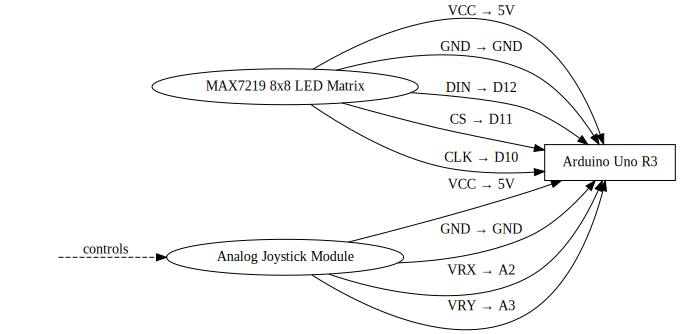

# Snake Game
A joystick controlled snake on a display using a Arduino Uno R3 board

:::info 

**Author**: Plai George Alexandru \
**GitHub Project Link**: [link_to_github](https://github.com/UPB-PMRust-Students/proiect-PlaiGeorge)

:::

## Description
A way to play the famous game "Snake".The game is displayed on a MAX7219 display and controlled using a josytick all of it being connected to a ARDUINO UNO R3.

## Motivation

The idea came from a trip to my grandma's where her old phone had the famous game called snake.
Playing it again after such a long while made me relieve my childhood memories and thus decided to choose this game for the project.

## Architecture 

The Arduino Uno R3 is the board chosen for this project acting as the main component to which every other peripheral is connected
Breadboard handles some of the peripherals ports such as VCC and GND
MAX7219 Display and the Joystick are connected to bot the breadboard and the Arduino Uno R3 based on the needed port.

 

## Log

<!-- write your progress here every week -->

### Week 5 - 11 May
Ordering parts & research
### Week 12 - 18 May
Assembly
### Week 19 - 25 May
Testing
## Hardware

Arduino Uno R3 
MAX7219 8x8 Display 
Joystick 
Green LED 
Breadboard
Port to Socket wire
Socket to Socket wire

### Schematics


### Bill of Materials

<!-- Fill out this table with all the hardware components that you might need.

The format is 
```
| [Device](link://to/device) | This is used ... | [price](link://to/store) |

```

-->

| Device | Usage | Price |
|--------|--------|-------|
| [Joystick doua axe XY (402)](https://da-proj.gitlab-pages.liu.se/vanheden/pdf/Analog_Joystick.pdf)| Direction Input | 1x 3.99RON (https://sigmanortec.ro/Modul-joystick-doua-axe-XY-p126458908)
| [Matrice led 8x8, MAX7219, 5V (956)] (https://www.analog.com/media/en/technical-documentation/data-sheets/max7219-max7221.pdf) | Displaying the game | (https://sigmanortec.ro/modul-matrice-led-8x8-max7219-5v) - 1x 11.98 RON
| [Breadboard 400 puncte (56)](https://course.ccs.neu.edu/cs7680su18/resources/w1/breadboard_sparkfun.pdf) | Connecting ports to sockets | (https://sigmanortec.ro/Breadboard-400-puncte-p129872825) - 1x 6.37 RON
| [Placa dezvoltare UNO R3 Arduino Compatibil, ATmega328p, CH340G, cu bara pini (535)] (https://docs.arduino.cc/resources/datasheets/A000066-datasheet.pdf) | Central board and Debugger | (https://sigmanortec.ro/Placa-dezvoltare-UNO-R3-Arduino-Compatibil-ATmega328p-CH340G-cu-bara-pini-p170362384) - 1x 30.42 RON
| [40 Fire Dupont 30cm, Tata-Mama (8)] (https://www.farnell.com/datasheets/3178883.pdf) | Used for connecting the ports of peripherals to Breadboard or Board | (https://sigmanortec.ro/40-Fire-Dupont-30cm-Tata-Mama-p210854349) - 1x 7.94 RON
| [LED 5mm, Verde (1931)] (https://www.scribd.com/document/782240493/Green-LED-datasheet) | Used as a initial signal to check the Board | (https://sigmanortec.ro/led-5mm-verde) - 1x 0.30 RON
| [40 Fire Dupont 30cm, Tata-Tata (9)] (https://www.farnell.com/datasheets/3178883.pdf) | Used to connect Board to Breadboard | (https://sigmanortec.ro/40-Fire-Dupont-30cm-Tata-Tata-p210849599) - 1x 7.94 RON
Total : 83.84RON

## Software

| Library | Description | Usage |
|---------|-------------|-------|
| [Arduino-Hal](https://rahix.github.io/avr-hal/arduino_hal/index.html) |  HAL (hardware abstraction layer) for Arduino boards | Used for analog to digital conversion,taking control of peripherals
| [Max7219](https://docs.arduino.cc/libraries/max7219/) | Drivers for the MAX7219 Display | Used to control the Display,send pixel data to the physical display,setting brightness
| [MAX7219_canvas](https://docs.rs/max7219-canvas/latest/max7219_canvas/) | Provides a higher level of abstraction for drawing onto the display | Used for representing different elements(snake,fruits),updating the displaycanvas with canvaslayer information. 
| [rand](https://docs.rs/rand/latest/rand/) | library for random number generation | Used for generating numbers that act as place for the fruits to be placed at
| [const_random](https://docs.rs/const-random/latest/const_random/) | generates random values at compile time | Used for generating a seed so each game start randomly from the last one


## Links

<!-- Add a few links that inspired you and that you think you will use for your project -->

1. [link](https://docs.rs/)
2. [link](https://pmrust.pages.upb.ro/docs/acs_cc)
3. [link](https://blog.logrocket.com/complete-guide-running-rust-arduino/)
4. [link](https://www.quora.com/What-is-the-logic-behind-a-snake-game-from-a-programming-point-of-view)
5. [link](https://www.reddit.com/r/rust/)
...
