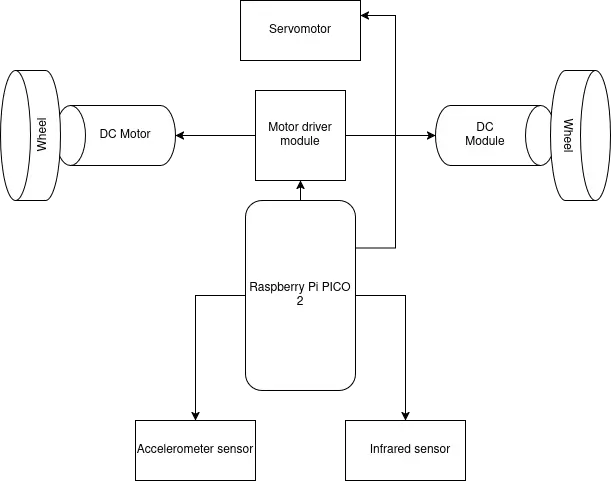
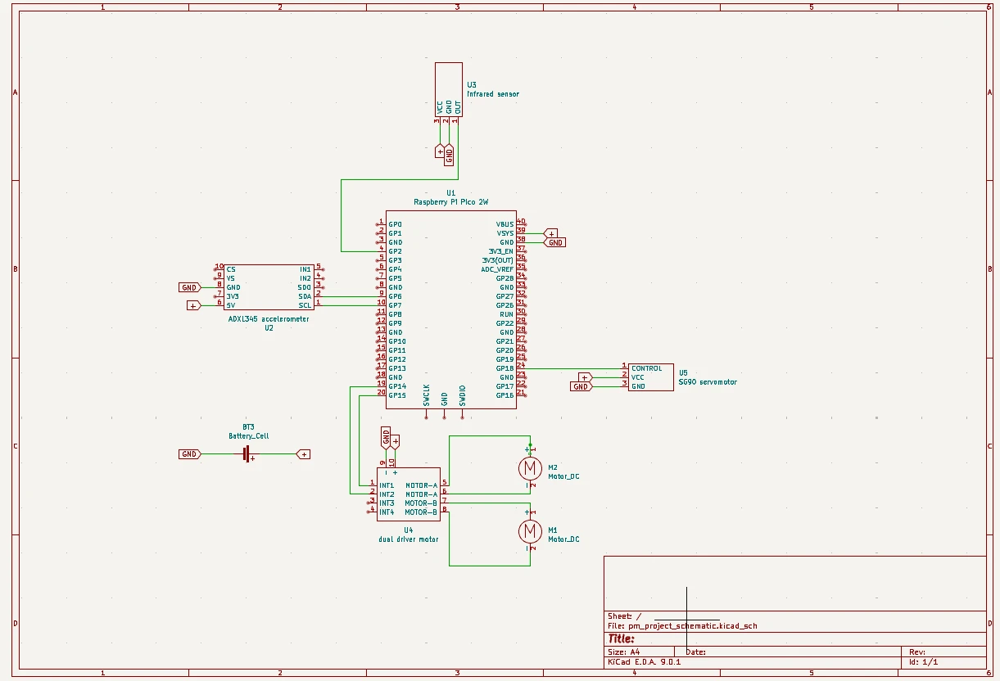

# Spicy the mouse
Interactive chase toy for cats!

:::info 

**Author**: IACOB Ioana-Delia \
**GitHub Project Link**: https://github.com/UPB-PMRust-Students/proiect-iacobDelia

:::

## Description

Spicy the mouse is an interactive cat toy for cats. It wags its tail as it moves around the room and stops once it encounters any obstacles or the cat topples it.

## Motivation

Pets are a significant part of our lives and important members of our families. The interactive cat toys I saw in stores were my inspiration for this project. This way I could learn about microcontroller programming and hardware interaction while building something I enjoy.

## Architecture 



* The microcontroller controls the behaviour of the components
* The DC motors will be controlled to move randomly
* The servomotor will have a continious back and forth movement
* Using the accelerometer or the infrared sensor the robot will stop when the cat topples it or when the robot encounters a wall respectively

## Log

<!-- write your progress here every week -->

### Week 5 - 11 May

### Week 12 - 18 May

### Week 19 - 25 May

## Hardware

* Raspberry pi pico 2w: the microcontroller
* The accelerometer: used for detecting changes in the movement of the robot
* The infrared sensor: used for wall detection
* The servomotor: mimics the movements of a tail
* DC motors: movement
* Dual motor driver: helps control the DC motors

### Schematics



### Bill of Materials

<!-- Fill out this table with all the hardware components that you might need.

The format is 
```
| [Device](link://to/device) | This is used ... | [price](link://to/store) |

```

-->

| Device    | Usage     | Price |
|-----------|-----------|-------|
| Raspberry Pi Pico 2W | Microcontroller | [39.66 Lei](https://www.optimusdigital.ro/ro/placi-raspberry-pi/13327-raspberry-pi-pico-2-w.html) |
| Raspberry Pi Pico RP2040 | Debugger | [30.00 Lei](https://www.emag.ro/microcontroller-raspberry-pi-rp2040-pico/pd/DKQQWNMBM/) |
| Breadboard kit | Electrical connections | [22 Lei](https://www.optimusdigital.ro/ro/kituri/2222-kit-breadboard-hq-830-p.html?search_query=Kit+Breadboard+HQ830+cu+Fire+%C8%99i+Sursa)|
| Infrared sensor | Obstacle avoidance | [3.49 Lei](https://www.optimusdigital.ro/ro/senzori-senzori-optici/4514-senzor-infrarosu-de-obstacole.html?search_query=+Modul+Senzor+Infrarosu+de+Obstacole+&results=6)|
| Micro Motor DC N60 | DC motors | [4.99 Lei](https://www.optimusdigital.ro/ro/motoare-micro-motoare-cu-reductor/2308-micro-motor-dc-n60-14500-rpm-la-3-v.html?search_query=Micro+Motor+DC+N60&results=1) x 2|
| Dual Motor driver | Motor control | [3.73 Lei](https://www.optimusdigital.ro/ro/drivere-de-motoare-cu-perii/1514-modul-driver-de-motoare-dual-in-miniatura-10-v-15-a.html?search_query=Modul+Driver+de+Motoare+Dual+in+Miniatura&results=1)|
| Ball support | Ease of movement | [3.95 Lei](https://www.optimusdigital.ro/ro/mecanica-suporturi-cu-bila/74-ball-caster.html?search_query=Suport+cu+Bila+&results=118)|
| Accelerometer | Movement sensor | [12.99 Lei](https://www.optimusdigital.ro/ro/senzori-senzori-inertiali/97-modul-accelerometru-cu-3-axe-adxl345.html?search_query=Modul+Accelerometru+cu+3+axe+ADXL345&results=2)|
| Battery wire | Power supply | [1.49 Lei](https://www.optimusdigital.ro/ro/fire-fire-mufate/896-fir-pentru-baterie-de-9v.html)|
| 9V Battery | Power supply | [4.87 Lei](https://www.emag.ro/baterie-zinc-carbon-gp-6f22-greencell-1604glf-b-1-buc-9v-gp1604glf-2ue1/pd/DGSJ13MBM/) |
| Micro Servomotor | Tail movement mechanism | [11.99](https://www.optimusdigital.ro/ro/motoare-servomotoare/2261-micro-servo-motor-sg90-180.html) |


Total: 144.17

## Software

| Library | Description | Usage |
|---------|-------------|-------|
| [embassy_rp](https://docs.embassy.dev/embassy-rp/git/rp2040/index.html) | HAL for the Raspberry Pi PICO 2W microcontroller | Used to program the Pico |
| [infrared](https://docs.rs/infrared/latest/infrared/) | Infrared sensor library | Used for the infrared sensors |
| [embassy-executor](https://crates.io/crates/embassy-executor) | An async/await executor designed for embedded usage | Used for task execution |
| [syact](https://docs.rs/syact/latest/syact/) | Library for controlling more complex motors, such as servomotors | Used for controlling the servomotor |

## Links

<!-- Add a few links that inspired you and that you think you will use for your project -->

1. [Inspiration for this project](https://www.youtube.com/watch?v=CJwI9GmFXds)
2. [Two wheeled line follower](https://www.ijert.org/research/pid-controller-based-line-following-and-obstacle-avoidance-two-wheeled-robot-IJERTCONV7IS02026.pdf) - not the same idea but similar execution
